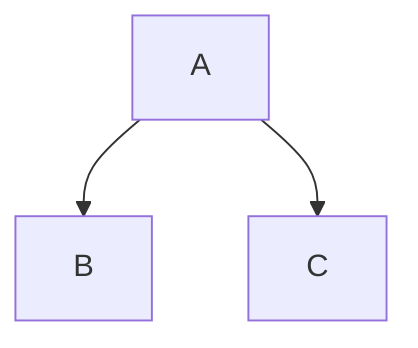

<!------------------------------------------------------------------------------------
这是 Chirpy Jekyll 主题的完整写作指南，涵盖了文章创建、Front Matter 配置、媒体资源管理、特殊 Markdown 语法和高级功能的详细说明。本指南将帮助你充分利用 Chirpy 主题的所有功能来创建优质的博客文章。
------------------------------------------------------------------------------------->
---
title: some_example_title
description: some_example_desp
author: Alden
date: 2025-1-1 10:21:00 +0800
categories: 
tags: 
pin: false
mermaid: true
comments: true

---

## 📝 帖子文件与基础 Front Matter

### 文件命名与路径

文章文件应命名为 `YYYY-MM-DD-TITLE.EXTENSION`，并放置在项目根目录的 `_posts/` 文件夹下。

  * **EXTENSION** 必须是 `md` 或 `markdown`。

### 核心 Front Matter

文章顶部必须包含 YAML 块，即 **Front Matter**。

| 键 (Key) | 描述 (Description) | 格式/示例 | 备注 |
| :--- | :--- | :--- | :--- |
| **title** | 帖子标题 | `TITLE` | 必需 |
| **date** | 发布日期和时间 | `YYYY-MM-DD HH:MM:SS +/-TTTT` | 必须包含时区偏移（例如：`+0800`）。 |
| **categories** | 分类 | `[TOP_CATEGORY, SUB_CATEGORY]` | 最多支持两个元素。 |
| **tags** | 标签 | `[tag1, tag2]` | 标签名**始终小写**。 |
| `layout` | 布局 | 无需设置 | 默认已设置为 `post`。 |
| `render_with_liquid` | Liquid 渲染控制 | `false` | (Jekyll 4.0+): 设置为 `false` 可在内容中直接显示 Liquid 标签，替代 ``。 |

categories 分类推荐：
优先考虑以下分类，实在无法放入时，再创建新的 categories
- System Cognition (系统认知): 包含哲学思考、书评、宏观架构理论、方法论；
- LLM Engineering(LLM 工程): 聚焦 LLM 的具体应用架构、推理引擎、Agent 开发、RAG 等；
- DevOps (云原生与运维): 聚焦基础设施、容器化、网络加速、部署流程；
- Coding Lab (代码实验室): 具体的编程实战、逆向工程、工具使用教程。

tags 参考推荐
[Philosophy, Complexity, Book Review, Azure, Docker, CLI, Container, Inference, vLLM, llama.cpp, Performance, Vibe Coding, Methodology, Language, Cognition, Structure, Architecture, RAG, Snowflake, Data Gravity, SDD, AI Coding, Best Practice, LLM Ops, Ollama, Agent, MCP, Anthropic, Entropy, Declarative, Vercel, CDN, EdgeOne, Network, Reverse Engineering]

-----

## 🔩 帖子元数据与控制

### 描述 (Description)

自定义文章摘要，将覆盖默认自动生成的摘要，并显示在文章标题下方。

```yaml
---
description: 帖子的简短摘要。
---
```

### 作者信息 (Author)

作者信息默认从 `_config.yml` 获取。如需覆盖或指定多作者，需在 `_data/authors.yml` 中定义作者 ID，然后在 Front Matter 中使用：

| 场景 (Scenario) | 语法 (Syntax) |
| :--- | :--- |
| 单个作者 | `author: <author_id>` |
| 多个作者 | `authors: [<author1_id>, <author2_id>]` |

### 帖子固定 (Pin)

将文章固定在首页顶部，按发布日期逆序排序。

```yaml
---
pin: true
---
```

### 目录 (TOC) 与评论 (Comments) 开关

通过 Front Matter 控制单个帖子的 **TOC** (Table of Contents) 和评论功能。

| 功能 (Feature) | Front Matter 键 | 禁用值 (To Disable) |
| :--- | :--- | :--- |
| 目录 | `toc` | `false` |
| 评论 | `comments` | `false` |

-----

## 🖼️ 媒体与资源管理

### URL 资源前缀

为了简化资源路径书写，可以使用以下两个变量：

1.  **全局 CDN 前缀** (`_config.yml`): `site.cdn: https://cdn.com`
2.  **文章子路径** (Front Matter): 设置 `media_subpath` 以指定当前文章的资源子路径。

最终资源 URL 结构：`[site.cdn/][page.media_subpath/]file.ext`

```yaml
---
media_subpath: /assets/my-post-media/
---
```

### 预览图 (Preview Image)

用于文章顶部的展示图，建议分辨率为 `1200 x 630` (1.91:1 比例)。

| 字段 (Field) | 描述 (Description) | 示例 (Example) |
| :--- | :--- | :--- |
| **path** | 图片路径（若设置了 `media_subpath` 则仅需文件名） | `/path/to/image.jpg` |
| **alt** | 图片替代文本 | `image alternative text` |
| **lqip** | 低质量图片占位符（用于快速加载） | `/path/to/lqip-file` 或 Base64 URI |

**简写模式：**

```yaml
---
image: /path/to/image.jpg
---
```

### 图像 (Normal Images)

#### 尺寸与样式

图像尺寸、位置、阴影等通过 Markdown 属性设置。

| 功能 (Feature) | 语法 (Syntax) | 备注 (Notes) |
| :--- | :--- | :--- |
| **设置尺寸** | `{: w="700" h="400" }` | 宽度 (`w` / `width`) 和高度 (`h` / `height`)，SVG 至少需设置宽度。 |
| **居中/左/右对齐** | `{: .normal/.left/.right }` | 设置位置后**不能**添加标题。 |
| **跟随主题模式** | `{: .light }` / `{: .dark }` | 需准备浅色/深色两张图。 |
| **添加阴影** | `{: .shadow }` | 常用于截图。 |
| **LQIP** | `{: lqip="/path/to/lqip" }` | 为普通图片添加占位符。 |
| **添加标题** | `\n_Image Caption_` | 紧跟图片下方添加**斜体文本**。 |

#### 示例

```markdown
{: w="500" h="300" .dark .shadow }
```

### 视频与音频嵌入 (Embeds)

#### 社交媒体平台

使用 Liquid **include** 标签嵌入外部平台的视频/音频。

```liquid

```

| 平台 (Platform) | 示例 ID (ID Example) |
| :--- | :--- |
| **youtube** | `H-B46URT4mg` |
| **twitch** | `1634779211` |
| **bilibili** | `BV1Q44y1B7Wf` |
| **spotify** | `3OuMIIFP5TxM8tLXMWYPGV` |

**Spotify 附加参数：** `compact=1` (紧凑播放器), `dark=1` (强制深色主题)。

#### 本地视频文件

使用 Liquid include 标签嵌入本地视频文件，支持多种控制属性。

```liquid

```

#### 本地音频文件

使用 Liquid include 标签嵌入本地音频文件。

```liquid

```

-----

## 💡 特殊 Markdown 语法

### 提示块 (Prompts)

通过在 blockquote 后添加 class 来生成不同类型的提示块。

| 类型 (Type) | 样式类 (Class) | 描述 (Description) |
| :--- | :--- | :--- |
| 提示 | `.prompt-tip` | 技巧或建议 |
| 信息 | `.prompt-info` | 普通信息 |
| 警告 | `.prompt-warning` | 温和警告 |
| 危险 | `.prompt-danger` | 严重警告 |

**语法：**

```markdown
> 这是提示信息。
{: .prompt-info }
```

### 文件路径高亮

在行内文本中高亮显示文件路径。

```markdown
`_config.yml`{: .filepath}
```

### 代码块 (Code Blocks)

#### 基础语法

使用三个反引号 ` ``` ` 包裹代码块。

  * **指定语言：** 在第一个 ` ``` ` 后添加语言名称（例如：`yaml`）。
  * **隐藏行号：** 默认显示行号，但 `plaintext`、`console` 和 `terminal` 除外。使用 `{: .nolineno }` 隐藏行号。
  * **指定文件名：** 使用 `{: file="path/to/file" }` 将语言名称替换为文件名。

<!-- end list -->

````markdown
```shell
echo 'Hello Chirpy'
````

{: file="run.sh" .nolineno }

`````

> 🛑 **注意：** Jekyll 原生的 `` 标签与 Chirpy 主题**不兼容**。
{: .prompt-danger }

---

## 🧪 高级功能

### 数学公式 (Mathematics)

使用 **MathJax** 渲染数学公式。需在 Front Matter 中开启：`math: true`。

| 区域 (Scope) | 语法 (Syntax) | 关键点 (Key Points) |
| :--- | :--- | :--- |
| **区块公式** | `$$\n LaTeX_math_expression \n$$` | **上下必须有空行**。 |
| **公式编号** | `$$\begin{equation}...\label{eq:label_name}\end{equation}$$` | 引用：`\eqref{eq:label_name}`。 |
| **行内公式** (行中) | `$$ LaTeX_math_expression $$` | **前后不能有空行**。 |
| **行内公式** (列表中) | `\$$ LaTeX_math_expression $$` | 第一个 `$` 需要转义 (`\`)。 |

### Mermaid 图表

使用 [Mermaid] 生成流程图、时序图等。需在 Front Matter 中开启：`mermaid: true`。

**语法：**



