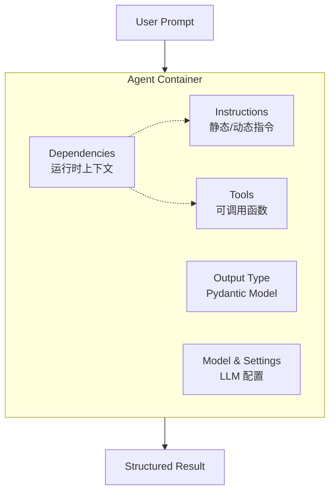
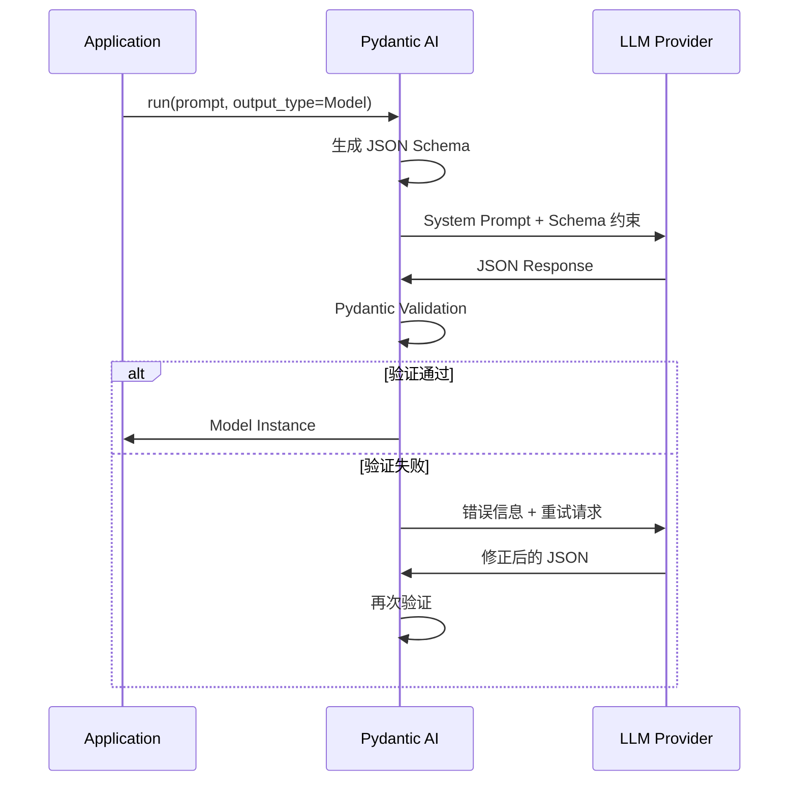

Pydantic AI 是 Pydantic 团队推出的 Python Agent 框架，其设计目标是将 FastAPI 的开发体验（类型安全、IDE 友好、工程化）引入 GenAI 应用开发领域。考虑到 Pydantic Validation 已经是 OpenAI SDK、LangChain、LlamaIndex 等主流库的底层依赖，这一框架的出现具有一定的生态整合意义。

## 框架定位与核心特性

### 设计动机

现有 Agent 框架普遍存在类型系统薄弱、输出不可控、调试困难等问题。Pydantic AI 的核心价值主张在于：

- **类型安全**：通过 Python Type Hints 实现编译期检查，将运行时错误前移至编写阶段
- **模型无关**：统一抽象层支持 OpenAI、Anthropic、Gemini、Bedrock、Ollama 等主流提供商
- **结构化输出**：基于 Pydantic V2 的 Schema 验证机制，强制 LLM 返回符合预期的数据结构
- **可观测性**：与 Pydantic Logfire 深度集成，兼容 OpenTelemetry 标准

### 特性矩阵

| 特性类别 | 具体能力 |
|---------|---------|
| 模型支持 | OpenAI, Anthropic, Gemini, DeepSeek, Cohere, Mistral, Bedrock, Vertex, Ollama |
| 输出控制 | 结构化输出、流式验证、Union 类型分类 |
| 执行模式 | 同步/异步、流式、图遍历 |
| 容错机制 | 自动重试、验证失败回传、手动 ModelRetry |
| 扩展能力 | MCP 协议、A2A 通信、Human-in-the-Loop、持久化执行 |

## Agent 架构模型

Agent 是框架的核心抽象，本质上是一个封装了 LLM 交互逻辑的容器。

### 组件构成



Agent 使用泛型定义 `Agent[Deps, Output]`，其中：
- `Deps`：依赖类型，运行时注入的上下文对象（数据库连接、API 客户端等）
- `Output`：输出类型，强制 LLM 返回的 Pydantic 模型

这种设计使 IDE 能够提供完整的类型检查和自动补全支持。

### 执行模式

框架提供多种运行方式以适应不同场景：

| 方法 | 返回类型 | 适用场景 |
|-----|---------|---------|
| `run()` | `RunResult` | 异步执行，获取最终结果 |
| `run_sync()` | `RunResult` | 同步执行，底层调用 asyncio |
| `run_stream()` | `StreamedRunResult` | 流式传输文本或结构化数据 |
| `run_stream_events()` | `AsyncIterator[AgentStreamEvent]` | 完整事件流，包含工具调用过程 |
| `iter()` | `AgentRun` | 图遍历，逐节点控制执行流程 |

`iter()` 方法暴露了 Agent 的底层状态机实现，允许在 `UserPromptNode`、`ModelRequestNode`、`CallToolsNode` 等节点间插入自定义逻辑。

## 结构化输出机制

这是 Pydantic AI 的核心技术亮点，解决了 LLM 输出不可控的工程痛点。

### 工作原理



关键技术点：

1. **Schema 注入**：框架自动将 Pydantic 模型的 JSON Schema 注入 System Prompt 或 Tool 定义
2. **验证闭环**：LLM 返回数据经 Pydantic 校验，失败时错误信息回传 LLM 触发自动修正
3. **Tool Choice**：对于支持 Function Calling 的模型，输出模型被转换为必须调用的工具

### 输出类型定义

支持三种定义方式：

```python
# 1. Pydantic BaseModel（推荐）
class CalendarEvent(BaseModel):
    name: str
    date: str
    participants: list[str]

# 2. dataclass
@dataclass
class Event:
    name: str
    date: str

# 3. TypedDict
class EventDict(TypedDict):
    name: str
    date: str
```

### 流式结构化输出

基于 `pydantic-core` 的部分验证（Partial Validation）能力，框架支持在 JSON 生成过程中实时构建和验证对象：

```python
async with agent.run_stream('Generate a profile') as result:
    async for partial_model in result.stream():
        # partial_model 是部分填充的 Pydantic 实例
        # 字段可能为 None 或不完整
        print(partial_model)
```

这一特性对于需要实时 UI 反馈的场景（如聊天界面的打字机效果）具有实际价值。

### Union 类型分类

Agent 可根据上下文返回不同类型的输出：

```python
class SearchSuccess(BaseModel):
    results: list[str]

class SearchError(BaseModel):
    error_message: str

agent = Agent(
    'openai:gpt-4o',
    output_type=Union[SearchSuccess, SearchError]
)
```

框架会将多种可能注册为 LLM 的工具选项，由模型自行选择匹配。

## 依赖注入与工具系统

### 依赖注入模式

通过 `RunContext` 在工具和指令中访问运行时上下文：

```python
@dataclass
class SupportDependencies:
    customer_id: int
    db: DatabaseConn

support_agent = Agent(
    'openai:gpt-4o',
    deps_type=SupportDependencies,
    output_type=SupportOutput,
)

# 动态指令：运行时获取上下文数据
@support_agent.instructions
async def add_context(ctx: RunContext[SupportDependencies]) -> str:
    name = await ctx.deps.db.customer_name(ctx.deps.customer_id)
    return f"Customer name: {name}"

# 工具定义：LLM 可调用的函数
@support_agent.tool
async def get_balance(ctx: RunContext[SupportDependencies]) -> float:
    return await ctx.deps.db.customer_balance(ctx.deps.customer_id)
```

### Instructions vs System Prompts

两者在 LLM 视角都是 System Message，但框架层面有明确区分：

| 类型 | 生命周期 | 适用场景 |
|-----|---------|---------|
| `instructions` | 仅当前运行有效 | Agent 特定指令 |
| `system_prompt` | 跨运行保留（传递 message_history 时） | 长期记忆、跨 Agent 上下文 |

官方建议默认使用 `instructions`，除非有明确的历史保留需求。

## 容错与重试机制

### 自动重试场景

1. **工具参数验证失败**：Pydantic 校验错误自动回传 LLM
2. **结构化输出验证失败**：不符合 `output_type` 定义时触发重试
3. **手动触发**：工具函数中抛出 `ModelRetry('error reason')` 异常

### 用量限制

通过 `UsageLimits` 防止无限循环或成本失控：

```python
from pydantic_ai import UsageLimits

limits = UsageLimits(
    request_limit=3,           # LLM 请求次数上限
    response_tokens_limit=1000, # 生成 Token 上限
    tool_calls_limit=5          # 工具调用次数上限
)
```

超出限制时抛出 `UsageLimitExceeded` 异常。

### 错误捕获

`capture_run_messages` 上下文管理器用于在异常时捕获完整的消息历史：

```python
from pydantic_ai import capture_run_messages, UnexpectedModelBehavior

with capture_run_messages() as messages:
    try:
        agent.run_sync("...")
    except UnexpectedModelBehavior:
        print(messages)  # 出错前的所有交互记录
```

## 可观测性集成

与 Pydantic Logfire 的集成仅需两行代码：

```python
import logfire

logfire.configure()
logfire.instrument_pydantic_ai()
```

之后所有 Agent 运行将自动记录详细的追踪数据，包括 Token 消耗、延迟分布、工具调用链路等。框架同时兼容 OpenTelemetry 标准。

## 安装与配置

### 安装选项

| 场景 | 命令 |
|-----|-----|
| 标准安装（含 Logfire + HTTP） | `pip install 'pydantic-ai[logfire,http]'` |
| 最小安装 | `pip install pydantic-ai-slim` |
| 含示例依赖 | `pip install 'pydantic-ai[examples]'` |

环境要求：Python >= 3.9，Pydantic V2。

### API 密钥配置

通过环境变量管理：

| 提供商 | 环境变量 |
|-------|---------|
| OpenAI | `OPENAI_API_KEY` |
| Anthropic | `ANTHROPIC_API_KEY` |
| Gemini | `GEMINI_API_KEY` |
| Groq | `GROQ_API_KEY` |
| Mistral | `MISTRAL_API_KEY` |

## 生态与扩展

框架提供了较为完整的扩展能力：

- **MCP 协议**：Model Context Protocol 客户端与服务器实现
- **A2A 通信**：Agent-to-Agent 协作模式
- **持久化执行**：集成 Temporal、DBOS、Prefect 实现断点续传
- **UI 事件流**：支持 Vercel AI、AG-UI 标准
- **Graph API**：通过类型提示定义复杂控制流图（Beta）

官方还提供了 `llms.txt` 和 `llms-full.txt` 文件，供 AI 编码助手（Cursor、Copilot 等）读取以提升代码补全质量。

## 工程价值评估

Pydantic AI 的核心价值在于将 LLM 输出从"不可靠的文本"转变为"经过验证的 Python 对象"。对于需要将 LLM 集成到现有 Python 工程体系的场景，其类型安全和结构化输出机制能够显著降低集成成本和运行时错误率。

框架的设计哲学与 FastAPI 一脉相承：通过类型系统约束行为，通过依赖注入管理上下文，通过自动验证保证数据质量。这种模式对于熟悉现代 Python Web 开发的工程师而言，学习曲线相对平缓。
