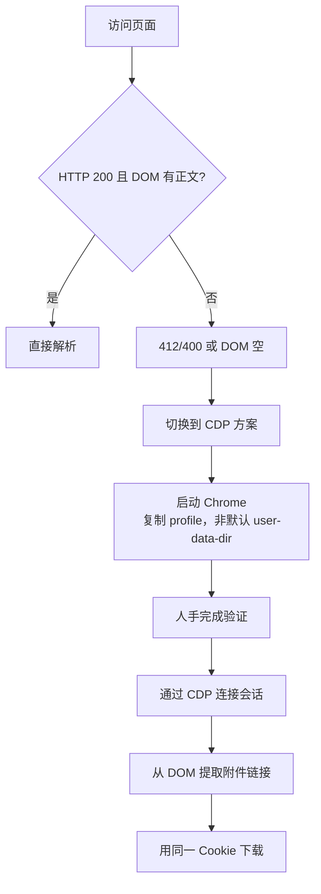

## 结论先行

本文不是逐行脚本说明，而是可复刻的方法论与核心实现总结。重点聚焦策略、判断与关键实现点。

### 三条核心结论

**避免正面对抗**：该站点部署瑞数风控，对无头请求直接返回 412/400，DOM 为空。修改 UA、延长等待时间均无效。

**最稳路线确立**：人工完成一次验证，CDP 复用会话。将浏览器视为"真实用户会话容器"，通过 CDP 读取 DOM、提取附件、复用 Cookie 下载。

**职责分离原则**：浏览器负责通过验证与渲染，爬虫只做读取与搬运。这是企业环境中对抗成本最低、稳定性最高的实现路径。

## 三个核心问题的工程解释

### 为什么 headless 会触发 412/400

站点前端部署行为风控与防护层，要求浏览器呈现真实用户特征。触发点来自三类信号：

**JS 执行侧指纹**：`navigator.webdriver`、插件/字体/Canvas/Audio/WebGL 指纹、性能计时差异、事件时序等。headless 环境呈现"过于一致/过于完美"的特征分布，与真实用户偏离。

**网络/协议侧指纹**：TLS 指纹、HTTP/2 头顺序、`sec-ch-ua` 组合、Header Presence/Ordering。headless 网络栈与真实 Chrome 存在可检测差异。

**挑战-应答侧**：首次请求返回 JS challenge，要求浏览器计算并写入 token/cookie。headless 不执行或执行结果不被接受，缺少 token 导致 412/400。

**状态码语义**：

- **412**：前置条件不满足（缺 token/验证失败）
- **400**：请求被判定非法（指纹或签名不匹配）

### CDP 是什么

**CDP = Chrome DevTools Protocol**，Chrome 对外暴露的调试/控制 API（JSON-RPC over WebSocket）。允许连接到已打开的真实 Chrome，在会话内执行 JS、读取 DOM、获取 Cookie、拦截网络。

CDP 在本方案中的价值：

- **不伪造浏览器**：使用真实 Chrome 通过验证
- **会话复用**：共享已验证 Cookie
- **程序只做读取与搬运**：避免深度对抗

### 瑞数是什么原理

瑞数（Ruishu）是典型的"前端风控 + WAF"组合：

**JS Challenge / 动态 token**：首次请求返回 JS，要求浏览器生成并写入 cookie。

**指纹/行为评分**：采集指纹（Canvas/Audio/WebGL/字体/时区等）与行为（滚动/点击/停留）。

**协议一致性检查**：TLS 与 HTTP/2 指纹、UA/`sec-ch-ua` 一致性。

## 问题画像

### 现象观察

- HTTP 412 / 400
- 页面 HTML 仅有空结构或瑞数 JS 注入
- 附件节点 `div.text > p` / `a#ariaTip` 均不存在

### 结论推导

- 该站点存在瑞数（RS6 级别）行为校验
- 只有"真实浏览器 + 人机验证"后的会话，才能获得可解析 DOM

**这决定了策略**：

- 放弃纯 headless 解题
- 转向"用户完成验证 + CDP 接管读取"

## 前期尝试与失败原因

本节用于复盘"为什么走不通"，便于快速判断应当切换到 CDP 方案。

### Headless 方向的尝试

**基础 headless 渲染**（headless-web-viewer / Playwright 默认参数）

- 结果：HTML 空、无 DOM、412/400
- 原因：瑞数返回 challenge，headless 环境未被认可

**改 UA / wait-until / channel**

- 改 `User-Agent`、`wait-until domcontentloaded`、`channel chrome`
- 结果：仍为空 DOM
- 原因：UA/等待无法覆盖指纹与挑战-应答要求

**"轻量 stealth"**（改 webdriver、plugins、languages 等）

- 结果：仍 412/400
- 原因：行为/协议/时序指纹差异依旧明显，挑战无法通过

**提取 cookies 后直连**

- 从 headless context 取 cookie，使用 `Invoke-WebRequest` 直连
- 结果：HTTP 400
- 原因：cookie 与真实浏览器行为/指纹绑定，直连缺少一致性

### Non-headless 方向的尝试

**直接使用默认 profile 启动 Playwright**

- 结果：报错
- 原因：Chrome 远程调试要求非默认 `user-data-dir`

**复制 profile 后 non-headless 访问**

- 结果：仍 412/400，DOM 为空
- 原因：即便非无头，仍缺少"人工完成验证"行为环节

### 为什么 non-headless 仍无法模拟"刷新+JS完整执行+合理时序"

**关键认知**：非无头不等于真实用户环境。

Playwright/Chromium 即便有 GUI，仍携带自动化痕迹（启动参数、`navigator.webdriver`、插件/字体/`window.chrome` 结构差异、`sec-ch-ua` 组合异常、HTTP/2/TLS 指纹差异）。挑战脚本据此直接给出高风险分，导致生成的 token/cookie 在服务端校验失败。

"第二次刷新"本身只是触发第二次请求，真正决定通过与否的是挑战脚本是否在可信环境里完整执行并生成与指纹一致的 token。自动化环境常在这里断链，表现为：

- JS 被短路
- cookie 与指纹不匹配
- 时间窗口不符合

另一个常见原因是加载/渲染时序被自动化破坏：`domcontentloaded` 不等于完整 load，脚本读取过快且缺少停留/滚动/焦点变化，导致挑战脚本未完成或结果不稳定。

### RS6 多维检测体系在工程上的"长相"

从工程视角看，RS6 是一个多信号融合的风险评分系统而非单点规则：

**传输层**：结合 TLS ClientHello/JA3/ALPN/会话复用等特征判断"这是否像真实 Chrome"。

**HTTP/2 层**：观察伪头字段顺序、HPACK 压缩行为、SETTINGS 与并发流形态等是否符合浏览器族谱。

**JS 运行时**：校验 `navigator.webdriver`/`window.chrome` 完整性、插件/字体/语言/时区组合、Canvas/WebGL/Audio 指纹和性能计时特征。

**资源加载轨迹**：检查 CSS/字体/图片/JS 是否按"正常浏览器路径"完整拉取、缓存/ETag/预加载行为是否自然。

**行为与时序**：观察停留时间、滚动曲线、焦点变化和操作间隔的分布。

**语义路径**：检查是否直接深链、访问顺序是否符合人类逻辑。

**服务端实体关联**：IP/ASN 信誉、同 IP 多 UA 的异常组合、cookie 生命周期与一致性。

最终一切落到 challenge 闭环校验：只要 token 与指纹/时序不一致，放行阈值就会被抬高或直接拒绝。

> 只要没有"真人完成一次验证"，瑞数挑战就无法稳定通过。因此策略切换到：**真人过一次验证 + CDP 会话复用**。
{: .prompt-tip }

## 设计思路



**核心原则**：

- 把"通过验证"交给真人
- 把"批量下载/解析"交给程序

## 关键实现策略

### 附件提取策略

**选择器优先级**：

1. `div.wenzhang.w1200-auto div.text p`
2. `a#ariaTip`

**失败兜底**：fallback 扫描所有 `a[href]`

**过滤规则**：`.(pdf|doc|docx|xls|xlsx|zip|rar)`

**路径处理**：统一处理相对路径，转换为绝对 URL

### 下载策略

从 CDP context 取出 cookie，请求头至少包含：

- `Referer`
- `User-Agent`
- `Cookie`

> 附件资源通常依赖已验证会话，裸请求会被拒绝。
{: .prompt-warning }

## 核心实现代码

以下代码即本次成功路线的精简核心，不包含日志/冗余兜底。

### 单页：CDP 接管 + 提取 + 下载

```javascript
const { chromium } = require('playwright');
const fs = require('fs');
const path = require('path');

const cdpUrl = 'http://127.0.0.1:9222';
const downloadDir = process.cwd();

const toAbs = (h, base) => { 
  try { 
    return new URL(h, base).toString(); 
  } catch { 
    return null; 
  } 
};

(async () => {
  const browser = await chromium.connectOverCDP(cdpUrl);
  const context = browser.contexts()[0];
  const page = context.pages()[0];

  const data = await page.evaluate(() => {
    const sels = [
      'body.bg-fff.hasOldFixed div.wenzhang.w1200-auto div.text p',
      'body.bg-fff.hasOldFixed a#ariaTip'
    ];
    const links = [];
    for (const sel of sels) {
      for (const node of document.querySelectorAll(sel)) {
        if (node.tagName === 'A') links.push(node);
        links.push(...node.querySelectorAll('a'));
      }
    }
    const all = Array.from(document.querySelectorAll('a[href]'));
    return {
      base: location.href,
      links: links.map(a => ({ 
        attrs: [...a.attributes].reduce((o,x)=>{
          o[x.name]=x.value;
          return o;
        }, {}) 
      })),
      all: all.map(a => a.getAttribute('href')),
      ua: navigator.userAgent
    };
  });

  const fromSel = data.links.flatMap(a => 
    ['href','data-href','data-url','data-src']
      .map(k => a.attrs[k])
      .filter(Boolean)
  );
  const all = data.all;

  const candidates = [...new Set([...fromSel, ...all])]
    .map(h => toAbs(h, data.base))
    .filter(h => h && /\.(pdf|docx?|xls[x]?|zip|rar)(\?|#|$)/i.test(h));

  const cookies = await context.cookies();
  const cookieHeader = cookies.map(c => `${c.name}=${c.value}`).join('; ');

  for (const link of candidates) {
    const res = await fetch(link, {
      headers: {
        Referer: data.base,
        'User-Agent': data.ua,
        Cookie: cookieHeader,
      }
    });
    if (!res.ok) continue;
    const filename = path.basename(new URL(link).pathname);
    const buf = Buffer.from(await res.arrayBuffer());
    fs.writeFileSync(path.join(downloadDir, filename), buf);
  }

  await browser.close();
})();
```

### 列表页：取前三条并下载附件

核心思路：

1. 打开列表页，提取前三条详情链接
2. 逐条打开详情页，复用"附件提取+下载"逻辑
3. 始终使用同一 CDP context（共享 Cookie）

```javascript
// 伪代码示例
// list = extractLinks(listPage).slice(0,3)
// for (url of list):
//   page.goto(url)
//   attachments = extractAttachments(page)
//   download(attachments, contextCookies)
```

> 列表页逻辑与单页一致，只是多一步"抓前三条文章链接"。
{: .prompt-info }

## 实际结果

### 单页测试（成功）

- 页面：`https://www.nnnn.gov.cn/xxgk/fgwj/xzhgfxwj/20251225100838171.html`
- 附件下载：`C:\Users\User1\Documents\codespace\CMU-LLM-Course\1766628495442076887.doc`

### 列表页前三条测试

- 列表页：`https://www.nnnn.gov.cn/xxgk/fgwj/index.html`
- 前三条详情页：
  1. `https://www.nnnn.gov.cn/xxgk/fgwj/flxzhfg/20260127172639127.html`
  2. `https://www.nnnn.gov.cn/xxgk/fgwj/gzwj/gzwjylqx/20260128085214181.html`
  3. `https://www.nnnn.gov.cn/xxgk/fgwj/gzwj/gzwjzh/20260126151948126.html`

## 为什么这个方法可复刻

**不依赖破解瑞数算法**：复用真实浏览器会话，而非对抗算法本身。

**可扩展**：将"附件提取"封装成独立函数，即可批量跑列表。

**对 DOM 变化有弹性**：主选择器失败仍能 fallback 扫描所有链接。

**工程上可控**：人机验证只做一次，其余流程自动化。
