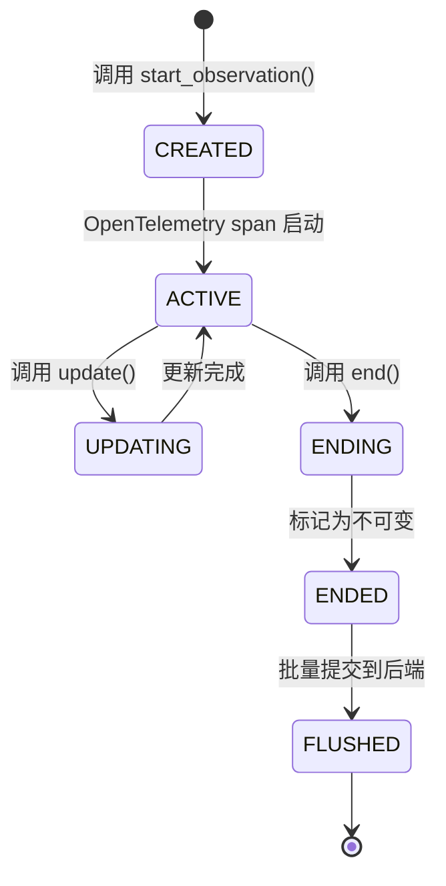
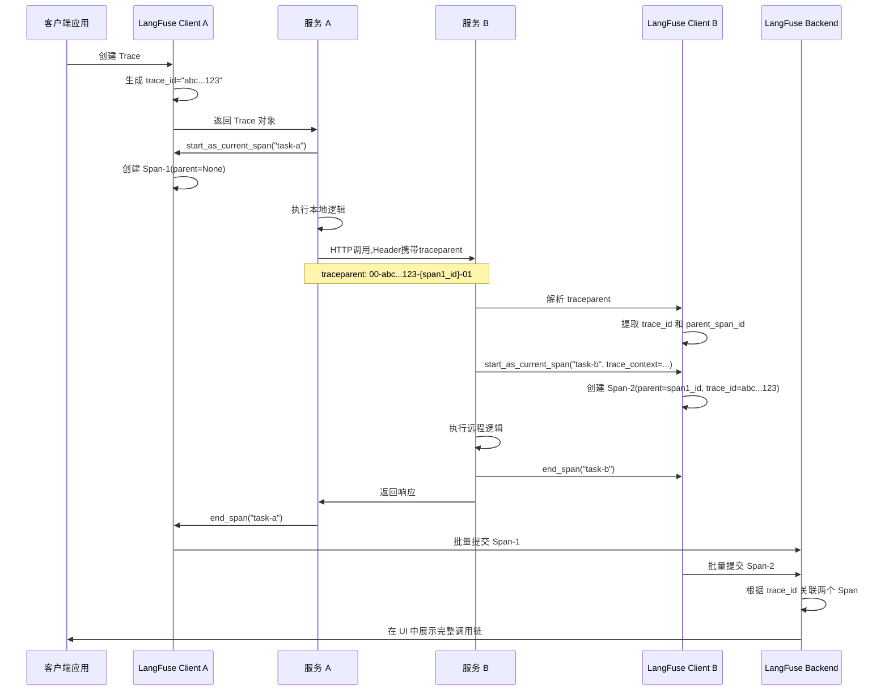

## 一、使用场景：如何判定追踪边界

LangFuse 将"可观测性"具象化为三层追踪模型：Trace（追踪）组织完整的业务流，Observation（观测）捕获独立的操作单元,Span（跨度)测量时间区间。这种设计响应了 LLM 应用的两个核心痛点。

**复杂链路的因果重建**。当一个用户请求触发多模型协作——检索模型召回文档,判别模型筛选相关段落,生成模型合成答案——传统日志无法还原这条因果链。LangFuse 通过 `trace_id` 将分散的调用串联成有向无环图(DAG),使工程师能够回溯:"为什么这个答案引用了错误的文档?"

**成本归因的粒度控制**。一次对话可能跨越多个计费单元:嵌入向量计算消耗 100 tokens,检索排序调用外部API 3次,最终生成消耗 500 tokens。若无结构化追踪,成本只能按会话级粗略估算。LangFuse 的 Observation 类型系统——`Generation`、`Embedding`、`Retriever`——将每个计费点映射为独立的观测对象,附带 `usage_details` 和 `cost_details` 字段,实现 per-operation 的成本核算。

**何时使用何种观测类型？** 判定逻辑基于操作的"副作用范围":
- **Generation**:调用 LLM 完成文本生成,包含 token 计量
- **Span**:不涉及模型调用的逻辑块,如数据预处理、格式转换
- **Event**:瞬时标记点,无持续时间,如用户点击、系统告警
- **Agent**:使用 LLM 引导的多步推理块,调用外部工具
- **Tool**:被 Agent 调用的外部函数,如数据库查询、API 请求
- **Chain**:多个步骤的串联执行流,每个步骤可能是不同的观测类型
- **Retriever**:向量检索或文档召回操作
- **Embedding**:文本向量化计算
- **Evaluator**:评估器执行,对输出质量进行打分
- **Guardrail**:安全检查或策略验证

边界条件:若一个操作既有 LLM 调用又有工具调用,应拆分为 Agent 包含 Tool 的嵌套结构,而非将两者合并为单一 Generation。

## 二、核心概念：动态交互的结构映射

### 2.1 Trace 与 Observation 的层级关系

Trace 类比于分布式系统的"请求 ID",但在 LangFuse 中它不仅是标识符,还携带业务语义:
```python
class Trace:
    id: str                    # 32字符十六进制UUID,全局唯一
    session_id: Optional[str]  # 关联同一用户会话的多个Trace
    user_id: Optional[str]     # 成本归因和行为分析的锚点
    metadata: Dict[str, Any]   # 扩展字段,如A/B实验分组、地域标签
    tags: List[str]            # 快速过滤器,如["production", "high-priority"]
```

Observation 是 Trace 的子节点,通过 `parent_observation_id` 构建树状结构:
```python
class Observation:
    id: str                        # Span ID,16字符十六进制
    trace_id: str                  # 所属Trace的ID
    parent_observation_id: Optional[str]  # 构建调用栈的关键
    type: ObservationTypeLiteral   # 类型标签,决定后续处理逻辑
    start_time: datetime           # OpenTelemetry 自动设置
    end_time: Optional[datetime]   # 调用 .end() 时写入
```

**为什么需要两级 ID？** Trace ID 在分布式调用中保持不变,用于跨服务关联；Observation ID 在每次嵌套调用时生成,用于构建调用树。例如:
```
Trace-A (trace_id="abc123...")
├── Span-1 (id="span001", parent=None)
│   ├── Generation-2 (id="span002", parent="span001")
│   └── Tool-3 (id="span003", parent="span001")
└── Span-4 (id="span004", parent=None)
```

### 2.2 Trace ID 的生成与传播

LangFuse 基于 OpenTelemetry 规范生成 Trace ID：使用 128 位随机数(格式化为 32 位十六进制字符串)。这种设计下,碰撞概率约为 $2^{-64}$ ,即使每秒生成 100 万个 ID,预期 60 万年后才出现首次碰撞。

**确定性 ID 生成**。某些场景需要从外部系统 ID 派生 Trace ID,如将用户订单号映射为固定的追踪标识:
```python
import hashlib

def create_deterministic_trace_id(seed: str) -> str:
    # SHA-256 产生 256 位哈希,截取前 128 位
    hash_bytes = hashlib.sha256(seed.encode()).digest()[:16]
    return hash_bytes.hex()  # 转为 32 字符十六进制

trace_id = create_deterministic_trace_id("order-20240615-1234")
# 结果: "8f3b2c1d9e4a5b6c7d8e9f0a1b2c3d4e"
```

这种映射使得同一订单的多次重试共享相同 Trace ID,便于关联分析。

**跨服务传播协议**。当服务 A 调用服务 B 时,Trace Context 通过 HTTP Header 传递:
```
traceparent: 00-{trace_id}-{parent_span_id}-01
```
其中 `01` 表示采样标志(采样)。LangFuse 客户端在收到此 Header 后,自动提取 `trace_id` 并延续追踪链路。

若使用非 HTTP 协议(如消息队列),需手动传递 `TraceContext`:
```python
# 服务A:生产消息
context = {"trace_id": current_trace_id, "parent_span_id": current_span_id}
message = {"payload": data, "trace_context": context}
queue.send(message)

# 服务B:消费消息
trace_context = TraceContext(**message["trace_context"])
with langfuse.start_as_current_span("process-message", trace_context=trace_context):
    process(message["payload"])
```

### 2.3 生命周期状态机

Observation 的状态转换遵循单向流:



**关键约束**:
1. **ENDED 后禁止修改**。一旦调用 `.end()`,任何 `.update()` 操作将抛出异常。这保证了已上传数据的一致性。
2. **上下文管理器的双刃剑**。使用 `with langfuse.start_as_current_span()` 会在退出作用域时自动调用 `.end()`。若需在作用域外继续更新,必须传递 `end_on_exit=False`:
   ```python
   span = langfuse.start_as_current_span("long-running", end_on_exit=False)
   # ... 异步任务在后台继续运行 ...
   # 手动结束时调用:
   span.end()
   ```
3. **批量刷新的延迟窗口**。ENDED 状态不触发立即上传,而是等待批量处理器的下一次 flush(默认每 10 秒或累积 50 条)。若应用崩溃,此窗口内的数据将丢失。缓解措施:在程序退出前调用 `langfuse.flush()`。

## 三、数据结构：字段语义的精确解析

### 3.1 Observation 核心字段

以下字段在所有 Observation 类型中通用:

| 字段 | 类型 | 语义解析 |
|------|------|----------|
| `id` | `str` | Span ID(16字符十六进制),由 OpenTelemetry 生成,在单个 Trace 内唯一 |
| `trace_id` | `str` | 所属 Trace 的 ID(32字符十六进制),跨服务传播的锚点 |
| `type` | `Literal["span","generation",...]` | 类型标签,决定后续字段的可用性(如 `model` 仅对 Generation 有效) |
| `name` | `Optional[str]` | 人类可读的操作名称,如 "database-query"、"llm-call" |
| `start_time` | `datetime` | 操作开始时间,OpenTelemetry 自动设置为 `datetime.now(timezone.utc)` |
| `end_time` | `Optional[datetime]` | 操作结束时间,调用 `.end()` 时写入 |
| `input` | `Any` | 操作的输入数据,支持 JSON 可序列化类型(字典、列表、字符串等) |
| `output` | `Any` | 操作的输出数据,同样支持 JSON 可序列化类型 |
| `metadata` | `Dict[str, Any]` | 扩展字段,可存储任意键值对 |
| `level` | `Literal["DEFAULT","WARNING","ERROR"]` | 日志级别,用于快速过滤异常操作 |
| `status_message` | `Optional[str]` | 错误信息或状态描述 |
| `parent_observation_id` | `Optional[str]` | 父观测的 ID,用于构建调用树 |
| `version` | `Optional[str]` | 应用版本号,用于 A/B 测试或灰度发布 |

### 3.2 Generation 专有字段

Generation 类型扩展了 Observation,增加模型调用相关字段:

| 字段 | 类型 | 语义解析 |
|------|------|----------|
| `model` | `Optional[str]` | 模型标识符,如 "gpt-4"、"claude-3-opus" |
| `model_parameters` | `Dict[str, Any]` | 模型参数,如 `{"temperature": 0.7, "max_tokens": 500}` |
| `usage_details` | `Dict[str, int]` | Token 使用量,键包括 `prompt_tokens`、`completion_tokens`、`total_tokens` |
| `cost_details` | `Dict[str, float]` | 成本明细,键包括 `prompt_cost`、`completion_cost`、`total_cost`(单位:美元) |
| `prompt_id` | `Optional[str]` | 关联的 Prompt 版本 ID,用于回溯提示词变更 |
| `completion_start_time` | `Optional[datetime]` | 首个 token 返回时间,用于计算 TTFT(Time To First Token) |

**成本计算逻辑**。LangFuse 不直接计算成本,而是依赖用户传入 `usage_details` 后由后端根据模型定价表计算。若需自定义定价:
```python
generation.update(
    usage_details={"prompt_tokens": 100, "completion_tokens": 50},
    cost_details={"total_cost": 0.0015}  # 手动覆盖
)
```

### 3.3 扩展字段的边界

`metadata` 和 `input`/`output` 均接受 `Any` 类型,但存在隐式约束:
1. **序列化限制**。字段值最终通过 JSON 序列化传输,不支持函数、类实例等不可序列化对象。
2. **大小限制**。单个字段超过 1MB 时,LangFuse 将截断并记录警告。若需传输大型数据(如图片),应使用媒体引用机制:
   ```python
   # 错误:直接传递二进制数据
   span.update(input={"image": base64_image_data})  # 可能超限

   # 正确:使用媒体引用
   media_ref = langfuse.upload_media(image_data, media_type="image/png")
   span.update(input={"image_ref": media_ref.id})
   ```
3. **类型安全的缺失**。使用 `Any` 类型牺牲了编译期类型检查,导致运行时错误(如传递不可序列化对象)只能通过日志发现。缓解措施:使用 TypedDict 定义业务模型,在传递前进行验证。

## 四、最小实现：从代码到执行流

以下代码展示了创建、更新、结束观测的完整流程:

```python
from langfuse import Langfuse

langfuse = Langfuse(
    public_key="pk-lf-...",
    secret_key="sk-lf-...",
    host="https://cloud.langfuse.com"
)

# 场景1:使用上下文管理器(推荐)
with langfuse.start_as_current_span(name="user-request") as span:
    # 模拟业务逻辑
    user_input = {"query": "What is LangFuse?"}
    
    # 创建子观测:调用 LLM
    with span.start_as_current_observation(
        name="llm-call",
        as_type="generation",
        input=user_input,
        model="gpt-4",
        model_parameters={"temperature": 0.7}
    ) as generation:
        # 模拟 LLM 调用
        response = "LangFuse is an observability platform..."
        
        generation.update(
            output={"response": response},
            usage_details={
                "prompt_tokens": 20,
                "completion_tokens": 50,
                "total_tokens": 70
            }
        )
    # generation 在此处自动调用 .end()
    
    # 创建另一个子观测:数据库查询
    with span.start_as_current_observation(
        name="db-query",
        as_type="span"
    ) as db_span:
        db_result = {"count": 42}
        db_span.update(output=db_result)
    
    # 更新父观测
    span.update(output={"status": "success", "response": response})
# span 在此处自动调用 .end()

# 强制刷新(在程序退出前调用)
langfuse.flush()
```

**执行流分解**:
1. 调用 `start_as_current_span` 时,LangFuse 创建一个 OpenTelemetry Span 并将其设置为"当前上下文"。
2. 嵌套的 `start_as_current_observation` 自动将父 Span 的 ID 设置为 `parent_observation_id`。
3. 每次 `update()` 调用将属性写入 OpenTelemetry Span 的 attributes 字典,键名遵循 `langfuse.observation.*` 命名空间。
4. 退出上下文管理器时,`.end()` 被调用,触发 Span 的 `end()` 方法,OpenTelemetry 将 Span 数据传递给 Exporter。
5. LangFuse 的自定义 Exporter 将 Span 数据转换为 Observation 对象,放入批量队列。
6. 批量处理器每 10 秒或累积 50 条时,通过 HTTP POST 发送到 LangFuse API。

## 五、关键流程：Trace 传播的时序分解

以下时序图展示了跨服务调用时 Trace Context 的传播过程:



**关键决策点**:
1. **何时传递 Parent Span ID？** 仅当需要构建严格的父子关系时才传递。若服务 B 的操作在逻辑上是服务 A 的"并行任务"而非"子任务",则不传递 `parent_span_id`,使其成为同一 Trace 下的另一个根节点。
2. **跨异步任务的 Context 传播**。Python 的 asyncio 任务切换会导致 OpenTelemetry Context 丢失。解决方案:
   ```python
   import asyncio
   from opentelemetry import context

   async def task_a():
       # 保存当前上下文
       ctx = context.get_current()
       await asyncio.sleep(1)
       # 恢复上下文
       context.attach(ctx)
       with langfuse.start_as_current_span("async-task"):
           ...
   ```

## 六、扩展点：高杠杆定制接口

### 6.1 自定义 Observation 类型

虽然 LangFuse 提供了 10+ 种内置类型,但某些场景需要自定义类型。通过继承 `LangfuseObservationWrapper`:

```python
from langfuse._client.span import LangfuseObservationWrapper

class LangfuseCache(LangfuseObservationWrapper):
    """自定义观测类型:缓存操作"""
    def __init__(self, **kwargs):
        kwargs["as_type"] = "cache"  # 注册自定义类型
        super().__init__(**kwargs)
    
    def record_hit(self, key: str):
        self.update(metadata={"cache_hit": True, "key": key})
    
    def record_miss(self, key: str):
        self.update(metadata={"cache_hit": False, "key": key})

# 注册到类型映射表
from langfuse._client.client import _OBSERVATION_CLASS_MAP
_OBSERVATION_CLASS_MAP["cache"] = LangfuseCache

# 使用
with langfuse.start_as_current_observation(name="redis-lookup", as_type="cache") as cache:
    if redis.exists(key):
        cache.record_hit(key)
    else:
        cache.record_miss(key)
```

### 6.2 属性传播的批量设置

使用 `propagate_attributes` 上下文管理器避免重复设置:

```python
from langfuse._client.propagation import propagate_attributes

with propagate_attributes(
    user_id="user-123",
    session_id="session-abc",
    metadata={"experiment": "variant-a"},
    tags=["production", "high-priority"]
):
    # 此作用域内的所有观测自动继承上述属性
    with langfuse.start_as_current_span("process-request") as span:
        # span 自动获得 user_id、session_id 等属性
        with span.start_as_current_observation("sub-task", as_type="span") as sub:
            # sub 也自动继承
            pass
```

**传播机制**。属性通过 OpenTelemetry 的 Baggage 机制传播,但仅在同一进程内有效。若需跨服务传播,需启用 HTTP Header 传播:
```python
with propagate_attributes(user_id="user-123", as_baggage=True):
    # 此时 user_id 会被编码到 HTTP Header "baggage: user_id=user-123"
    requests.get("http://service-b/api", ...)
```

### 6.3 媒体处理扩展

LangFuse 支持将图片、音频等媒体数据单独存储并引用:

```python
# 上传媒体
media_ref = langfuse.upload_media(
    image_bytes,
    media_type="image/png",
    trace_id=current_trace_id
)

# 在观测中引用
span.update(input={"image_id": media_ref.id})

# 后端会自动关联媒体与观测
```

这避免了将大型二进制数据直接序列化到 JSON 中,降低传输开销。

## 七、风险与权衡：架构设计的取舍

### 7.1 异步批量提交的数据丢失窗口

**风险描述**。Observation 在调用 `.end()` 后进入 ENDED 状态,但不立即上传。批量处理器按以下策略刷新:
- 时间触发:每 10 秒(可配置 `flush_interval`)
- 容量触发:队列累积 50 条(可配置 `flush_at`)
- 手动触发:调用 `langfuse.flush()`

若应用在触发前崩溃,队列中的数据丢失。以下情况尤其危险:
- **短生命周期进程**:AWS Lambda、Kubernetes Job 等,执行完毕后立即终止。
- **异常退出**:未捕获的异常导致进程直接终止,跳过清理逻辑。

**缓解措施**:
1. 在程序退出前显式调用 `langfuse.flush()`,阻塞直到所有数据上传完成。
2. 注册信号处理器,捕获 `SIGTERM` 和 `SIGINT`:
   ```python
   import signal
   import sys

   def cleanup(signum, frame):
       langfuse.flush()
       sys.exit(0)

   signal.signal(signal.SIGTERM, cleanup)
   signal.signal(signal.SIGINT, cleanup)
   ```
3. 对于 Lambda,在 handler 末尾调用 `flush()`:
   ```python
   def lambda_handler(event, context):
       try:
           # ... 业务逻辑 ...
       finally:
           langfuse.flush()  # 保证数据上传
   ```

### 7.2 灵活性与类型安全的矛盾

**权衡分析**。字段 `input`、`output`、`metadata` 使用 `Any` 类型,带来高度灵活性:用户可存储任意 JSON 可序列化数据,无需预定义 Schema。但代价是:
1. **运行时错误**。传递不可序列化对象(如函数、线程锁)会在序列化时抛出异常,而非编译期报错。
2. **字段名冲突**。不同团队可能在 `metadata` 中使用相同键名但语义不同,导致查询混乱。

**缓解措施**:
1. 使用 TypedDict 定义业务模型,并在传递前验证:
   ```python
   from typing import TypedDict

   class UserInput(TypedDict):
       query: str
       max_tokens: int

   def validate_input(data: UserInput):
       assert isinstance(data["query"], str)
       assert isinstance(data["max_tokens"], int)

   user_input = {"query": "...", "max_tokens": 100}
   validate_input(user_input)
   span.update(input=user_input)
   ```
2. 建立团队级的元数据命名规范,如使用命名空间前缀:`team_ml.experiment_id`。

### 7.3 OpenTelemetry 抽象的性能开销

**性能瓶颈**。LangFuse 基于 OpenTelemetry 构建,每次创建 Observation 时:
1. OpenTelemetry 创建 Span 对象(约 200 字节内存)。
2. 属性通过字典存储,每次 `update()` 触发字典更新操作。
3. 上下文传播依赖 `contextvars`,在高并发场景下可能成为瓶颈。

**基准测试**。在 M1 MacBook Pro 上,创建并结束一个空 Span 的耗时约 5 微秒。若应用每秒处理 10,000 个请求,追踪开销约占 0.05% CPU 时间,通常可忽略。但若每个请求创建 100+ 个嵌套 Span,开销升至 5% CPU,需权衡。

**优化策略**:
1. **采样率控制**。LangFuse 支持按比例采样:
   ```python
   langfuse = Langfuse(sample_rate=0.1)  # 仅追踪 10% 的请求
   ```
   采样决策在 Trace 创建时确定,若 Trace 被丢弃,所有子 Observation 也不创建。
2. **懒惰计算**。将昂贵的元数据计算延迟到 `update()` 调用时:
   ```python
   # 避免:在创建时计算
   span = langfuse.start_span(name="task", metadata=expensive_compute())

   # 推荐:延迟计算
   span = langfuse.start_span(name="task")
   # ... 仅在需要时 ...
   span.update(metadata=expensive_compute())
   ```
3. **禁用追踪**。在性能敏感路径(如热点循环)中,暂时禁用追踪:
   ```python
   with langfuse.start_as_current_span("outer"):
       for item in large_list:
           # 不为每个迭代创建 Span
           process(item)
   ```

### 7.4 Trace ID 冲突的概率估算

**理论分析**。128 位 UUID 的冲突概率遵循生日悖论公式:

$$P(\text{collision}) \approx 1 - e^{-\frac{n^2}{2 \times 2^{128}}}$$

当生成 $n = 2^{64}$ 个 ID 时(约 $1.8 \times 10^{19}$ 个),冲突概率约为 50%。假设应用每秒生成 100 万个 Trace ID,需约 585 年才达到此阈值。

**实际风险**。若使用确定性 ID 生成(基于业务键哈希),风险显著上升。例如,将订单号哈希为 Trace ID 时,若两个订单号仅尾号不同(如 "ORDER-001" 和 "ORDER-002"),哈希碰撞概率取决于哈希函数质量。

**缓解措施**:使用 HMAC-SHA256 而非简单的 SHA256,引入密钥增强唯一性:
```python
import hmac
import hashlib

def create_secure_trace_id(seed: str, secret_key: str) -> str:
    hmac_obj = hmac.new(secret_key.encode(), seed.encode(), hashlib.sha256)
    return hmac_obj.hexdigest()[:32]
```

## 小结

LangFuse 的追踪架构通过 Trace-Observation 的两级层级,结合 OpenTelemetry 的分布式传播机制,实现了 LLM 应用的端到端可观测性。其核心权衡在于:以 `Any` 类型的灵活性换取类型安全,以异步批量提交的高吞吐换取数据丢失窗口的风险,以 OpenTelemetry 抽象的通用性换取额外的性能开销。工程实践中,需根据应用的 QPS、错误容忍度、成本预算,在这些维度间寻找平衡点。
