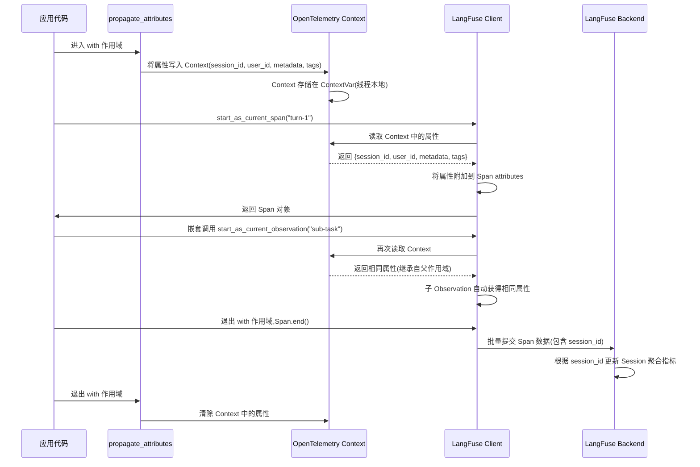

## 一、使用场景：何时需要会话级聚合

LangFuse 提供两层上下文组织机制：Session(会话)实现业务逻辑的逻辑分组，Metadata(元数据)提供扩展维度的键值存储。这种设计解决了两类核心问题。

**跨 Trace 的关联分析**。一个用户会话可能触发多个独立的 Trace：
- 用户首次提问触发 Trace-A(检索+生成)
- 用户追问触发 Trace-B(基于上下文的增量生成)
- 用户要求重新表述触发 Trace-C(改写前文答案)

若无会话级标识符,这三个 Trace 在数据库中孤立存在,无法回答:"用户在一次会话中平均提问几次?" 或 "哪些会话触发了最多的 API 错误?"。LangFuse 通过 `session_id` 将分散的 Trace 串联,使工程师能按会话维度聚合指标——总成本、平均延迟、错误率——并在 UI 中一键展开某个会话的完整交互历史。

**多维度的归因分析**。一个 Trace 可能关联多个业务维度:
- 用户维度(`user_id`):哪些用户产生了最高成本?
- 实验维度(`metadata.experiment_variant`):A/B 测试中哪个变体的响应质量更高?
- 地域维度(`tags: ["region-us-west"]`):不同地域的延迟差异如何?

传统日志系统通过正则解析日志文本提取这些维度,LangFuse 将其结构化为 Trace 和 Observation 的原生字段,支持高效的索引和过滤。

**何时使用 Session？** 判定标准是"业务逻辑的连续性":
- **多轮对话**:聊天机器人的一次完整交互会话
- **工作流链路**:用户从搜索到结算的完整购物流程
- **批处理任务**:ETL 管道中同一批次的所有数据处理 Trace

边界条件:若 Trace 间无语义关联(如两个不同用户的独立请求),不应使用相同 `session_id`,否则会污染会话级指标。

## 二、核心概念：Session 与 Metadata 的交互模型

### 2.1 Session 的隐式创建机制

LangFuse 中不存在"创建 Session"的显式 API。Session 通过 `session_id` 的首次使用而隐式创建:
```python
# 无需调用 create_session(),直接使用 session_id
with langfuse.start_as_current_span(name="turn-1", session_id="session-abc123"):
    # Session "session-abc123" 被自动创建(若不存在)
    pass
```

后端在收到带有新 `session_id` 的 Trace 时,自动在数据库中创建 Session 记录:
```python
class Session:
    id: str                    # session_id,由客户端指定
    created_at: datetime       # 首次出现该 session_id 的时间
    project_id: str            # 所属项目
    environment: str           # 运行环境(如 "production")
```

**为什么不提供 create_session API？** 设计理由是避免"先创建 Session,再关联 Trace"的两步流程。在分布式系统中,若创建 Session 的请求失败,后续 Trace 将丢失会话信息。隐式创建保证了 Session 与 Trace 的原子性绑定。

**Session 生命周期**。Session 无显式的"结束"操作,其生命周期由关联的最后一个 Trace 的 `timestamp` 确定。LangFuse 后端通过定时任务标记超过 N 小时未活动的 Session 为"inactive",但不删除历史数据。

### 2.2 Trace 与 Session 的一对多关系

一个 Session 可关联多个 Trace,但一个 Trace 仅属于一个 Session(或无 Session)。数据模型:
```python
class Trace:
    id: str
    session_id: Optional[str]  # 外键,指向 Session.id
    # ... 其他字段

class Session:
    id: str
    traces: List[Trace]        # 一对多关系,由后端维护
```

查询某个 Session 的所有 Trace:
```python
# 通过 API
session_data = langfuse.api.sessions.get(session_id="session-abc123")
for trace in session_data.traces:
    print(trace.id, trace.timestamp)
```

**Session 的聚合指标**。LangFuse UI 自动计算每个 Session 的:
- **Trace 数量**:该会话触发了多少次独立请求
- **总成本**:所有 Trace 的 `cost_details` 求和
- **平均延迟**:所有 Trace 的 `duration` 均值
- **错误率**:包含 `level=ERROR` 的 Trace 占比

这些指标在数据库层面通过 SQL 聚合查询计算,无需客户端手动累加。

### 2.3 Metadata 的扁平化存储

Metadata 是一个 `Dict[str, Any]` 字段,支持嵌套对象:
```python
trace.update(metadata={
    "user_profile": {
        "tier": "premium",
        "country": "US"
    },
    "experiment": {
        "variant": "a",
        "cohort": "control"
    }
})
```

LangFuse 后端将嵌套结构扁平化为点分键名:
```
metadata.user_profile.tier = "premium"
metadata.user_profile.country = "US"
metadata.experiment.variant = "a"
metadata.experiment.cohort = "control"
```

这种扁平化使得后端能为常用字段建立索引,支持快速过滤:
```sql
SELECT * FROM traces 
WHERE metadata->>'user_profile.tier' = 'premium'
  AND metadata->>'experiment.variant' = 'a';
```

**扁平化的边界**。嵌套层级超过 5 层时,部分数据库(如 PostgreSQL JSONB)的查询性能显著下降。建议:
- 将高频查询的维度提升为 Trace 的顶层字段(如 `user_id`)
- 将低频查询的维度放入 `metadata`

### 2.4 Tags 与 Metadata 的职责划分

Tags 是字符串数组,Metadata 是键值对。职责划分:

| 维度 | Tags | Metadata |
|------|------|----------|
| **典型用例** | 分类标签(如 "production", "beta", "high-priority") | 结构化数据(如 {"user_id": "123", "score": 0.95}) |
| **查询性能** | 数组类型,支持 `IN` 查询,索引高效 | JSONB 类型,支持点分键查询,但索引开销较大 |
| **UI 过滤** | 下拉菜单选择(枚举值) | 文本输入或范围选择(数值/字符串) |
| **推荐使用** | 环境标签、优先级、功能开关 | 用户属性、实验参数、业务指标 |

**反模式**:
- 将结构化数据存为 Tags:如 `tags: ["user_id:123", "score:0.95"]`。这破坏了 Tags 的语义分类职责,且无法支持范围查询(如 `score > 0.9`)。
- 将枚举值存为 Metadata:如 `metadata: {"environment": "production"}`。这增加了查询复杂度(需 JSONB 查询),应改为 `tags: ["production"]`。

## 三、数据结构：Session 与 Metadata 的字段解析

### 3.1 Session 数据模型

```python
class Session:
    id: str                    # 客户端指定的唯一标识符
    created_at: datetime       # 首次关联 Trace 的时间
    project_id: str            # 所属项目(多租户隔离)
    environment: str           # 运行环境(如 "production", "staging")

class SessionWithTraces(Session):
    traces: List[Trace]        # 关联的所有 Trace(后端聚合查询)
```

**字段约束**:
- `id`:无格式限制,但建议使用 UUID 或业务键(如 "session-{user_id}-{timestamp}")
- `environment`:与 Langfuse 客户端的 `environment` 参数一致,用于多环境数据隔离

### 3.2 Trace 中的 Session 关联字段

```python
class Trace:
    id: str
    session_id: Optional[str]  # 指向 Session.id
    user_id: Optional[str]     # 用户标识,常与 session_id 配合使用
    metadata: Dict[str, Any]   # 扩展元数据
    tags: List[str]            # 分类标签
    timestamp: datetime        # Trace 创建时间
    # ... 其他字段
```

**Session 与 User 的关系**:
- `session_id`:标识一次业务逻辑的会话(如一次对话)
- `user_id`:标识用户身份,一个用户可能有多个会话

例如,用户 A 今天上午和下午分别发起两次对话,应创建两个不同的 `session_id`,但 `user_id` 相同。

### 3.3 Metadata 的序列化规则

Metadata 字段接受任意 JSON 可序列化类型,但存在以下约束:
1. **大小限制**:单个 Metadata 字典序列化后不超过 64KB。超限时 LangFuse 截断并记录警告。
2. **键名规范**:键名不应包含点号 `.`,否则与扁平化后的点分键冲突。例如:
   ```python
   # 错误:键名包含点号
   metadata = {"user.profile.tier": "premium"}
   # 扁平化后:metadata.user.profile.tier,与嵌套结构冲突

   # 正确:使用下划线
   metadata = {"user_profile_tier": "premium"}
   ```
3. **类型保持**:数值、布尔值在序列化后保持类型,字符串需加引号。LangFuse 后端根据类型选择索引策略:数值字段可建立 B-Tree 索引,字符串字段建立 GIN 索引。

## 四、最小实现：Session 与 Metadata 的代码示例

以下代码展示了会话级上下文管理的典型用法:

```python
from langfuse import Langfuse
from langfuse._client.propagation import propagate_attributes

langfuse = Langfuse()

# 场景1:显式指定 session_id
session_id = "session-20240615-user123"

with langfuse.start_as_current_span(
    name="conversation-turn-1",
    session_id=session_id,
    user_id="user-123",
    metadata={"user_tier": "premium", "language": "zh-CN"},
    tags=["production", "chatbot"]
) as turn1:
    # 模拟对话第一轮
    user_query = "What is LangFuse?"
    response = generate_response(user_query)
    turn1.update(input=user_query, output=response)

# 对话第二轮(共享 session_id)
with langfuse.start_as_current_span(
    name="conversation-turn-2",
    session_id=session_id,  # 复用相同 session_id
    user_id="user-123",
    metadata={"user_tier": "premium", "language": "zh-CN"},
    tags=["production", "chatbot"]
) as turn2:
    user_query = "How does it track costs?"
    response = generate_response(user_query, context=turn1.output)
    turn2.update(input=user_query, output=response)

# 场景2:使用 propagate_attributes 避免重复设置
with propagate_attributes(
    session_id=session_id,
    user_id="user-123",
    metadata={"user_tier": "premium", "language": "zh-CN"},
    tags=["production", "chatbot"]
):
    # 此作用域内的所有 Span 自动继承属性
    with langfuse.start_as_current_span(name="turn-3") as turn3:
        # turn3 自动获得 session_id、user_id、metadata、tags
        user_query = "Can you show an example?"
        response = generate_response(user_query)
        turn3.update(input=user_query, output=response)
```

**执行流分解**:
1. 首次使用 `session_id="session-20240615-user123"` 时,LangFuse 后端自动创建 Session 记录。
2. 每个 Trace 的 `session_id` 字段指向该 Session。
3. `propagate_attributes` 将属性写入 OpenTelemetry Context,嵌套的 Span 通过 Context 继承。
4. 后端在查询时,按 `session_id` 聚合 Trace,计算会话级指标。

## 五、关键流程：属性传播的执行链路

以下时序图展示了属性如何从 Trace 层级传播到嵌套的 Observation:



**关键决策点**:
1. **属性的优先级**。若同时使用 `propagate_attributes` 和显式参数,显式参数优先:
   ```python
   with propagate_attributes(user_id="user-old"):
       # 显式参数覆盖 Context 中的值
       with langfuse.start_as_current_span(name="task", user_id="user-new"):
           # 此 Span 的 user_id 为 "user-new"
           pass
   ```
2. **跨异步任务的 Context 丢失**。Python 的 `asyncio.create_task` 会创建新的 Context,导致属性不继承:
   ```python
   with propagate_attributes(session_id="session-123"):
       async def background_task():
           # 此处无法读取 session_id,Context 已丢失
           with langfuse.start_as_current_span("bg-task"):
               pass
       asyncio.create_task(background_task())
   ```
   **解决方案**:使用 `asyncio.create_task` 的 `context` 参数传递 Context:
   ```python
   from contextvars import copy_context

   with propagate_attributes(session_id="session-123"):
       ctx = copy_context()
       async def background_task():
           with langfuse.start_as_current_span("bg-task"):
               pass
       asyncio.create_task(background_task(), context=ctx)
   ```

## 六、扩展点：Metadata 的高级模式

### 6.1 动态计算的延迟加载

某些 Metadata 字段的计算开销较大(如调用外部 API 获取用户画像)。推荐在首次使用时才计算:

```python
class LazyMetadata:
    def __init__(self):
        self._cache = {}
    
    def get_user_profile(self, user_id: str) -> dict:
        if user_id not in self._cache:
            # 仅在首次访问时调用 API
            self._cache[user_id] = fetch_user_profile_from_api(user_id)
        return self._cache[user_id]

lazy_meta = LazyMetadata()

with langfuse.start_as_current_span(name="task") as span:
    # 仅在需要时计算
    profile = lazy_meta.get_user_profile("user-123")
    span.update(metadata={"user_profile": profile})
```

### 6.2 跨服务的 Metadata 传播

在微服务架构中,Metadata 需跨 HTTP 调用传播。LangFuse 支持通过 `as_baggage=True` 将属性编码到 HTTP Header:

```python
# 服务 A
with propagate_attributes(
    session_id="session-123",
    metadata={"experiment": "variant-a"},
    as_baggage=True  # 启用 HTTP Header 传播
):
    response = requests.post("http://service-b/api", json={...})
```

服务 B 的 HTTP Handler 自动解析 `baggage` Header:
```
baggage: session_id=session-123,metadata.experiment=variant-a
```

LangFuse 客户端在服务 B 中读取 Header,恢复 Context:
```python
# 服务 B(自动解析 baggage)
with langfuse.start_as_current_span(name="process-request"):
    # session_id 自动继承自 HTTP Header
    pass
```

**安全警告**。`as_baggage=True` 会将 Metadata 暴露在 HTTP Header 中,不应传递敏感信息(如密码、令牌)。若需传递敏感数据,改用加密的请求体。

### 6.3 Metadata 的版本演化

随着业务迭代,Metadata Schema 可能发生变化(如字段改名、增加嵌套层级)。推荐使用版本标记:

```python
# v1 Schema
metadata_v1 = {
    "schema_version": "1.0",
    "user_tier": "premium"
}

# v2 Schema(改名为 subscription_tier)
metadata_v2 = {
    "schema_version": "2.0",
    "subscription_tier": "premium"
}

# 查询时根据版本解析
def parse_metadata(meta: dict):
    if meta.get("schema_version") == "1.0":
        return meta["user_tier"]
    elif meta.get("schema_version") == "2.0":
        return meta["subscription_tier"]
```

这使得新旧版本的数据能在同一数据库中共存,避免全量迁移。

## 七、风险与权衡：上下文管理的架构取舍

### 7.1 Session 生命周期的模糊性

**风险描述**。Session 无显式的"结束"操作,其生命周期由最后一个 Trace 的时间戳隐式确定。这导致两类问题:
1. **僵尸 Session**。若用户会话因异常中断(如浏览器崩溃),后续无新 Trace 生成,该 Session 永远停留在"活跃"状态。
2. **跨日会话的统计偏差**。若用户会话跨越 UTC 日期边界(如 23:50 开始,00:10 结束),按日聚合时该会话被拆分到两天,导致指标失真。

**缓解措施**:
1. 在客户端实现显式的会话结束标记:
   ```python
   with langfuse.start_as_current_span(
       name="session-end-marker",
       session_id=session_id,
       metadata={"event": "session_closed"}
   ):
       pass  # 仅用于标记会话结束
   ```
2. 后端定时任务:标记超过 N 小时无活动的 Session 为"inactive",排除在活跃会话统计之外。

### 7.2 Metadata 的查询性能瓶颈

**性能分析**。PostgreSQL 的 JSONB 类型支持点分键查询,但性能依赖 GIN 索引。建立索引:
```sql
CREATE INDEX idx_trace_metadata_gin ON traces USING GIN (metadata);
```

查询性能基准(在 100 万条 Trace 记录上):
- **无索引**:点分键查询耗时 ~5 秒(全表扫描)
- **GIN 索引**:点分键查询耗时 ~50 毫秒(索引扫描)
- **提升为顶层字段**:查询耗时 ~5 毫秒(B-Tree 索引)

**权衡决策**:
- **高频查询维度**(如 `user_id`, `session_id`):提升为 Trace 的顶层字段,享受 B-Tree 索引的性能。
- **中频查询维度**(如 `experiment_variant`):保留在 Metadata,但为常用键建立 GIN 索引。
- **低频查询维度**(如 `debug_info`):保留在 Metadata,接受全表扫描的开销。

### 7.3 Tags 的枚举爆炸问题

**风险描述**。若将高基数字段存为 Tags(如用户 ID),Tags 的枚举值数量爆炸:
```python
# 错误:100 万用户产生 100 万个不同 Tags
tags = [f"user-{user_id}"]
```

这导致 UI 的 Tags 过滤器无法渲染(下拉菜单包含 100 万项),且数组索引失效(PostgreSQL 的 GIN 索引在高基数场景下退化为全表扫描)。

**缓解措施**:
1. **高基数字段使用 Metadata**:
   ```python
   # 正确:将 user_id 存为 Metadata
   metadata = {"user_id": user_id}
   tags = ["production"]  # Tags 仅存储低基数分类
   ```
2. **Tags 的命名规范**:限制 Tags 的枚举值在 100 个以内,使用分类而非标识符。

### 7.4 跨服务传播的 Header 大小限制

**风险描述**。HTTP Header 的总大小通常限制在 8KB(Nginx 默认)或 16KB(Apache 默认)。若通过 `as_baggage=True` 传播大量 Metadata,可能超限导致请求被拒绝:
```python
# 错误:传播大型 Metadata
with propagate_attributes(
    metadata={"large_object": "..." * 10000},  # 10KB 数据
    as_baggage=True
):
    requests.post("http://service-b/api")  # 请求失败:Header too large
```

**缓解措施**:
1. **仅传播必要字段**:
   ```python
   # 正确:仅传播关键标识符
   with propagate_attributes(
       metadata={"trace_context_id": "abc123"},
       as_baggage=True
   ):
       # 服务 B 根据 trace_context_id 查询完整 Metadata
       requests.post("http://service-b/api")
   ```
2. **使用压缩编码**:对大型 Metadata 进行 gzip 压缩后 Base64 编码,但需自定义 Baggage 处理逻辑。

### 7.5 Session 聚合指标的最终一致性

**一致性模型**。Session 的聚合指标(如总成本、Trace 数量)由后端异步计算:
1. Trace 上传到后端后,进入消息队列。
2. 聚合服务消费队列,更新 Session 的统计字段。
3. UI 查询 Session 时,读取已缓存的统计结果。

这种设计下,指标存在"最终一致性":Trace 上传后,可能延迟数秒至数十秒才反映在 Session 指标中。

**权衡分析**:
- **优势**:避免每次 Trace 上传时实时计算聚合(锁竞争、性能瓶颈)。
- **劣势**:实时监控场景下,无法立即看到最新指标。

**解决方案**:
- 对于实时性要求高的场景(如 Dashboard),使用"强制刷新"按钮触发同步计算:
  ```python
  # API 调用:强制重新计算 Session 指标
  session = langfuse.api.sessions.get(session_id="...", refresh=True)
  ```
- 对于批量分析场景,接受延迟,依赖异步更新。

## 小结

LangFuse 的上下文管理系统通过 Session 的隐式创建和 Metadata 的扁平化存储,实现了业务逻辑的灵活组织。其核心权衡在于:以隐式生命周期的简洁性换取僵尸会话的风险,以 JSONB 的灵活性换取查询性能的下降,以异步聚合的高吞吐换取指标的最终一致性。工程实践中,需根据查询频率、实时性要求、数据规模,在这些维度间寻找平衡点。Tags 用于低基数分类,Metadata 用于高维度扩展,两者的职责边界需严格遵守,以避免性能退化。
