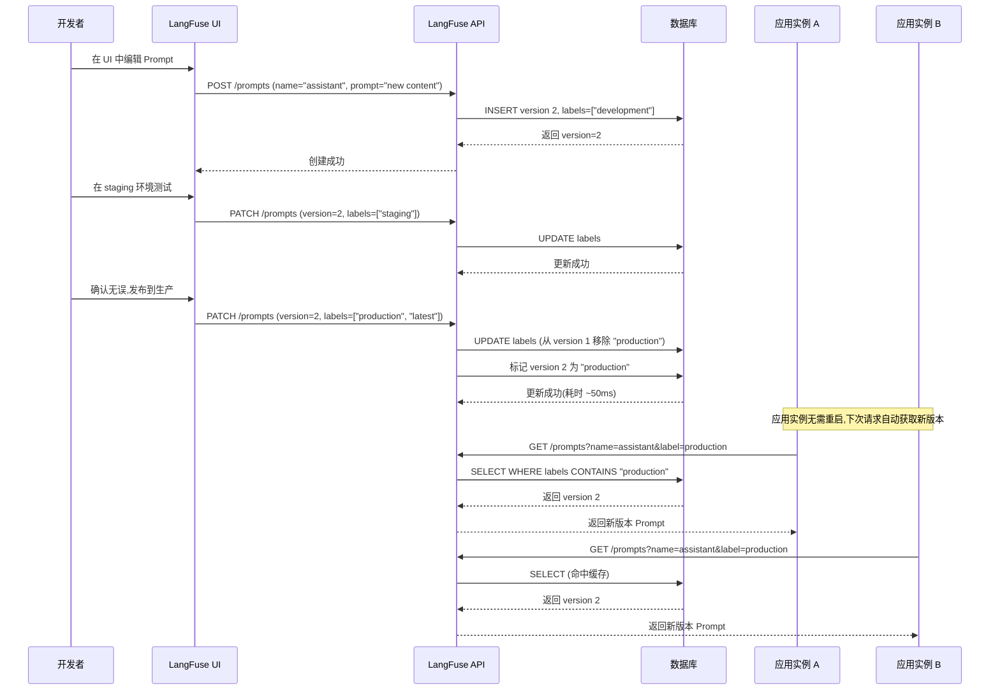

## 一、使用场景：何时将 Prompt 结构化管理

LangFuse 将 Prompt 从代码中剥离,作为独立的可版本化资源管理。这种设计响应了 LLM 应用工程化的三个核心痛点。

**Prompt 迭代与代码解耦**。传统做法是将 Prompt 硬编码在应用代码中:
```python
# 反模式:Prompt 与代码耦合
prompt = "You are a helpful assistant. Answer the question: {question}"
response = llm.complete(prompt.format(question=user_input))
```

当需要优化 Prompt(如调整措辞、增加示例)时,必须修改代码、重新部署。在高频迭代场景下(A/B 测试需要每日切换 10+ 个 Prompt 变体),这种流程的摩擦成本不可接受。LangFuse 将 Prompt 存储在后端数据库,应用运行时通过 API 动态拉取:
```python
# LangFuse 模式:Prompt 作为配置
prompt = langfuse.get_prompt("assistant-v2", label="production")
response = llm.complete(prompt.compile(question=user_input))
```

产品经理可在 UI 中直接编辑 Prompt,立即生效,无需工程师介入。这将 Prompt 迭代周期从"小时级"压缩到"秒级"。

**多变体的并行实验**。在 A/B 测试中,需要同时运行多个 Prompt 版本:
- 版本 1(baseline):"As a professional assistant, ..."
- 版本 2(variant-a):"As a friendly expert, ..."
- 版本 3(variant-b):"You are an AI trained to help users by ..."

若 Prompt 硬编码,需维护三份代码分支,切换时需重新部署。LangFuse 通过 Label 机制实现零停机切换:
```python
# 根据实验分组动态选择 Prompt
label = "variant-a" if user_in_experiment_group() else "production"
prompt = langfuse.get_prompt("assistant", label=label)
```

所有变体共存于同一应用进程,通过 Label 路由流量。

**Prompt 质量的回溯分析**。当模型输出质量下降时,需回答:"是哪次 Prompt 变更导致的?" 传统做法依赖 Git 历史和人工比对,LangFuse 将每个 Trace 与使用的 Prompt 版本关联:
```python
generation = langfuse.start_observation(
    name="llm-call",
    as_type="generation",
    prompt_id=prompt.version  # 自动记录 Prompt 版本
)
```

UI 中可按 Prompt 版本过滤 Trace,对比不同版本的质量指标(如平均得分、错误率),快速定位劣化的版本。

**何时使用 Prompt 管理？** 判定标准是"Prompt 的变更频率":
- **高频迭代场景**(如日均 >1 次 Prompt 调整):必须使用,否则部署成本压垮迭代速度
- **多变体实验**(如 A/B 测试 >3 个变体):必须使用,否则代码分支爆炸
- **跨团队协作**(如产品经理需直接编辑 Prompt):必须使用,否则沟通成本过高
- **低频静态 Prompt**(如月均 <1 次调整):可硬编码,使用 Prompt 管理的收益不足以覆盖引入的复杂度

## 二、核心概念：Prompt 的类型系统与版本模型

### 2.1 Text Prompt 与 Chat Prompt 的职责边界

LangFuse 支持两种 Prompt 类型,对应不同的 LLM 交互模式:

**Text Prompt**(文本提示):单一字符串模板,用于 Completion API:
```python
class Prompt_Text:
    prompt: str                    # 模板字符串,如 "Summarize: {{text}}"
    name: str                      # 唯一标识符
    version: int                   # 版本号(自增)
    labels: List[str]              # 标签,如 ["production", "latest"]
    config: Dict[str, Any]         # 模型参数,如 {"temperature": 0.7}
```

使用场景:文本生成、摘要、分类等"单次输入-单次输出"任务。

**Chat Prompt**(对话提示):消息列表,用于 Chat Completion API:
```python
class Prompt_Chat:
    prompt: List[ChatMessage]      # 消息数组
    name: str
    version: int
    labels: List[str]
    config: Dict[str, Any]

class ChatMessage:
    role: Literal["system", "user", "assistant", "tool"]
    content: str                   # 支持变量替换,如 "Hello, {{name}}"
```

使用场景:多轮对话、角色扮演、工具调用等需要"消息历史"的任务。

**为什么需要两种类型？** 设计理由是匹配不同 LLM API 的输入格式:
- OpenAI 的 `gpt-3.5-turbo` 要求 `messages` 数组(Chat 格式)
- OpenAI 的 `text-davinci-003` 要求单一 `prompt` 字符串(Text 格式)

虽然 Chat 格式可模拟 Text 格式(将 Text 包装为单条 user 消息),但 LangFuse 保留两种类型以提供语义明确性:看到 Text Prompt 时,开发者立即知道这是单次交互,无需理解复杂的消息角色。

### 2.2 版本号与标签的二元定位

每个 Prompt 变更创建新版本,版本号从 1 开始自增。版本是"不可变快照":一旦创建,内容永不修改。

**标签(Label)**是版本的"可变指针",类比于 Git 的 Branch:
```
Prompt Name: "assistant"
├── Version 1 (labels: ["production"])
│   └── "You are a helpful assistant."
├── Version 2 (labels: ["staging"])
│   └── "You are a professional assistant."
└── Version 3 (labels: ["latest"])
    └── "You are an expert assistant."
```

**获取 Prompt 的三种方式**:
```python
# 方式1:按标签获取(默认 "production")
prompt = langfuse.get_prompt("assistant")  # 返回 Version 1
prompt = langfuse.get_prompt("assistant", label="staging")  # 返回 Version 2

# 方式2:按版本号获取
prompt = langfuse.get_prompt("assistant", version=2)  # 返回 Version 2

# 方式3:获取最新版本
prompt = langfuse.get_prompt("assistant", label="latest")  # 返回 Version 3
```

**标签的可重分配性**。标签可随时重新指向不同版本,实现零停机部署:
```python
# 将 "production" 标签从 Version 1 移动到 Version 3
langfuse.api.prompts.update(
    name="assistant",
    version=3,
    new_labels=["production", "latest"]
)
# 此后所有请求 label="production" 的代码立即获取 Version 3
```

这种设计的好处是"发布"与"回滚"操作都是标签的重新绑定,耗时 <100ms,远快于重新部署应用(分钟级)。

### 2.3 变量替换的模板引擎

Prompt 中的变量使用 `{{variable}}` 语法标记:
```python
# Text Prompt 示例
template = "Summarize the following text: {{text}}. Focus on {{aspect}}."

# Chat Prompt 示例
messages = [
    {"role": "system", "content": "You are a {{role}} assistant."},
    {"role": "user", "content": "My question is: {{question}}"}
]
```

编译时传入变量字典:
```python
prompt = langfuse.get_prompt("summarizer")
compiled = prompt.compile(text="Long article...", aspect="key points")
# 结果: "Summarize the following text: Long article.... Focus on key points."
```

**模板引擎的实现逻辑**:
1. 使用正则表达式扫描 `{{...}}` 模式
2. 提取变量名(去除首尾空格)
3. 查找变量字典,若存在则替换为字符串值,否则保留原样
4. 拼接结果字符串

**边界情况**:
- **嵌套花括号**:`{{{var}}}` 会被解析为字面量 `{` + 变量 `var` + 字面量 `}`
- **未定义变量**:保留原始的 `{{var}}`,不抛出异常(便于部分编译)
- **非字符串值**:自动调用 `str()` 转换(如数值、布尔值)

### 2.4 占位符(Placeholder)的动态消息注入

Chat Prompt 支持特殊的"占位符"类型,在编译时注入整个消息列表:
```python
# 定义 Chat Prompt(包含占位符)
messages = [
    {"role": "system", "content": "You are a helpful assistant."},
    {"type": "placeholder", "name": "conversation_history"},
    {"role": "user", "content": "{{current_question}}"}
]

# 编译时注入历史消息
compiled = prompt.compile(
    conversation_history=[
        {"role": "user", "content": "What is Python?"},
        {"role": "assistant", "content": "Python is a programming language."}
    ],
    current_question="What is its syntax like?"
)

# 结果消息列表:
# [
#   {"role": "system", "content": "..."},
#   {"role": "user", "content": "What is Python?"},
#   {"role": "assistant", "content": "Python is a programming language."},
#   {"role": "user", "content": "What is its syntax like?"}
# ]
```

占位符使得 Prompt 模板能够适配任意长度的对话历史,避免为不同轮次的对话创建重复的 Prompt 版本。

## 三、数据结构：字段语义的精确解析

### 3.1 Prompt 基础字段

两种 Prompt 类型共享的字段:

| 字段 | 类型 | 语义解析 |
|------|------|----------|
| `name` | `str` | Prompt 的唯一标识符,用于 API 查询(如 "email-summarizer") |
| `version` | `int` | 版本号,自动递增,首次创建为 1 |
| `labels` | `List[str]` | 标签数组,用于环境隔离或实验分组(如 ["production", "staging"]) |
| `tags` | `List[str]` | 分类标签,用于 UI 过滤(如 ["email", "summarization"]) |
| `config` | `Dict[str, Any]` | 模型参数,如 `{"temperature": 0.7, "max_tokens": 500}` |
| `commit_message` | `Optional[str]` | 版本变更说明,类比 Git Commit Message |
| `type` | `Literal["text", "chat"]` | 类型标识,决定 `prompt` 字段的数据结构 |

### 3.2 Text Prompt 专有字段

```python
class Prompt_Text:
    prompt: str                    # 单一模板字符串
```

**字段约束**:
- `prompt` 长度限制:16KB(约 4000 tokens)
- 变量数量限制:建议 ≤20 个,过多变量降低可读性

### 3.3 Chat Prompt 专有字段

```python
class Prompt_Chat:
    prompt: List[ChatMessageWithPlaceholders]

# ChatMessage 的两种形式
ChatMessage = {
    "role": "system" | "user" | "assistant" | "tool",
    "content": str
}

Placeholder = {
    "type": "placeholder",
    "name": str
}

ChatMessageWithPlaceholders = ChatMessage | Placeholder
```

**字段约束**:
- 消息列表长度限制:建议 ≤50 条,过长的历史应在应用层截断
- 占位符名称:必须是合法的 Python 标识符(字母、数字、下划线)

### 3.4 config 字段的模型参数映射

`config` 字段存储模型调用参数,常见键值:

| 键名 | 类型 | OpenAI 对应参数 |
|------|------|----------------|
| `temperature` | `float` | 控制随机性(0-2) |
| `max_tokens` | `int` | 最大生成长度 |
| `top_p` | `float` | 核采样阈值(0-1) |
| `frequency_penalty` | `float` | 词频惩罚(-2 到 2) |
| `presence_penalty` | `float` | 新词惩罚(-2 到 2) |
| `stop` | `List[str]` | 停止序列 |

LangFuse 不验证 `config` 的键名,由调用方负责传递给 LLM API。这使得 LangFuse 能支持任意模型提供商(OpenAI、Anthropic、Cohere 等),而无需为每个提供商维护不同的 Schema。

## 四、最小实现：从创建到编译的完整流程

以下代码展示了 Prompt 的完整生命周期:

```python
from langfuse import Langfuse

langfuse = Langfuse()

# ========== 1. 创建 Text Prompt ==========
text_prompt_id = langfuse.create_prompt(
    name="summarizer",
    prompt="Summarize the following text in {{max_words}} words: {{text}}",
    labels=["development"],  # 初始标签
    config={"temperature": 0.5, "max_tokens": 200}
)
print(f"Created Text Prompt, version: {text_prompt_id.version}")

# ========== 2. 创建 Chat Prompt ==========
chat_prompt_id = langfuse.create_prompt(
    name="assistant",
    prompt=[
        {"role": "system", "content": "You are a {{role}} assistant."},
        {"type": "placeholder", "name": "history"},
        {"role": "user", "content": "{{question}}"}
    ],
    labels=["development"],
    config={"temperature": 0.7, "max_tokens": 500}
)

# ========== 3. 获取并编译 Prompt ==========
# 按标签获取
prompt = langfuse.get_prompt("summarizer", label="development")

# 编译模板
compiled_text = prompt.compile(
    max_words=50,
    text="LangFuse is an observability platform for LLM applications..."
)
print(compiled_text)
# 输出: "Summarize the following text in 50 words: LangFuse is..."

# ========== 4. 获取并编译 Chat Prompt ==========
chat_prompt = langfuse.get_prompt("assistant", label="development")

compiled_messages = chat_prompt.compile(
    role="technical",
    history=[
        {"role": "user", "content": "What is Python?"},
        {"role": "assistant", "content": "Python is a language."}
    ],
    question="What about its performance?"
)
print(compiled_messages)
# 输出消息列表(占位符已展开)

# ========== 5. 创建新版本(迭代优化) ==========
new_version = langfuse.create_prompt(
    name="summarizer",  # 相同名称触发版本递增
    prompt="Provide a concise summary of {{text}} in no more than {{max_words}} words.",
    labels=["staging"],  # 新版本使用 staging 标签
    config={"temperature": 0.3, "max_tokens": 200}
)
print(f"Created new version: {new_version.version}")

# ========== 6. 发布到生产环境(标签迁移) ==========
langfuse.api.prompts.update(
    name="summarizer",
    version=new_version.version,
    new_labels=["production", "latest"]  # 将 production 标签指向新版本
)

# 此后所有使用 label="production" 的代码自动获取新版本
```

**执行流分解**:
1. 调用 `create_prompt` 时,后端检查 `name` 是否已存在。若不存在,创建首个版本(version=1);若存在,版本号自增。
2. `labels` 参数在创建时绑定到新版本。若 `labels` 包含已被其他版本占用的标签,后端自动从旧版本移除该标签,重新绑定到新版本。
3. 调用 `get_prompt` 时,后端根据 `label` 或 `version` 查询数据库,返回匹配的 Prompt 对象。
4. 客户端调用 `prompt.compile(**kwargs)` 时,模板引擎在本地执行变量替换,无需网络请求。
5. `update` 操作仅修改 `labels` 字段,不修改 `prompt` 或 `config`(版本不可变原则)。

## 五、关键流程：版本发布的零停机切换

以下时序图展示了 Prompt 版本从开发到生产的完整流程:



**关键决策点**:
1. **标签的原子性更新**。API 在单个事务中完成"移除旧标签+添加新标签",避免中间状态(两个版本同时拥有 `production` 标签)。
2. **客户端缓存的失效策略**。LangFuse 客户端默认缓存 Prompt 60 秒(可配置)。标签更新后,最多 60 秒后所有实例才获取新版本。若需立即生效,需:
   - 缩短缓存 TTL(如设为 0,禁用缓存)
   - 调用 `langfuse.clear_prompt_cache()` 手动清空缓存
3. **回滚的快速路径**。若新版本引发问题,只需将 `production` 标签重新指向旧版本:
   ```python
   # 回滚到 version 1
   langfuse.api.prompts.update(
       name="assistant",
       version=1,
       new_labels=["production"]
   )
   ```
   回滚耗时与发布相同(~50ms),远快于重新部署应用。

## 六、扩展点：模板引擎的高级功能

### 6.1 自定义模板解析器

虽然 LangFuse 内置的模板引擎仅支持简单的变量替换,但可通过继承扩展:

```python
from langfuse.model import TemplateParser

class AdvancedTemplateParser(TemplateParser):
    @staticmethod
    def compile_template(content: str, data: dict) -> str:
        # 步骤1:先执行内置的变量替换
        result = TemplateParser.compile_template(content, data)
        
        # 步骤2:实现自定义逻辑(如条件语句)
        # 示例:支持 {{#if var}}...{{/if}} 语法
        import re
        pattern = r'\{\{#if (\w+)\}\}(.*?)\{\{/if\}\}'
        def replace_if(match):
            var_name, content = match.groups()
            if data.get(var_name):
                return content
            return ""
        result = re.sub(pattern, replace_if, result, flags=re.DOTALL)
        
        return result

# 使用自定义解析器
prompt = langfuse.get_prompt("assistant")
prompt._parser = AdvancedTemplateParser  # 替换解析器
compiled = prompt.compile(show_advanced=True, ...)
```

**警告**:自定义解析器可能破坏 LangFuse UI 的预览功能(UI 使用内置解析器渲染)。建议仅在复杂场景下使用。

### 6.2 LangChain 集成

LangFuse Prompt 可直接转换为 LangChain 的 PromptTemplate:

```python
from langfuse import Langfuse
from langchain.prompts import PromptTemplate, ChatPromptTemplate

langfuse = Langfuse()

# Text Prompt -> LangChain PromptTemplate
text_prompt = langfuse.get_prompt("summarizer")
langchain_prompt = text_prompt.get_langchain_prompt()
# 类型: PromptTemplate(input_variables=["text", "max_words"], template="...")

# Chat Prompt -> LangChain ChatPromptTemplate
chat_prompt = langfuse.get_prompt("assistant")
langchain_chat = chat_prompt.get_langchain_prompt()
# 类型: ChatPromptTemplate(messages=[...])

# 直接用于 LangChain Chain
from langchain.chains import LLMChain
chain = LLMChain(llm=llm, prompt=langchain_prompt)
result = chain.run(text="...", max_words=50)
```

这使得 LangFuse 可无缝集成到现有的 LangChain 应用,享受版本控制的好处,同时保持 LangChain 的灵活性。

### 6.3 Prompt 继承与组合

虽然 LangFuse 不原生支持 Prompt 继承,但可通过客户端逻辑实现:

```python
# 定义基础 Prompt(仅 system 消息)
base_prompt = langfuse.get_prompt("base-system")
# prompt: [{"role": "system", "content": "You are a helpful assistant."}]

# 定义任务 Prompt(仅 user 消息)
task_prompt = langfuse.get_prompt("task-question")
# prompt: [{"role": "user", "content": "{{question}}"}]

# 组合两个 Prompt
combined_messages = base_prompt.prompt + task_prompt.prompt
compiled = ChatPromptClient.compile_messages(
    combined_messages,
    question="What is Python?"
)
```

这种模式适用于多个任务共享相同 system 消息的场景,避免重复维护。

## 七、风险与权衡：版本控制的架构取舍

### 7.1 标签重分配的竞态条件

**风险描述**。两个开发者同时将 `production` 标签分配给不同版本:
```
# 开发者 A:将 production 指向 version 2
langfuse.api.prompts.update(name="assistant", version=2, new_labels=["production"])

# 开发者 B:同时将 production 指向 version 3
langfuse.api.prompts.update(name="assistant", version=3, new_labels=["production"])
```

若无并发控制,最终哪个版本获得 `production` 标签取决于请求到达顺序,可能导致"最后写入者胜利"的混乱。

**缓解措施**:
1. **乐观锁机制**。API 要求传递 `expected_current_version` 参数:
   ```python
   # 仅当 production 当前指向 version 1 时才允许更新
   langfuse.api.prompts.update(
       name="assistant",
       version=2,
       new_labels=["production"],
       expected_current_version=1  # 版本前置条件
   )
   ```
   若前置条件不满足,API 返回 409 Conflict,客户端需重新获取最新状态并重试。
2. **UI 层的权限控制**。LangFuse UI 可配置"仅允许特定角色修改 production 标签",避免普通开发者误操作。

### 7.2 缓存一致性的延迟窗口

**一致性模型**。LangFuse 客户端默认缓存 Prompt 60 秒,缓存键为 `(name, label)` 或 `(name, version)`:
```python
# 第一次调用:从 API 获取
prompt = langfuse.get_prompt("assistant", label="production")  # 网络请求

# 60 秒内再次调用:从缓存返回
prompt = langfuse.get_prompt("assistant", label="production")  # 缓存命中

# 61 秒后:缓存过期,重新请求
prompt = langfuse.get_prompt("assistant", label="production")  # 网络请求
```

**权衡分析**:
- **优势**:减少 API 调用频率,降低延迟(缓存命中耗时 <1ms,API 请求耗时 ~50ms)
- **劣势**:标签更新后,最多 60 秒后才在所有实例中生效,存在"最终一致性"延迟

**解决方案**:
1. 对于实时性要求高的场景(如紧急修复),将 TTL 降至 0(禁用缓存):
   ```python
   prompt = langfuse.get_prompt("assistant", cache_ttl_seconds=0)
   ```
2. 对于常规发布,接受 60 秒延迟,依赖灰度发布降低风险:先更新 10% 实例,观察 10 分钟后再全量发布。

### 7.3 版本历史的存储膨胀

**风险描述**。每次 Prompt 修改创建新版本,版本记录永不删除。若团队高频迭代(日均 10 次),一个月后单个 Prompt 积累 300 个版本,占用存储空间 ~300KB(假设每个版本 1KB)。

在 SaaS 环境中,若存储成本按 GB 计费,10,000 个 Prompt × 300 版本 × 1KB = 3GB,月成本可能超过 $10。

**缓解措施**:
1. **版本压缩策略**。LangFuse 后端可配置"仅保留最近 N 个版本和所有标记过的版本":
   ```python
   # 保留策略示例
   retention_policy = {
       "keep_recent": 50,           # 保留最近 50 个版本
       "keep_labeled": True,        # 保留所有曾被标记的版本
       "archive_older_than_days": 90  # 90 天前的未标记版本归档到冷存储
   }
   ```
2. **UI 中的版本清理**。LangFuse UI 提供"批量删除未使用版本"功能,工程师可定期清理实验性版本。

### 7.4 灵活性与类型安全的矛盾

**权衡分析**。`config` 字段使用 `Dict[str, Any]` 类型,允许存储任意模型参数,但牺牲了类型安全:
```python
# 错误:拼写错误导致参数无效
config = {"temprature": 0.7}  # 正确拼写为 temperature
```

LangFuse 不验证 `config` 的键名,错误参数会被静默忽略,直到 LLM API 调用时才报错。

**缓解措施**:
1. 在客户端使用 TypedDict 定义参数模型:
   ```python
   from typing import TypedDict

   class OpenAIConfig(TypedDict, total=False):
       temperature: float
       max_tokens: int
       top_p: float

   def create_prompt_with_validation(config: OpenAIConfig):
       # 编译期类型检查
       langfuse.create_prompt(name="...", config=config)
   ```
2. 在 LangFuse UI 中提供"参数校验"功能,根据选择的模型提供商(OpenAI/Anthropic)动态验证 `config` 键名。

### 7.5 变量未定义的静默失败

**风险描述**。模板编译时,未定义的变量被保留为 `{{var}}` 而非抛出异常:
```python
template = "Hello, {{name}}! Your score is {{score}}."
compiled = compile_template(template, {"name": "Alice"})
# 结果: "Hello, Alice! Your score is {{score}}."
# score 未定义,但无异常
```

这在生产环境中可能导致"半编译"的 Prompt 发送给 LLM,产生混乱的输出。

**缓解措施**:
1. 在编译后检查结果中是否仍包含 `{{...}}`:
   ```python
   import re

   compiled = prompt.compile(**variables)
   if re.search(r'\{\{.*?\}\}', compiled):
       raise ValueError(f"Undefined variables in prompt: {compiled}")
   ```
2. 在 LangFuse UI 中提供"变量检查器",列出 Prompt 中所有变量,与调用代码中传递的变量对比,高亮缺失项。

## 小结

LangFuse 的 Prompt 工程系统通过版本不可变+标签可重分配的二元模型,实现了 Prompt 的快速迭代与零停机部署。其核心权衡在于:以标签的可变性换取并发控制的复杂度,以缓存的性能提升换取一致性的延迟窗口,以 `config` 的灵活性换取类型安全的缺失。工程实践中,需根据发布频率、实时性要求、团队规模,在这些维度间寻找平衡点。Text 与 Chat 两种 Prompt 类型覆盖了主流 LLM API 的交互模式,占位符机制使得 Chat Prompt 能适配任意长度的对话历史,避免模板爆炸。
