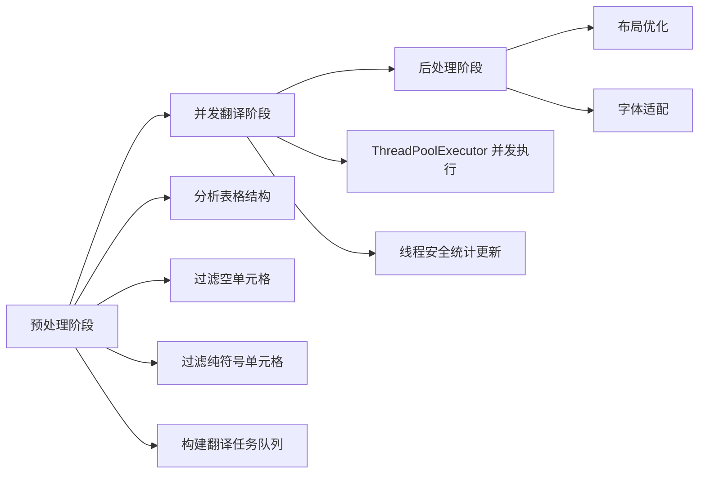
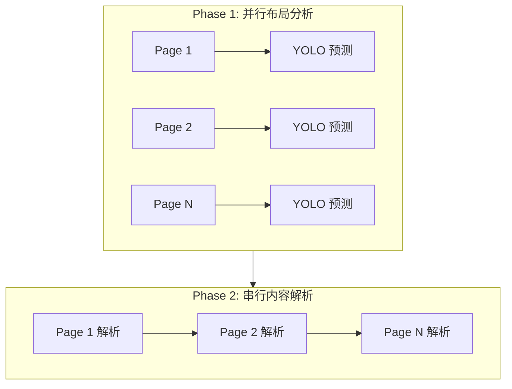
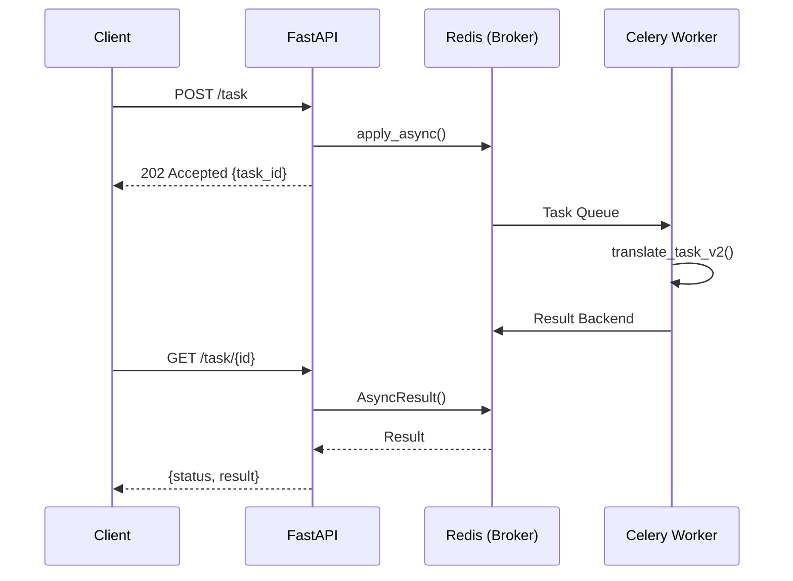
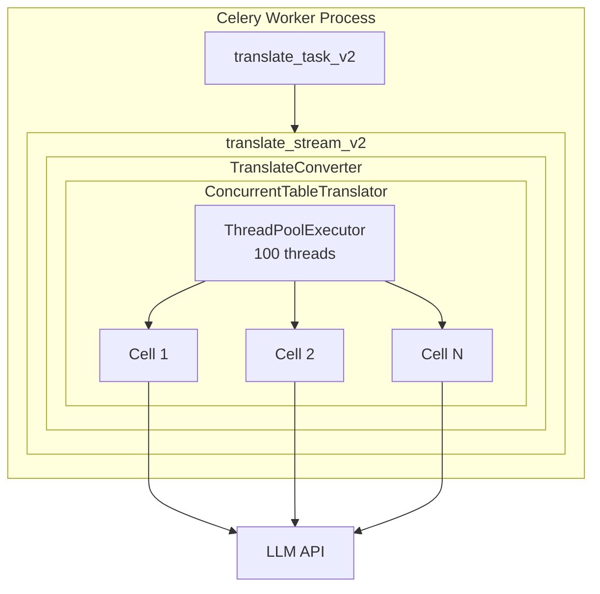

## 问题域：本地 LLM 的并发潜力未被释放

PDFMathTranslate 是一个 PDF 文档翻译工具。当其后端从云端 API 切换到本地部署的 LLM（Ollama、Xinference 等）时，原有的串行翻译架构成为性能瓶颈。

本地 LLM 与云端 API 存在本质差异：

| 特性 | 云端 API | 本地 LLM |
|------|----------|----------|
| 并发限制 | 受 rate limit 约束 | 无 API 调用限制 |
| 延迟特性 | 网络延迟波动 | 本地推理延迟稳定 |
| 资源控制 | 不可控 | 可根据硬件配置调整并发度 |

原系统的五个瓶颈点：

1. 串行翻译逐个处理段落和表格单元格，无法利用本地 LLM 的并发能力
2. 表格翻译成为性能热点——PDF 表格包含大量独立单元格，串行处理时间浪费严重
3. YOLO 模型的页面布局分析是 CPU/GPU 密集型任务，多页 PDF 串行处理效率低
4. 缺乏翻译进度预估，用户无法预知任务完成时间
5. 缺乏运行时统计，无法追踪 token 消耗和翻译成功率

## 优化目标与设计约束

核心目标：

- 提升翻译吞吐量，最大化利用本地 LLM 计算能力
- 缩短端到端时间
- 提供可预测性——翻译开始前给出预计耗时
- 增强可观测性——提供详细运行时统计

设计约束：

- 保持与原有串行模式的兼容性（可配置切换）
- 确保翻译质量不受并发影响
- 提供完善的错误处理和回退机制

## 技术方案一：并发表格翻译器

### 任务抽象与数据结构

表格翻译的核心抽象是将每个单元格封装为独立的翻译任务：

```
CellTranslationTask:
  - cell_idx: 单元格索引
  - cell: 单元格对象引用
  - text: 待翻译文本
  - row_idx, col_idx: 行列索引（用于布局优化）
  - translated_text: 翻译结果
```

`TableCell` 数据类包含几何信息（x0, y0, x1, y1）、文本内容、字体大小、字符对象列表、翻译后文本和优化后字体等字段。

### 三阶段处理流程

并发表格翻译器 `ConcurrentTableTranslator` 采用三阶段设计：



**阶段一：预处理**

遍历表格单元格，执行过滤逻辑：
- 空单元格直接跳过，统计计入 `skipped_empty`
- 不含中英文字符的单元格（纯数字、符号）保留原文，计入 `skipped_no_text`
- 有效单元格通过 `_analyze_grid_structure` 分析其在表格中的行列位置，封装为 `CellTranslationTask`

**阶段二：并发翻译**

使用 `ThreadPoolExecutor` 并发执行翻译任务。关键设计点：

- 线程数通过 `thread_count` 参数配置，默认为 4
- 统计数据更新使用 `threading.Lock` 保证线程安全
- 单个单元格翻译失败时保留原文，不影响其他单元格

**阶段三：后处理**

调用 `_optimize_layout` 对翻译后的单元格进行布局优化，处理因翻译导致的文本长度变化。

### 串行翻译器作为回退方案

`SerialTableTranslator` 提供串行翻译能力，作为并发翻译失败时的回退方案。其处理逻辑与并发版本一致，但采用顺序遍历方式。

### 模式切换机制

`TranslateConverter` 通过 `use_concurrent_table_translation` 布尔参数控制翻译模式：

```
if use_concurrent_table_translation:
    try:
        并发翻译
    except Exception:
        回退到串行翻译
else:
    串行翻译
```

翻译器实例采用延迟初始化策略，首次使用时创建。

## 技术方案二：并行布局分析

### 两阶段并行设计

PDF 分析过程被拆分为两个阶段：

| 阶段 | 特性 | 处理方式 |
|------|------|----------|
| Phase 1: 布局分析 | CPU/GPU 密集型，页面间无依赖 | 并行处理 |
| Phase 2: 内容解析 | 需保持页面顺序 | 串行处理 |



### 单页布局分析算法

`_analyze_page_layout` 函数处理单个页面：

1. 使用 PyMuPDF 渲染页面为图像
2. 将图像转换为 NumPy 数组，调整通道顺序（BGR to RGB）
3. 调用 YOLO 模型预测，输入尺寸对齐到 32 的倍数
4. 构建布局掩码矩阵，初始值为 1

布局掩码的标记规则：

| 检测类别 | 掩码值 | 处理方式 |
|----------|--------|----------|
| table | 负数 ID（-(i+100)） | 记录表格区域，后续单独处理 |
| abandon, figure, isolate_formula, formula_caption | 0 | 标记为不翻译区域 |
| 其他文本区域 | i+2 | 正常翻译 |

边界框坐标经过裁剪处理，确保不越界：
- x0, x1 裁剪到 [0, w-1]
- y0, y1 裁剪到 [0, h-1]
- 坐标扩展 1 像素以覆盖边缘

### 取消机制

布局分析支持取消操作，通过 `cancellation_event` 参数传入 `threading.Event` 对象。每个并行任务执行前检查取消标志，若已设置则抛出 `CancelledError`。

## 技术方案三：Token 统计与时间预估

### Tokenizer 模块

引入 Qwen3 tokenizer 进行精确的 token 计数。设计要点：

- 使用 `@lru_cache(maxsize=1)` 缓存 tokenizer 实例，避免重复加载
- 加载失败时设置 `_tokenizer_failed` 标志，后续调用直接回退到字符计数
- `count_tokens` 函数对外提供统一接口，内部自动处理回退逻辑

应用场景：
- 段落 token 统计
- 表格单元格 token 统计
- Prompt 模板 token 预计算（`TEMPLATE_PROMPT_MEDICAL_TOKEN_COUNT`、`TEMPLATE_PROMPT_GENERAL_TOKEN_COUNT`）

### 统计数据结构

`PDFTranslationStatistics` 类管理两类统计数据：

**预估统计（pre_stats）**：翻译开始前计算

```
- page_count: 页数
- total_paragraph_count: 段落总数
- total_paragraph_tokens: 段落 token 总数
- total_table_cell_count: 表格单元格总数
- total_table_tokens: 表格 token 总数
- estimated_input_tokens: 预估输入 token
- estimated_output_tokens: 预估输出 token
- estimated_time_seconds: 预估翻译时间
- pages: 每页详细信息
```

**运行时统计（runtime_stats）**：翻译过程中收集

```
- 时间追踪：start_time, end_time, translation_start_time, translation_end_time
- 环境信息：service, service_model, thread_count
- LLM 调用：llm_call_count, actual_input/output/total_tokens
- 段落统计：paragraph_total, translated, skipped_empty, skipped_formula, skipped_no_text
- 表格统计：table_cell_total, translated, skipped_empty, skipped_no_text, skipped_failed
```

### Token 估算算法

输入 token 计算公式：

$$
\text{input\_tokens} = P_t + P_c \times T_p + T_t + T_c \times 0.45 \times T_p
$$

其中：
- $P_t$: 段落 token 总数
- $P_c$: 段落数量
- $T_p$: Prompt 模板 token 数
- $T_t$: 表格 token 总数
- $T_c$: 表格单元格数量
- 0.45: 表格单元格跳过率经验系数

输出 token 计算分两种模式：

**普通模式**：

$$
\text{output\_tokens} = P_t + T_t \times 0.45
$$

**推理模式（Reasoning Model）**：

$$
\text{output\_tokens} = P_t + P_c \times 450 + T_t + T_c \times 450
$$

其中 450 是推理模型平均思考内容 token 数的经验值。

### 时间估算算法

```
输入处理时间 = estimated_input_tokens / 500
输出生成时间 = estimated_output_tokens / TPS / 系数
```

其中：
- TPS（Tokens Per Second）= 50，为通用模型每秒 token 处理速度
- 系数：普通模式为 1.5，推理模式为 2

### Translator 层 Token 统计

`BaseTranslator` 基类维护 `token_stats` 字典，包含 `prompt_tokens`、`completion_tokens`、`total_tokens`、`translation_count` 四个字段。

`update_token_stats` 方法提供统一的统计更新接口，支持两种数据来源：
1. API 返回的 usage 信息（优先）
2. 使用 tokenizer 估算（回退）

以 `XinferenceTranslator` 为例，翻译完成后检查响应中是否包含 `usage` 字段，有则直接使用，无则调用 `count_tokens` 估算。

## 技术方案四：公式标识符清理

LLM 翻译时可能破坏 `{v0}`, `{v1}` 等公式占位符的格式。`clean_formula_markers` 函数执行两步清理：

**步骤一：标准化格式**

匹配并修复以下变体：
- `{ v1 }`, `{v 1}`, `{ v 1 }` → `{v1}`
- `{ V1 }`, `{V 1}` → `{v1}`
- `{v1.}`, `{v1,}` → `{v1}`

对于越界的公式标识符（ID >= max_formula_id），直接删除并记录警告日志。

**步骤二：移除无效模式**

删除以下无效标识符：
- `{v112}` — 重复数字
- `{vabc}` — 非数字
- `{v1abc}` — 混合字符
- `{v}` — 空标识符

## 技术方案五：Redis + Celery 异步任务队列

### 架构动机

PDF 翻译是典型的长耗时任务，同步阻塞式 HTTP 请求存在超时风险。引入 Redis + Celery 架构，将翻译操作从请求线程中解耦：



### Celery 配置要点

| 配置项 | 值 | 作用 |
|--------|-----|------|
| `broker` | Redis URL | 消息代理 |
| `backend` | Redis URL | 结果存储 |
| `task_track_started` | True | 跟踪任务开始状态 |
| `result_expires` | 3600 | 结果 1 小时后过期，避免 Redis 内存膨胀 |
| `visibility_timeout` | 3600 | 任务可见性超时，防止重复执行 |

### 任务设计

**估算任务 (`estimate_task_v2`)**

根据文档规模采用不同策略：
- 小文档（<50 页）：调用 `analyze_pdf()` 进行详细分析，使用 `PDFTranslationStatistics` 计算预估时间
- 大文档（>=50 页）：快速估算，按每页约 8 秒计算

**翻译任务 (`translate_task_v2`)**

核心设计点：

| 特性 | 实现方式 |
|------|----------|
| 进度回调 | `self.update_state(state="PROGRESS", meta={"message": ...})` |
| Prompt 模板选择 | 根据 `domain` 参数选择 `TEMPLATE_PROMPT_MEDICAL` 或 `TEMPLATE_PROMPT_GENERAL` |
| 动态阈值调整 | 根据文件名特征调整 YOLO 的 `conf_threshold` 和 `nms_threshold` |
| 并发配置 | `thread=100`，`use_concurrent_table_translation=True` |

翻译完成后，结果文件保存到指定目录，返回文件路径和可选的 DOCX 转换链接。

### 与翻译优化的协同

Redis + Celery 架构与前述翻译优化形成两级并发：



| 并发层级 | 机制 | 作用 |
|----------|------|------|
| 进程级 | 多个 Celery Worker | 同时处理不同翻译任务 |
| 线程级 | ThreadPoolExecutor (100 threads) | 单任务内并发调用 LLM |
| 请求级 | FastAPI 异步返回 | HTTP 请求不阻塞 |

进度回调与 Celery 的 `update_state()` 集成，前端可通过轮询 `/task/{task_id}` 获取实时翻译进度。统计模块在估算任务中提供预计完成时间，与翻译任务的实际耗时形成对照。

## 工程收益

性能提升（基于实际测试）：

| 优化项 | 提升幅度 | 适用场景 |
|--------|----------|----------|
| 表格翻译 | 3-5x | 多单元格表格，取决于线程数和 LLM 并发能力 |
| 布局分析 | 2-4x | 多页 PDF |
| 端到端时间 | 30-50% | 表格密集型文档收益更大 |

可观测性增强：
- 翻译开始前提供预计完成时间
- 翻译结束后生成详细统计报告（token 使用、翻译成功率、时间偏差分析）
- 支持推理模式的时间估算

系统稳定性保障：
- 并发翻译失败时自动回退到串行模式
- 完善的错误处理和日志记录
- 线程安全的统计数据收集

## 小结

本地 LLM 的无 rate limit 特性为并发优化提供了空间。通过将表格翻译任务拆分为独立单元格、将布局分析与内容解析分离为两阶段、引入精确的 token 统计和时间预估，PDFMathTranslate 在本地 LLM 场景下的翻译效率得到显著提升。Redis + Celery 架构将翻译操作从 HTTP 请求中解耦，实现进程级与线程级的两级并发。串行模式作为回退方案保证了系统稳定性，统计模块则为性能调优和问题排查提供了数据支撑。
