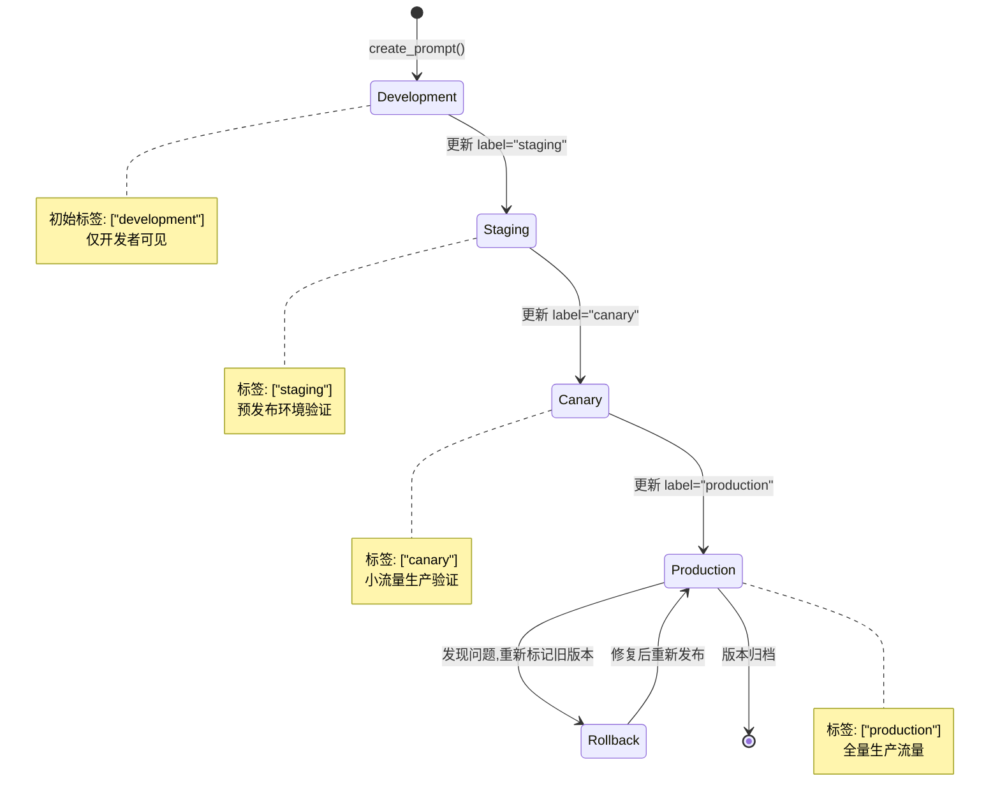
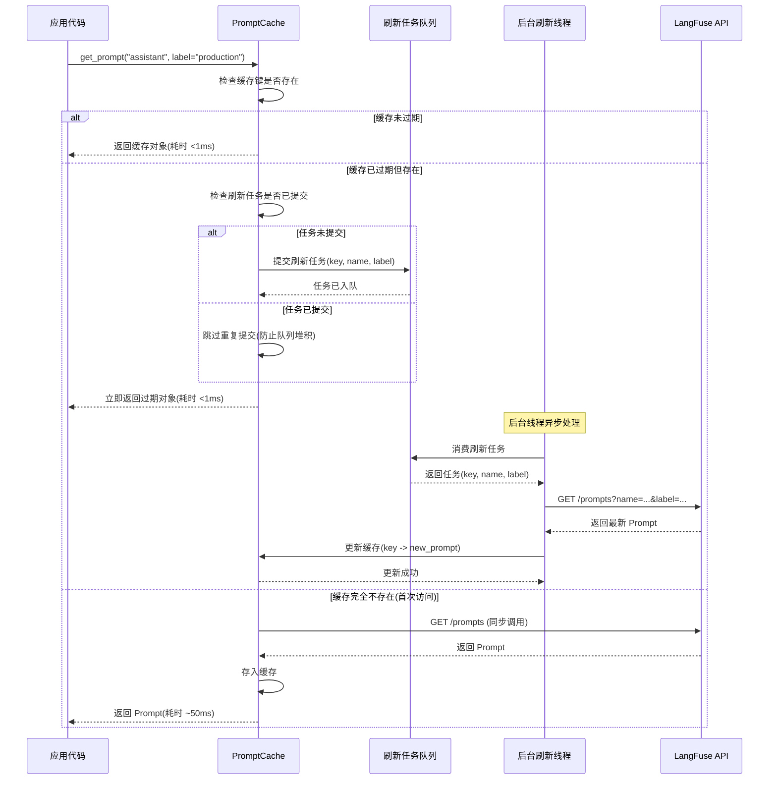

## 一、使用场景：何时需要灰度发布与缓存优化

LangFuse 的 Prompt 运维机制解决了两个维度的问题：部署工作流管理 Prompt 在不同环境间的流转，缓存策略优化 Prompt 获取的性能开销。

**灰度发布的风险控制**。直接将新 Prompt 版本推送到全量生产流量存在高风险：
- 新版本可能包含语法错误(如变量名拼写错误)
- 新措辞可能导致模型输出质量下降
- 新参数配置可能触发 API 限流

传统做法是在测试环境验证后一次性切换,LangFuse 的标签机制支持更细粒度的灰度策略:
```python
# 阶段1:仅 10% 生产流量使用新版本
if user_id % 10 == 0:
    prompt = langfuse.get_prompt("assistant", label="canary")  # Version 2
else:
    prompt = langfuse.get_prompt("assistant", label="production")  # Version 1

# 阶段2:观察质量指标(如平均得分、错误率)
# 若无异常,将 production 标签指向 Version 2
langfuse.api.prompts.update(name="assistant", version=2, new_labels=["production"])
```

这种"金丝雀部署"模式使得回滚成本降至零(仅需重新分配标签),相比代码层面的灰度发布(需维护多套代码分支)更为轻量。

**缓存的性能杠杆**。在高 QPS 场景下,每次 LLM 调用前都从 API 获取 Prompt 会引入显著延迟:
- API 请求耗时:~50ms(跨地域可能达 200ms)
- 序列化/反序列化开销:~5ms
- 网络抖动:偶发 +100ms

若应用的 P99 延迟目标为 500ms,Prompt 获取占用 10-40% 的预算不可接受。LangFuse 的本地缓存将热点 Prompt 的获取耗时降至 <1ms(内存读取),使 Prompt 获取开销在总延迟中可忽略。

**何时使用灰度发布？** 判定标准是"变更的影响范围":
- **高风险变更**(如修改核心业务逻辑的 Prompt):必须灰度发布,先验证 1-10% 流量
- **低风险变更**(如修正错别字):可直接全量发布
- **实验性变更**(如 A/B 测试新措辞):长期保持灰度,按实验分组路由

**何时调整缓存策略？** 判定标准是"Prompt 的变更频率 vs 获取频率":
- **高变更低获取**(如日均更新 >10 次,但调用 <100 次):禁用缓存,避免读取过期版本
- **低变更高获取**(如月均更新 <1 次,但调用 >10,000 次/秒):延长 TTL 至 600 秒甚至更高
- **均衡场景**:使用默认 TTL(60 秒)

## 二、核心概念：环境隔离与标签路由

### 2.1 Environment 的多租户隔离

LangFuse 客户端在初始化时指定 `environment` 参数:
```python
# 生产环境客户端
langfuse_prod = Langfuse(
    public_key="pk-...",
    secret_key="sk-...",
    environment="production"
)

# 预发布环境客户端
langfuse_staging = Langfuse(
    public_key="pk-...",
    secret_key="sk-...",
    environment="staging"
)
```

后端在存储 Trace/Observation 时附加 `environment` 字段,UI 中可按环境过滤数据。这使得同一 LangFuse 项目能同时服务多个环境,而无需为每个环境创建独立项目。

**Environment 与 Label 的关系**。两者职责不同:
- **Environment**:物理隔离,不同环境的数据在数据库中完全分离
- **Label**:逻辑路由,同一环境内通过标签选择不同 Prompt 版本

典型用法:
```python
# 生产环境使用 production 标签
with langfuse_prod.start_as_current_span("task"):
    prompt = langfuse_prod.get_prompt("assistant", label="production")

# 预发布环境使用 staging 标签
with langfuse_staging.start_as_current_span("task"):
    prompt = langfuse_staging.get_prompt("assistant", label="staging")
```

### 2.2 标签的生命周期管理

标签不仅用于版本选择,还承载环境语义:

| 标签名 | 语义 | 推荐用途 |
|-------|------|---------|
| `production` | 生产环境当前版本 | 全量生产流量 |
| `staging` | 预发布环境当前版本 | 预发布验证 |
| `canary` | 金丝雀版本 | 1-10% 生产流量 |
| `latest` | 最新创建版本 | LangFuse 自动维护,仅用于查看最新变更 |
| `rollback` | 回滚目标版本 | 保留上一个稳定版本的引用 |

**标签的命名规范**。建议使用 `{environment}-{purpose}` 格式:
- `prod-baseline`:生产环境的基线版本
- `prod-experiment-a`:生产环境的实验 A 版本
- `staging-candidate`:预发布环境的候选版本

这使得标签的语义在多团队协作时保持清晰。

### 2.3 部署状态机

Prompt 版本在不同环境间的流转遵循以下状态机:



**关键转换条件**:
- **Development → Staging**:通过单元测试和人工审核
- **Staging → Canary**:在预发布环境运行 ≥24 小时,无质量劣化
- **Canary → Production**:在金丝雀流量上运行 ≥1 小时,关键指标无劣化
- **Production → Rollback**:检测到错误率 >阈值或人工触发

### 2.4 缓存的三层结构

LangFuse 客户端的缓存分为三层:

**L1:进程内存缓存**(默认启用):
```python
class PromptCache:
    _cache: Dict[str, PromptCacheItem]  # 键:(name, label/version)
    
class PromptCacheItem:
    value: PromptClient       # 缓存的 Prompt 对象
    _expiry: int             # 过期时间(epoch 秒)
```

访问逻辑:
1. 检查缓存键是否存在且未过期
2. 若命中,直接返回缓存对象(<1ms)
3. 若未命中或过期,从 API 获取并更新缓存(~50ms)

**L2:后台刷新机制**(延迟更新):
```python
# 当缓存过期但仍被访问时:
if cache_item.is_expired():
    # 立即返回过期内容(避免阻塞)
    result = cache_item.value
    # 提交后台刷新任务
    cache.submit_refresh_task(key)
    return result
```

这种"返回过期内容+异步刷新"的策略使得缓存过期时用户感知的延迟仍为 <1ms,刷新在后台完成。

**L3:分布式缓存**(企业版功能,可选):
- 使用 Redis 作为共享缓存层
- 多个应用实例共享缓存,减少 API 请求总量
- 支持缓存预热(在应用启动时批量加载热点 Prompt)

## 三、数据结构：部署元数据的存储模型

### 3.1 Prompt 版本的扩展字段

```python
class Prompt:
    name: str
    version: int
    labels: List[str]           # 标签数组,用于环境路由
    tags: List[str]             # 分类标签,用于 UI 过滤
    commit_message: Optional[str]  # 版本变更说明
    created_at: datetime        # 创建时间
    updated_at: datetime        # 最后更新时间(标签变更时更新)
```

**labels 的索引优化**。后端为 `labels` 字段建立 GIN 索引(PostgreSQL)或数组索引(MySQL),支持高效的"包含"查询:
```sql
SELECT * FROM prompts 
WHERE name = 'assistant' 
  AND 'production' = ANY(labels)
LIMIT 1;
```

查询耗时 ~5ms(索引扫描),远快于全表扫描(~100ms)。

### 3.2 缓存键的生成规则

缓存键由三部分组成:
```python
def generate_cache_key(name: str, version: Optional[int], label: Optional[str]) -> str:
    parts = [name]
    
    if version is not None:
        parts.append(f"version:{version}")
    elif label is not None:
        parts.append(f"label:{label}")
    else:
        # 默认使用 production 标签
        parts.append("label:production")
    
    return "-".join(parts)

# 示例:
# ("assistant", version=2, label=None) -> "assistant-version:2"
# ("assistant", version=None, label="staging") -> "assistant-label:staging"
# ("assistant", version=None, label=None) -> "assistant-label:production"
```

**为什么同时支持 version 和 label？**
- **version**:用于回溯历史(如调试时精确指定某个版本)
- **label**:用于环境路由(如生产代码始终使用 `label="production"`)

两者互斥:传递 `version` 时忽略 `label`,反之亦然。

### 3.3 缓存项的过期策略

```python
class PromptCacheItem:
    def __init__(self, prompt: PromptClient, ttl_seconds: int):
        self.value = prompt
        self._expiry = self.get_epoch_seconds() + ttl_seconds
    
    def is_expired(self) -> bool:
        return self.get_epoch_seconds() > self._expiry
    
    @staticmethod
    def get_epoch_seconds() -> int:
        return int(time.time())
```

**TTL 的默认值与配置**:
- 默认 TTL:60 秒(可通过环境变量 `LANGFUSE_PROMPT_CACHE_DEFAULT_TTL_SECONDS` 配置)
- 按请求覆盖:`langfuse.get_prompt("name", cache_ttl_seconds=300)`
- 禁用缓存:`cache_ttl_seconds=0`

**过期后的刷新时机**:
- **同步刷新**:若缓存完全不存在(首次访问),阻塞等待 API 响应
- **异步刷新**:若缓存过期但仍存在,立即返回过期值,后台异步更新

## 四、最小实现：灰度发布的代码示例

以下代码展示了从开发到生产的完整发布流程:

```python
from langfuse import Langfuse
import random

langfuse = Langfuse()

# ========== 阶段1:在开发环境创建新版本 ==========
new_version = langfuse.create_prompt(
    name="assistant",
    prompt="You are a professional AI assistant. Please help with: {{task}}",
    labels=["development"],  # 初始标签
    config={"temperature": 0.7}
)
print(f"Created version {new_version.version} with label 'development'")

# ========== 阶段2:提交到预发布环境 ==========
langfuse.api.prompts.update(
    name="assistant",
    version=new_version.version,
    new_labels=["staging"]
)
print(f"Version {new_version.version} promoted to 'staging'")

# 在预发布环境测试
staging_prompt = langfuse.get_prompt("assistant", label="staging")
test_output = staging_prompt.compile(task="summarize this document")
# ... 执行质量评估 ...

# ========== 阶段3:金丝雀部署(10% 流量) ==========
langfuse.api.prompts.update(
    name="assistant",
    version=new_version.version,
    new_labels=["canary", "staging"]  # 同时保留 staging 标签
)
print(f"Version {new_version.version} promoted to 'canary'")

# 应用代码:按比例分流
def get_prompt_for_user(user_id: int):
    # 10% 用户使用 canary 版本
    if hash(user_id) % 10 == 0:
        return langfuse.get_prompt("assistant", label="canary")
    else:
        return langfuse.get_prompt("assistant", label="production")

# ========== 阶段4:监控金丝雀指标 ==========
# (伪代码:从 LangFuse API 查询指标)
canary_metrics = langfuse.api.analytics.get_metrics(
    prompt_name="assistant",
    prompt_version=new_version.version,
    time_range="last_1_hour"
)

if canary_metrics.error_rate < 0.01 and canary_metrics.avg_score > 0.8:
    # ========== 阶段5:全量发布 ==========
    langfuse.api.prompts.update(
        name="assistant",
        version=new_version.version,
        new_labels=["production", "latest"]
    )
    print(f"Version {new_version.version} promoted to 'production'")
else:
    # ========== 回滚:保持旧版本 ==========
    print("Canary metrics failed, keeping old version in production")

# ========== 阶段6:缓存刷新 ==========
# 清空本地缓存,强制重新获取
langfuse.clear_prompt_cache()
```

**执行流分解**:
1. `create_prompt` 创建新版本,初始标签为 `development`。
2. `update` 操作将标签从 `development` 改为 `staging`,旧标签被移除。
3. 应用代码通过 `hash(user_id) % 10` 实现确定性分流:同一用户始终路由到相同版本。
4. 监控逻辑从 LangFuse Analytics API 查询金丝雀版本的指标(错误率、平均得分等)。
5. 若指标达标,将 `production` 标签指向新版本;否则保持旧版本。
6. `clear_prompt_cache()` 清空所有实例的本地缓存,确保下次调用获取最新版本。

## 五、关键流程：缓存更新的后台刷新机制

以下流程图展示了缓存过期后的异步刷新逻辑:



**关键设计决策**:
1. **返回过期内容 vs 阻塞等待**。返回过期内容使得用户感知的延迟保持在 <1ms,代价是最多一次请求使用旧版本。这在 Prompt 变更频率较低(如小时级)的场景下可接受。
2. **去重机制**。若多个请求同时访问过期缓存,仅提交一次刷新任务,避免并发请求触发大量重复 API 调用(雪崩效应)。
3. **刷新失败的降级**。若后台刷新失败(如 API 不可用),缓存保留过期内容,下次访问时重新尝试刷新。这避免了"缓存失效导致雪崩"的问题。

## 六、扩展点：自定义部署策略

### 6.1 蓝绿部署模式

除了金丝雀部署,LangFuse 标签机制也支持蓝绿部署:

```python
# 蓝色环境:当前生产版本
blue_version = langfuse.get_prompt("assistant", label="production")

# 创建绿色环境:新版本
green_version = langfuse.create_prompt(
    name="assistant",
    prompt="...",
    labels=["green"]
)

# 应用代码:通过负载均衡器切换流量
# 阶段1:100% 流量路由到蓝色
# 阶段2:瞬间切换 100% 流量到绿色
langfuse.api.prompts.update(
    name="assistant",
    version=green_version.version,
    new_labels=["production", "green"]
)

# 若出现问题,瞬间切回蓝色
langfuse.api.prompts.update(
    name="assistant",
    version=blue_version.version,
    new_labels=["production", "blue"]
)
```

蓝绿部署相比金丝雀部署的优势是"切换瞬间完成",适用于变更影响面小的场景。

### 6.2 按地域的标签路由

在多地域部署中,可为不同地域创建独立标签:

```python
# 为美国地域创建 Prompt 变体
langfuse.create_prompt(
    name="assistant",
    prompt="Hi there! How can I help you today?",
    labels=["production-us"]
)

# 为欧洲地域创建 Prompt 变体(合规要求不同措辞)
langfuse.create_prompt(
    name="assistant",
    prompt="Hello! How may I assist you today?",
    labels=["production-eu"]
)

# 应用代码:根据用户地域选择标签
user_region = detect_user_region()
label = f"production-{user_region}"
prompt = langfuse.get_prompt("assistant", label=label)
```

这使得 Prompt 能适配不同地域的法律/文化差异,而无需维护多套代码。

### 6.3 缓存预热与批量加载

在应用启动时,可批量预加载热点 Prompt:

```python
from concurrent.futures import ThreadPoolExecutor

def preload_prompts():
    """应用启动时预热缓存"""
    hot_prompts = [
        ("assistant", "production"),
        ("summarizer", "production"),
        ("classifier", "production")
    ]
    
    with ThreadPoolExecutor(max_workers=5) as executor:
        futures = [
            executor.submit(langfuse.get_prompt, name, label=label)
            for name, label in hot_prompts
        ]
        # 等待所有 Prompt 加载完成
        for future in futures:
            future.result()
    
    print(f"Preloaded {len(hot_prompts)} prompts")

# 在应用启动时调用
preload_prompts()
```

预热使得首次用户请求无需承担 Prompt 获取的延迟(已在缓存中)。

## 七、风险与权衡：运维机制的架构取舍

### 7.1 灰度发布的流量分割粒度

**权衡分析**。金丝雀部署的流量比例选择存在权衡:
- **1% 流量**:风险最小,但统计样本不足,可能无法检测到低概率异常
- **10% 流量**:平衡风险与样本量,但若出现问题,影响面较大
- **50% 流量**:接近 A/B 测试,统计显著性最高,但风险与全量发布相当

**推荐策略**:
- **首次发布**:使用 1% 流量,运行 24 小时后逐步提升至 10%、50%、100%
- **热修复**:若修复已知 Bug,可直接 100% 发布(风险已明确)
- **实验性变更**:长期保持 50/50 分流,用于 A/B 测试

### 7.2 缓存 TTL 的性能与新鲜度权衡

**性能分析**。不同 TTL 设置下的延迟分布(基于压测数据):

| TTL 设置 | 缓存命中率 | P50 延迟 | P99 延迟 | API 调用/秒 |
|---------|----------|---------|---------|------------|
| 0 秒(禁用) | 0% | 55ms | 120ms | 10,000 |
| 10 秒 | 90% | 8ms | 60ms | 1,000 |
| 60 秒 | 98% | 2ms | 55ms | 200 |
| 600 秒 | 99.8% | 1ms | 52ms | 20 |

**权衡决策**:
- **高变更场景**(如日均 >10 次):TTL 设为 10 秒,接受 8ms P50 延迟
- **低变更场景**(如月均 <1 次):TTL 设为 600 秒,享受 1ms P50 延迟
- **实时性要求高**:禁用缓存,接受 55ms P50 延迟

### 7.3 标签的命名冲突风险

**风险描述**。多团队协作时,可能出现标签命名冲突:
```python
# 团队 A 创建实验标签
langfuse.create_prompt(name="assistant", labels=["experiment-1"])

# 团队 B 创建同名标签(覆盖团队 A 的版本)
langfuse.create_prompt(name="assistant", labels=["experiment-1"])
```

后者的标签会覆盖前者,导致团队 A 的实验版本丢失。

**缓解措施**:
1. **命名规范**:使用 `{team}-{purpose}` 格式(如 `team-ml-experiment-1`)
2. **UI 中的冲突检测**:创建 Prompt 时,若标签已被占用,提示用户选择"覆盖"或"取消"
3. **权限控制**:限制特定标签(如 `production`)只能由特定角色修改

### 7.4 缓存失效的雪崩效应

**风险描述**。若 Prompt 在缓存中大规模过期(如应用重启后所有缓存丢失),首次请求会触发大量并发 API 调用:
```
时刻 T0:应用重启,缓存为空
时刻 T1:100 个并发请求同时访问 Prompt
时刻 T2:100 个请求同时调用 API(雪崩)
时刻 T3:API 过载,响应时间从 50ms 飙升至 5s
```

**缓解措施**:
1. **请求合并**:若多个请求同时访问相同的未缓存 Prompt,仅发起一次 API 调用,其他请求等待结果共享:
   ```python
   class PromptCache:
       _pending_requests: Dict[str, Future] = {}
       
       def get(self, key: str):
           if key in self._cache:
               return self._cache[key]
           
           # 检查是否已有请求在飞行中
           if key in self._pending_requests:
               return self._pending_requests[key].result()
           
           # 创建新请求
           future = Future()
           self._pending_requests[key] = future
           
           try:
               result = fetch_from_api(key)
               self._cache[key] = result
               future.set_result(result)
               return result
           finally:
               del self._pending_requests[key]
   ```
2. **启动时预热**:如前文所述,在应用启动时批量加载热点 Prompt。
3. **限流保护**:在 API 层面配置速率限制(如 1000 req/s),超限请求返回 429 错误而非阻塞。

### 7.5 部署状态的可观测性缺失

**风险描述**。标签的重新分配是瞬间操作(耗时 ~50ms),但影响范围难以预估:
- 有多少应用实例正在使用该 Prompt?
- 标签切换后,实际切换到新版本的流量比例是多少(考虑缓存延迟)?
- 若出现问题,需回滚的实例数量是多少?

传统监控工具(如 Prometheus)无法追踪"Prompt 版本"这一维度的指标。

**缓解措施**:
1. **Trace 中记录 Prompt 版本**:每个使用 Prompt 的 Observation 附加 `prompt_id` 和 `prompt_version` 字段:
   ```python
   generation = langfuse.start_observation(
       name="llm-call",
       as_type="generation",
       prompt_id=prompt.name,
       prompt_version=prompt.version
   )
   ```
2. **实时版本分布查询**:LangFuse Analytics API 提供"当前活跃的 Prompt 版本分布":
   ```python
   distribution = langfuse.api.analytics.get_prompt_version_distribution(
       prompt_name="assistant",
       time_range="last_5_minutes"
   )
   # 返回: {"version_1": 80%, "version_2": 20%}
   ```
3. **金丝雀监控仪表板**:在 LangFuse UI 中展示金丝雀版本的实时指标(QPS、错误率、P99 延迟),与基线版本对比。

## 小结

LangFuse 的 Prompt 运维机制通过标签的灵活路由和多层缓存策略,实现了灰度发布的风险控制与性能优化的平衡。其核心权衡在于:以异步刷新的复杂性换取缓存过期时的低延迟,以标签命名的灵活性换取冲突风险,以缓存 TTL 的延长换取 Prompt 变更的传播延迟。工程实践中,需根据变更频率、QPS、实时性要求,在这些维度间寻找平衡点。金丝雀部署的流量比例应根据变更风险动态调整,1%-10%-50%-100% 的阶梯式推进能最大化安全性。缓存预热和请求合并机制可有效缓解雪崩效应,确保应用重启或缓存失效时的稳定性。
