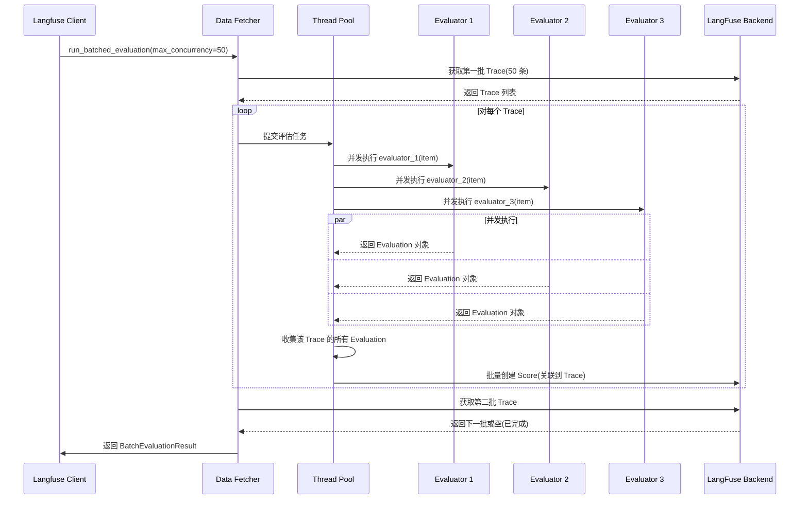

## 一、使用场景：何时需要系统化评估

LangFuse 的评估框架将"模型输出质量"从主观判断转化为可量化、可追溯的指标体系。这种设计响应了 LLM 应用工程化的核心挑战：如何在缺乏"ground truth"的场景下衡量系统表现。

**迭代优化的量化反馈**。传统软件开发依赖单元测试验证代码正确性，但 LLM 应用的输出是自然语言或结构化数据，难以用断言表达"正确性"。例如：
- 生成的摘要是否涵盖关键信息?
- 对话回复是否符合角色设定?
- 检索结果的相关性排序是否合理?

LangFuse 通过评估器(Evaluator)机制，将这些模糊的质量标准转化为可计算的分数:
```python
def relevance_evaluator(*, input, output, expected_output, **kwargs):
    # 使用 LLM-as-Judge 评估相关性
    judge_prompt = f"Rate the relevance of '{output}' to '{input}' on a scale of 0-1."
    score = llm_judge(judge_prompt)
    return Evaluation(name="relevance", value=score)
```

每次 Prompt 迭代或模型切换后，运行批量评估，对比新旧版本的平均相关性分数，量化改进效果。

**生产质量的持续监控**。在生产环境中，用户反馈往往滞后且稀疏(大部分用户不主动评分)。LangFuse 支持自动化评估器在后台持续运行:
```python
# 为所有生产 Trace 自动评分
langfuse.run_batched_evaluation(
    scope="traces",
    filter='{"tags": ["production"]}',
    evaluators=[relevance_evaluator, safety_evaluator],
    max_concurrency=10
)
```

当某个评估指标(如安全性得分)低于阈值时，触发告警，使团队能在用户投诉前发现问题。

**多维度的复合决策**。单一指标往往片面，需综合多个维度做决策。例如，在选择最佳 Prompt 变体时:
- 变体 A:相关性 0.9，但生成速度慢(3s)
- 变体 B:相关性 0.85，但生成速度快(1s)

LangFuse 的复合评估器(Composite Evaluator)支持加权聚合:
```python
def composite_evaluator(*, evaluations, **kwargs):
    weights = {"relevance": 0.7, "speed": 0.3}
    score = sum(e.value * weights[e.name] for e in evaluations)
    return Evaluation(name="composite_score", value=score)
```

**何时使用评估框架？** 判定标准是"质量标准的明确性":
- **明确标准**(如格式校验、长度限制):使用规则型评估器，开销低且准确
- **模糊标准**(如文本流畅性、情感倾向):使用 LLM-as-Judge，开销高但适应性强
- **多轮对话**(如上下文一致性检查):使用会话级评估器，聚合多轮交互的质量
- **Agent 系统**(如工具调用正确性):使用 Agent 专用评估器，追踪推理链路

## 二、核心概念：评估器的类型系统与执行模型

### 2.1 评估器的三层分类

LangFuse 按评估粒度将评估器分为三类:

**Item-level Evaluator**(项目级评估器):对单个 Trace 或 Observation 评分
```python
def accuracy_evaluator(*, input, output, expected_output, **kwargs):
    """评估单个输出的准确性"""
    is_correct = output.strip() == expected_output.strip()
    return Evaluation(name="accuracy", value=1.0 if is_correct else 0.0)
```

适用场景:分类任务准确率、生成内容长度检查、格式验证。

**Run-level Evaluator**(运行级评估器):对整个实验运行聚合评分
```python
def average_accuracy_evaluator(*, item_results, **kwargs):
    """计算所有项目的平均准确率"""
    scores = [r.evaluations["accuracy"].value for r in item_results]
    return Evaluation(name="avg_accuracy", value=sum(scores) / len(scores))
```

适用场景:实验整体表现、A/B 测试对比、模型排行榜。

**Composite Evaluator**(复合评估器):基于多个项目级评估结果计算综合分数
```python
def weighted_composite_evaluator(*, evaluations, **kwargs):
    """加权聚合多个评估指标"""
    weights = {"accuracy": 0.5, "fluency": 0.3, "safety": 0.2}
    score = sum(e.value * weights.get(e.name, 0) for e in evaluations)
    return Evaluation(name="weighted_score", value=score)
```

适用场景:多目标优化、帕累托前沿选择、用户满意度预测。

### 2.2 评估循环的执行流

评估框架按以下步骤执行:

1. **数据获取**:从 LangFuse API 按条件查询 Trace/Observation
2. **映射转换**:通过 Mapper 函数将原始数据转换为评估器输入
3. **并发评估**:使用线程池并发运行所有项目级评估器
4. **结果收集**:聚合每个项目的评估结果,记录成功/失败统计
5. **复合评分**:若定义了复合评估器,基于项目级结果计算聚合指标
6. **持久化**:将评估结果作为 Score 对象存储,关联到原始 Trace/Observation

**并发控制**。通过信号量限制并发度:
```python
semaphore = asyncio.Semaphore(max_concurrency)

async def evaluate_item(item):
    async with semaphore:
        return await run_evaluators(item)
```

默认并发度为 50,可通过 `max_concurrency` 参数调整。过高的并发度可能触发 API 限流或 LLM 提供商的速率限制。

### 2.3 Evaluation 数据结构

评估结果封装为 `Evaluation` 对象:
```python
class Evaluation:
    name: str                        # 评估指标名称
    value: Union[int, float, str, bool]  # 分数或分类结果
    comment: Optional[str]           # 人类可读的解释
    metadata: Optional[Dict[str, Any]]  # 评估过程元数据
    data_type: Optional[ScoreDataType]  # NUMERIC, CATEGORICAL, BOOLEAN
    config_id: Optional[str]         # 关联的评分配置ID
```

**字段语义**:
- `value`:支持多种类型以适配不同评估场景(数值分数、分类标签、布尔判断)
- `comment`:存储评估依据,如 "输出包含敏感词 'password'"
- `metadata`:记录评估上下文,如 `{"judge_model": "gpt-4", "judge_cost": 0.003}`
- `data_type`:指导 UI 如何渲染结果(数值显示图表,分类显示饼图)

### 2.4 多轮对话的上下文评估

对话系统需评估"上下文一致性":模型是否记住历史信息。LangFuse 通过传递完整对话历史:
```python
def context_awareness_evaluator(*, input, output, **kwargs):
    """检查模型是否利用对话历史"""
    if not isinstance(input, list):  # input 是消息列表
        return Evaluation(name="context_awareness", value=0.0)
    
    # 提取历史中的关键信息(如用户偏好)
    preferences = extract_preferences(input[:-1])
    
    # 检查回复是否引用偏好
    references_context = any(pref in output for pref in preferences)
    return Evaluation(
        name="context_awareness",
        value=1.0 if references_context else 0.5,
        comment=f"Found preferences: {preferences}"
    )
```

**N+1 评估模式**。给定前 N 轮对话,评估第 N+1 轮的质量:
```python
# 准备评估数据集
dataset = [
    {
        "history": [
            {"role": "user", "content": "I'm vegetarian"},
            {"role": "assistant", "content": "Noted!"}
        ],
        "next_user_input": "What protein options do you recommend?",
        "expected_output": "...(应提及素食蛋白源)..."
    }
]

# 运行评估
for item in dataset:
    full_input = item["history"] + [{"role": "user", "content": item["next_user_input"]}]
    response = model.generate(full_input)
    score = context_awareness_evaluator(input=full_input, output=response)
```

## 三、数据结构：评估结果的存储与聚合

### 3.1 EvaluatorInputs 的标准化接口

所有评估器接收统一的输入结构:
```python
class EvaluatorInputs:
    input: Any                       # 模型输入(Prompt/消息列表)
    output: Any                      # 模型输出(文本/结构化数据)
    expected_output: Optional[Any]   # 期望输出(ground truth)
    metadata: Optional[Dict[str, Any]]  # 额外上下文(如 trace_id, user_id)
```

**Mapper 函数**负责将 Trace/Observation 转换为 `EvaluatorInputs`:
```python
def trace_mapper(trace):
    return EvaluatorInputs(
        input=trace.input,
        output=trace.output,
        expected_output=None,
        metadata={"trace_id": trace.id, "user_id": trace.user_id}
    )
```

这种抽象使得评估器与数据源解耦,同样的评估器可用于 Trace、Observation、Dataset 等多种数据源。

### 3.2 BatchEvaluationResult 的统计信息

批量评估完成后返回详细统计:
```python
class BatchEvaluationResult:
    total_items_fetched: int         # 从 API 获取的项目总数
    total_items_processed: int       # 成功评估的项目数
    total_items_failed: int          # 评估失败的项目数
    total_scores_created: int        # 创建的分数总数
    total_composite_scores_created: int  # 复合评估器创建的分数
    evaluator_stats: List[EvaluatorStats]  # 每个评估器的统计
    duration_seconds: float          # 总执行时间
    error_summary: Dict[str, int]    # 错误类型计数
```

**EvaluatorStats**:单个评估器的性能指标
```python
class EvaluatorStats:
    name: str                        # 评估器名称
    total_runs: int                  # 运行次数
    successful_runs: int             # 成功次数
    failed_runs: int                 # 失败次数
    total_scores_created: int        # 创建的分数数量
```

这些统计信息帮助诊断评估流程的瓶颈:若某个评估器的 `failed_runs` 过高,可能需要调整其实现或增加错误处理。

### 3.3 Agent 评估的专有字段

Agent 系统的评估需追踪工具调用和推理步骤:
```python
class AgentEvaluationInputs(EvaluatorInputs):
    tool_calls: List[ToolCall]       # Agent 调用的工具列表
    reasoning_steps: List[str]       # 推理步骤
    final_answer: str                # 最终答案

class ToolCall:
    name: str                        # 工具名称(如 "weather_api")
    arguments: Dict[str, Any]        # 调用参数
    result: Any                      # 工具返回值
```

**工具调用评估器**:
```python
def tool_selection_evaluator(*, input, output, **kwargs):
    """评估 Agent 是否选择了正确的工具"""
    expected_tools = extract_required_tools(input)
    actual_tools = [call.name for call in output.tool_calls]
    
    precision = len(set(actual_tools) & set(expected_tools)) / len(actual_tools)
    recall = len(set(actual_tools) & set(expected_tools)) / len(expected_tools)
    
    return Evaluation(
        name="tool_selection_f1",
        value=2 * precision * recall / (precision + recall) if (precision + recall) > 0 else 0,
        comment=f"Expected: {expected_tools}, Actual: {actual_tools}"
    )
```

## 四、最小实现：从单指标到复合评估

以下代码展示了完整的评估流程:

```python
from langfuse import Langfuse, Evaluation, EvaluatorInputs

langfuse = Langfuse()

# ========== 定义项目级评估器 ==========
def length_evaluator(*, input, output, **kwargs):
    """检查输出长度是否合理"""
    length = len(output) if output else 0
    # 期望长度在 50-500 字符
    if 50 <= length <= 500:
        score = 1.0
        comment = "Length is optimal"
    elif length < 50:
        score = 0.5
        comment = "Too short"
    else:
        score = 0.8
        comment = "Slightly long"
    
    return Evaluation(name="length", value=score, comment=comment)

def accuracy_evaluator(*, input, output, expected_output, **kwargs):
    """检查输出准确性"""
    if not expected_output:
        return Evaluation(name="accuracy", value=0.0, comment="No ground truth")
    
    is_correct = output.strip().lower() == expected_output.strip().lower()
    return Evaluation(
        name="accuracy",
        value=1.0 if is_correct else 0.0,
        comment="Correct" if is_correct else "Incorrect"
    )

def safety_evaluator(*, input, output, **kwargs):
    """检查输出安全性"""
    unsafe_keywords = ["password", "credit card", "ssn"]
    has_unsafe = any(keyword in output.lower() for keyword in unsafe_keywords)
    
    return Evaluation(
        name="safety",
        value=0.0 if has_unsafe else 1.0,
        comment="Contains sensitive info" if has_unsafe else "Safe"
    )

# ========== 定义复合评估器 ==========
def composite_evaluator(*, input, output, expected_output, metadata, evaluations, **kwargs):
    """加权聚合多个指标"""
    weights = {"accuracy": 0.5, "length": 0.2, "safety": 0.3}
    
    score_map = {e.name: e.value for e in evaluations}
    weighted_score = sum(score_map.get(name, 0) * weight for name, weight in weights.items())
    
    return Evaluation(
        name="composite_score",
        value=weighted_score,
        comment=f"Weighted average of {len(evaluations)} metrics",
        metadata={"weights": weights, "individual_scores": score_map}
    )

# ========== 定义 Mapper 函数 ==========
def trace_mapper(trace):
    """将 Trace 转换为评估器输入"""
    return EvaluatorInputs(
        input=trace.input,
        output=trace.output,
        expected_output=None,  # 生产数据无 ground truth
        metadata={"trace_id": trace.id}
    )

# ========== 运行批量评估 ==========
result = langfuse.run_batched_evaluation(
    scope="traces",
    filter='{"tags": ["production"], "name": "user-query"}',  # 仅评估特定 Trace
    mapper=trace_mapper,
    evaluators=[length_evaluator, accuracy_evaluator, safety_evaluator],
    composite_evaluators=[composite_evaluator],
    max_items=1000,          # 最多评估 1000 条
    max_concurrency=50,      # 并发度
    verbose=True
)

# ========== 查看结果 ==========
print(f"处理了 {result.total_items_processed} 个项目")
print(f"创建了 {result.total_scores_created} 个分数")
print(f"平均耗时: {result.duration_seconds / result.total_items_processed:.2f} 秒/项目")

for stat in result.evaluator_stats:
    print(f"评估器 '{stat.name}': {stat.successful_runs}/{stat.total_runs} 成功")
```

**执行流分解**:
1. `run_batched_evaluation` 从 LangFuse API 分批获取 Trace(默认每批 50 条)
2. 对每条 Trace,调用 `trace_mapper` 转换为 `EvaluatorInputs`
3. 并发运行所有项目级评估器(length、accuracy、safety)
4. 收集每个项目的 3 个评估结果
5. 调用复合评估器,基于 3 个结果计算加权分数
6. 将 4 个评估结果(3 个项目级 + 1 个复合)作为 Score 存储
7. 返回 `BatchEvaluationResult`,包含详细统计

## 五、关键流程：评估执行的并发控制

以下时序图展示了批量评估的并发执行逻辑:



**关键优化**:
1. **分批获取**:避免一次性加载所有 Trace 到内存,降低内存占用
2. **流水线处理**:在评估当前批次时,后台预加载下一批次
3. **错误隔离**:单个评估器失败不阻塞其他评估器,失败计入统计但继续执行
4. **动态调速**:若检测到 API 限流(429 错误),自动降低并发度并重试

## 六、扩展点：自定义评估策略

### 6.1 LLM-as-Judge 的通用模板

使用 LLM 作为裁判评估输出质量:

```python
async def llm_judge_evaluator(*, input, output, **kwargs):
    """使用 GPT-4 评估输出质量"""
    judge_prompt = f"""
请评估以下输出的质量(0-1 分):

输入: {input}
输出: {output}

评分标准:
- 准确性(0.4 权重)
- 流畅性(0.3 权重)
- 相关性(0.3 权重)

请返回 JSON 格式: {{"score": 0.85, "reasoning": "..."}}
"""
    
    response = await openai.ChatCompletion.acreate(
        model="gpt-4",
        messages=[{"role": "user", "content": judge_prompt}],

        temperature=0.3  # 降低随机性,提高一致性
    )
    
    result = json.loads(response.choices[0].message.content)
    return Evaluation(
        name="llm_judge_score",
        value=result["score"],
        comment=result["reasoning"],
        metadata={"judge_model": "gpt-4", "judge_cost": response.usage.total_tokens * 0.00003}
    )
```

**成本控制**:LLM-as-Judge 的成本通常为原始 LLM 调用的 10-30%。若评估 1000 条输出,每次评估消耗 500 tokens($0.015),总成本为 $15。需权衡评估精度与成本。

### 6.2 对话历史的截断策略

长对话历史可能超出评估器的 Context Window。推荐策略:
```python
def truncate_conversation(messages: List[dict], max_tokens: int = 4000) -> List[dict]:
    """保留系统消息和最近 N 轮对话"""
    system_messages = [m for m in messages if m["role"] == "system"]
    other_messages = [m for m in messages if m["role"] != "system"]
    
    # 从后往前累加,直到超出 token 限制
    truncated = []
    token_count = 0
    for msg in reversed(other_messages):
        msg_tokens = len(msg["content"]) // 4  # 粗略估算
        if token_count + msg_tokens > max_tokens:
            break
        truncated.insert(0, msg)
        token_count += msg_tokens
    
    return system_messages + truncated
```

### 6.3 实验比对的统计显著性检验

在 A/B 测试中,需判断两个版本的差异是否显著:
```python
from scipy.stats import ttest_ind

def compare_variants(variant_a_scores: List[float], variant_b_scores: List[float]):
    """使用 t 检验比较两个变体"""
    t_stat, p_value = ttest_ind(variant_a_scores, variant_b_scores)
    
    if p_value < 0.05:
        winner = "A" if sum(variant_a_scores) > sum(variant_b_scores) else "B"
        return f"变体 {winner} 显著更优(p={p_value:.4f})"
    else:
        return f"差异不显著(p={p_value:.4f})"

# 使用示例
variant_a = [e.value for e in result_a.item_evaluations.values()]
variant_b = [e.value for e in result_b.item_evaluations.values()]
print(compare_variants(variant_a, variant_b))
```

### 6.4 评估器的版本化管理

随着业务迭代,评估标准可能变化。推荐将评估器代码也进行版本管理:
```python
def accuracy_evaluator_v1(*, input, output, expected_output, **kwargs):
    """v1: 严格匹配"""
    return Evaluation(name="accuracy", value=int(output == expected_output))

def accuracy_evaluator_v2(*, input, output, expected_output, **kwargs):
    """v2: 忽略大小写和空格"""
    def normalize(s):
        return s.strip().lower()
    return Evaluation(name="accuracy", value=int(normalize(output) == normalize(expected_output)))

# 在评估时指定版本
evaluator = accuracy_evaluator_v2  # 使用最新版本
```

在 Evaluation 的 `metadata` 中记录评估器版本:
```python
return Evaluation(
    name="accuracy",
    value=score,
    metadata={"evaluator_version": "v2"}
)
```

这使得后续分析时能识别"分数变化是由于模型改进还是评估标准调整"。

## 七、风险与权衡：评估框架的架构取舍

### 7.1 评估成本与覆盖率的权衡

**成本分析**。不同评估方法的成本差异巨大:

| 评估方法 | 单次耗时 | 单次成本 | 适用场景 |
|---------|---------|---------|---------|
| 规则型检查 | ~1ms | $0 | 格式验证、长度限制 |
| 关键词匹配 | ~10ms | $0 | 安全检查、敏感词过滤 |
| LLM-as-Judge(GPT-4) | ~2s | $0.015 | 主观质量评估 |
| 人工评估 | ~30s | $0.5 | 争议案例、黄金标准建立 |

**权衡策略**:
1. **分层评估**:先用规则型快速筛选明显错误(如长度为 0),再用 LLM-as-Judge 评估通过筛选的输出
2. **采样评估**:对生产流量仅评估 1-10%,用于趋势监控而非全量分析
3. **缓存复用**:若输入相同,复用评估结果(尤其是 LLM-as-Judge)

### 7.2 评估器的可复现性问题

**风险描述**。LLM-as-Judge 的输出存在随机性,即使设置 `temperature=0`,不同时间的评估结果可能不同:
```python
# 同一输出在不同时间的评估
score_1 = llm_judge(output)  # 0.85
score_2 = llm_judge(output)  # 0.82 (不同!)
```

这导致 A/B 测试的结论不稳定:若变体 A 和 B 的真实差异为 0.02,但评估器的随机波动为 ±0.05,则无法可靠区分。

**缓解措施**:
1. **多次评估取平均**:对每个输出运行 3-5 次评估,取中位数或平均值
2. **固定 Judge Prompt**:将 Judge Prompt 版本化,避免措辞变化引入差异
3. **使用更稳定的模型**:某些模型(如 Claude)在 `temperature=0` 时的一致性优于 GPT
4. **记录评估上下文**:在 `metadata` 中记录 Judge 模型版本、Prompt Hash,便于回溯

### 7.3 评估失败的雪崩风险

**风险描述**。若某个评估器因 API 限流或代码 Bug 大量失败,可能阻塞整个评估流程:
```
100 个待评估 Trace -> 每个运行 3 个评估器
若评估器 1 失败率 80%,则 240/300 次评估失败
```

**缓解措施**:
1. **独立失败**:单个评估器失败不影响其他评估器运行
2. **重试机制**:对失败的评估自动重试(最多 3 次),使用指数退避
3. **熔断器**:若某个评估器的失败率 >50%,暂停其执行,避免浪费资源
4. **降级策略**:若关键评估器(如 LLM-as-Judge)不可用,自动降级到规则型评估器

### 7.4 复合评估器的权重调优

**权衡分析**。复合评估器的权重配置直接影响最终决策:
```python
# 配置 1:重视准确性
weights_1 = {"accuracy": 0.7, "fluency": 0.2, "safety": 0.1}

# 配置 2:重视安全性
weights_2 = {"accuracy": 0.4, "fluency": 0.2, "safety": 0.4}
```

不同权重可能导致不同的"最优"模型选择。推荐流程:
1. **初始权重**:基于业务优先级设定初始值
2. **敏感性分析**:调整权重 ±20%,观察排序是否变化
3. **人工校准**:选择 10-20 个边界案例,调整权重使排序与人工判断一致
4. **定期复审**:每季度重新评估权重合理性,适应业务变化

### 7.5 多轮对话的评估偏差

**风险描述**。在评估对话系统时,早期轮次的错误会影响后续轮次:
```
轮次 1:模型误解用户意图(错误)
轮次 2:基于错误理解给出回复(看似合理,但实际偏离)
轮次 3:继续延续错误路径
```

若仅评估轮次 3,可能给出高分(回复流畅),但忽略了根源问题在轮次 1。

**缓解措施**:
1. **追踪因果链**:为每轮对话评分时,记录"是否基于前轮错误"
2. **加权惩罚**:早期错误的惩罚权重更高(如轮次 1 错误权重 ×1.5)
3. **独立评估**:将对话拆分为多个独立片段,分别评估,避免误差累积
4. **对比人类对话**:与人类客服的对话质量对比,校准评估标准

### 7.6 Agent 评估的维度爆炸

**风险描述**。Agent 系统涉及多个维度:
- 工具选择准确性
- 工具调用参数正确性
- 推理步骤逻辑性
- 最终答案准确性
- 执行效率(调用次数、耗时)

若为每个维度创建独立评估器,评估成本线性增长。当 Agent 系统有 10+ 个工具时,评估器数量可能达到 50+,评估时间从秒级升至分钟级。

**缓解措施**:
1. **分层评估**:先评估核心维度(准确性、安全性),若通过再评估次要维度(效率、成本)
2. **合并评估器**:将相关维度合并到一个评估器中(如"工具使用综合评分")
3. **按权重采样**:对高优先级 Agent(如面向付费用户)进行全量评估,对低优先级 Agent 采样评估
4. **增量评估**:仅在 Agent 代码变更时重新评估,稳定版本复用缓存结果

## 小结

LangFuse 的评估框架通过项目级、运行级、复合级的三层评估器体系,实现了从单点评分到多维度综合决策的扩展性。其核心权衡在于:以 LLM-as-Judge 的高成本换取主观质量的可量化,以并发执行的复杂性换取批量评估的吞吐量,以多次评估取平均的开销换取结果的可复现性。工程实践中,需根据质量要求、成本预算、实时性需求,在规则型、LLM-as-Judge、人工评估间寻找平衡点。对于多轮对话和 Agent 系统,需特别注意因果链追踪和维度爆炸问题,通过分层评估和增量评估降低复杂度。复合评估器的权重配置应基于业务优先级,并通过敏感性分析和人工校准持续优化。
