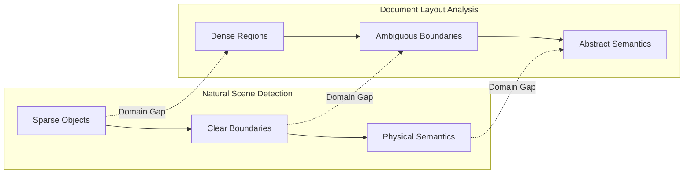
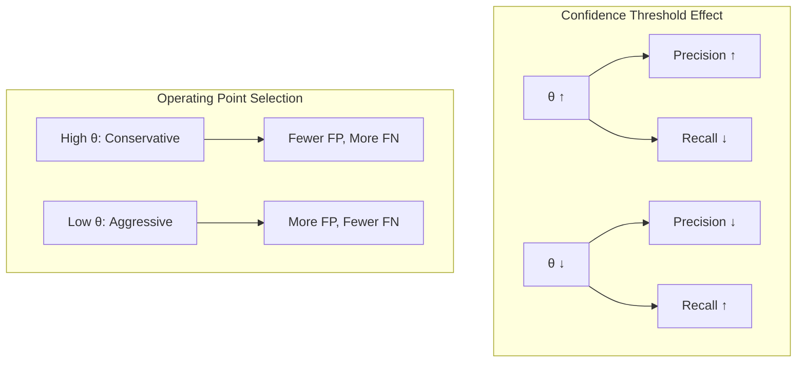
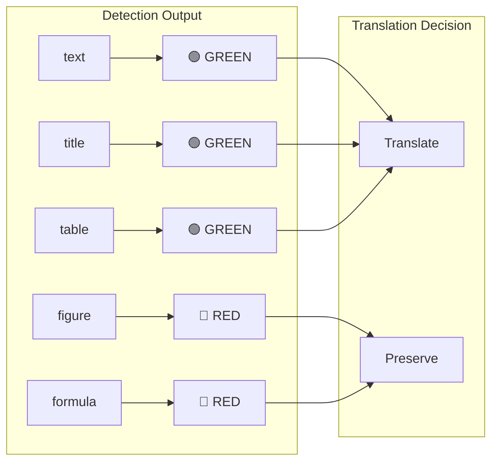
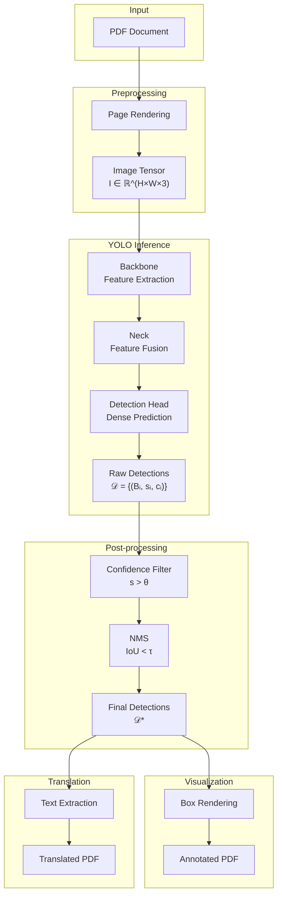
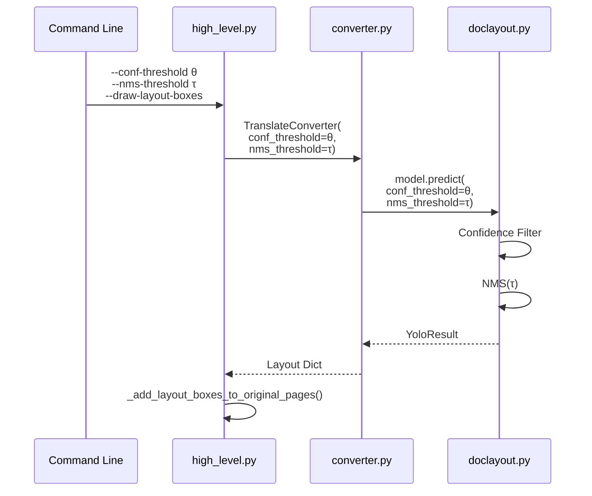

> **Domain**: Document Layout Analysis · Object Detection · Post-processing Optimization  
> **Abstract**: 本文系统阐述了在 PDF 文档翻译流水线中，针对 YOLO-based Layout Parser 的两项关键优化：(1) 基于参数化 NMS 的检测冗余抑制机制；(2) 面向可解释性的检测结果可视化验证框架。从信息论与优化理论视角剖析算法设计动机，给出严格的数学形式化与复杂度分析。

## 1. 引言与问题形式化

### 1.1 Document Layout Analysis 的理论框架

文档版面分析 (Document Layout Analysis, DLA) 可形式化为一个 **结构化预测问题** (Structured Prediction Problem)。给定文档图像 $\mathbf{I} \in \mathbb{R}^{H \times W \times 3}$，目标是学习映射：

$$
f_\theta: \mathbb{R}^{H \times W \times 3} \rightarrow \mathcal{P}(\mathcal{B} \times \mathcal{C} \times [0,1])
$$

其中 $\mathcal{B} = \{(x_1, y_1, x_2, y_2) | x_1 < x_2, y_1 < y_2\}$ 为边界框空间，$\mathcal{C} = \{\text{text}, \text{title}, \text{table}, \text{figure}, \text{formula}, ...\}$ 为语义类别集合，$\mathcal{P}(\cdot)$ 表示幂集。

### 1.2 文档域的特殊性：从 Natural Scene 到 Document Image

相较于自然场景目标检测，文档图像呈现出显著的 **分布偏移** (Domain Shift)：



**定量刻画**：设 $\rho(\mathbf{I})$ 为图像的目标密度函数：

$$
\rho(\mathbf{I}) = \frac{\sum_{i=1}^{N} \text{Area}(B_i)}{H \times W}
$$

实证研究表明：$\rho_{\text{COCO}} \approx 0.15$，而 $\rho_{\text{PubLayNet}} \approx 0.72$，文档图像的目标覆盖率高出近 5 倍。

### 1.3 核心挑战：检测冗余与级联误差

YOLO 系列检测器采用 **dense prediction** 范式，在高密度文档场景下产生大量冗余检测框。设原始检测集合为 $\mathcal{D} = \{(B_i, s_i, c_i)\}_{i=1}^{N}$，冗余度可定义为：

$$
\text{Redundancy}(\mathcal{D}) = 1 - \frac{|\mathcal{D}^*|}{|\mathcal{D}|}
$$

其中 $\mathcal{D}^* \subseteq \mathcal{D}$ 为去冗余后的最优子集。在 PDF 翻译流水线中，冗余检测导致：

1. **语义碎片化**：连续段落被切分为多个重叠区域
2. **翻译边界模糊**：重叠区域的文本被重复翻译或遗漏
3. **计算资源浪费**：下游模块处理冗余输入

## 2. 非极大值抑制的理论分析

### 2.1 NMS 的优化视角

Non-Maximum Suppression 可视为一个 **组合优化问题**。给定检测集合 $\mathcal{D}$，定义二元决策变量 $z_i \in \{0, 1\}$ 表示是否保留第 $i$ 个检测框，优化目标为：

$$
\begin{aligned}
\max_{z} \quad & \sum_{i=1}^{N} s_i \cdot z_i \\
\text{s.t.} \quad & z_i + z_j \leq 1, \quad \forall (i,j): \text{IoU}(B_i, B_j) > \tau \\
& z_i \in \{0, 1\}, \quad \forall i \in [N]
\end{aligned}
$$

这是一个 **Maximum Weight Independent Set (MWIS)** 问题在 IoU 图上的实例化，已知为 NP-hard。贪心 NMS 提供了一个 $O(N^2)$ 的近似解。

### 2.2 IoU 度量的几何性质

**定义 2.1 (Intersection over Union)**：对于两个边界框 $B_i, B_j \in \mathcal{B}$，IoU 定义为：

$$
\text{IoU}(B_i, B_j) = \frac{|B_i \cap B_j|}{|B_i \cup B_j|} = \frac{|B_i \cap B_j|}{|B_i| + |B_j| - |B_i \cap B_j|}
$$

**性质 2.1**：IoU 是一个 **伪度量** (Pseudometric)，满足：
- 非负性：$\text{IoU}(B_i, B_j) \geq 0$
- 对称性：$\text{IoU}(B_i, B_j) = \text{IoU}(B_j, B_i)$
- 但不满足三角不等式

**性质 2.2**：$d_{\text{IoU}}(B_i, B_j) = 1 - \text{IoU}(B_i, B_j)$ 构成 Jaccard 距离，是一个有效的度量。

### 2.3 贪心 NMS 算法

NMS 的核心思路很直观：每次挑出置信度最高的框，然后去除所有和它重叠太多的框，重复这个过程直到没有框剩下。

```python
def nms(detections, iou_threshold):
    # 按置信度降序排列
    detections = sorted(detections, key=lambda x: x.score, reverse=True)
    keep = []
    
    while detections:
        best = detections.pop(0)  # 取出当前最高分
        keep.append(best)
        # 过滤掉与 best 重叠过多的框
        detections = [d for d in detections if iou(best.box, d.box) <= iou_threshold]
    
    return keep
```

复杂度是 $O(N^2)$，对于文档检测场景（通常几十到几百个框）完全够用。

### 2.4 阈值 τ 的信息论解释

从信息论视角，NMS 阈值 $\tau$ 控制了检测集合的 **信息熵压缩率**。定义检测集合的冗余熵：

$$
H_{\text{redundancy}}(\mathcal{D}) = -\sum_{i < j} \text{IoU}(B_i, B_j) \log \text{IoU}(B_i, B_j)
$$

NMS 的作用是最小化 $H_{\text{redundancy}}$ 同时保持检测的 **召回率**：

$$
\tau^* = \arg\min_{\tau} \left[ H_{\text{redundancy}}(\mathcal{D}_\tau) + \lambda \cdot \text{FN}(\mathcal{D}_\tau) \right]
$$

其中 $\text{FN}(\cdot)$ 为假阴性数量，$\lambda$ 为 Lagrange 乘子。

## 3. 置信度阈值的统计决策理论

### 3.1 检测置信度的概率建模

假设检测器输出的置信度分数服从条件分布：

$$
s | y = \begin{cases}
p(s | y=1) \sim \mathcal{N}(\mu_+, \sigma_+^2) & \text{(True Positive)} \\
p(s | y=0) \sim \mathcal{N}(\mu_-, \sigma_-^2) & \text{(False Positive)}
\end{cases}
$$

其中 $\mu_+ > \mu_-$（真正例的置信度均值高于假正例）。

### 3.2 最优阈值的 Neyman-Pearson 准则

在给定假阳性率 (FPR) 约束下，最大化真阳性率 (TPR) 的最优阈值由 **似然比检验** 给出：

$$
\theta^* = \arg\max_\theta \left\{ \text{TPR}(\theta) : \text{FPR}(\theta) \leq \alpha \right\}
$$

对于高斯假设，最优阈值的闭式解为：

$$
\theta^* = \frac{\mu_+ \sigma_-^2 - \mu_- \sigma_+^2 + \sigma_+ \sigma_- \sqrt{(\mu_+ - \mu_-)^2 + 2(\sigma_+^2 - \sigma_-^2) \ln \frac{\sigma_-}{\sigma_+}}}{\sigma_-^2 - \sigma_+^2}
$$

### 3.3 Precision-Recall 权衡的几何解释



在 PR 空间中，阈值 $\theta$ 定义了一条从 $(1, 0)$ 到 $(0, 1)$ 的参数化曲线。最优工作点通常选择 **F1-score 最大化点**：

$$
\theta^*_{F1} = \arg\max_\theta \frac{2 \cdot P(\theta) \cdot R(\theta)}{P(\theta) + R(\theta)}
$$

## 4. 可视化验证的可解释性框架

### 4.1 从 Black-box 到 Explainable Detection

检测结果可视化是 **Explainable AI (XAI)** 在目标检测领域的直接应用。定义可解释性函数：

$$
\phi: \mathcal{D} \times \mathbf{I} \rightarrow \mathbf{I}'
$$

将检测结果 $\mathcal{D}$ 叠加到原始图像 $\mathbf{I}$ 上，生成可解释输出 $\mathbf{I}'$。

### 4.2 语义颜色映射的设计原则

颜色编码遵循 **认知负荷最小化** 原则，采用二元语义映射：

$$
\text{Color}(c) = \begin{cases}
\text{GREEN} = (0, 0.8, 0) & c \in \mathcal{C}_{\text{translate}} \\
\text{RED} = (1, 0, 0) & c \in \mathcal{C}_{\text{preserve}}
\end{cases}
$$

其中：
- $\mathcal{C}_{\text{translate}} = \{\text{text}, \text{title}, \text{table}\}$
- $\mathcal{C}_{\text{preserve}} = \{\text{figure}, \text{formula}, \text{abandon}\}$



### 4.3 PDF 绘图实现

在 PDF 上画检测框其实挺简单，PDF 的绘图指令类似 PostScript：

```text
q                    % 保存当前绘图状态
  0 0.8 0 RG         % 设置描边颜色 (RGB)
  2 w                % 线宽 2pt
  100 200 300 50 re  % 画矩形 (x, y, width, height)
  S                  % 描边
Q                    % 恢复绘图状态
```
{: .nolineno }

`q/Q` 配对保证我们的绘图操作不会影响 PDF 原有内容。

## 5. 系统架构与数据流

### 5.1 端到端流水线



### 5.2 参数传递链路



## 6. 实验配置与调优策略

### 6.1 阈值选择的经验准则

基于文档类型的先验知识，给出阈值配置矩阵：

| Document Type | $\theta_{\text{conf}}$ | $\tau_{\text{NMS}}$ | Rationale |
|--------------|----------------------|-------------------|-----------|
| Academic Paper (双栏) | 0.30 | 0.40 | 高密度布局，需激进抑制 |
| Technical Manual | 0.25 | 0.50 | 图文混排，保留更多检测 |
| Scanned Document | 0.20 | 0.60 | 噪声较多，降低过滤强度 |
| Table-heavy Document | 0.35 | 0.30 | 表格边界需精确分割 |

### 6.2 自适应阈值选择

对于未知文档类型，可采用 **基于验证集的网格搜索**：

$$
(\theta^*, \tau^*) = \arg\max_{\theta, \tau} \text{mAP}_{50}(\mathcal{D}_{\theta, \tau}, \mathcal{G})
$$

其中 $\mathcal{G}$ 为 ground truth 标注，$\text{mAP}_{50}$ 为 IoU=0.5 时的平均精度。
