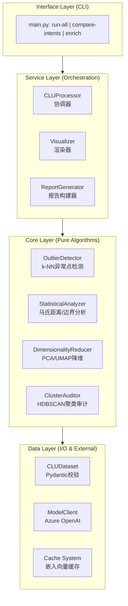
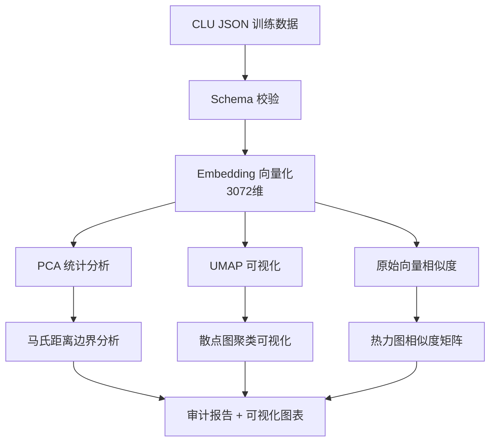
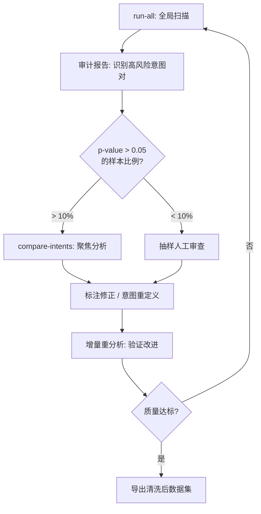

意图识别（Intent Classification）是任务型对话系统的核心组件，其性能上界由训练语料的质量决定。Azure Conversational Language Understanding (CLU) 作为企业级 NLU 服务，在实际部署中常面临三类数据质量问题，这些问题直接映射到模型的泛化能力瓶颈：

| 质量缺陷 | 数学表征 | 模型行为退化 |
|---------|---------|---------|
| 意图内聚性不足 | 类内方差过大，$\text{Var}(X \| Y=c)$ 偏高 | softmax 输出熵增大，置信度下降 |
| 意图边界耦合 | 类间距离过小，$d(\mu_i, \mu_j)$ 不足 | 决策边界附近样本误分类率上升 |
| 长尾意图欠采样 | 样本量 $n_c < n_{min}$ | 该类别的 recall 显著低于整体 |

本文介绍一套将数据质量评估形式化为统计假设检验问题的分析框架。核心思路是利用预训练语言模型的语义表征能力，将离散的自然语言空间映射到连续的度量空间，进而应用经典的多元统计方法进行量化分析：

$$\mathcal{T}: \text{Utterance} \xrightarrow{\text{Embedding}} \mathbb{R}^d \xrightarrow{\text{Statistical Analysis}} \text{Quality Metrics}$$

## 系统架构

### 分层设计



### 数据流



## 核心算法

### 语义向量化与表征学习

选用 `text-embedding-3-large`（$d=3072$）作为编码器。该模型基于对比学习范式预训练，其输出向量在余弦相似度度量下具有良好的语义对齐特性：语义相近的文本在向量空间中距离较近，反之亦然。

向量化是后续所有分析的理论基础。通过将离散符号序列 $x = (w_1, w_2, ..., w_n)$ 映射到稠密向量 $\mathbf{e} \in \mathbb{R}^d$，语义相似度问题转化为向量空间中的距离计算问题。这一转换使得经典的多元统计方法（如协方差分析、假设检验）得以应用。

考虑到 Embedding API 的调用成本与延迟，系统实现了基于内容哈希的确定性缓存机制：对语料集文本进行排序后计算 MD5 摘要作为缓存键，确保相同输入产生相同的缓存命中。

### 意图内异常点检测：基于 k-NN 距离的离群分析

**问题形式化**：设意图 $c$ 对应的语料集为 $\mathcal{U}_c = \{u_1, u_2, ..., u_{n_c}\}$，其嵌入向量集合为 $\mathcal{E}_c = \{\mathbf{e}_1, \mathbf{e}_2, ..., \mathbf{e}_{n_c}\}$。目标是识别那些与同类样本语义距离异常大的离群点，这些点可能源于标注错误或意图定义的边界模糊。

**算法原理**：采用基于 k 近邻距离的异常分数定义。对于样本 $\mathbf{e}_i$，其异常分数为到第 $k$ 近邻的余弦距离：

$$s_i = d_{cos}(\mathbf{e}_i, \mathbf{e}_{(k)})$$

其中 $\mathbf{e}_{(k)}$ 表示 $\mathbf{e}_i$ 在 $\mathcal{E}_c \setminus \{\mathbf{e}_i\}$ 中的第 $k$ 近邻。选择 $k > 1$ 而非最近邻是为了降低对局部密度波动的敏感性——单个近邻可能是噪声，但 $k$ 个近邻的统计特性更稳定。

**阈值确定策略**：

| 策略 | 统计学基础 | 适用场景 |
|-----|------|---------|
| $P_{95}$ 百分位 | 假设异常点占比 $\leq 5\%$ | 平衡召回与精确度 |
| $P_{90}$ 百分位 | 假设异常点占比 $\leq 10\%$ | 高召回场景 |
| $Q_3 + 1.5 \times IQR$ | 基于四分位距的鲁棒估计 | 分布偏态或存在极端值 |

百分位阈值隐含了"多数样本正常"的先验假设。IQR 方法的优势在于对分布形态的假设更弱，且对极端值具有击穿鲁棒性（breakdown point = 25%）。

**核心实现**：

```python
def detect_outliers_knn(embeddings: np.ndarray, k: int = 5, threshold_strategy: str = "95pct"):
    # 构建成对余弦距离矩阵 D[i,j] = 1 - cos(e_i, e_j)
    distances = cosine_distances(embeddings)
    np.fill_diagonal(distances, np.inf)  # 排除自距离
    
    # 沿行排序，提取第 k 近邻距离
    sorted_distances = np.sort(distances, axis=1)
    k_nearest_distances = sorted_distances[:, k - 1]
    
    # 阈值计算
    if threshold_strategy == "95pct":
        threshold = np.percentile(k_nearest_distances, 95)
    elif threshold_strategy == "90pct":
        threshold = np.percentile(k_nearest_distances, 90)
    elif threshold_strategy == "iqr":
        q1, q3 = np.percentile(k_nearest_distances, [25, 75])
        threshold = q3 + 1.5 * (q3 - q1)
    
    outlier_mask = k_nearest_distances > threshold
    return outlier_mask, k_nearest_distances, threshold
```

### 意图边界混淆分析：马氏距离与假设检验

**问题形式化**：给定样本 $\mathbf{e}$ 及其标注意图 $c_{orig}$，评估该样本是否在统计意义上更可能属于另一意图 $c_{alt}$。这本质上是一个假设检验问题：

$$H_0: \mathbf{e} \sim \mathcal{N}(\boldsymbol{\mu}_{c_{alt}}, \boldsymbol{\Sigma}_{c_{alt}}) \quad \text{vs} \quad H_1: \mathbf{e} \not\sim \mathcal{N}(\boldsymbol{\mu}_{c_{alt}}, \boldsymbol{\Sigma}_{c_{alt}})$$

**维度灾难与降维必要性**：原始嵌入空间 $d=3072$ 远超典型意图的样本量。在高维空间中，协方差矩阵的最大似然估计需要 $n > d$ 才能保证正定性，否则矩阵奇异无法求逆。更深层的问题是"维度灾难"：随着维度增加，欧氏距离的区分能力退化，所有点对之间的距离趋于均匀化。

**自适应 PCA 降维**：目标维度由样本量约束决定：

$$d_{target} = \min\left(\min_{c} n_c - 1, d_{original}\right)$$

这确保了每个意图类别都有足够自由度来估计其协方差结构。PCA 作为线性变换保持了向量空间的仿射结构，使得降维后的马氏距离仍具有统计意义。

```python
n_min = min(len(utterances) for intent, utterances in intent_groups.items())
target_dim = min(n_min - 1, original_dim)

pca = PCA(n_components=target_dim)
reduced_embeddings = pca.fit_transform(embeddings)
```

**意图分布的参数估计**：将每个意图建模为多元高斯分布 $\mathcal{N}(\boldsymbol{\mu}_c, \boldsymbol{\Sigma}_c)$。协方差矩阵 $\boldsymbol{\Sigma}_c$ 编码了意图内部的变异结构：主成分方向上的方差大小及各维度间的相关性。

为保证数值稳定性，对协方差矩阵施加 Tikhonov 正则化：$\boldsymbol{\Sigma}_{reg} = \boldsymbol{\Sigma} + \epsilon \mathbf{I}$，其中 $\epsilon = 10^{-6}$。

```python
def build_intent_model(intent_embeddings: np.ndarray):
    mean_vector = np.mean(intent_embeddings, axis=0)
    cov_matrix = np.cov(intent_embeddings, rowvar=False)
    
    # Tikhonov 正则化
    reg_identity = np.identity(cov_matrix.shape[0]) * 1e-6
    inv_cov_matrix = np.linalg.pinv(cov_matrix + reg_identity)
    
    return mean_vector, inv_cov_matrix
```

**马氏距离的几何直觉**：

$$D_M(\mathbf{x}, \boldsymbol{\mu}, \boldsymbol{\Sigma}) = \sqrt{(\mathbf{x} - \boldsymbol{\mu})^T \boldsymbol{\Sigma}^{-1} (\mathbf{x} - \boldsymbol{\mu})}$$

马氏距离可理解为在协方差矩阵定义的椭球坐标系下的标准化距离。与欧氏距离相比，它对分布的各向异性进行了校正：在方差大的方向上，相同的偏移量对应更小的马氏距离。这符合直觉——如果某个意图本身在某维度上变异较大，则该维度上的偏离不应被过度惩罚。

```python
def mahalanobis_distance(x: np.ndarray, mean: np.ndarray, inv_cov: np.ndarray) -> float:
    diff = x - mean
    return np.sqrt(np.dot(np.dot(diff, inv_cov), diff.T))
```

**p-value 的统计解释**：在多元高斯假设下，马氏距离的平方服从自由度为 $d$ 的卡方分布：

$$D_M^2 \sim \chi^2_d$$

由此可计算 p-value：

$$p = 1 - F_{\chi^2_d}(D_M^2)$$

p-value 的操作性解释：在原假设"样本属于目标意图"成立的条件下，观察到当前或更极端马氏距离的概率。当 $p > 0.05$ 时，无法拒绝该样本属于目标意图的假设，提示存在潜在的标注错误或意图边界模糊。

```python
from scipy.stats import chi2

def mahalanobis_to_pvalue(distance: float, df: int) -> float:
    return 1 - chi2.cdf(distance ** 2, df=df)
```

### 全局聚类审计：HDBSCAN 与标注一致性验证

**问题动机**：前述方法均以现有标注为锚点进行分析。但若意图体系本身存在设计缺陷（如语义重叠的意图应合并、单一意图应拆分），则需要无监督视角来审视数据的内在结构。

**算法选择依据**：HDBSCAN（Hierarchical Density-Based Spatial Clustering of Applications with Noise）相比 K-Means 具有三个关键优势：

1. 无需预设簇数 $k$，通过密度连通性自动发现聚类结构
2. 显式建模噪声点（标记为 $-1$），不强制将所有样本分配到某个簇
3. 对簇形状无凸性假设，能够识别任意形状的流形结构

**关键超参数**：

| 参数 | 语义 | 调优建议 |
|-----|-------|-----|
| `min_cluster_size` | 有效簇的最小样本数 | 设为预期最小意图样本量的 50%-70% |
| `min_samples` | 核心点的邻域密度要求 | 较大值产生更保守的聚类，更多噪声点 |
| `cluster_selection_epsilon` | 簇合并的距离阈值 | 控制聚类粒度 |

**聚类纯度与标注一致性**：

$$\text{Purity}(C_j) = \frac{\max_{c} |C_j \cap \mathcal{U}_c|}{|C_j|}$$

纯度度量聚类簇与意图标注的对齐程度。低纯度簇（$< 0.8$）表明多个意图的样本在语义空间中混杂，提示：
- 意图定义存在语义重叠，考虑合并
- 标注一致性差，需要重新审视标注指南
- 意图粒度过细，超出了模型的区分能力

```python
import hdbscan
from collections import Counter

def audit_clusters(embeddings: np.ndarray, intent_labels: List[str], min_cluster_size: int = 15):
    clusterer = hdbscan.HDBSCAN(min_cluster_size=min_cluster_size, metric='euclidean')
    cluster_labels = clusterer.fit_predict(embeddings)
    
    cluster_stats = []
    for cluster_id in set(cluster_labels):
        if cluster_id == -1:  # 噪声点单独统计
            continue
        
        mask = cluster_labels == cluster_id
        cluster_intents = [intent_labels[i] for i, m in enumerate(mask) if m]
        intent_counts = Counter(cluster_intents)
        
        dominant_intent, dominant_count = intent_counts.most_common(1)[0]
        purity = dominant_count / len(cluster_intents)
        
        cluster_stats.append({
            'cluster_id': cluster_id,
            'size': len(cluster_intents),
            'purity': purity,
            'dominant_intent': dominant_intent,
            'intent_distribution': dict(intent_counts)
        })
    
    return cluster_stats
```

## 降维策略的理论考量

系统采用双降维策略，服务于不同的分析目标：

**PCA：保结构的线性投影**

PCA 寻找最大化投影方差的正交基，是一种保持全局线性结构的降维方法。其关键性质是：降维后的欧氏距离与原空间中的欧氏距离成比例（在主成分方向上）。这使得马氏距离等基于二阶统计量的方法在降维后仍然有效。

**UMAP：保拓扑的流形学习**

UMAP 基于黎曼几何和代数拓扑理论，通过优化低维表示与高维数据的模糊集合交叉熵来保持局部邻域结构。其优势在于能够揭示数据的非线性流形结构，在 2D 可视化中呈现更清晰的聚类边界。

**互补性**：UMAP 散点图用于探索性分析和问题定位；PCA 空间中的统计检验提供可解释的量化判据。两者结合实现了"定性洞察 + 定量验证"的分析范式。

## 输出解读

### 关键指标的决策边界

| 指标 | 统计含义 | 行动阈值 | 干预建议 |
|-----|------|---------|---------|
| k-NN 异常分数 | 局部密度偏离程度 | $> P_{95}$ | 人工审查标注正确性 |
| 簇纯度 | 聚类-标注对齐度 | $< 0.8$ | 评估意图合并/拆分 |
| 边界 p-value | 跨意图归属概率 | $> 0.05$ | 优先审查，可能误标 |

### 可视化图表的解读要点

| 图表类型 | 分析目标 | 关注模式 |
|-----|------|-------|
| 意图相似度热力图 | 意图对的语义距离 | 对角线外的高亮区块 |
| UMAP 全局散点图 | 语料分布与聚类结构 | 跨意图混杂区域、孤立点 |
| 意图内散点图 | 单意图内聚性 | 离群点位置与密度 |

## 迭代分析工作流



## 方法论局限与改进方向

| 局限性 | 理论根源 | 潜在改进 |
|-----|------|---------|
| k-NN 对 $k$ 敏感 | 固定 $k$ 无法适应局部密度变化 | LOF（Local Outlier Factor）自适应邻域 |
| 高斯分布假设 | 马氏距离的理论基础 | 核密度估计或 Copula 建模 |
| 静态全局阈值 | 忽略意图间的异质性 | 分层贝叶斯阈值学习 |
| 线性 PCA 降维 | 可能丢失非线性结构 | 核 PCA 或自编码器 |
