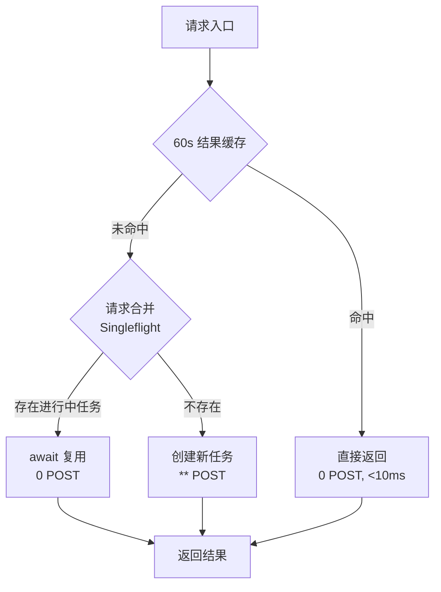
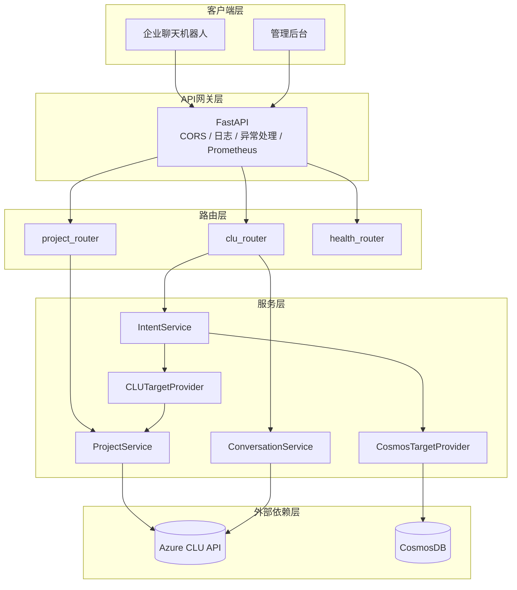
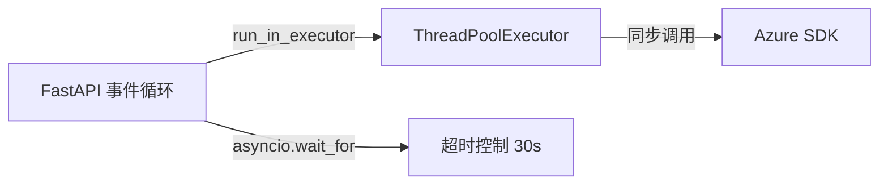
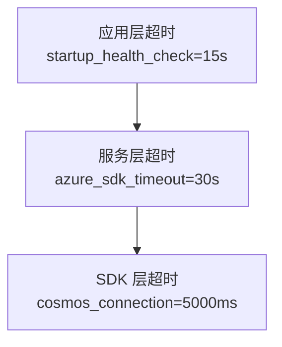
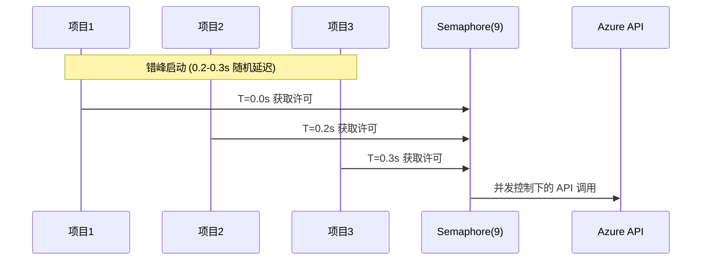
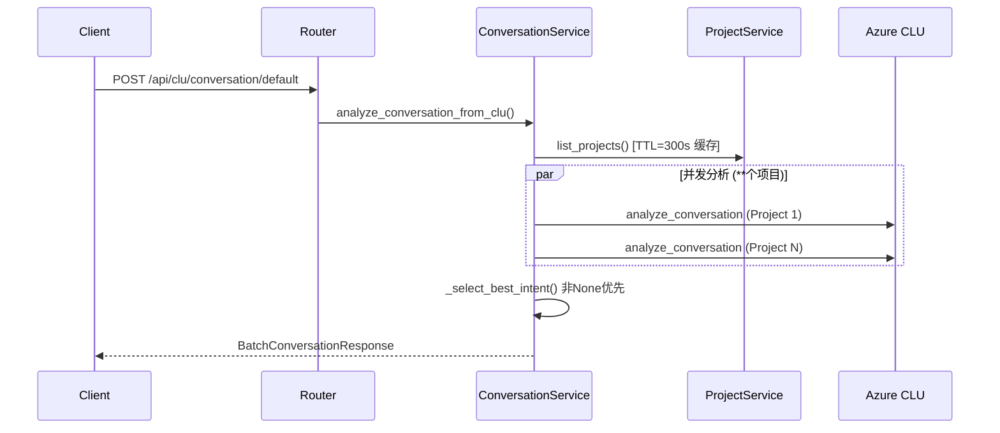

## 项目定位与工程背景

CLU API Service 是一个面向企业级对话语言理解场景的中间层服务，作为 Azure AI Language 服务（CLU）的封装层，为内部聊天机器人提供意图识别能力。

### 业务约束

- 多项目并行：IT、财务、采购等业务线独立维护各自的 CLU 项目（当前 ** 个）
- 跨项目聚合：需从多个领域模型中选择最佳匹配意图
- 企业级稳定性：生产环境对可用性和响应时间有明确要求

### 技术约束：LUIS 到 CLU 的迁移

Azure 于 2023 年将 LUIS 服务迁移至 CLU，带来架构层面的根本性变化：

| 维度 | LUIS (旧) | CLU (新) |
|------|-----------|----------|
| Intent 获取 | `GET /apps/{appId}/intents` 直接列表 | 无直接 API，需通过 Export 操作 |
| 模型结构 | App = 模型 | Project + Deployment 分离 |
| API 限流 | 相对宽松 | Authoring API: 10 POST/min |

CLU 缺少直接获取 Intent 列表的 API，必须通过项目导出（Export）操作获取，而 Authoring API 的限流策略（10 POST/min）与业务需求（** 个项目批量查询）存在天然矛盾。

---

## 核心设计洞察

### 洞察一：缓存是解决 API 限流的核心手段

Azure CLU Authoring API 的限流策略与多项目批量查询需求之间的矛盾，通过双重缓存机制解决：



效果量化：

| 场景 | 优化前 | 优化后 |
|------|--------|--------|
| 60s 内重复请求 | ** POST, ~3s | 0 POST, <10ms |
| 5 个并发请求 | 35 POST (触发限流) | ** POST, ~3s |

### 洞察二：非 None 意图优先的业务价值

在多项目并发分析场景中，通用项目的 "None" 意图往往具有更高置信度，但业务价值低。

场景示例：
- IT 项目识别 "账号锁定" (置信度 0.99)
- 通用项目识别 "None" (置信度 0.999)

传统算法选择 "None"，用户得不到有用答案。采用"非 None 优先"算法，确保业务意图优先于兜底意图。

### 洞察三：Provider 模式实现数据源解耦

通过 `TargetProvider` 协议抽象数据源，支持两种模式：

| 数据源 | 来源 | 适用场景 |
|--------|------|---------|
| CosmosDB | 运维维护的激活项目列表 | 生产环境，可控性强 |
| CLU | 自动发现所有项目 | 开发环境，灵活性高 |

```python
class TargetProvider(Protocol):
    async def get_project_names(self) -> List[str]: ...
```

---

## 系统架构

### 分层架构



### 核心服务职责

| 服务 | 职责 | 关键特性 |
|------|------|---------|
| `ProjectService` | 项目 CRUD、导入导出 | 5 分钟项目列表缓存、线程池异步化 |
| `ConversationService` | 意图识别、批量分析 | 非 None 优先算法 |
| `IntentService` | Intent 批量查询 | 60s 结果缓存、请求合并 |

---

## 异步架构：同步 SDK 的非阻塞封装

### 问题本质

Azure Python SDK（`azure-ai-language-conversations`）是同步阻塞库，在高并发场景下会阻塞 FastAPI 的事件循环。

### 解决方案

采用线程池 + asyncio 超时控制的混合架构：



核心实现模式：

```python
def _sync_list_projects():
    return list(self.client_author.list_projects())

loop = asyncio.get_event_loop()
future = loop.run_in_executor(self._executor, _sync_list_projects)
projects = await asyncio.wait_for(future, timeout=30)
```

### 线程池配置

| 服务 | max_workers | 用途 |
|------|-------------|------|
| ProjectService | ** | Azure SDK 调用 |
| UtilsService | 2 | CosmosDB 查询 |

### 分层超时设计



---

## 并发控制策略

### 约束条件

- Azure CLU Authoring API 限流：10 POST/min
- 当前项目数：** 个
- 理论并发风险：** 个项目同时发起 = ** 次/分钟（触发限流）

### 双重保护机制

Semaphore 限流 + 错峰启动：



配置参数：
- `max_concurrent`: 最大并发数（默认 **）
- `stagger_delay_min/max`: 错峰延迟范围（默认 0.2-0.3s）

### 错误隔离

单个项目失败不影响整体流程：

```python
results = await asyncio.gather(*tasks, return_exceptions=True)
for result in results:
    if isinstance(result, Exception):
        errors.append(...)
    else:
        all_intents.extend(result['intents'])
```

---

## 意图识别流程

### 完整数据流



### 意图选择算法

```python
def _select_best_intent(results, threshold):
    # 优先级1: 非None意图 + 阈值过滤
    if non_none_intents and top.confidence >= threshold:
        return non_none_intents[0]
    
    # 优先级2: None意图 + 阈值过滤
    if none_intents and top.confidence >= threshold:
        return none_intents[0]
    
    # 优先级3: 返回最高置信度，但 hintIntent=null
    return {"intent": None, "confidence": max_confidence}
```

---

## 可观测性设计

### 监控栈

| 组件 | 职责 |
|------|------|
| Prometheus | 指标采集、存储 |
| Grafana | 数据可视化 |
| Alertmanager | 告警管理 |

### 核心指标

```promql
# 会话分析 QPS
rate(conversation_default_requests_total[5m])

# P95 响应时间
histogram_quantile(0.95, rate(conversation_default_duration_seconds_bucket[5m]))

# Azure SDK 超时率
rate(azure_sdk_call_total{status="timeout"}[5m]) / rate(azure_sdk_call_total[5m])
```

### 告警规则

| 告警 | 触发条件 | 严重级别 |
|------|---------|---------|
| HighErrorRate | 错误率 > 5% 持续 5min | warning |
| SlowResponseTime | P95 > 5s 持续 10min | warning |
| ServiceDown | 服务不可用 2min | critical |

---

## 关键技术决策

### 为什么不使用 Redis 分布式缓存

当前状态：单实例部署 + 进程内缓存

决策理由：
1. 业务规模：** 个项目，请求频率低，单实例足够
2. 复杂度权衡：引入 Redis 增加运维成本，收益有限
3. 演进路径：如需扩展，优先考虑负载均衡一致性哈希

### 为什么采用 Export 而非直接 API 获取 Intent

Azure CLU 架构约束：
- CLU Runtime API 仅支持预测，无 Intent 列表端点
- 官方推荐通过 Authoring API 的 Export 操作获取完整项目 JSON

### 为什么 Intent 缓存 TTL 设为 60s

权衡考量：
- Intent 数据变更频率极低（天级别）
- 60s 足以覆盖大部分重复请求场景
- 避免缓存过长导致数据陈旧

---

## 技术栈

| 层次 | 技术选型 | 版本 |
|------|---------|------|
| 运行时 | Python | 3.11+ |
| Web 框架 | FastAPI | 0.115.2 |
| 数据验证 | Pydantic | 2.9.2 |
| Azure SDK | azure-ai-language-conversations | 1.1.0 |
| 数据库 | Azure CosmosDB | 4.9.0+ |
| 监控 | prometheus-client | 0.21.1 |

---

## 工程价值总结

CLU API Service 的核心工程价值在于：

1. **API 限流问题的系统性解决**：通过双重缓存机制（结果缓存 + 请求合并），将 API 调用频率降低 90%+，从根本上解决了 Azure CLU Authoring API 10 POST/min 限流与 ** 项目批量查询之间的矛盾。

2. **同步 SDK 的非阻塞封装**：通过 ThreadPoolExecutor + asyncio.wait_for 的组合，在不修改 Azure SDK 的前提下实现了非阻塞调用，保证了 FastAPI 事件循环的响应能力。

3. **业务语义优先的算法设计**：非 None 优先算法体现了对业务场景的深入理解，在数学最优与业务价值之间做出了正确的权衡。

4. **可配置的并发控制**：Semaphore + 错峰启动的组合，配合可配置参数，在不同环境下提供了灵活的调优空间。

项目体现了对 Azure 云服务限制的深入理解，以及在工程实践中对性能、可维护性、可观测性的综合权衡。
