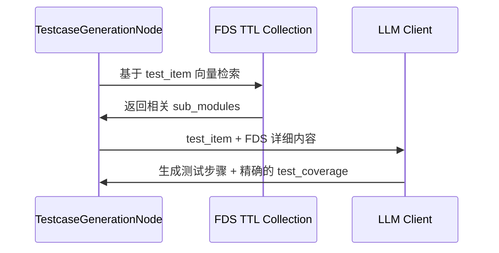

## 背景

在构建基于 LLM 的测试用例生成系统时，Milvus 作为向量数据库承担了文档检索和语义匹配的核心职责。本文记录两个工程实践：一是批量插入性能优化，二是面向工作流的 TTL Collection 设计。

---

## Part 1: 批量插入性能优化

### 问题表现

环境配置：Milvus 2.x + MilvusClient，21 条记录（86KB/条），3072 维向量（Azure OpenAI），批量大小 50 条。

实际表现：导入耗时 3 分 48 秒，平均 0.09 条/秒。

### 瓶颈定位

采用假设驱动的诊断方法，逐一验证可能的性能瓶颈：

| 假设 | 验证方法 | 结果 | 结论 |
|------|----------|------|------|
| Embedding 生成延迟 | 独立测试单次 Embedding 生成耗时 | 747ms | 非主要瓶颈 |
| 数据包过大 | 查询单条记录并计算序列化大小 | 86KB/条 | 次要因素 |
| 插入和刷新策略错误 | 日志时间戳分析 + 代码审查 | 连续插入间隔 8-11 秒 | 主要瓶颈 |

通过日志时间戳分析，发现连续插入操作之间存在 8-11 秒的间隔，这一数据直接指向了代码层面的问题。

### 核心问题

代码审查定位到两个关键缺陷：

**问题 A：伪批量插入**

外层代码使用了"批次"的概念，但内部循环逐条调用 `insert()`，未能利用 Milvus 的批量插入能力。

**问题 B：过度刷新**

每条记录插入后立即调用 `flush()`，导致 21 次磁盘 I/O 操作。`flush()` 是一个昂贵的操作，它强制将内存中的数据持久化到磁盘。

### 解决方案

1. **真正的批量插入**：新增 `insert_test_cases_batch()` 方法，单次提交整个文档列表
2. **独立刷新控制**：新增 `flush_collection()` 方法，由调用方决定刷新时机
3. **流程重构**：批次内一次性插入、无刷新；所有数据完成后单次刷新

### 性能对比

| 指标 | 优化前 | 优化后 | 提升倍数 |
|------|--------|--------|----------|
| 总耗时 | 3 分 48 秒 | 10.6 秒 | 21.4x |
| 平均速度 | 0.09 条/秒 | 1.97 条/秒 | 21.9x |
| 插入操作 | 21 次单条 | 1 次批量 | - |
| 刷新操作 | 21 次 | 1 次 | - |

### 经验总结

- **假设驱动诊断**：验证性能瓶颈假设，避免直觉误判
- **日志时间戳分析**：观察连续操作间隔可快速定位热点
- **批量操作优先**：批量操作比循环单条快几个数量级
- **I/O 最小化**：`flush` 等磁盘操作需控制调用频率
- **接口分离**：针对不同性能需求提供专门接口

---

## Part 2: FDS TTL Collection 设计

### 问题背景

在测试用例生成流程中，`TestcaseGenerationNode` 存在一个关键缺陷：

1. **上下文不足**：`DocumentProcessingNode` 解析 FDS 文档后仅提取了功能点的标题列表，缺少详细的规格描述
2. **映射不准确**：LLM 仅根据功能点标题进行 `test_coverage` 映射，容易产生偏差
3. **无法精准检索**：无法根据具体的测试项检索到最相关的 FDS 功能规格详细内容

### 设计目标

通过构建 FDS TTL Collection，实现：

- **结构化存储**：将解析后的 FDS 数据按 `sub_module` 粒度存储到 Milvus
- **向量化检索**：对 `sub_module_name + sub_module_overview` 进行向量化，支持语义检索
- **富上下文**：将详细的 `functional_specifications`、`permissions` 等作为 metadata 存储
- **精准映射**：通过 RAG 检索提供完整的 FDS 上下文给 LLM

### 数据粒度选择

基于 FDS 文档结构分析，选择 `sub_module` 作为存储和检索的基本粒度：

- **粒度适中**：既包含足够的上下文信息，又不会过于庞大
- **语义完整**：每个 sub_module 代表一个完整的业务流程或功能模块
- **检索效率**：向量维度合理，检索性能良好

数据结构示例：

```json
{
  "module_id": 1,
  "module_name": "采购管理主流程概述及说明",
  "sub_modules": [
    {
      "sub_module_id": "1",
      "sub_module_name": "供应商档案建立流程",
      "sub_module_overview": "企业向新供应商采购时，采购员在U9系统中...",
      "functional_specifications": [
        {
          "fds_id": "F-U9-供应商档案建立流程-010-010-010",
          "description": "在基础设置－供应商界面，可录入编码、名称..."
        }
      ],
      "permissions": [...],
      "reports": [...]
    }
  ]
}
```

### 向量化策略

向量化内容：`sub_module_name + " " + sub_module_overview`

选择依据：
- `sub_module_name` 提供功能模块的核心关键词
- `sub_module_overview` 提供详细的业务上下文描述
- 组合后形成语义丰富的文本，便于与测试项进行语义匹配

### TTL 与隔离设计

**TTL 设置**：24 小时（86400 秒）

**隔离策略**：使用 `execution_id` 作为分区键，确保不同工作流执行的数据完全隔离

设计原则：
- 每次工作流执行都无条件解析和存储 FDS 数据
- 每个 `execution_id` 对应一套完整的 FDS 数据
- 不同工作流执行之间零干扰
- 每次执行的数据都可以独立追踪

### Collection Schema

| 字段名 | 类型 | 描述 |
|--------|------|------|
| `chunk_id` | VarChar(64) | 主键，UUID |
| `execution_id` | VarChar(64) | 工作流执行 ID，用于隔离 |
| `chunk_vector` | FloatVector(3072) | 向量表示 |
| `document_title` | VarChar(512) | FDS 文档标题 |
| `module_id` | INT64 | 模块 ID |
| `module_name` | VarChar(512) | 模块名称 |
| `sub_module_id` | VarChar(64) | 子模块 ID |
| `sub_module_name` | VarChar(512) | 子模块名称 |
| `sub_module_overview` | VarChar(2000) | 子模块概述 |
| `chunk_text` | VarChar(4000) | 向量化的源文本 |
| `metadata` | JSON | 详细数据 |

### 检索与生成流程



### 数据流程

```
[FDS文档]
    ↓ DocumentProcessingNode.parse()
[解析后的FDS数据]
    ↓ _vectorize_and_store_fds()
[向量化] → [FDS TTL Collection]
    ↓ execution_id 传递
[TestcaseGenerationNode]
    ↓ _retrieve_fds_content(test_item, execution_id)
[检索相关FDS内容] → [LLM生成测试用例]
    ↓
[精确的test_coverage映射]
```

### 实现要点

**DocumentProcessingNode 增强**：
- FDS 解析完成后，遍历所有 sub_modules
- 对每个 sub_module 进行向量化
- 构建 metadata（包含 functional_specifications、permissions 等）
- 批量写入 FDS TTL Collection
- 错误容忍：向量化失败不影响主流程

**TestcaseGenerationNode 重构**：
- 新增 `_retrieve_fds_content` 方法：基于 test_item 检索相关 FDS 内容
- 新增 `_format_user_content_with_fds` 方法：为 LLM 提供富 FDS 上下文
- 保持线程池并发执行

### 风险与对策

| 风险 | 对策 |
|------|------|
| 向量维度兼容性 | 复用统一的 embedding 配置 |
| 检索召回率不足 | 设置较低的相似度阈值以提高召回率 |
| LLM 上下文长度限制 | 对过长的 FDS 内容进行智能截取 |

### 生产环境注意事项

POC 阶段暂时禁用了 TTL 机制，生产环境需要启用：

```python
# 生产环境需要启用的代码
properties={
    "collection.ttl.seconds": MilvusFDSChunksSchema.TTL_SECONDS
}
```

其他考虑：
- 基于文档哈希的去重机制
- Collection 大小和性能监控

---

## 总结

两个实践场景的共同点在于：性能问题往往隐藏在看似正确的代码逻辑中。批量插入优化的核心是识别"伪批量"模式和过度 I/O；TTL Collection 设计的核心是在数据隔离、自动清理和检索效率之间找到平衡。

工程实践中，日志时间戳分析、假设驱动诊断、接口分离等方法论的价值，往往比具体的技术方案更具普适性。
