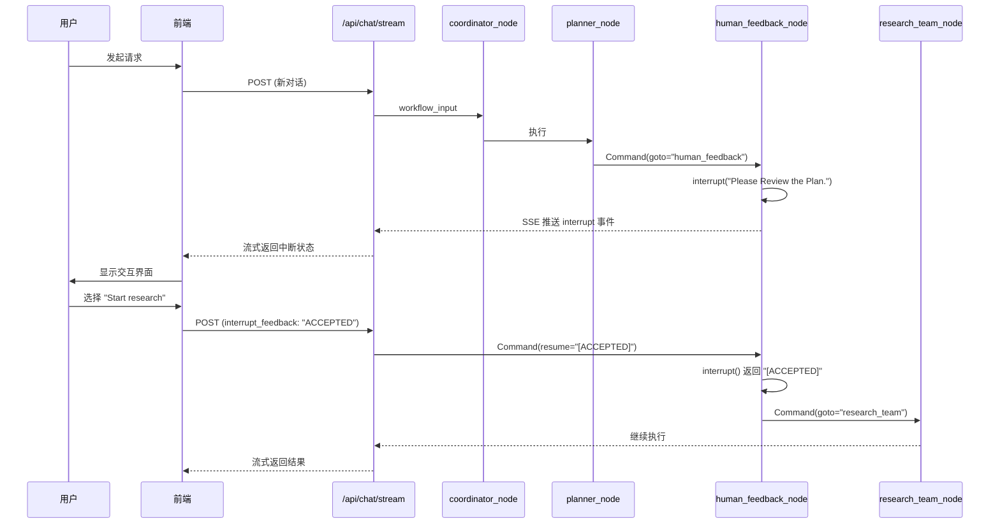

## 技术栈与场景背景

本文分析的架构基于以下技术栈：

| 组件 | 版本/说明 |
| :--- | :--- |
| 平台框架 | FastAPI + LangGraph 0.6.4, Python 3.12 |
| 核心依赖 | langchain-core, langgraph.types.Command, langgraph.checkpoint |
| 应用场景 | 多节点异步工作流，SSE 流式响应，人机交互中断机制 |
| 并发要求 | 支持数百并发会话，需保证状态隔离 |

在构建 AI Agent 工作流时，人机交互中断（Human-in-the-Loop）是常见需求。LangGraph 提供了 `interrupt()` 和 `Command` 机制来实现这一能力，但其架构设计存在几个关键问题需要澄清：

- SSE 架构是否采用双端点集成模式来处理中断和恢复？
- interrupt 中断和 resume 恢复是否跨越多个节点执行？
- Command 的 goto 和 resume 底层实现原理是什么？

---

## 架构假设与验证

通过源码分析和执行流程追踪，对上述问题进行了系统性验证：

| 假设 | 验证方法 | 结果 | 结论 |
| :--- | :--- | :--- | :--- |
| SSE 采用双端点架构 | 分析 server/app.py 端点定义 | 只有单个 /api/chat/stream 端点 | 排除 |
| Interrupt 跨多个节点 | 追踪 human_feedback_node 源码 | 中断和恢复都在同一节点内 | 排除 |
| Resume 通过普通状态传递 | 检查 Command(resume=...) 用法 | 专门的 LangGraph 恢复机制 | 排除 |
| 单端点处理所有交互 | 分析 interrupt_feedback 参数 | 通过同一端点的参数区分状态 | 主要架构 |

---

## 核心架构设计

### SSE 单端点统一架构

项目采用单个 `/api/chat/stream` 端点处理新对话和中断恢复，通过 `interrupt_feedback` 参数区分状态，避免了双端点的复杂性。

```python
@app.post("/api/chat/stream")
async def chat_stream(request: ChatRequest):
    # 通过参数区分新对话和恢复场景
    if not auto_accepted_plan and interrupt_feedback:
        workflow_input = Command(resume=f"[{interrupt_feedback}]")
    else:
        workflow_input = {"messages": messages, ...}
    
    return StreamingResponse(_astream_workflow_generator(...))
```

这种设计的核心特点：

- 单一入口点处理所有聊天交互
- 通过请求参数（`interrupt_feedback`）区分新对话与恢复场景
- 前端集成只需对接一个端点

### 单节点内完整状态机

`human_feedback_node` 内部实现完整的中断-等待-恢复状态机。`interrupt()` 是同步阻塞调用，恢复后在同一执行上下文继续处理。

```python
def human_feedback_node(state) -> Command[...]:
    if not auto_accepted_plan:
        # 阶段1：执行中断
        feedback = interrupt("Please Review the Plan.")
        
        # 阶段2：处理恢复反馈
        if feedback.upper().startswith("[EDIT_PLAN]"):
            return Command(goto="planner")  # 路由控制
        elif feedback.upper().startswith("[ACCEPTED]"):
            # 继续后续处理
            pass
    
    # 阶段3：执行后续逻辑
    return Command(goto="research_team")
```

关键实现细节：

- `interrupt()` 调用时暂停执行并保存当前状态
- 恢复时从同一位置继续，`interrupt()` 返回用户反馈
- 所有状态转换逻辑封装在单一节点内

### Command 机制的双重职责

LangGraph 的 `Command` 类型承担两种不同职责：

| 机制 | 用途 | 典型场景 |
| :--- | :--- | :--- |
| `Command(resume=...)` | 中断恢复 | 将用户反馈传递给暂停的 `interrupt()` 调用 |
| `Command(goto=...)` | 节点路由 | 精确控制工作流跳转到指定节点 |

两者配合实现灵活的工作流控制，职责边界清晰。

---

## Interrupt-Resume 完整生命周期



生命周期关键时间节点：

| 时间点 | 事件 |
| :--- | :--- |
| T0 | 用户发起请求，工作流开始执行 |
| T1 | 到达 `human_feedback_node`，执行 `interrupt()` |
| T2 | SSE 推送中断事件，前端显示交互界面 |
| T3 | 用户做出选择，发送带有 `interrupt_feedback` 的请求 |
| T4 | `Command(resume=...)` 触发状态恢复 |
| T5 | `interrupt()` 返回用户选择，继续执行后续逻辑 |

---

## 设计原则总结

### 统一接口原则

使用单端点处理所有聊天交互，简化前端集成复杂度。通过参数区分不同场景，降低架构复杂性。

### 状态内聚原则

将中断和恢复逻辑封装在单一节点内，保证状态一致性。避免跨节点状态传递带来的复杂性和潜在的状态不一致问题。

### 机制分离原则

`Command.resume` 专门用于状态恢复，`Command.goto` 专门用于流程控制，避免功能混淆。

### 并发安全原则

使用 `("messages", thread_id)` 模式实现会话级数据隔离，保证高并发安全。每个会话拥有独立的命名空间，互不干扰。

---

## 方案对比

| 指标 | 传统双端点方案 | 单端点 SSE 方案 |
| :--- | :--- | :--- |
| 前端集成复杂度 | 需管理多个端点状态 | 单一端点接口 |
| 状态同步开销 | 跨端点状态同步成本 | 内部参数区分，零同步开销 |
| 并发处理能力 | 受限于端点数量 | 单端点高并发，支持数百并发 |
| 错误处理复杂度 | 多点故障排查 | 单点集中处理 |

---

## 工程实践要点

1. **端点设计**：单端点架构降低了前端集成和后端维护的复杂度，新功能添加更加直观。

2. **状态机封装**：单节点状态机模式便于添加新的中断处理逻辑，完整的执行流程集中在少数关键节点内，问题排查和性能优化更加高效。

3. **并发隔离**：命名空间隔离支持大规模并发，经过实际高并发验证的架构设计，适用于企业级 AI 应用场景。

4. **扩展方向**：
   - 增加中断类型的可扩展性，支持更多样化的人机交互场景
   - 探索 WebSocket 在特定场景下的补充作用，如大文件传输
   - 优化 Command 机制，提供更丰富的流程控制能力
