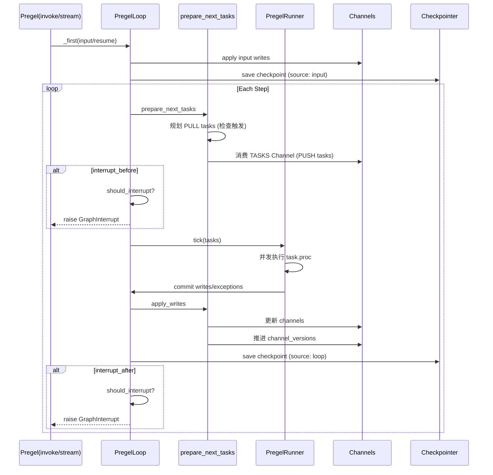
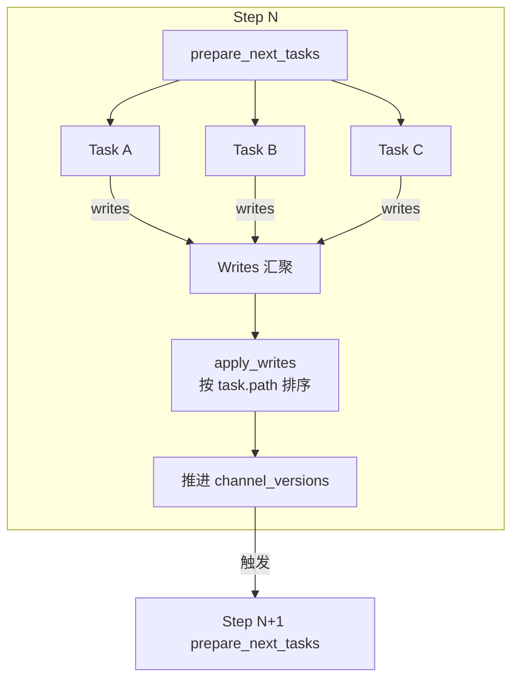

## 背景与动机

在 AI Agent 编排场景中,我们需要处理的问题包括:
- 多个节点并行执行,写入同一状态时如何避免冲突?
- 执行过程中如何保证可中断、可恢复?
- 如何在保持确定性的同时提升并发性能?

LangGraph 选择 Pregel 的 BSP(Bulk Synchronous Parallel)模型来解决这些问题。这个模型把连续的执行流拆分为离散的 step,在 step 边界引入同步屏障,牺牲实时性换取一致性和可检查点能力。

## 核心概念

### Step 与 Superstep

**Step** 是执行的离散时间单位。每个 step 包含三个阶段:

1. **计算阶段**: 并行执行本 step 的所有任务,任务间不可见彼此的写入
2. **通信阶段**: 任务完成后,写入被收集但不立即生效
3. **同步阶段**: step 结束时,所有写入统一 apply 到 Channel,推进版本号

这种设计的直接后果是: **step N 的写入在 step N+1 才可见**。

### Task 与触发

**Task** 是执行的最小单位,分为两类:

**PULL Task**: 基于触发条件生成
- 遍历候选节点,检查其订阅的 Channel 版本是否推进
- 通过比较 `channel_versions` 和 `versions_seen` 判定是否触发
- 触发后创建任务,携带节点的输入和配置

**PUSH Task**: 基于显式派发生成
- 节点通过 `Send(target, data)` 显式派发任务
- 写入到 `TASKS` 这个特殊 Topic Channel
- 下一 step 消费 TASKS Channel,为每个 Send 创建任务

### Writes 与 Channel

**Writes** 是任务的输出,格式为 `(channel, value)` 序列:
- 任务执行期间,写入累积在 `task.writes` 队列中
- Step 结束时,`apply_writes` 按 channel 分组聚合
- Channel 根据自己的类型(LastValue/BinaryOperatorAggregate/Topic)决定如何处理并发写入

## 数据链路

### 完整执行流程



### Step 内的并发模型

在单个 step 内部:

1. **任务规划**: `prepare_next_tasks` 决定哪些节点在本 step 执行
2. **并发提交**: Runner 把任务提交给 Executor(线程池或事件循环)
3. **独立执行**: 每个任务看到的是"上一个已提交 step"的 Channel 快照
4. **写入收集**: 任务的写入被收集到 `task.writes`,不影响其他并发任务
5. **统一应用**: step 结束时,`apply_writes` 按确定性顺序应用所有写入



## 使用场景

### 适用场景

**多节点协同**: 节点间通过 Channel 通信,无需关心并发写冲突  
典型案例: 多 Agent 并行工作,结果汇聚到共享状态

**状态驱动应用**: 对话系统、决策引擎、自动化流程  
典型案例: 客服 Bot 在多轮对话中维护会话状态

**长时间运行任务**: 需要中断、恢复和回溯调试  
典型案例: 数据处理管道,执行数小时但可随时暂停

### 不适用场景

**强实时要求**: 如果需要"写后立即对所有节点可见",BSP 模型不适合  
替代方案: 共享内存 + 锁,或流式处理框架

**细粒度状态更新**: step 边界引入的延迟可能不可接受  
替代方案: Actor 模型或 CSP 模型

## 最小实现

以下骨架展示核心执行逻辑:

```python
def pregel_run(input, config):
    loop = PregelLoop(
        input, 
        config=config,
        nodes=compiled_nodes,
        channels=compiled_channels,
        checkpointer=checkpointer
    )
    
    # 处理输入
    loop._first(input_keys, updated_channels=None)

    while True:
        # 步进上限检查
        if loop.step > loop.stop:
            loop.status = "out_of_steps"
            break

        # 1. 规划任务
        loop.tasks = prepare_next_tasks(
            checkpoint=loop.checkpoint,
            pending_writes=loop.checkpoint_pending_writes,
            processes=loop.nodes,
            channels=loop.channels,
            step=loop.step,
            updated_channels=loop.updated_channels
        )
        
        if not loop.tasks:
            loop.status = "done"
            break

        # 2. 中断检查 (before)
        if should_interrupt(loop.checkpoint, loop.interrupt_before, loop.tasks):
            loop.status = "interrupt_before"
            raise GraphInterrupt()

        # 3. 并发执行
        runner.tick(
            loop.tasks.values(),
            schedule_task=loop.accept_push,
            retry_policy=loop.retry_policy
        )

        # 4. 提交写入
        loop.updated_channels = apply_writes(
            loop.checkpoint,
            loop.channels,
            loop.tasks.values()
        )

        # 5. 持久化
        loop._put_checkpoint({"source": "loop"})

        # 6. 中断检查 (after)
        if should_interrupt(loop.checkpoint, loop.interrupt_after, loop.tasks):
            loop.status = "interrupt_after"
            raise GraphInterrupt()
```

## 扩展点

### Checkpointer

注入位置: `StateGraph.compile(checkpointer=...)`  
作用: 支持状态持久化、时间回溯和中断恢复  
约束: 没有 checkpointer 时,`Command(resume=...)` 被禁止

### Executor

分类:
- **BackgroundExecutor**: 使用线程池,适合 I/O 密集型任务
- **AsyncBackgroundExecutor**: 使用事件循环,适合异步 I/O

扩展方式: 通过 `config["max_concurrency"]` 控制并发度

### Retry

注入位置: 任务级 `retry_policy`  
行为:
- 重试前清空 `task.writes`,避免重复提交
- 设置 `CONFIG_KEY_RESUMING=True`,影响子图恢复路径

## 权衡与风险

### 一致性换并行

**收益**: step 边界的屏障简化了并发写的复杂度,Channel 可以专注于聚合策略而无需考虑锁  
**代价**: 引入 step 级延迟,写入在下一 step 才可见

### 触发判定开销

**问题**: `prepare_next_tasks` 默认遍历所有节点,检查触发条件  
**优化**: 利用 `updated_channels` 和 `trigger_to_nodes` 映射,只检查可能被触发的节点  
**约束**: 需要完整的触发依赖信息

### 中断语义复杂度

**问题**: 中断判定依赖 `channel_versions` 和 `versions_seen[INTERRUPT]` 的版本比较  
**风险**: 自定义 Channel 如果实现了异常的版本函数或 update 行为,可能破坏中断语义  
**建议**: 优先使用框架内置的 Channel 类型

### 确定性保证

**机制**: `apply_writes` 在应用写入前,按 `task.path[:3]` 对任务排序  
**效果**: 把并发完成的不确定性转化为确定的应用顺序  
**局限**: 对于顺序敏感的 reducer(如列表拼接),仍需业务层保证幂等性

## Sync/Async 双模式

### API 层面

**Sync 入口**:
- `invoke(...)`: 消费 `stream` 并返回最终值
- `stream(...)`: 执行核心循环,返回生成器

**Async 入口**:
- `ainvoke(...)`: 消费 `astream` 并返回最终值
- `astream(...)`: 异步版本的执行循环

### 语义一致性

两种模式的 **step 语义完全一致**:
- Channel 更新在 step 边界统一 apply
- 触发判定和任务规划逻辑相同
- 唯一差异在并发执行方式(线程 vs 协程)

## 小结

Pregel 执行模型通过 step 离散化和同步屏障,在保持确定性的前提下实现了节点级并发。这种设计的核心权衡是:

**牺牲**: 实时可见性(step N 的写入在 step N+1 才可见)  
**换取**: 一致性保证、可检查点能力、并发写冲突的简化处理

理解这个模型是掌握 LangGraph 架构的基础。下一篇文章 [Channel 机制与一致性模型]() 会深入解析不同 Channel 类型如何在 step 边界处理并发写入,以及 fresh read 如何打破默认的可见性规则。
