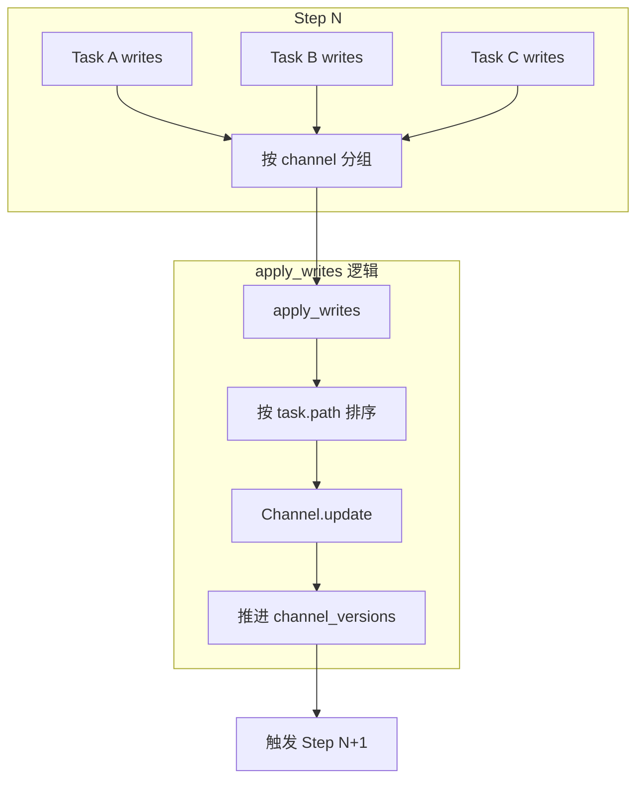
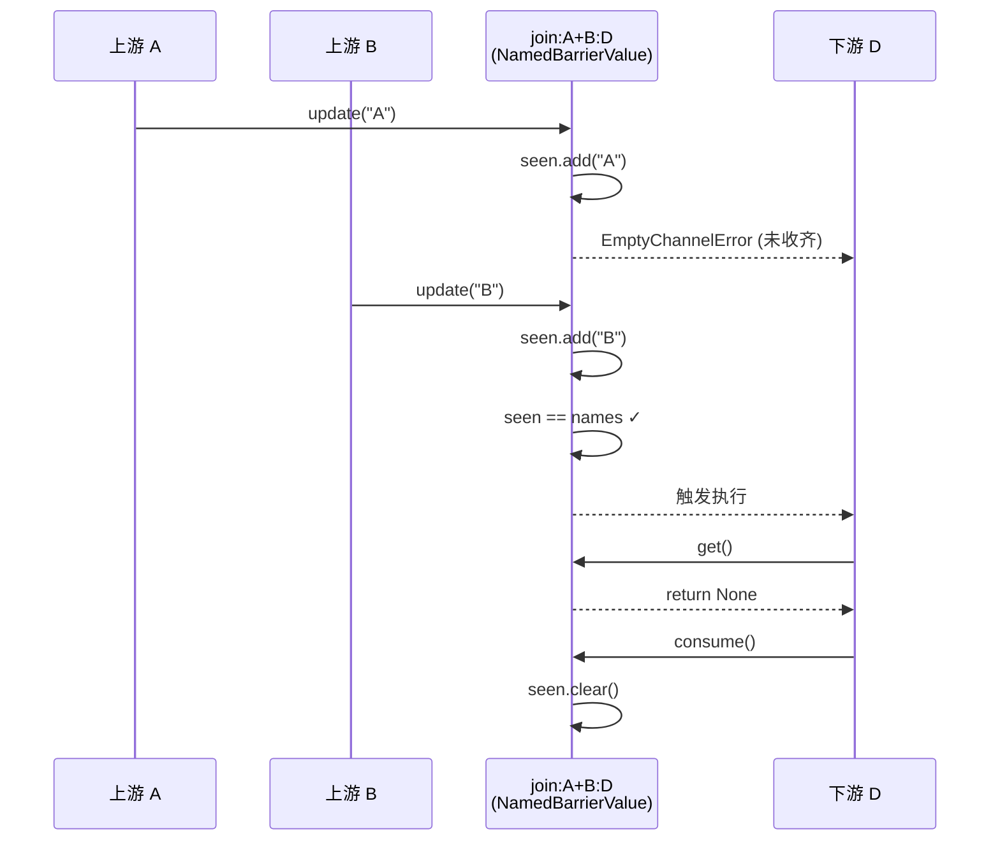

## 背景与动机

上一篇文章分析了 Pregel 的 step 执行模型。在 step 边界,所有写入被统一提交到 Channel。但问题是:
- 同一 step 内多个任务写同一 Channel,如何决定最终值?
- 如何表达"最后一次写入生效"和"所有写入累积"两种不同语义?
- 如何实现 fan-in 等待多个上游完成的屏障同步?

Channel 机制通过类型系统解决这些问题。每种 Channel 类型封装了特定的聚合策略、触发条件和消费语义,把并发写冲突的处理逻辑从业务节点中剥离出来。

## 核心概念

### Channel 三元抽象

Channel 是 `(ValueType, UpdateType, CheckpointType)` 的泛型抽象:

**ValueType**: Channel 内部存储的值类型  
**UpdateType**: Channel 接受的更新类型  
**CheckpointType**: Channel 可序列化的快照类型

这种分离设计支持 "更新类型与存储类型不同" 的场景。例如 Topic 接受单个值更新,但内部存储值序列。

### Step 末统一更新

Pregel 在每个 step 结束时对每个 Channel 调用 `update(values)`。关键语义:
- 所有 Channel 的 update 都会被调用,即使本 step 没有写入(空更新)
- Channel 根据自己的类型决定如何处理并发写入序列
- 更新后推进 `channel_versions`,用于触发判定

### 可见性规则

**默认读**: 读取上一个已提交 step 的 Channel 快照  
实现: `read_channels(channels, select)` 直接读当前 channels

**Fresh Read**: 读取"包含当前任务写入"的临时视图  
实现: 对每个 Channel 执行 `copy().update(task_writes)`,形成 task-local 视图  
用途: Conditional edge 需要基于本节点刚产生的状态进行路由判断

## Channel 类型解析

### LastValue: 单值语义

```python
class LastValue(BaseChannel):
    def update(self, values: Sequence) -> bool:
        if len(values) > 1:
            raise InvalidUpdateError(
                "LastValue channel only accepts one value per step"
            )
        if values:
            self.value = values[0]
            return True
        return False
```

**使用场景**: 配置项、单一决策结果、非聚合状态  
**并发写约束**: 同一 step 最多一个写入,否则抛 `InvalidUpdateError`  
**边界条件**: 空更新保留已有值

### AnyValue: 覆盖语义

```python
class AnyValue(BaseChannel):
    def update(self, values: Sequence) -> bool:
        if values:
            self.value = values[-1]  # 取最后一个
            return True
        else:
            self.value = Empty  # 空更新清空值
            return True
```

**使用场景**: 日志、消息、临时缓存  
**风险**: 空更新会清空已有值,可能导致意外的 EmptyChannelError

### BinaryOperatorAggregate: 聚合语义

```python
class BinaryOperatorAggregate(BaseChannel):
    def __init__(self, typ: Type, operator: Callable[[T, T], T]):
        self.operator = operator  # 二元操作符: add/concat/merge
    
    def update(self, values: Sequence) -> bool:
        regular = [v for v in values if not isinstance(v, Overwrite)]
        overwrites = [v.value for v in values if isinstance(v, Overwrite)]
        
        if len(overwrites) > 1:
            raise InvalidUpdateError(
                "Multiple overwrites in one step"
            )
        
        if overwrites:
            self.value = overwrites[0]
        else:
            for v in regular:
                self.value = self.operator(self.value, v)
        
        return bool(values)
```

**使用场景**: 列表累积、字符串拼接、数值累加  
**Overwrite 语义**: 忽略所有常规更新,直接替换为 Overwrite 值  
**约束**: 每 step 最多一个 Overwrite

**确定性保证**: `apply_writes` 在应用更新前按 `task.path[:3]` 排序,确保聚合顺序确定

### Topic: PubSub 语义

```python
class Topic(BaseChannel):
    def __init__(self, typ: Type, accumulate: bool = False):
        self.accumulate = accumulate
        self.values = []
    
    def update(self, values: Sequence) -> bool:
        if not self.accumulate:
            self.values.clear()  # 非累积模式,每 step 清空
        self.values.extend(values)
        return bool(values)
    
    def consume(self) -> bool:
        was_empty = not self.values
        self.values.clear()
        return not was_empty
```

**使用场景**: Send 派发(TASKS Channel)、事件流  
**accumulate=False**: 每 step 自动清空,再追加新值  
**consume**: 读取后清空,避免重复消费

### NamedBarrierValue: 屏障同步

```python
class NamedBarrierValue(BaseChannel):
    def __init__(self, typ: Type, names: Set[str]):
        self.names = names  # 预期到达的名字集合
        self.seen = set()   # 已到达的名字集合
    
    def update(self, values: Sequence[str]) -> bool:
        for v in values:
            if v not in self.names:
                raise InvalidUpdateError(f"{v} not in expected names")
            self.seen.add(v)
        return bool(values)
    
    def get(self) -> None:
        if self.seen != self.names:
            raise EmptyChannelError("Barrier not released")
        return None  # 屏障释放,返回值固定为 None
    
    def consume(self) -> bool:
        was_complete = (self.seen == self.names)
        self.seen.clear()
        return was_complete
```

**使用场景**: Join 等待多个上游完成、fan-in 聚合点  
**释放条件**: `seen == names`  
**consume 语义**: 读取后重置,准备下一轮屏障

### EphemeralValue: 短期通信

```python
class EphemeralValue(BaseChannel):
    def __init__(self, typ: Type, guard: bool = False):
        self.guard = guard
    
    def update(self, values: Sequence) -> bool:
        if values:
            if self.guard and len(values) > 1:
                raise InvalidUpdateError("Multiple writes with guard=True")
            self.value = values[-1]
        else:
            self.value = Empty  # 空更新清空
        return True
```

**使用场景**: 临时消息传递、step 内有效的触发信号  
**生命周期**: 只保留上一 step 的值,空更新会清空  
**guard=True**: 限制每 step 最多一个写入

### UntrackedValue: 不可回溯

```python
class UntrackedValue(BaseChannel):
    def checkpoint(self):
        return MISSING  # 不进入 checkpoint 快照
```

**使用场景**: 不允许持久化的临时数据、敏感信息  
**风险**: 时间回溯和恢复时无法重建状态

## 数据链路

### 写入汇聚与应用



### Join 屏障流程



## 使用场景

### 场景映射

| 场景 | 推荐 Channel | 理由 |
|:---|:---|:---|
| 配置项/单一决策 | LastValue | 严格的单值约束,防止并发覆盖 |
| 消息列表/历史记录 | BinaryOperatorAggregate(list, add) | 支持列表拼接,保序 |
| 累加计数器 | BinaryOperatorAggregate(int, add) | 支持数值累加 |
| Send 派发 | Topic(accumulate=False) | 每 step 自动清空,适合任务派发 |
| Fan-in 等待 | NamedBarrierValue | 屏障同步,等待多源完成 |
| 临时触发信号 | EphemeralValue | 只在下一 step 有效 |
| 敏感数据 | UntrackedValue | 不持久化 |

### 反模式

**用 AnyValue 做关键状态**: 空更新会清空值,可能导致状态丢失  
**用 LastValue 做累积**: 并发写会抛错,应该用 BinaryOperatorAggregate

**用 Topic(accumulate=True) 做 Send**: 不会自动清空,导致任务重复派发

## 扩展点

### 自定义 Channel

实现 `BaseChannel` 的抽象方法:

```python
class CustomChannel(BaseChannel[Value, Update, Checkpoint]):
    @property
    def ValueType(self) -> Any:
        return Value
    
    @property
    def UpdateType(self) -> Any:
        return Update
    
    def get(self) -> Value:
        # 返回当前值
    
    def update(self, values: Sequence[Update]) -> bool:
        # 处理并发写入,返回是否有更新
        # 这里决定如何聚合/冲突检测
    
    def from_checkpoint(self, checkpoint: Checkpoint) -> Self:
        # 从快照恢复
    
    def checkpoint(self) -> Checkpoint:
        # 返回可序列化快照
```

**关键决策点**: `update` 方法中的并发写处理策略  
**选择**:
- 抛错(LastValue/Ephemeral guard)
- 聚合(BinaryOperatorAggregate)
- 取任意(AnyValue)
- 屏障(NamedBarrierValue)

### ManagedValue

**定位**: 不是 Channel,但可被读取  
**注入位置**: `local_read` 从 `managed[k].get(scratchpad)` 读取  
**用途**: 派生状态、任务私有值,不进入 checkpoint

## 权衡与风险

### LastValue/Ephemeral guard 的硬约束

**收益**: 显式失败,防止隐式覆盖,利于定位并发写冲突  
**代价**: 高并发场景更容易暴露冲突,需要调整图拓扑或改用聚合 Channel

### AnyValue 的空更新清空语义

**问题**: `update([])` 会把已有值清空  
**风险**: 如果用 AnyValue 做触发型输入,空更新可能导致下游误触发  
**建议**: 只用于"覆盖语义明确"的场景,如日志追加

### UntrackedValue 的不可回溯

**问题**: 不进入 checkpoint,时间回溯时丢失  
**适用**: 确实不需要持久化的临时数据  
**禁忌**: 关键状态用 UntrackedValue 会导致恢复后状态不一致

### BinaryOperatorAggregate 的顺序依赖

**问题**: 列表拼接、字符串拼接对顺序敏感  
**保证**: `apply_writes` 按 `task.path` 排序,确保确定性  
**局限**: 顺序仍取决于任务路径,业务层需理解这个排序规则

## Fresh Read 的代价

Conditional edge 使用 `fresh=True` 时,需要:
1. 对每个读取的 Channel 执行 `copy()`
2. Apply 当前任务的写入到副本
3. 返回临时视图

**开销**: 大状态下 copy 和 apply 有明显 CPU/内存压力  
**收益**: 分支判断能看到本节点刚写的状态,避免写后读不一致  
**权衡**: 只在 conditional edge 等必需场景使用 fresh read

## 小结

Channel 机制通过类型系统封装了并发写的处理策略:

**LastValue/Ephemeral guard**: 显式失败,严格约束  
**AnyValue**: 覆盖语义,注意空更新陷阱  
**BinaryOperatorAggregate**: 聚合语义,确定性排序  
**Topic**: PubSub 语义,支持自动清空  
**NamedBarrierValue**: 屏障同步,等待多源完成

选择合适的 Channel 类型是避免并发冲突的关键。下一篇文章 [StateGraph 编译期装配与状态隔离]() 会分析编译期如何把用户声明的控制流(edge/branch/join)编码为内部 Channel,以及如何实现 Global/Private 状态隔离。
