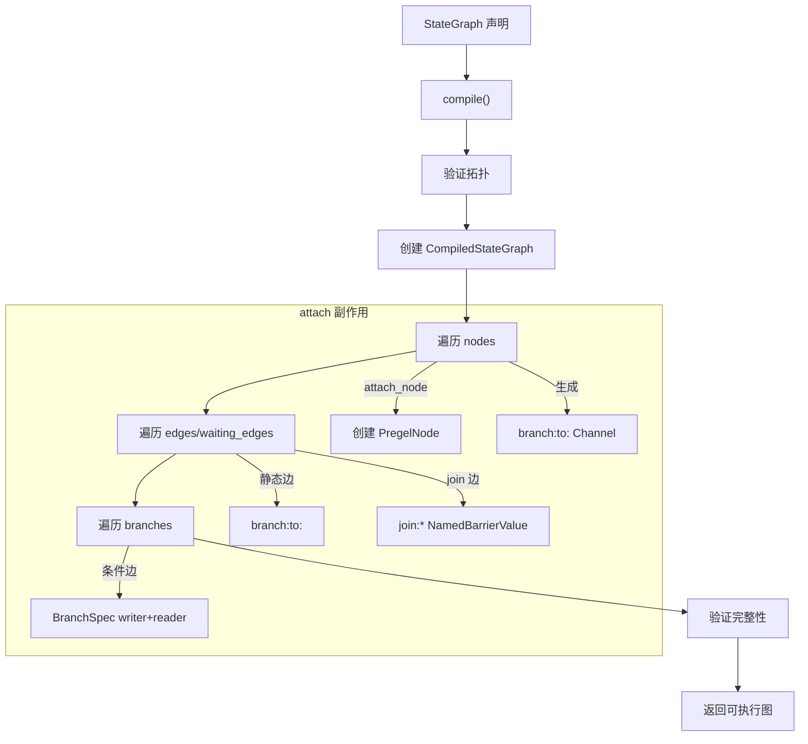
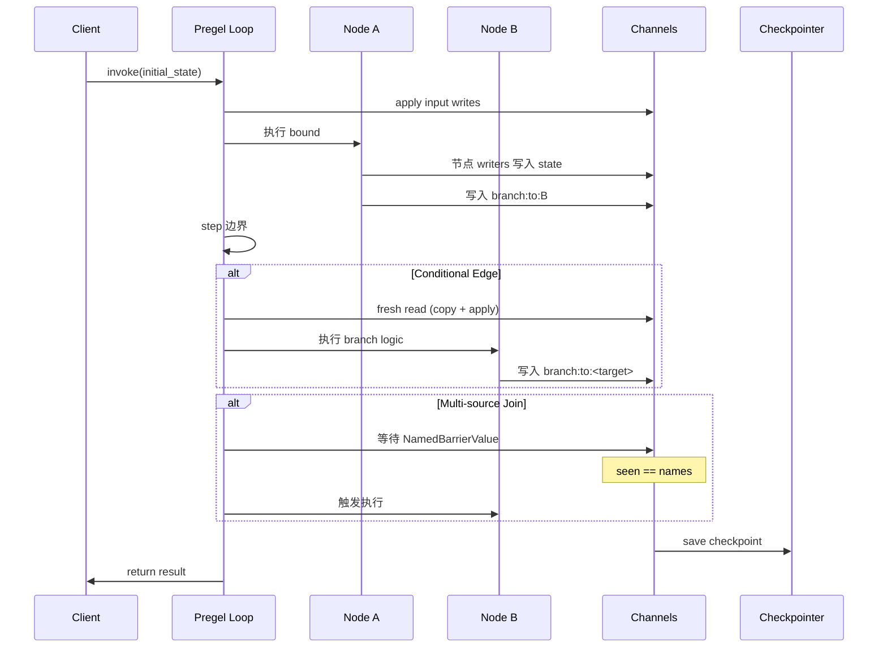

## 背景与动机

前两篇文章分析了执行模型和 Channel 机制。但用户编写 LangGraph 应用时,并不直接操作 Pregel Loop 和 Channel,而是使用 StateGraph 这个 Builder API:

```python
builder = StateGraph(state_schema=State)
builder.add_node("A", node_a)
builder.add_edge("A", "B")
builder.add_conditional_edges("B", route_fn, {"x": "A", "y": END})
compiled = builder.compile(checkpointer=...)
```

这段声明式代码如何转换为可执行的 Pregel 图? 控制流如何被编码? 状态如何隔离? 本文解析编译期的装配过程。

## 核心概念

### StateGraph 是 Builder

`StateGraph` 不能执行,必须 `.compile()` 转换为 `CompiledStateGraph`。编译过程:
1. 验证拓扑(中断节点是否存在、边是否有效)
2. 计算输出 channels 和流输出 channels
3. 创建 `CompiledStateGraph` 实例(继承自 `Pregel`)
4. 遍历节点、边、分支,调用 attach 方法装配
5. 验证完整性,返回可执行图

### CompiledStateGraph 是 Pregel

`CompiledStateGraph` 继承 `Pregel`,拥有执行所需的所有字段:
- `nodes: dict[str, PregelNode]`: 编译后的节点
- `channels: dict[str, BaseChannel]`: 状态 Channel 和控制 Channel
- `checkpointer/store/cache`: 扩展依赖

执行时调用 `invoke/stream`,由 PregelLoop 驱动。

### 控制流编码为内部 Channel

用户声明的控制流被转换为内部 Channel:

**静态边**: `A -> B`  
生成 `branch:to:B` Channel(EphemeralValue)  
A 的 writers 追加写入该 Channel  
B 的 triggers 追加该 Channel

**Join 边**: `A,C -> D`  
生成 `join:A+C:D` Channel(NamedBarrierValue)  
A 写入 `"A"`,C 写入 `"C"`  
D 等待屏障释放后触发

**条件边**: `route_fn(state) -> target`  
生成 branch writer,包含:
- Reader: `ChannelRead.do_read(fresh=True)` 读取最新状态
- Router: 调用 `route_fn` 计算目标
- Writer: 根据目标写入 `branch:to:<target>` 或 `Send`

## 编译流程

### 编译期装配



### attach_node 关键副作用

对每个节点:
1. 创建 `branch:to:<node>` Channel(EphemeralValue)
2. 构造 PregelNode:
   - `channels`: 节点订阅的状态 keys
   - `triggers`: 触发该节点的 Channel 列表
   - `bound`: 节点 runnable(用户函数或子图)
   - `writers`: 写入 state 和控制 Channel 的 writers
3. 注册到 `compiled.nodes[name]`

### attach_edge 控制流编码

**静态边** `start -> end`:

```python
def attach_edge(self, start: str, end: str):
    # 生成控制 Channel 名称
    channel_name = f"branch:to:{end}"
    
    # 追加到 start 的 writers
    self.nodes[start].writers.append(
        ChannelWriteEntry(channel_name, None)
    )
    
    # 追加到 end 的 triggers
    self.nodes[end].triggers.append(channel_name)
```

**Join 边** `starts -> end`:

```python
def attach_edge(self, starts: list[str], end: str):
    # 生成 join Channel 名称
    channel_name = f"join:{'+'.join(starts)}:{end}"
    
    # 注册屏障 Channel
    self.channels[channel_name] = NamedBarrierValue(
        str, 
        names=set(starts)
    )
    
    # 每个 start 写入自己的名字
    for start in starts:
        self.nodes[start].writers.append(
            ChannelWriteEntry(channel_name, start)
        )
    
    # end 等待屏障
    self.nodes[end].triggers.append(channel_name)
```

### attach_branch 条件路由

条件边生成包含 reader 和 writer 的 runnable:

```python
def attach_branch(self, start: str, branch: BranchSpec):
    # 构造 fresh reader
    reader = ChannelRead.do_read(
        select=state_keys,
        fresh=True  # 读取包含本节点写入的视图
    )
    
    # 构造 writer
    def get_writes(dests):
        writes = []
        for dest in dests:
            if isinstance(dest, Send):
                writes.append((TASKS, dest))
            else:
                writes.append((f"branch:to:{dest}", None))
        return writes
    
    # 追加到 start 的 writers
    branch_writer = branch.run(get_writes, reader)
    self.nodes[start].writers.append(branch_writer)
```

## Reducer 编译期降级

StateGraph 的 state_schema 支持 Annotated reducer:

```python
class State(TypedDict):
    messages: Annotated[list, add]  # 累积
    counter: Annotated[int, add]    # 累加
    result: str                     # 单值
```

编译期转换规则:

1. **显式 Channel**: 如果 Annotated 元数据中有 `BaseChannel` 子类,直接使用
2. **Binary Operator**: 如果元数据最后一个是可调用且签名为 `(a, b) -> c`,生成 `BinaryOperatorAggregate`
3. **Fallback**: 默认使用 `LastValue`

```python
def _get_channel(annotation):
    if is_field_channel(annotation):
        # 情况 1: 显式 Channel
        return extract_channel(annotation)
    
    if is_field_binop(annotation):
        # 情况 2: Binary operator
        op = extract_operator(annotation)
        return BinaryOperatorAggregate(typ, op)
    
    # 情况 3: Fallback
    return LastValue(typ)
```

这意味着 "reducer 聚合" 不是运行时动态分派,而是编译期把 state key 映射到确定的 Channel 类型。

## 状态隔离

### Global 状态

**Channels**: 所有 state keys、控制 Channel(`branch:to:*`/`join:*`)都在同一 Channel 表  
**可见性**: 受 step 提交和 checkpoint 管控  
**持久化**: 进入 checkpoint 快照(除非是 UntrackedValue)

### Private 状态

**Task-local Config**: 每个任务有独立的 config,包含:
- `CONFIG_KEY_TASK_ID`: 任务唯一 ID
- `CONFIG_KEY_CHECKPOINT_NS`: 命名空间(含 task_id)
- `CONFIG_KEY_SEND`: 写入回调
- `CONFIG_KEY_READ`: 读取回调
- `CONFIG_KEY_RUNTIME`: Runtime 实例(context/store/stream_writer)
- `CONFIG_KEY_SCRATCHPAD`: Scratchpad(step/resume/counters)

**ManagedValue**: 从 scratchpad 派生,不进入 channels  
读取位置: `local_read` 检查 `managed` 映射,调用 `get(scratchpad)`  
用途: 任务私有值、派生状态

**Namespace 隔离**:

```python
# 任务级 namespace
task_checkpoint_ns = f"{checkpoint_ns}{NS_END}{task_id}"

# 子图可以在相同 thread_id 下隔离状态
# 通过 namespace 层次区分父子图
```

`recast_checkpoint_ns` 去除 task_id,用于比较和定位:

```python
def recast_checkpoint_ns(ns: str) -> str:
    # "parent:123|child:456" -> "parent|child"
    return NS_SEP.join(
        part.split(NS_END)[0] 
        for part in ns.split(NS_SEP)
    )
```

## 使用场景

### 编译期注入扩展

```python
compiled = StateGraph(State).compile(
    checkpointer=MyCheckpointSaver(),
    store=MyStore(),
    cache=MyCache(),
    interrupt_before=["human_feedback"],
    interrupt_after=["planner"]
)
```

这些扩展在编译期注入到 `CompiledStateGraph` 字段,运行时通过 `_defaults` 选择和传递给 Loop。

### 子图复用

子图也是 `CompiledStateGraph`,可以作为节点嵌入:

```python
subgraph = StateGraph(SubState).compile()
builder.add_node("sub", subgraph)
```

子图在父图的 task config 中获得独立的 checkpoint_ns,状态完全隔离。

## 扩展点

### 自定义 ManagedValue

实现 `ManagedValueSpec`:

```python
class CustomManaged(ManagedValueSpec):
    def get(self, scratchpad: PregelScratchpad) -> Any:
        # 从 scratchpad 派生值
        return derived_value
```

注册到 compiled graph 的 `managed` 字段,可被 `local_read` 读取。

### 自定义状态 Channel

在 state_schema 的 Annotated 中显式指定:

```python
class State(TypedDict):
    custom: Annotated[Value, CustomChannel(typ, ...)]
```

编译期会提取并使用自定义 Channel。

## 权衡与风险

### 控制流 Channel 化

**收益**: 执行内核只理解 "Channel 触发",无需理解用户级 edge 语义  
**代价**: 内部 Channel 命名复杂,迁移逻辑复杂(`_migrate_checkpoint`)

### Fresh Read 的开销

**问题**: Conditional edge 求值时 copy channels 并 apply task writes  
**适用**: 分支判断需要看到本节点刚写的状态  
**优化**: 只在必需场景使用 fresh=True

### Reducer 的确定性

**问题**: Reducer 应用顺序受 task.path 排序影响  
**保证**: `apply_writes` 按 `task.path[:3]` 排序,确保确定性  
**局限**: 顺序敏感的 reducer(列表拼接)仍需业务层理解排序规则

### Namespace 复杂度

**问题**: 为隔离子图/任务,ns 中携带 task_id,引入 recast/migrate/父子映射等机制  
**收益**: 可追溯性和可调试性  
**代价**: 复杂度税

## 运行期时序



## 小结

StateGraph 编译装配的核心机制:

**控制流编码**: edge/join/branch 转换为内部 Channel,执行内核统一处理  
**Reducer 降级**: 编译期把 Annotated reducer 映射到 Channel 类型  
**状态隔离**: Global channels 共享,Private config/managed/namespace 隔离

理解编译期装配是理解运行期行为的前提。下一篇文章 [条件边与扇入扇出]() 会深入解析 fresh read、Send 派发和屏障同步的完整语义。
