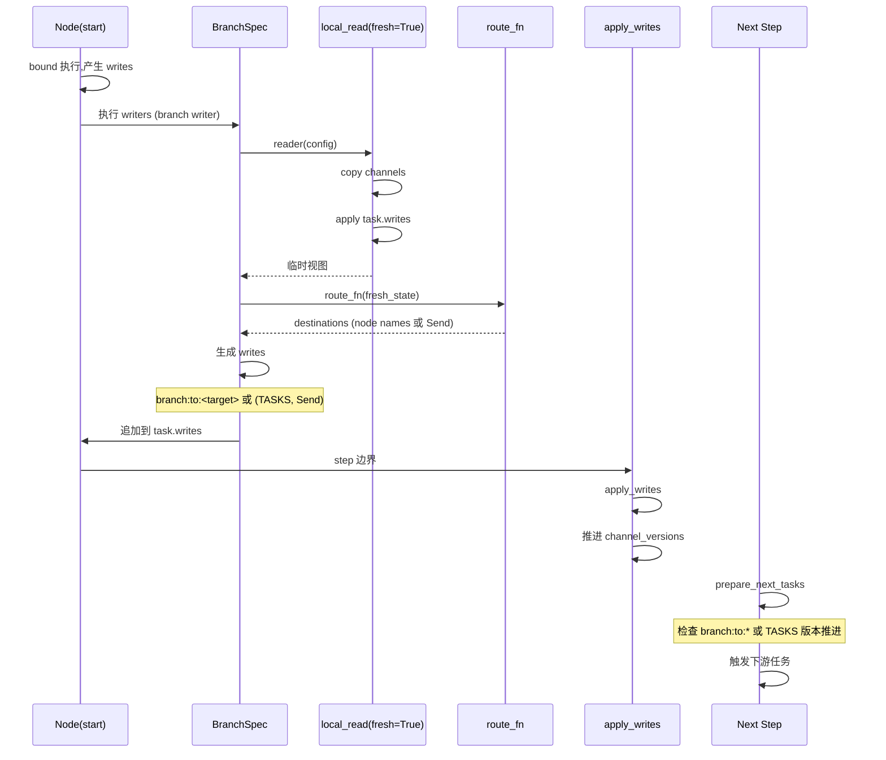
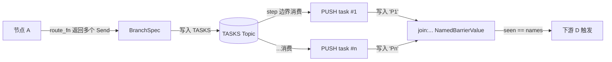

## 背景与动机

前文分析了 StateGraph 如何把控制流编码为内部 Channel。但实际应用中,我们需要更复杂的控制流模式:

- **动态路由**: 根据运行态状态决定下一步执行哪个节点
- **并行展开**: 一个节点把工作拆成多个并行子任务
- **结果聚合**: 多个并行任务完成后再触发下游

本文解析 conditional edge、fan-out、fan-in 的实现机制,以及它们如何组合构成 MapReduce 模式。

## 核心概念

### Conditional Edge 是 Writer

Conditional edge 在编译期被追加到 start 节点的 writers,**在节点逻辑执行完成后**触发。

关键时点:
1. Node bound 执行,产生 writes
2. Node writers 执行(包含 conditional edge)
3. Writers 写入 task.writes
4. Step 结束,apply_writes 统一提交
5. 下一 step 根据 `branch:to:*` 或 `TASKS` 的版本推进触发下游

### Fresh Read 语义

Conditional edge 需要基于 "包含本节点刚写的状态" 进行路由判断。这通过 `fresh=True` 实现:

```python
reader = ChannelRead.do_read(
    select=state_keys,
    fresh=True  # 读取 task-local 视图
)
```

`local_read(fresh=True)` 的行为:
1. 对每个读取的 Channel 执行 `copy()`
2. Apply 当前任务的 writes 到副本
3. 返回临时视图

**代价**: 大状态下 copy 和 apply 有明显开销  
**收益**: 避免写后读不一致

### Branch 写入形式

Branch writer 根据路由结果生成写入:

**目标是节点名**: 写入 `branch:to:<target>`  
下一 step,target 节点检查该 Channel 版本推进,触发执行

**目标是 Send**: 写入 `TASKS` Channel  
下一 step,`prepare_next_tasks` 消费 TASKS,为每个 Send 创建 PUSH task

### Join 是 NamedBarrier

多个上游完成后触发下游,通过 `NamedBarrierValue` 实现:

```python
# 编译期生成
channel_name = f"join:A+B:D"
self.channels[channel_name] = NamedBarrierValue(
    str, 
    names={"A", "B"}
)

# 运行期写入
A.writers.append((channel_name, "A"))
B.writers.append((channel_name, "B"))

# 屏障释放条件
barrier.seen == barrier.names  # {"A", "B"}
```

## 数据链路

### Conditional Edge 完整流程



### Fan-out / Fan-in 流程



## Conditional Edge 实现

### BranchSpec 结构

```python
class BranchSpec:
    def __init__(
        self,
        path: Runnable,  # 路由函数
        ends: dict[str, str]  # path_map: route_key -> node_name
    ):
        self.path = path
        self.ends = ends
    
    def run(self, writer_fn, reader):
        """返回一个 runnable,注册为 writer"""
        def route_and_write(input, config):
            # 1. 读取最新状态
            fresh_state = reader(config)
            
            # 2. 计算路由
            result = self.path.invoke(fresh_state, config)
            
            # 3. 映射到目标
            dests = self._map_result(result)
            
            # 4. 生成写入
            writes = writer_fn(dests)
            
            # 5. 执行写入
            ChannelWrite.do_write(config, writes)
        
        return RunnableCallable(route_and_write)
```

### Writer 函数

```python
def get_writes(dests):
    writes = []
    for dest in dests:
        if isinstance(dest, Send):
            # Fan-out: 写入 TASKS
            writes.append((TASKS, dest))
        elif dest != END:
            # 普通路由: 写入 branch:to:*
            writes.append((f"branch:to:{dest}", None))
    return writes
```

## Fan-out 派发机制

### Send 结构

```python
@dataclass
class Send:
    node: str      # 目标节点名
    arg: Any       # 传递的数据
```

### TASKS Channel 消费

```python
def prepare_next_tasks(...):
    # 1. 消费 TASKS Channel
    if TASKS in channels:
        sends = channels[TASKS].consume()
        
        # 2. 为每个 Send 创建 PUSH task
        for idx, send in enumerate(sends):
            task = prepare_single_task(
                proc=nodes[send.node],
                input=send.arg,
                task_type=PUSH,
                task_id=(PUSH, idx)
            )
            tasks[task.id] = task
    
    # 3. 规划 PULL tasks (基于触发)
    for node in candidate_nodes:
        if should_trigger(node):
            task = prepare_single_task(
                proc=node,
                task_type=PULL
            )
            tasks[task.id] = task
```

## Fan-in 屏障同步

### NamedBarrierValue 完整语义

```python
class NamedBarrierValue(BaseChannel):
    def __init__(self, typ: Type, names: Set[str]):
        self.names = names  # 预期到达的名字集合
        self.seen = set()   # 已到达的名字集合
    
    def update(self, values: Sequence[str]) -> bool:
        for v in values:
            if v not in self.names:
                raise InvalidUpdateError(
                    f"Unexpected name: {v}"
                )
            self.seen.add(v)
        return bool(values)
    
    def get(self) -> None:
        if self.seen != self.names:
            raise EmptyChannelError("Barrier not released")
        return None  # 屏障释放,值固定为 None
    
    def consume(self) -> bool:
        was_complete = (self.seen == self.names)
        self.seen.clear()  # 重置,准备下一轮
        return was_complete
```

### 触发判定

```python
def should_trigger(node):
    # 检查 node.triggers 中的 Channel 版本是否推进
    for channel in node.triggers:
        if channel.startswith("join:"):
            # Join channel: 必须屏障释放
            if channels[channel].get() is None:
                triggered = True
        else:
            # 普通 channel: 版本推进即触发
            if versions_seen[channel] < channel_versions[channel]:
                triggered = True
```

## MapReduce 模式

### 完整语义

LangGraph 不提供专门的 MapReduce 类,而是通过组合实现:

**Map 阶段**: Conditional edge 返回多个 Send  
**Reduce 阶段**: 聚合 Channel(BinaryOperatorAggregate) + Join 屏障

```python
# 1. Map: 节点 A 派发多个任务
def route_fn(state):
    items = state["items"]
    return [Send("process", item) for item in items]

builder.add_conditional_edges("A", route_fn)

# 2. Reduce: 多个 process 任务写入聚合 Channel
class State(TypedDict):
    results: Annotated[list, add]  # BinaryOperatorAggregate

# 3. Join: 等待所有 process 完成
builder.add_edge(["process"], "summary")  # 隐式 join
```

### Reduce 确定性

`apply_writes` 在应用更新前按 `task.path[:3]` 排序:

```python
def apply_writes(tasks):
    # 1. 按 task path 排序
    sorted_tasks = sorted(tasks, key=lambda t: t.path[:3])
    
    # 2. 按顺序应用写入
    for task in sorted_tasks:
        for channel, value in task.writes:
            channels[channel].update([value])
```

**效果**: 把并发完成的不确定性转化为确定的应用顺序  
**局限**: 列表拼接等顺序敏感操作仍受 task.path 影响

## 使用场景

### 场景映射

| 场景 | 实现模式 | 关键机制 |
|:---|:---|:---|
| 动态路由 | Conditional edge 返回节点名 | Fresh read + branch:to:* |
| 并行处理 | Conditional edge 返回多个 Send | TASKS Topic 消费 |
| 结果聚合 | 聚合 Channel + Join 屏障 | BinaryOperatorAggregate + NamedBarrierValue |
| MapReduce | 组合上述三者 | Send + 聚合 + Join |

### 典型案例

**客服路由**:

```python
def route_intent(state):
    intent = classify(state["query"])
    return {
        "faq": "faq_handler",
        "complaint": "complaint_handler",
        "other": "human_agent"
    }[intent]
```

**并行检索**:

```python
def route_search(state):
    query = state["query"]
    return [
        Send("search_docs", query),
        Send("search_code", query),
        Send("search_web", query)
    ]
```

**聚合分析**:

```python
class State(TypedDict):
    results: Annotated[list, add]

# 多个 search 节点写入 results
# summary 节点等待 join,读取 results
```

## 扩展点

### 自定义路由逻辑

BranchSpec.path 可以是任意 runnable:

```python
# 简单函数
def route_fn(state):
    return "next_node"

# RunnableLambda
route = RunnableLambda(lambda s: compute_target(s))

# RunnableSequence (组合多个 runnable)
route = preprocess | classify | map_to_target
```

### Defer Join

当 end 节点需要等待"所有上游完成 + finish 信号"时:

```python
builder.add_edge(["A", "B"], "D", defer=True)

# 生成 NamedBarrierValueAfterFinish
# 必须 seen == names 且 finish() 被调用
```

**用途**: 确保所有副作用(外部 API 调用等)完成后再触发下游

## 权衡与风险

### Fresh Read 的开销

**问题**: Copy channels 并 apply task writes  
**量化**: 大状态(MB 级)下可能增加 10-100ms 延迟  
**适用**: 只在路由判断依赖本节点写入时使用

### Join 的写入约束

**问题**: 写入值必须属于 `names`,否则抛 `InvalidUpdateError`  
**收益**: 早失败,利于定位错误  
**代价**: 运行期硬中断

### MapReduce 抽象缺失

**问题**: 没有专门的 MapReduce 类/协议  
**原因**: LangGraph 选择组合而非抽象  
**影响**: 需要用户理解底层机制(Send + 聚合 + Join)

### Reduce 顺序依赖

**问题**: 列表拼接对顺序敏感  
**保证**: 按 task.path 排序  
**局限**: 业务层需理解排序规则,避免依赖并发完成顺序

## 生效时点澄清

Conditional edge 的路由决策在 **step N 的节点执行末尾** 完成,但写入要等 **step N 的 apply_writes** 才推进版本,从而触发 **step N+1** 的任务。

证据链:
1. Branch 是 writer,追加到节点 writers
2. Writers 写入 task.writes
3. `after_tick` 调用 `apply_writes` 统一提交
4. `prepare_next_tasks` 根据版本推进触发下游

## 小结

Conditional edge、fan-out、fan-in 的核心机制:

**Conditional Edge**: Writer + Fresh Read,在节点后执行  
**Fan-out**: Send -> TASKS Topic -> PUSH tasks  
**Fan-in**: NamedBarrierValue 屏障同步,等待多源完成  
**MapReduce**: 组合上述三者,确定性排序保证 reduce 顺序

理解这些控制流模式是构建复杂 Agent 工作流的基础。下一篇文章 [并发与异步调度]() 会分析 Runner/Executor 的调度机制和异常传播路径。
