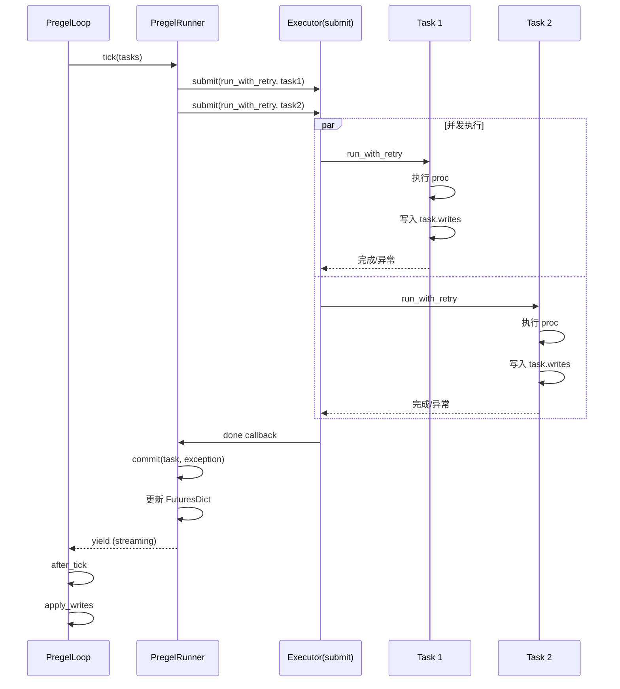

## 背景与动机

前文分析了 step 模型和控制流。在单个 step 内,LangGraph 支持多个节点并发执行:

- 多个 PULL 任务基于触发条件并发执行
- 多个 PUSH 任务(Send 派发)并发处理
- 任务间彼此独立,写入互不可见

这些并发任务如何调度? 异常如何传播? 背压如何控制? 本文解析 Runner/Executor 的并发机制。

## 核心概念

### 并发边界

**Step 内并发**: 同一 step 的多个任务并发执行  
**Step 间串行**: step 推进由 Loop 串行控制

关键约束: "每个任务独立于所有其他并发任务"(注释明确)

### Runner 职责

`PregelRunner` 负责:
1. 提交任务到 Executor
2. 追踪 Future->Task 映射
3. 在任务完成时调用 commit
4. 多次 yield 把控制权交回 Loop(用于 streaming/debug)

**不负责**: 任务执行、线程/协程管理(由 Executor 处理)

### Executor 职责

`BackgroundExecutor`(sync) 和 `AsyncBackgroundExecutor`(async) 负责:
1. 管理线程池或事件循环
2. 提交任务并返回 Future
3. 退出时 cancel 未开始任务(可选)
4. 收集异常并 re-raise(可选)

### Task 独立性

任务执行期间看到的是 "上一个已提交 step" 的 Channel 快照:
- 任务 A 的写入对任务 B 不可见
- 写入累积在 task.writes,step 边界统一提交
- 并发写冲突由 Channel.update 处理

## 数据链路

### 并发提交与收敛



### Runner.tick 核心逻辑

```python
def tick(self, tasks, schedule_task, retry_policy):
    # 1. 创建 FuturesDict (Future -> Task 映射)
    futures = FuturesDict()
    
    # 2. 提交所有任务
    with self.executor as submit:
        for task in tasks:
            fut = submit(
                run_with_retry,
                task,
                retry_policy,
                __cancel_on_exit__=True
            )
            futures[fut] = task
    
    # 3. 等待完成
    while futures:
        done = wait_any(futures)  # FIRST_COMPLETED
        for fut in done:
            task = futures.pop(fut)
            exc = fut.exception()
            
            # 4. Commit
            self.commit(task, exc)
            
            # 5. Yield (让调度器输出 updates/debug)
            yield
```

### Executor 提交与退出

**Sync Executor**:

```python
class BackgroundExecutor:
    def __init__(self, config):
        self.executor = get_executor_for_config(config)
        self.tasks = []
    
    def submit(self, fn, *args, __cancel_on_exit__=False, **kwargs):
        future = self.executor.submit(fn, *args, **kwargs)
        self.tasks.append((future, __cancel_on_exit__))
        return future
    
    def __exit__(self):
        # 1. Cancel 未开始任务 (如果标记)
        for fut, cancel in self.tasks:
            if cancel and not fut.done():
                fut.cancel()
        
        # 2. 等待全部完成
        wait(self.tasks)
        
        # 3. Re-raise 第一个异常 (如果标记)
        for fut, reraise in self.tasks:
            if reraise and fut.exception():
                raise fut.exception()
```

**Async Executor**:

```python
class AsyncBackgroundExecutor:
    def __init__(self, max_concurrency=None):
        self.tasks = []
        self.semaphore = asyncio.Semaphore(max_concurrency) \
            if max_concurrency else None
    
    async def submit(self, fn, *args, __cancel_on_exit__=False):
        if self.semaphore:
            await self.semaphore.acquire()
        
        async def wrapped():
            try:
                return await fn(*args)
            finally:
                if self.semaphore:
                    self.semaphore.release()
        
        task = asyncio.create_task(wrapped())
        self.tasks.append((task, __cancel_on_exit__))
        return task
    
    async def __aexit__(self):
        # 1. Cancel 未完成任务 (如果标记)
        for task, cancel in self.tasks:
            if cancel and not task.done():
                task.cancel()
        
        # 2. 等待全部完成
        await asyncio.gather(*self.tasks, return_exceptions=True)
        
        # 3. Re-raise 第一个非 CancelledError 异常
        for task, reraise in self.tasks:
            if reraise and task.exception():
                if not isinstance(task.exception(), asyncio.CancelledError):
                    raise task.exception()
```

## 异常传播

### GraphBubbleUp 特殊处理

`GraphInterrupt` 和 `ParentCommand` 继承 `GraphBubbleUp`,被视为控制信号而非错误:

**Retry 层**:

```python
def run_with_retry(task, retry_policy):
    for attempt in range(max_retries):
        try:
            return task.proc.invoke(input, config)
        except GraphBubbleUp:
            raise  # 不 retry,直接向上冒泡
        except Exception as e:
            if attempt < max_retries - 1:
                task.writes.clear()  # 清空写入
                config[RESUMING] = True  # 标记重试
                continue
            raise
```

**Executor 层**:

```python
def __exit__(self):
    for fut in self.tasks:
        exc = fut.exception()
        if exc and not isinstance(exc, GraphBubbleUp):
            # 只 re-raise 非控制信号的异常
            raise exc
```

**Runner 层**:

```python
def commit(self, task, exception):
    if isinstance(exception, GraphInterrupt):
        # 收集所有 GraphInterrupt
        self.interrupts.append(exception)
    else:
        # 其他异常记录到 checkpoint_pending_writes
        self.checkpoint_pending_writes.append(
            (task.id, ERROR, exception)
        )

# tick 结束时
if self.interrupts:
    # 聚合所有中断
    raise GraphInterrupt(tuple(self.interrupts))
```

### 普通异常处理

普通异常被记录到 `checkpoint_pending_writes`,不中断 step 执行:

```python
# 任务 A 抛异常
task_a.exception = ValueError("error")

# Runner commit
checkpoint_pending_writes.append((task_a.id, ERROR, exception))

# 其他任务继续执行
task_b.run()
task_c.run()

# Step 结束,checkpoint 保存
checkpoint.pending_writes = checkpoint_pending_writes
```

恢复时可以检查 pending_writes 中的 ERROR,决定如何处理。

## 并发控制

### is_nested 与 skip_done_tasks

`PregelLoop.__init__` 初始化两个关键开关:

**is_nested**: 当前 loop 是否运行在子图上下文

```python
self.is_nested = CONFIG_KEY_TASK_ID in config.get(CONF, {})

# 如果不是 nested 且 config 带了 checkpoint_ns
# Loop 会重置为根图语义 (checkpoint_ns="" 且 checkpoint_id=None)
```

**skip_done_tasks**: 是否允许回放 pending_writes

```python
self.skip_done_tasks = CONFIG_KEY_CHECKPOINT_ID not in config[CONF]

# 恢复窗口: 第一次 tick 时回灌 pending_writes
if not skip_done_tasks and checkpoint_pending_writes:
    _match_writes(self.tasks)

# 第一次 tick 后强制开启
self.skip_done_tasks = True
```

**设计动机**: 恢复时需要把 checkpoint 中保存的中间写入回灌到 tasks,避免状态不一致。但回灌只能在第一次 tick 的窗口执行。

### 并发度控制

**Async**: 通过 `config["max_concurrency"]` 设置 semaphore

```python
executor = AsyncBackgroundExecutor(
    max_concurrency=config.get("max_concurrency")
)
```

**Sync**: 依赖 `get_executor_for_config(config)` 返回的线程池

默认线程池大小由上游配置决定,无内置限制。

## 使用场景

### I/O 密集型任务

**适用**: 并发 API 调用、数据库查询、文件读写  
**模式**: Sync Executor + 线程池  
**性能**: 线程切换开销小,适合等待 I/O

### CPU 密集型任务

**问题**: 线程池受 GIL 限制,无法利用多核  
**替代**: 多进程 Executor(需自定义)  
**权衡**: 进程通信开销大,状态序列化复杂

### Async I/O

**适用**: 大量并发 HTTP 请求、WebSocket 连接  
**模式**: Async Executor + asyncio  
**性能**: 单线程事件循环,无切换开销

## 扩展点

### 自定义 Executor

实现 submit 和 context manager 协议:

```python
class CustomExecutor:
    def submit(self, fn, *args, **kwargs):
        # 提交任务,返回 Future-like 对象
        return future
    
    def __enter__(self):
        return self.submit
    
    def __exit__(self, *args):
        # 清理资源、等待完成、re-raise 异常
        pass
```

注入方式: 通过 `config` 传递给 Loop。

### Retry 策略

```python
class RetryPolicy:
    max_retries: int = 3
    retry_on: tuple[type, ...] = (Exception,)
    backoff: Callable[[int], float] = lambda n: 2 ** n
```

注入位置: 任务级或 Loop 级

```python
task.retry_policy = RetryPolicy(max_retries=5)
# 或
loop.retry_policy = RetryPolicy(...)
```

### Schedule Task

Runner.tick 接受 `schedule_task` 回调:

```python
def accept_push(task):
    # 动态生成的 PUSH task
    loop.tasks[task.id] = task

runner.tick(tasks, schedule_task=loop.accept_push)
```

**用途**: 任务执行期间生成新任务(如 Send 派发)

## 权衡与风险

### 并发写冲突

**问题**: 并发任务写同一 Channel  
**处理**: 由 Channel.update 决定(抛错/聚合/取任意)  
**建议**: 选对 Channel 类型,或调整图拓扑避免并发写

### 资源与背压

**Async**: Semaphore 提供显式背压  
**Sync**: 线程池队列提供隐式背压  
**风险**: 无限制并发可能耗尽内存或连接

### 乱序与确定性

**问题**: 并发完成顺序不确定  
**保证**: `apply_writes` 按 task.path 排序应用更新  
**局限**: 只保证应用顺序确定,不保证执行顺序确定

### 异常传播复杂度

**GraphBubbleUp**: 不 retry,直接冒泡,聚合后统一 raise  
**普通异常**: 记录到 pending_writes,不中断 step  
**权衡**: 复杂度换灵活性,但增加调试难度

## Sync/Async 语义一致性

两种模式的执行语义完全一致:
- Step 边界相同
- 触发判定相同
- Channel 更新相同

唯一差异:
- Sync: 线程池并发
- Async: 事件循环并发

## 小结

LangGraph 并发调度的核心机制:

**Runner**: 提交任务、追踪完成、commit 写入  
**Executor**: 管理线程池/事件循环、控制并发度  
**异常传播**: GraphBubbleUp 特殊处理,普通异常记录  
**确定性**: apply_writes 排序保证应用顺序确定

理解并发调度是优化性能和排查并发问题的基础。下一篇文章 [Checkpoint 与时间回溯]() 会分析状态持久化和恢复的完整语义。
