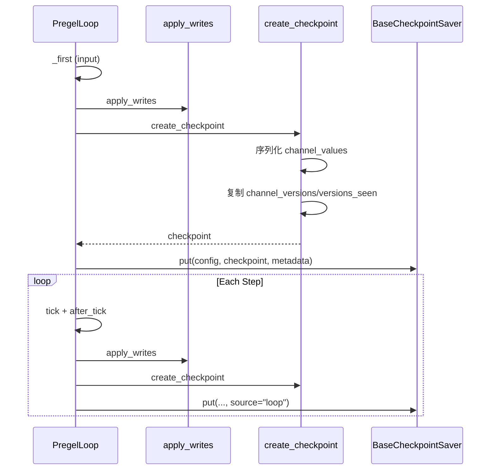
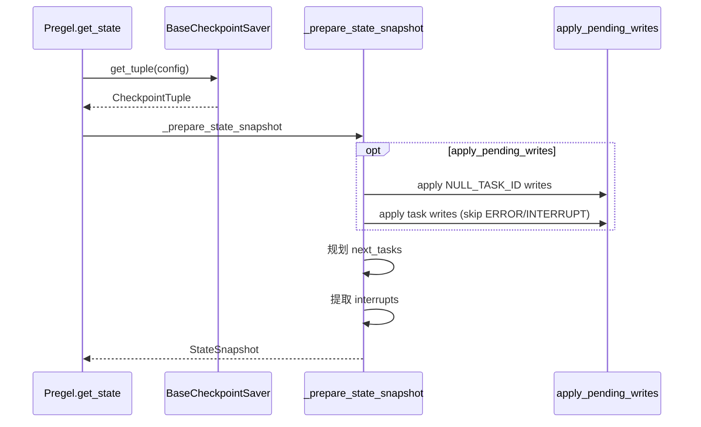

## 背景与动机

前文分析了执行模型和并发调度。但在实际应用中,我们需要:

- **跨会话记忆**: 多轮对话中维持用户会话状态
- **时间回溯**: 回看任意历史 step 的状态快照和任务信息
- **中断恢复**: 暂停后从断点继续执行
- **外部状态注入**: 人工修改状态后重新执行

这些能力都依赖 Checkpoint 机制。本文解析 Checkpoint 的设计原理和工程实践。

## 核心概念

### Checkpoint 是快照 + 元信息

Checkpoint 不仅保存状态值,还保存触发元信息:

**channel_values**: Channels 的序列化快照  
**channel_versions**: 单调版本号,用于触发判定  
**versions_seen**: 每个节点已看到的版本,用于判定下一 step 是否触发

这种设计使得 Checkpoint 不仅能恢复状态,还能精确重现触发条件。

### CheckpointTuple 是完整上下文

```python
@dataclass
class CheckpointTuple:
    config: RunnableConfig          # 配置(含 thread_id/checkpoint_id)
    checkpoint: Checkpoint          # 状态快照
    metadata: CheckpointMetadata    # 元信息(source/step/parents)
    parent_config: RunnableConfig   # 父配置(用于嵌套)
    pending_writes: list[PendingWrite]  # 中间写入
```

**pending_writes** 是关键: 保存"与 checkpoint 关联的中间写入",恢复时回灌到 channels,避免状态不一致。

### Time Travel 就是 Checkpoint 遍历

Time travel 不是额外的时间机器模块,而是:
1. 调用 `checkpointer.list(config, before, limit)` 获取历史 checkpoint
2. 对每个 checkpoint 调用 `_prepare_state_snapshot` 转换为 `StateSnapshot`
3. 返回生成器,供用户遍历

## 数据结构

### Checkpoint

```python
@dataclass
class Checkpoint:
    v: int = 1  # 版本号
    id: str     # 唯一 ID (单调递增,可排序)
    ts: str     # ISO 8601 时间戳
    
    channel_values: dict[str, Any]      # Channel 快照
    channel_versions: dict[str, int]    # 版本号
    versions_seen: dict[str, dict[str, int]]  # node -> {channel: version}
    
    updated_channels: list[str] = None  # 本 checkpoint 更新的 channels
```

**关键语义**:
- `id` 单调递增,可排序
- `channel_versions` 单调递增,用于触发判定
- `versions_seen[node][channel]` 记录节点上次看到的版本

### CheckpointMetadata

```python
@dataclass
class CheckpointMetadata:
    source: Literal["input", "loop", "update", "fork"]
    step: int  # input=-1, loop 从 0 开始
    parents: dict[str, str] = {}  # namespace -> checkpoint_id
```

**source 语义**:
- **input**: 输入阶段保存
- **loop**: step 结束保存
- **update**: 外部状态注入
- **fork**: 分支执行(如并行 invocation)

### Namespace 结构

```python
# 常量
NS_SEP = "|"  # 层级分隔
NS_END = ":"  # namespace 与 task_id 分隔

# 结构: "graph_name:task_id|subgraph_name:task_id|..."
checkpoint_ns = "parent:123|child:456"

# Recast (去除 task_id,用于比较)
recast_checkpoint_ns("parent:123|child:456")
# -> "parent|child"
```

**设计动机**: 隔离子图/任务状态,同时保持层次化可追溯。

## 数据链路

### 保存流程



### 读取与恢复流程



### Pending Writes 回灌机制

```python
def _prepare_state_snapshot(config, saved, apply_pending_writes=False):
    checkpoint = saved.checkpoint
    pending_writes = saved.pending_writes
    
    if apply_pending_writes:
        # 1. Apply NULL_TASK_ID writes (输入/更新产生)
        for task_id, channel, value in pending_writes:
            if task_id == NULL_TASK_ID:
                channels[channel].update([value])
        
        # 2. 规划 next_tasks
        tasks = prepare_next_tasks(
            checkpoint=checkpoint,
            pending_writes=pending_writes,
            ...
        )
        
        # 3. Apply task writes (skip ERROR/INTERRUPT)
        for task in tasks:
            for task_id, channel, value in pending_writes:
                if task_id == task.id and channel not in [ERROR, INTERRUPT]:
                    task.writes.append((channel, value))
        
        apply_writes(checkpoint, channels, tasks)
```

**关键**: 恢复时需要回灌 pending_writes,否则会丢失中间写入。

## Checkpoint 保存时机

### Input 阶段

```python
def _first(self, input):
    # 1. 把 input 映射成 writes
    writes = map_input(input)
    
    # 2. Apply writes
    apply_writes(self.checkpoint, self.channels, writes)
    
    # 3. 保存 checkpoint
    self._put_checkpoint({"source": "input", "step": -1})
```

### Loop 阶段

```python
def after_tick(self):
    # 1. Apply writes
    self.updated_channels = apply_writes(
        self.checkpoint,
        self.channels,
        self.tasks.values()
    )
    
    # 2. 保存 checkpoint
    self._put_checkpoint({"source": "loop", "step": self.step})
```

### Durability 模式

`stream/astream` 的 `durability` 参数控制何时真正保存:

**sync**: 每个 checkpoint 立即保存,等待完成  
**async**: 每个 checkpoint 异步保存,不等待  
**exit**: 只在退出时保存

```python
def _put_checkpoint(self, metadata):
    do_checkpoint = (
        self.checkpointer 
        and (self.exiting or self.durability != "exit")
    )
    
    if do_checkpoint:
        checkpoint = create_checkpoint(
            self.checkpoint,
            self.channels if not self.exiting else None,  # 退出时不刷新 values
            self.step
        )
        
        # 异步串行保存 (等待上一个完成)
        self._put_checkpoint_fut = self._checkpointer_put_after_previous(
            checkpoint,
            metadata
        )
```

**异步串行**: `_checkpointer_put_after_previous` 等待上一个 checkpoint 保存完成,确保 checkpointer 收到的 checkpoints 有序。

## Time Travel 实现

### 读取当前状态

```python
def get_state(self, config, subgraphs=False):
    checkpointer = self._get_checkpointer(config)
    if not checkpointer:
        raise ValueError("No checkpointer set")
    
    saved = checkpointer.get_tuple(config)
    
    return self._prepare_state_snapshot(
        config,
        saved,
        recurse=checkpointer if subgraphs else None,
        apply_pending_writes=(CONFIG_KEY_CHECKPOINT_ID not in config[CONF])
    )
```

**apply_pending_writes**: 只在"读取最新状态"时应用,读取历史状态时不应用。

### 遍历历史

```python
def get_state_history(self, config, before=None, limit=None):
    checkpointer = self._get_checkpointer(config)
    if not checkpointer:
        raise ValueError("No checkpointer set")
    
    for checkpoint_tuple in checkpointer.list(config, before, limit):
        yield self._prepare_state_snapshot(
            checkpoint_tuple.config,
            checkpoint_tuple,
            recurse=None,
            apply_pending_writes=False  # 历史状态不应用 pending_writes
        )
```

### StateSnapshot 结构

```python
@dataclass
class StateSnapshot:
    values: dict  # 状态值
    next: tuple[str, ...]  # 下一步执行的节点名
    config: RunnableConfig  # 配置
    metadata: CheckpointMetadata  # 元信息
    
    tasks: tuple[PregelTask, ...]  # 待执行任务 (含子图状态)
    interrupts: tuple[Interrupt, ...]  # 中断信息
    
    created_at: str  # 创建时间
    parent_config: RunnableConfig  # 父配置
```

## 使用场景

### 跨会话记忆

```python
# 第一轮对话
compiled.invoke(
    {"messages": [{"role": "user", "content": "你好"}]},
    config={"configurable": {"thread_id": "user_123"}}
)

# 第二轮对话 (相同 thread_id)
compiled.invoke(
    {"messages": [{"role": "user", "content": "刚才说了什么?"}]},
    config={"configurable": {"thread_id": "user_123"}}
)
```

Checkpointer 根据 `thread_id` 加载上一轮的状态,实现多轮记忆。

### 时间回溯调试

```python
# 遍历历史状态
for state in compiled.get_state_history(config, limit=10):
    print(f"Step {state.metadata.step}:")
    print(f"  Values: {state.values}")
    print(f"  Next: {state.next}")
    print(f"  Tasks: {len(state.tasks)}")
```

### 外部状态注入

```python
# 修改状态后重新执行
compiled.update_state(
    config,
    values={"corrected_plan": "..."},
    as_node="planner"  # 视为 planner 节点的输出
)

# 继续执行
compiled.invoke(None, config=config)
```

`update_state` 保存 `source="update"` 的 checkpoint。

## 扩展点

### 自定义 Checkpointer

实现 `BaseCheckpointSaver`:

```python
class CustomCheckpointer(BaseCheckpointSaver):
    def get_tuple(self, config):
        # 根据 thread_id 和 checkpoint_id 读取
        return CheckpointTuple(...)
    
    def list(self, config, before=None, limit=None):
        # 遍历历史 checkpoints
        yield CheckpointTuple(...)
    
    def put(self, config, checkpoint, metadata, new_versions):
        # 保存 checkpoint
        pass
    
    def put_writes(self, config, writes, task_id):
        # 保存中间写入
        pass
```

**典型实现**: PostgresCheckpointer, SQLiteCheckpointer

### Bulk Update

```python
def bulk_update_state(self, configs, values_list, as_node):
    # 批量注入状态
    for config, values in zip(configs, values_list):
        self.update_state(config, values, as_node)
```

**用途**: 批量修正状态、批量注入测试数据

## 权衡与风险

### Checkpointer 是功能门禁

**问题**: 没有 checkpointer 时,get_state/update_state/resume 都被禁止  
**设计动机**: 确保"可恢复 = 必须可持久化"  
**影响**: 必须配置 checkpointer 才能使用这些功能

### Namespace 复杂度

**问题**: ns 携带 task_id,引入 recast/migrate/父子映射  
**收益**: 可追溯性、子图隔离  
**代价**: 复杂度税,迁移逻辑复杂

### Pending Writes 一致性

**问题**: 恢复时必须回灌 pending_writes,否则状态不一致  
**机制**: `_prepare_state_snapshot` 选择性应用 pending_writes  
**约束**: 历史状态不应用(避免污染快照)

### UntrackedValue 的黑洞

**问题**: UntrackedValue 不进入 checkpoint,时间回溯时丢失  
**适用**: 确实不需要持久化的临时数据  
**风险**: 关键状态用 UntrackedValue 会导致恢复后状态不一致

### Create Checkpoint 的优化

```python
def create_checkpoint(checkpoint, channels, step):
    if channels is None:
        # 退出时不刷新 channel_values,只沿用已有快照
        return {
            **checkpoint,
            "channel_versions": checkpoint["channel_versions"]
        }
    
    # 正常保存,刷新 channel_values
    return {
        "channel_values": {k: c.checkpoint() for k, c in channels.items()},
        "channel_versions": checkpoint["channel_versions"],
        "versions_seen": checkpoint["versions_seen"]
    }
```

**设计动机**: 退出时无需重新序列化 channels,减少开销。

## Resume Map 与恢复

### Resume Map 结构

```python
# Command(resume=...) 的 resume 如果是 dict,被当作 resume_map
resume_map = {
    xxh3_128_hexdigest(namespace): resume_value,
    ...
}
```

### 恢复流程

```python
def _first(self, input):
    if isinstance(input, Command) and input.resume:
        # 1. 解析 resume
        if isinstance(input.resume, dict):
            # Resume map (多中断点恢复)
            config[CONFIG_KEY_RESUME_MAP] = input.resume
        else:
            # 单一 resume 值
            writes = [(NULL_TASK_ID, RESUME, input.resume)]
        
        # 2. 保存 writes
        self.put_writes(writes)
        
        # 3. 推进 versions_seen[INTERRUPT]
        if self.is_resuming:
            self.versions_seen[INTERRUPT] = self.channel_versions
```

**关键**: 推进 `versions_seen[INTERRUPT]`,避免立即再次触发中断。

## 小结

Checkpoint 机制是 LangGraph 可恢复性的基石:

**Checkpoint**: 状态快照 + 触发元信息,支持精确重现  
**Pending Writes**: 中间写入,恢复时回灌保证一致性  
**Time Travel**: Checkpoint 遍历,无需额外机制  
**Namespace**: 层次化隔离,支持子图和多任务

理解 Checkpoint 是掌握中断恢复和状态管理的前提。下一篇文章 [中断恢复机制]() 会深入解析 GraphInterrupt 的传播路径和 resume 语义。
