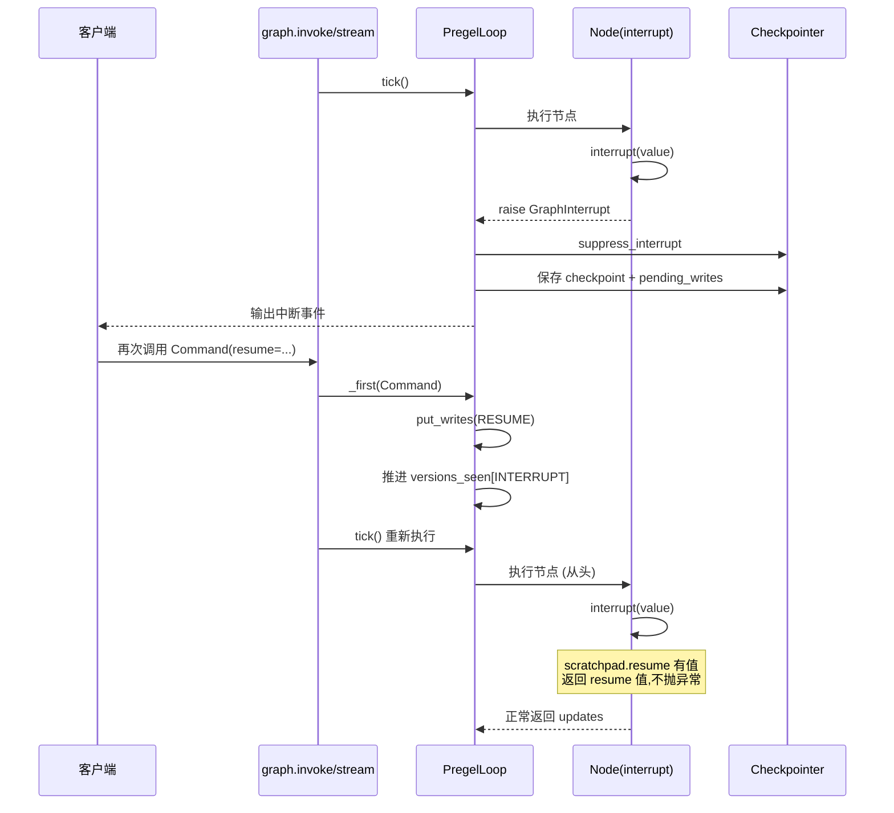

## 背景与动机

在 [Interrupt-SSE 架构分析]() 一文中,我们分析了人机交互中断在应用层的实现。本文深入框架内核,解析中断恢复的底层机制:

- GraphInterrupt 如何作为控制信号在框架中传播?
- Resume 如何绑定到特定任务和命名空间?
- 节点重执行时如何保证幂等性?

## 核心概念

### GraphInterrupt 是控制信号

`GraphInterrupt` 继承 `GraphBubbleUp`,被视为控制信号而非错误:

```python
class GraphBubbleUp(Exception):
    """控制流信号基类"""

class GraphInterrupt(GraphBubbleUp):
    """中断信号"""
    def __init__(self, interrupts: tuple[Interrupt, ...]):
        self.interrupts = interrupts
```

**关键语义**: Retry 层不 retry,Executor 层不 re-raise,Runner 层收集并聚合。

### 中断触发方式

**静态中断**: 编译期指定

```python
compiled = StateGraph(State).compile(
    interrupt_before=["human_feedback"],  # 节点执行前中断
    interrupt_after=["planner"]           # 节点执行后中断
)
```

**动态中断**: 节点内调用

```python
def node_fn(state):
    feedback = interrupt("需要人工审核")
    # 恢复后继续执行
    if feedback == "approved":
        return {"status": "approved"}
```

### Interrupt 触发判定

Loop 在两处检查中断条件:

**interrupt_before**: 在 `tick()` 执行任务前检查

```python
if should_interrupt(
    checkpoint,
    interrupt_before_nodes,
    tasks
):
    raise GraphInterrupt(...)
```

**interrupt_after**: 在 `after_tick()` 应用写入后检查

```python
if should_interrupt(
    checkpoint,
    interrupt_after_nodes,
    tasks
):
    raise GraphInterrupt(...)
```

判定逻辑:

```python
def should_interrupt(checkpoint, interrupt_nodes, tasks):
    # 1. 检查是否有任务触发中断节点
    triggered = any(
        task.name in interrupt_nodes 
        for task in tasks
    )
    
    # 2. 检查版本是否推进 (避免重复中断)
    version_advanced = any(
        versions_seen[INTERRUPT][chan] < channel_versions[chan]
        for chan in updated_channels
    )
    
    return triggered and version_advanced
```

## 节点内 Interrupt

### Interrupt 函数实现

```python
def interrupt(value):
    conf = get_config()["configurable"]
    scratchpad = conf[CONFIG_KEY_SCRATCHPAD]
    idx = scratchpad.interrupt_counter()  # 同一节点内多次中断按序编号
    
    # 1. 优先使用 task-specific resume 列表
    if scratchpad.resume and idx < len(scratchpad.resume):
        # 恢复路径: 返回 resume 值
        conf[CONFIG_KEY_SEND]([(RESUME, scratchpad.resume)])
        return scratchpad.resume[idx]
    
    # 2. 使用全局 null resume (NULL_TASK_ID 的 RESUME)
    v = scratchpad.get_null_resume(consume=True)
    if v is not None:
        scratchpad.resume.append(v)
        conf[CONFIG_KEY_SEND]([(RESUME, scratchpad.resume)])
        return v
    
    # 3. 没有 resume 值 -> 抛 GraphInterrupt
    raise GraphInterrupt((
        Interrupt.from_ns(
            value=value, 
            ns=conf[CONFIG_KEY_CHECKPOINT_NS]
        ),
    ))
```

**关键语义**:
- 第一次调用: 抛 GraphInterrupt,中断执行
- 恢复后再次执行: 从 scratchpad.resume 返回 resume 值,不抛异常

### Scratchpad 结构

```python
class PregelScratchpad:
    step: int
    stop: int
    counters: dict[str, int]  # 各种计数器
    resume: list[Any]          # 当前任务的 resume 值列表
```

**注入位置**: `prepare_single_task` 为每个任务构造独立的 scratchpad

```python
scratchpad = PregelScratchpad(
    step=step,
    stop=stop,
    counters={},
    resume=[]  # 从 pending_writes + resume_map 拼接
)

config[CONFIG_KEY_SCRATCHPAD] = scratchpad
```

## Resume 机制

### Command(resume=...)

恢复入口在 `_first`:

```python
def _first(self, input):
    if isinstance(input, Command) and input.resume:
        if not self.checkpointer:
            raise RuntimeError("Resume requires checkpointer")
        
        # 1. 解析 resume
        if isinstance(input.resume, dict):
            # Resume map: 多中断点恢复
            self.config[CONF][CONFIG_KEY_RESUME_MAP] = input.resume
            writes = []
        else:
            # 单一 resume 值
            pending_interrupts = self._pending_interrupts()
            if len(pending_interrupts) > 1:
                raise RuntimeError(
                    "Multiple pending interrupts, must specify interrupt id"
                )
            writes = [(NULL_TASK_ID, RESUME, input.resume)]
        
        # 2. 保存 writes
        self.put_writes(writes)
        
        # 3. 推进 versions_seen[INTERRUPT]
        if self.is_resuming:
            self.versions_seen[INTERRUPT] = self.channel_versions
```

### Pending Interrupts 判定

```python
def _pending_interrupts(self):
    """找出尚未被 RESUME 配对的 interrupt_id"""
    interrupts = set()
    resumes = set()
    
    for task_id, write_type, value in self.checkpoint_pending_writes:
        if write_type == INTERRUPT:
            interrupts.add(value.interrupt_id)
        elif write_type == RESUME:
            resumes.update(value)  # Resume 可能是列表
    
    return interrupts - resumes
```

### Resume Map 绑定

```python
def _scratchpad(checkpoint_ns, resume_map):
    """构造 scratchpad,绑定 resume 值"""
    resume = []
    
    # 1. 从 pending_writes 提取 resume
    for task_id, write_type, value in pending_writes:
        if task_id == current_task_id and write_type == RESUME:
            resume = value
    
    # 2. 从 resume_map 匹配 namespace hash
    if resume_map:
        namespace_hash = xxh3_128_hexdigest(checkpoint_ns)
        if namespace_hash in resume_map:
            resume.append(resume_map[namespace_hash])
    
    return PregelScratchpad(resume=resume, ...)
```

**作用域**: Resume 值绑定到 `task_id` 和 `namespace_hash`,不同任务不共享。

## 数据链路

### 中断到恢复完整流程



### Suppress Interrupt

Loop 捕获 GraphInterrupt 后:

```python
try:
    loop.tick()
except GraphInterrupt as e:
    if loop.is_nested:
        # 子图中断,向上冒泡
        raise
    else:
        # 根图中断,suppress 并输出
        loop._suppress_interrupt(e)
        yield {"__interrupt__": e.interrupts}
```

`_suppress_interrupt` 保存 checkpoint,包含:
- Pending writes(含 INTERRUPT 写入)
- 当前 channel_versions

### 推进 versions_seen[INTERRUPT]

恢复时推进 `versions_seen[INTERRUPT]`,避免立即再次触发中断:

```python
if self.is_resuming:
    for chan in self.updated_channels:
        self.versions_seen[INTERRUPT][chan] = self.channel_versions[chan]
```

**设计动机**: `should_interrupt` 检查版本推进,如果不推进会重复中断。

## 使用场景

### 人工审核

```python
def human_feedback_node(state):
    if not state.get("auto_approved"):
        feedback = interrupt("请审核方案")
        
        if feedback == "EDIT":
            return Command(goto="planner")
        elif feedback == "APPROVED":
            return Command(goto="execute")
```

### 多中断点恢复

```python
# 图有多个并发中断点
def nodeA(state):
    x = interrupt("需要 X")
    return {"x": x}

def nodeB(state):
    y = interrupt("需要 Y")
    return {"y": y}

# 一次恢复多个中断
compiled.invoke(
    Command(resume={
        hash_of_nodeA_ns: "valueX",
        hash_of_nodeB_ns: "valueY"
    }),
    config=config
)
```

### 条件中断

```python
def node_fn(state):
    if state["requires_human"]:
        decision = interrupt("需要人工决策")
        state["decision"] = decision
    
    # 继续后续逻辑
    return state
```

## 扩展点

### 中断点策略

**静态**: compile-time 指定 `interrupt_before/after`  
**动态**: 节点内调用 `interrupt(...)`  
**组合**: 两者可同时使用

### 自定义 Interrupt 类型

```python
class Interrupt:
    value: Any           # 中断携带的数据
    interrupt_id: str    # 唯一 ID
    ns: tuple[str, ...]  # 命名空间
    
    @classmethod
    def from_ns(cls, value, ns):
        return cls(
            value=value,
            interrupt_id=uuid4().hex,
            ns=ns
        )
```

可以在 `value` 中携带自定义数据结构。

## 权衡与风险

### 需要 Checkpointer

**约束**: `Command(resume=...)` 在没有 checkpointer 时被禁止  
**设计动机**: 确保"可恢复 = 必须可持久化"  
**影响**: 必须配置 checkpointer 才能使用中断恢复

### 节点重执行

**关键**: 恢复后节点**从头重新执行**,`interrupt()` 返回 resume 值而不抛异常  
**幂等性要求**: 节点必须处理重执行的副作用

```python
def node_fn(state):
    # BAD: 重执行会重复调用 API
    api.call()
    
    feedback = interrupt("...")
    return {"result": process(feedback)}
```

```python
def node_fn(state):
    # GOOD: 幂等处理
    if not state.get("api_called"):
        api.call()
        state["api_called"] = True
    
    feedback = interrupt("...")
    return {"result": process(feedback)}
```

### Resume 作用域

**绑定**: Resume 值绑定到 `task_id` 和 `namespace_hash`  
**隔离**: 不同并发任务不共享 resume  
**收益**: 防止串扰  
**复杂度**: Resume map 需要计算 namespace hash

### 多中断点恢复

**问题**: 非 map 的 resume 在存在多个 pending interrupts 时被禁止  
**设计动机**: 避免歧义(不知道 resume 值对应哪个中断)  
**替代**: 使用 resume_map 显式指定

## 中断类型区分

### Interrupt Before vs After

| 类型 | 时点 | 用途 |
|:---|:---|:---|
| interrupt_before | tick() 执行任务前 | 阻止节点执行,用于前置审核 |
| interrupt_after | after_tick() 应用写入后 | 允许节点执行但阻止后续,用于结果审核 |

### 静态 vs 动态

| 类型 | 定义位置 | 触发条件 | 灵活性 |
|:---|:---|:---|:---|
| 静态 | compile() | 节点名匹配 | 固定 |
| 动态 | 节点内 | 业务逻辑决定 | 灵活 |

## 版本推进机制

### 避免重复中断

```python
def should_interrupt(checkpoint, interrupt_nodes, tasks):
    # 必须同时满足:
    # 1. 有任务触发中断节点
    triggered = any(task.name in interrupt_nodes for task in tasks)
    
    # 2. 版本推进 (避免重复中断)
    version_advanced = any(
        versions_seen[INTERRUPT][chan] < channel_versions[chan]
        for chan in updated_channels
    )
    
    return triggered and version_advanced
```

**关键**: 恢复时推进 `versions_seen[INTERRUPT]`,确保版本检查通过。

## 小结

LangGraph 中断恢复机制的核心设计:

**GraphInterrupt**: 控制信号,不是错误,在 Retry/Executor/Runner 各层特殊处理  
**节点内 Interrupt**: 同步阻塞调用,恢复后返回 resume 值  
**Resume Map**: 绑定到 namespace hash,支持多中断点恢复  
**节点重执行**: 从头执行,业务层需保证幂等性

理解中断恢复是实现人机协作工作流的关键。下一篇文章 [子图机制]() 会解析子图的发现、挂载和跨边界路由机制。
