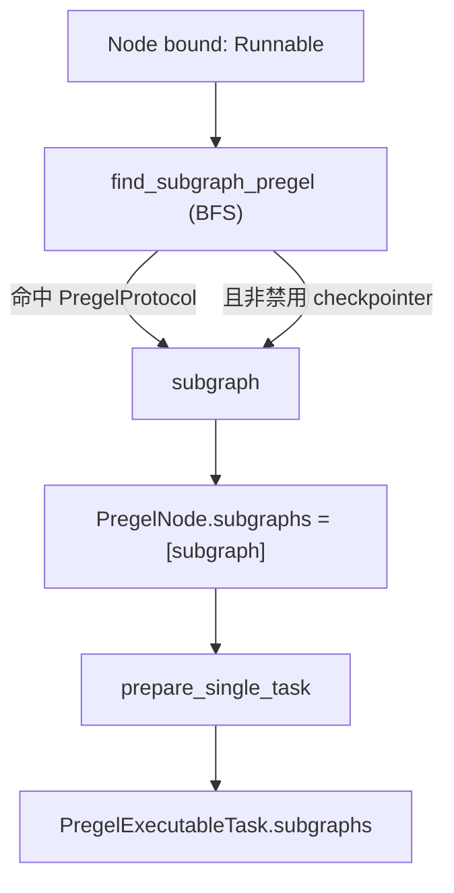
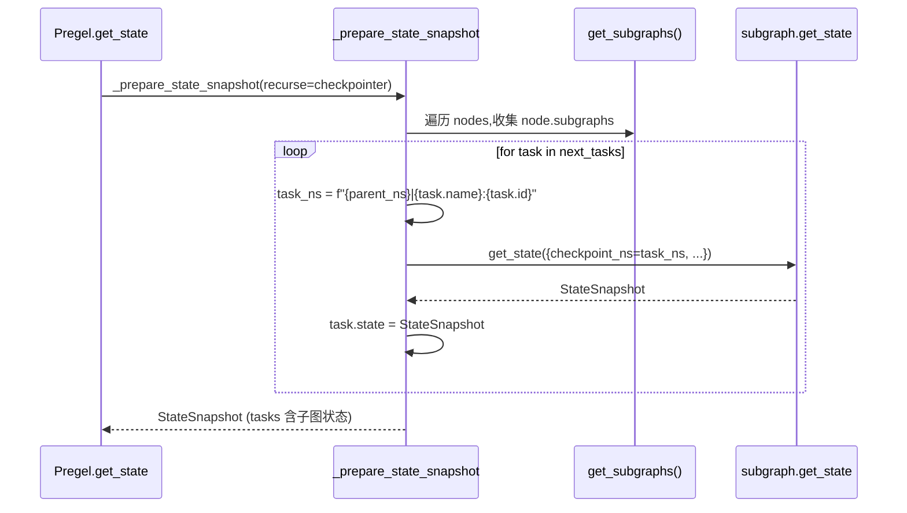
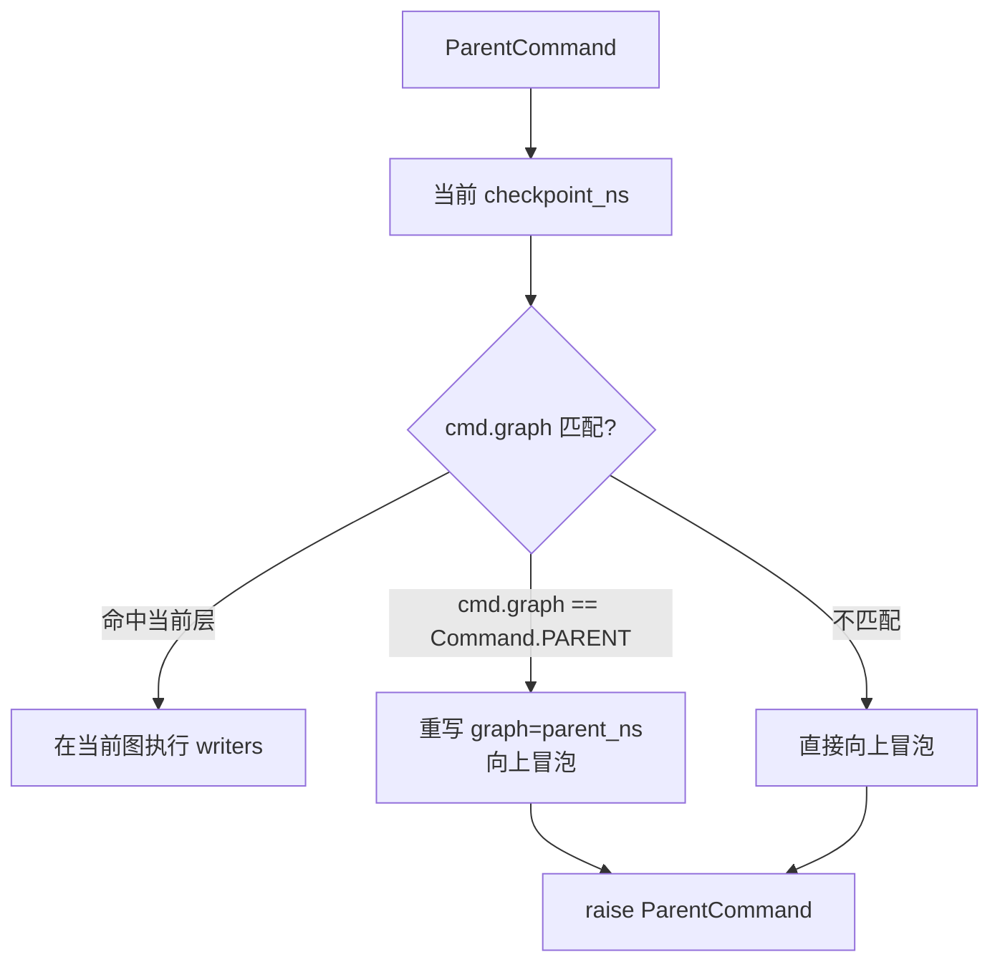

## 背景与动机

前文分析了中断恢复机制,解决了单个图内的人机交互问题。但在实际应用中,我们还需要模块化和复用能力:

- 如何把一个完整的图作为节点嵌入另一个图?
- 如何在保持状态隔离的同时实现父子图通信?
- 如何支持远程子图调用?

本文解析 LangGraph 的子图机制:

- 子图如何被发现和挂载到节点?
- 子图的 namespace 如何隔离?
- 子图如何通过 ParentCommand 与父图通信?

## 核心概念

### PregelProtocol: 子图抽象

```python
class PregelProtocol(Protocol):
    def invoke(self, input, config):
        """同步执行"""
    
    def stream(self, input, config):
        """流式执行"""
    
    def get_state(self, config):
        """读取状态"""
    
    def get_state_history(self, config):
        """读取历史状态"""
    
    def update_state(self, config, values):
        """更新状态"""
```

**关键**: 实现这个协议的对象可以像"节点"一样嵌入另一个图。

### 子图发现: find_subgraph_pregel

从一个 Runnable 中探测出 PregelProtocol 实例:

```python
def find_subgraph_pregel(runnable):
    """BFS 遍历 runnable 结构,找到 PregelProtocol 实例"""
    if isinstance(runnable, PregelProtocol):
        # 排除禁用 checkpoint 的 Pregel
        if isinstance(runnable, Pregel) and runnable.checkpointer is False:
            return None
        return runnable
    
    # 递归探测 RunnableSequence/RunnableLambda 等组合
    if isinstance(runnable, RunnableSequence):
        for step in runnable.steps:
            found = find_subgraph_pregel(step)
            if found:
                return found
    
    # 探测 RunnableCallable 的闭包
    if isinstance(runnable, RunnableCallable):
        for var in closure_vars(runnable.func):
            found = find_subgraph_pregel(var)
            if found:
                return found
    
    return None
```

### 子图挂载: PregelNode.subgraphs

`PregelNode.__init__` 时自动发现并挂载:

```python
class PregelNode:
    def __init__(self, bound, subgraphs=None):
        self.bound = bound
        
        if subgraphs is not None:
            self.subgraphs = subgraphs
        elif bound is not DEFAULT_BOUND:
            # 自动发现
            found = find_subgraph_pregel(bound)
            self.subgraphs = [found] if found else []
        else:
            self.subgraphs = []
```

### Namespace 层次化隔离

子图在父图的 task config 中获得独立的 checkpoint_ns:

```python
# 父图 task
task_checkpoint_ns = f"{checkpoint_ns}{NS_END}{task_id}"

# 子图继承 task_checkpoint_ns
subgraph.invoke(input, config={
    "configurable": {
        "checkpoint_ns": task_checkpoint_ns,
        ...
    }
})
```

**结构示意**: `"parent:123|child:456"`  
**分隔符**: `|` 分层,`:` 分隔 namespace 和 task_id

## 数据链路

### 子图发现到任务传播



### StateSnapshot 递归装配

`get_state(subgraphs=True)` 时递归获取子图状态:



### ParentCommand 跨边界路由



## ParentCommand 实现

### 定义

```python
class ParentCommand(GraphBubbleUp):
    """子图向父图发送命令的控制信号"""
    def __init__(self, command: Command):
        self.command = command
```

### 路由逻辑

`run_with_retry` 捕获 ParentCommand:

```python
def run_with_retry(task, retry_policy):
    try:
        return task.proc.invoke(input, config)
    except ParentCommand as cmd:
        ns = config[CONF][CONFIG_KEY_CHECKPOINT_NS]
        
        # 1. 检查是否命中当前层
        if cmd.command.graph in (ns, recast_checkpoint_ns(ns), task.name):
            # 在当前图处理
            for writer in task.writers:
                writer.invoke(cmd.command, config)
            return
        
        # 2. 检查是否是 Command.PARENT
        if cmd.command.graph == Command.PARENT:
            # 重写为父 ns
            parent_ns = ns.rsplit(NS_SEP, 1)[0]
            cmd.command.graph = parent_ns
        
        # 3. 向上冒泡
        raise cmd
```

### 使用场景

子图需要跳转到父图的某个节点:

```python
def subgraph_node(state):
    if state["should_escalate"]:
        # 跳出子图,回到父图的 human_review 节点
        return Command(
            goto="human_review",
            graph=Command.PARENT  # 指定父图
        )
```

## Namespace 结构

### 组成

```python
# 常量
NS_SEP = "|"  # 层级分隔
NS_END = ":"  # namespace 与 task_id 分隔

# 示例
checkpoint_ns = "parent:task_123|child:task_456|grandchild:task_789"
```

### Recast

去除 task_id,只保留 namespace 名称:

```python
def recast_checkpoint_ns(ns: str) -> str:
    # "parent:123|child:456" -> "parent|child"
    return NS_SEP.join(
        part.split(NS_END)[0]
        for part in ns.split(NS_SEP)
    )
```

**用途**: 状态查询、子图定位、ParentCommand 路由

### 父 Namespace 推导

```python
def parent_ns(ns: str) -> str:
    # "parent|child|grandchild" -> "parent|child"
    parts = ns.split(NS_SEP)
    return NS_SEP.join(parts[:-1]) if len(parts) > 1 else ""
```

## get_subgraphs 枚举

### 实现

```python
def get_subgraphs(self):
    """枚举图中的所有子图"""
    seen = set()
    for node in self.nodes.values():
        if node.subgraphs:
            # 只取第一个子图 (默认策略)
            subgraph = node.subgraphs[0]
            if subgraph not in seen:
                seen.add(subgraph)
                yield (node.name, subgraph)
```

**限制**: 每个节点最多暴露一个子图。

### 递归状态

`_prepare_state_snapshot` 使用 `get_subgraphs`:

```python
def _prepare_state_snapshot(config, saved, recurse):
    if recurse:
        subgraphs = dict(self.get_subgraphs())
    else:
        subgraphs = {}
    
    for task in next_tasks:
        if task.name in subgraphs:
            # 构造子图 config
            task_ns = f"{parent_ns}|{task.name}:{task.id}"
            subgraph_config = {
                "configurable": {
                    "checkpoint_ns": task_ns,
                    "checkpointer": recurse  # 传递 checkpointer
                }
            }
            
            # 递归获取子图状态
            task.state = subgraphs[task.name].get_state(
                subgraph_config,
                subgraphs=True  # 继续递归
            )
        else:
            task.state = task.config
```

## RemoteGraph 边界

### Config Sanitize

RemoteGraph 调用远程 API 前 sanitize config:

```python
_CONF_DROPLIST = [
    CONFIG_KEY_CHECKPOINT_ID,
    CONFIG_KEY_CHECKPOINT_NS,
    CONFIG_KEY_TASK_ID,
    CONFIG_KEY_SCRATCHPAD,
    CONFIG_KEY_SEND,
    CONFIG_KEY_READ,
    ...
]

def _sanitize_config(config):
    sanitized = {}
    for k, v in config.items():
        if k not in _CONF_DROPLIST:
            sanitized[k] = _sanitize_config_value(v)
    return sanitized
```

### Namespace 前缀补齐

RemoteGraph 的事件流需要补齐 caller_ns:

```python
def stream(self, input, config):
    caller_ns = config[CONF].get(CONFIG_KEY_CHECKPOINT_NS, "")
    
    for chunk in client.runs.stream(input, sanitized_config):
        if chunk.event in ("values", "updates"):
            # 补齐 namespace 前缀
            remote_ns = chunk.data.get("ns", "")
            chunk.data["ns"] = f"{caller_ns}|{remote_ns}"
        yield chunk
```

**设计动机**: 保持 namespace 层次一致性。

## 使用场景

### 本地子图复用

```python
# 定义可复用子图
research_graph = StateGraph(ResearchState).add_node(...).compile()

# 嵌入到主图
builder = StateGraph(State)
builder.add_node("research", research_graph)
builder.add_edge("plan", "research")
```

### 远程子图集成

```python
remote_graph = RemoteGraph(
    url="https://remote-server.com",
    graph_id="specialized_processor"
)

builder.add_node("remote_process", remote_graph)
```

### 跨边界命令

```python
def subgraph_node(state):
    if state["needs_human"]:
        # 跳出子图,路由到父图
        return Command(
            goto="human_review",
            graph=Command.PARENT
        )
```

## 扩展点

### 自定义子图发现

显式指定 `PregelNode.subgraphs`:

```python
node = PregelNode(
    bound=my_runnable,
    subgraphs=[custom_subgraph_1, custom_subgraph_2]  # 显式指定
)
```

绕开自动探测和"最多一个"的限制。

### 递归控制

`get_state(subgraphs=True)` 通过 `recurse` 参数控制:

```python
if not recurse:
    # 只标记子图存在
    task.state = task.config
else:
    # 深入抓取子图状态
    task.state = subgraph.get_state(...)
```

**用途**: 分级获取状态,控制递归深度。

## 权衡与风险

### 发现开销

**问题**: `find_subgraph_pregel` BFS 遍历 + 解析闭包变量  
**影响**: 大规模封装/复杂闭包可能放大开销  
**优化**: `bound is DEFAULT_BOUND` 时跳过发现

### 每节点一个子图

**限制**: `get_subgraphs` 只取 `node.subgraphs[0]`  
**原因**: 默认策略简化递归状态装配  
**替代**: 显式指定 subgraphs 可突破限制

### 禁用 Checkpoint 的子图

**约束**: `checkpointer is False` 的 Pregel 不被识别为子图  
**收益**: 避免不可回溯子图污染可回溯语义  
**代价**: 复用能力下降

### Namespace 复杂度

**问题**: ns 携带 task_id,引入 recast/父子推导/caller_ns 补齐  
**收益**: 可追溯性、层次化隔离  
**代价**: 复杂度税

### RemoteGraph 边界

**Sanitize**: 剥离 checkpoint/task 相关字段  
**收益**: 稳定的跨进程调用  
**限制**: 本地执行态无法透明传递

## 子图与父图的状态共享

### 隔离原则

**子图有独立的 checkpoint_ns**,状态完全隔离:
- 子图的 channels 与父图的 channels 分别管理
- 子图的 checkpoint 独立保存
- 子图的 trigger 机制独立运行

### 通信方式

**输入/输出**: 子图通过节点参数接收输入,通过返回值输出  
**ParentCommand**: 子图通过 ParentCommand 向父图发送命令  
**Store**: 通过 Runtime.store 跨图共享数据(但不参与触发)

## 小结

LangGraph 子图机制的核心设计:

**PregelProtocol**: 子图抽象,统一 invoke/stream/get_state 接口  
**自动发现**: BFS 遍历 bound,探测 PregelProtocol 实例  
**Namespace 隔离**: 层次化 checkpoint_ns,子图状态完全隔离  
**ParentCommand**: 跨边界路由,支持子图向父图发送命令  
**RemoteGraph**: 远程子图,sanitize config,补齐 namespace

理解子图机制是构建模块化、可复用 Agent 系统的基础。最后一篇文章 [扩展点架构]() 会梳理 Store/Cache/Retry/Remote 等高杠杆扩展点的注入机制和边界约束。
