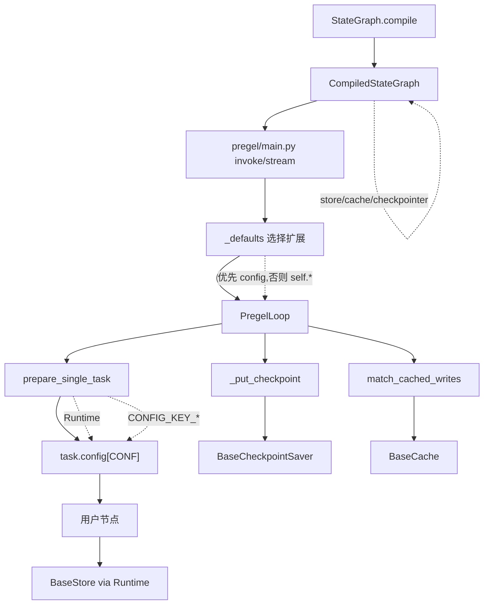

## 背景与动机

前文分析了子图的复用和隔离机制。LangGraph 的架构设计遵循"内核精简,能力可插拔"的原则,通过扩展点机制把复杂性下沉到可替换组件。本文作为系列收官,梳理主要扩展点:

- **Store**: 长时记忆,跨 thread/跨会话
- **Cache**: 写入缓存,跳过实际执行
- **Retry**: 失败重试,指数退避
- **Remote**: 远程子图,跨进程调用

理解这些扩展点的注入机制、运行时可见性和边界约束,是在不修改内核的前提下定制框架行为的基础。

## 核心概念

### 扩展点 = 注入位置 + 运行时可见性

所有扩展点最终被注入到:
- `task.config[CONF]`: 任务级依赖
- `PregelLoop` 成员字段: Loop 级依赖

运行时访问方式:
- 节点通过 `get_config/get_runtime` 获取
- Loop 在 `tick/after_tick/_put_checkpoint` 中调度

### 编译期 vs 运行期注入

**编译期注入**: `StateGraph.compile(...)`

```python
compiled = StateGraph(State).compile(
    checkpointer=MyCheckpointSaver(),
    store=MyStore(),
    cache=MyCache()
)
```

这些扩展写入 `CompiledStateGraph` 字段。

**运行期选择**: `_defaults` 方法

```python
def _defaults(self, config):
    # 优先从 config 选择,否则用 self.* (编译期注入)
    checkpointer = config[CONF].get(CONFIG_KEY_CHECKPOINTER, self.checkpointer)
    store = config[CONF].get(CONFIG_KEY_RUNTIME, Runtime()).store or self.store
    cache = config[CONF].get(CONFIG_KEY_CACHE, self.cache)
```

这种设计支持"编译期默认 + 运行期覆盖"。

## Runtime: 依赖打包器

### 结构

```python
@dataclass
class Runtime:
    context: Any = None              # 业务上下文
    store: BaseStore = None          # 长时记忆
    stream_writer: StreamWriter = None  # 流输出
    previous: Any = None             # 上一次节点输出
```

### 注入位置

`prepare_single_task` 构造任务时:

```python
runtime = runtime.override(
    previous=...,
    store=store  # 从 Loop 传入
)

config[CONFIG_KEY_RUNTIME] = runtime
```

### 节点使用

节点参数中显式接收:

```python
def node_fn(state, runtime: Runtime):
    # 访问 store
    runtime.store.put(("cache", "key"), value)
    
    # 访问 context
    user_id = runtime.context.user_id
```

或通过 `get_runtime()`:

```python
def node_fn(state):
    runtime = get_runtime()
    store = runtime.store
```

## Store: 长时记忆

### 设计定位

**Store** 是跨 thread/跨会话的长期存储介质:
- 不参与 Pregel 的 channel_versions/versions_seen 触发机制
- 不进入 checkpoint 快照
- 适合存放知识库、用户档案、历史对话摘要

### 注入路径

1. **编译期**: `StateGraph.compile(store=...)`
2. **运行期**: `_defaults` 选择 store
3. **任务级**: `prepare_single_task` 注入 `Runtime.store`

### API

```python
class BaseStore:
    def get(self, namespace: tuple[str, ...], key: str):
        """读取"""
    
    def put(self, namespace: tuple[str, ...], key: str, value: dict):
        """写入"""
    
    def search(self, namespace_prefix: tuple[str, ...]):
        """搜索"""
    
    def delete(self, namespace: tuple[str, ...], key: str):
        """删除"""
```

**Namespace**: 层次化组织,如 `("user", user_id, "preferences")`

### 使用场景

```python
def retrieve_node(state, runtime: Runtime):
    # 读取用户历史对话摘要
    summaries = runtime.store.search(("user", state["user_id"], "summaries"))
    
    # 写入新摘要
    runtime.store.put(
        ("user", state["user_id"], "summaries"),
        f"summary_{state['session_id']}",
        {"content": state["summary"]}
    )
```

## Cache: 写入缓存

### 设计定位

**Cache** 把"节点输入 -> writes"映射缓存起来,命中缓存时跳过实际执行。

### CachePolicy

```python
class CachePolicy:
    key_func: Callable[[Any], str]  # 如何从节点输入计算 cache key
    ttl: int = None                 # 缓存 TTL (秒)
```

### Cache Key 形成

`prepare_single_task` 构造任务时:

```python
if cache_policy:
    args_key = cache_policy.key_func(val)  # val 是节点输入
    cache_key = CacheKey(
        ns=(CACHE_NS_WRITES, identifier(proc), name),
        key=xxh3_128_hexdigest(args_key),
        ttl=cache_policy.ttl
    )
    task.cache_key = cache_key
```

### 命中回放

Loop 在 `tick()` 中:

```python
def match_cached_writes(self, tasks):
    # 1. 收集有 cache_key 但无 writes 的任务
    to_cache = [t for t in tasks if t.cache_key and not t.writes]
    
    # 2. 批量读取
    keys = [t.cache_key for t in to_cache]
    values = self.cache.get(keys)
    
    # 3. 回放 writes
    for task, writes in zip(to_cache, values):
        if writes:
            task.writes.extend(writes)
            matched.add(task)
```

Runner 在执行前检查:

```python
if task.cache_key and task in matched:
    return  # 跳过执行
```

### 保存缓存

Loop 在 `put_writes()` 中:

```python
if task.cache_key and task.writes:
    self.cache.set({
        (task.cache_key.ns, task.cache_key.key): (task.writes, task.cache_key.ttl)
    })
```

### 使用场景

```python
# 编译期配置缓存策略
builder.add_node(
    "expensive_compute",
    expensive_node,
    cache=CachePolicy(
        key_func=lambda state: state["input_hash"],
        ttl=3600  # 1 小时
    )
)
```

**适用**: 纯函数节点、幂等计算、外部 API 调用(结果稳定)

### 风险

**副作用丢失**: 命中缓存会跳过节点执行,如果节点有副作用(写 DB/调 API),这些副作用不会发生。

## Retry: 失败重试

### RetryPolicy

```python
class RetryPolicy:
    max_retries: int = 3
    retry_on: tuple[type, ...] = (Exception,)
    backoff: Callable[[int], float] = lambda n: 2 ** n
```

### 注入位置

任务级或 Loop 级:

```python
task.retry_policy = RetryPolicy(max_retries=5)
# 或
loop.retry_policy = RetryPolicy(...)
```

### 重试逻辑

`run_with_retry`:

```python
def run_with_retry(task, retry_policy):
    for attempt in range(max_retries):
        try:
            return task.proc.invoke(input, config)
        except GraphBubbleUp:
            raise  # 控制信号不 retry
        except retry_on as e:
            if attempt < max_retries - 1:
                task.writes.clear()  # 清空写入
                config[RESUMING] = True  # 影响子图恢复路径
                sleep(backoff(attempt))
                continue
            raise
```

### 副作用

**清空 writes**: 避免重复提交  
**设置 RESUMING**: 子图恢复时跳过已完成工作

## Remote: 远程子图

### 设计定位

`RemoteGraph` 实现 `PregelProtocol`,用 LangGraph Server API 作为远端执行引擎。可以作为节点/子图嵌入。

### Config Sanitize

跨进程传输时,config 需要 sanitize:

```python
_CONF_DROPLIST = [
    CONFIG_KEY_CHECKPOINT_ID,
    CONFIG_KEY_CHECKPOINT_NS,
    CONFIG_KEY_TASK_ID,
    CONFIG_KEY_SCRATCHPAD,
    ...
]

def _sanitize_config_value(value):
    # 只允许 primitive 类型
    if isinstance(value, (str, int, float, bool, type(None))):
        return value
    elif isinstance(value, (list, tuple)):
        return [_sanitize_config_value(v) for v in value]
    elif isinstance(value, dict):
        return {k: _sanitize_config_value(v) for k, v in value.items()}
    else:
        return None  # 不可序列化,丢弃
```

### Namespace 前缀补齐

RemoteGraph 的事件流需要补齐 caller_ns:

```python
def stream(self, input, config):
    remote_config = _sanitize_config(config)
    
    for chunk in client.runs.stream(input, remote_config):
        # 补齐 namespace 前缀
        if chunk.event in ("values", "updates"):
            chunk.data = {
                **chunk.data,
                "ns": f"{caller_ns}|{chunk.data['ns']}"
            }
        yield chunk
```

### 使用场景

```python
# 远程子图
remote_subgraph = RemoteGraph(
    url="https://remote-server.com",
    graph_id="subgraph_id"
)

builder.add_node("remote", remote_subgraph)
```

**适用**: 微服务架构、资源隔离、跨语言子图

## 扩展点组合

### 编译期注入示例

```python
compiled = StateGraph(State, context_schema=Context).compile(
    checkpointer=PostgresCheckpointer(conn_string),
    store=RedisStore(redis_client),
    cache=MemoryCache(),
    interrupt_before=["human_feedback"]
)
```

### 运行期覆盖

```python
compiled.invoke(
    input,
    config={
        "configurable": {
            "thread_id": "user_123",
            CONFIG_KEY_CACHE: CustomCache()  # 覆盖编译期 cache
        }
    },
    context=Context(user_id="user_123")
)
```

## 注入拓扑



## 扩展点清单

| 扩展点 | 注入位置 | 运行时可见 | 主要用途 |
|:---|:---|:---|:---|
| Checkpointer | compile() | Loop._put_checkpoint | 状态持久化、时间回溯、恢复 |
| Store | compile() / config | Runtime.store | 长时记忆、知识库 |
| Cache | compile() / config | Loop.match_cached_writes | 写入缓存、跳过执行 |
| Retry | 任务级 / Loop 级 | run_with_retry | 失败重试、指数退避 |
| StreamProtocol | Loop._emit | Loop.stream | 流输出、调试、observability |
| RemoteGraph | 节点 | 节点 bound | 远程子图、微服务 |

## 权衡与风险

### 可插拔带来的复杂度

**收益**: 内核精简,定制灵活  
**代价**: 更多状态塞进 config[CONF] 和 namespace,增加调试和迁移成本

### 缓存一致性

**问题**: Cache 以 writes 为缓存值,等价于跳过节点执行  
**要求**: 节点逻辑是"纯函数 + 副作用可忽略/可重放"  
**风险**: 命中缓存会丢失副作用

### Store 的触发隔离

**设计**: Store 不参与 step 触发机制  
**收益**: 避免破坏确定性  
**限制**: Store 读写不会触发下游节点

### RemoteGraph 的边界

**Sanitize**: Config 剥离 checkpoint/task 相关字段  
**收益**: 稳定的跨进程调用  
**限制**: 本地执行态无法透明传递

## Hooks/Callbacks

### 注入位置

`prepare_single_task` 通过 `patch_config` 注入:

```python
if manager:
    child_manager = manager.get_child(f"graph:step:{step}")
    config = patch_config(config, callbacks=child_manager)
```

### 效果

每个 task 有独立的回调链路,可记录:
- 执行事件
- 性能指标
- Trace 信息

### 风险

回调链引入额外开销,如果回调异常处理不当,可能影响整体执行稳定性。

## 小结

LangGraph 扩展点架构的核心设计:

**Runtime**: 依赖打包器,注入 store/context/stream_writer  
**Store**: 长时记忆,不参与触发,不进 checkpoint  
**Cache**: 写入缓存,跳过执行,要求节点纯函数  
**Retry**: 失败重试,清空 writes,设置 RESUMING  
**Remote**: 远程子图,sanitize config,补齐 namespace

理解扩展点的注入机制是定制框架行为的基础。至此,LangGraph 架构深度解析系列完结。回到 [系列导引]() 可以查看完整地图。
