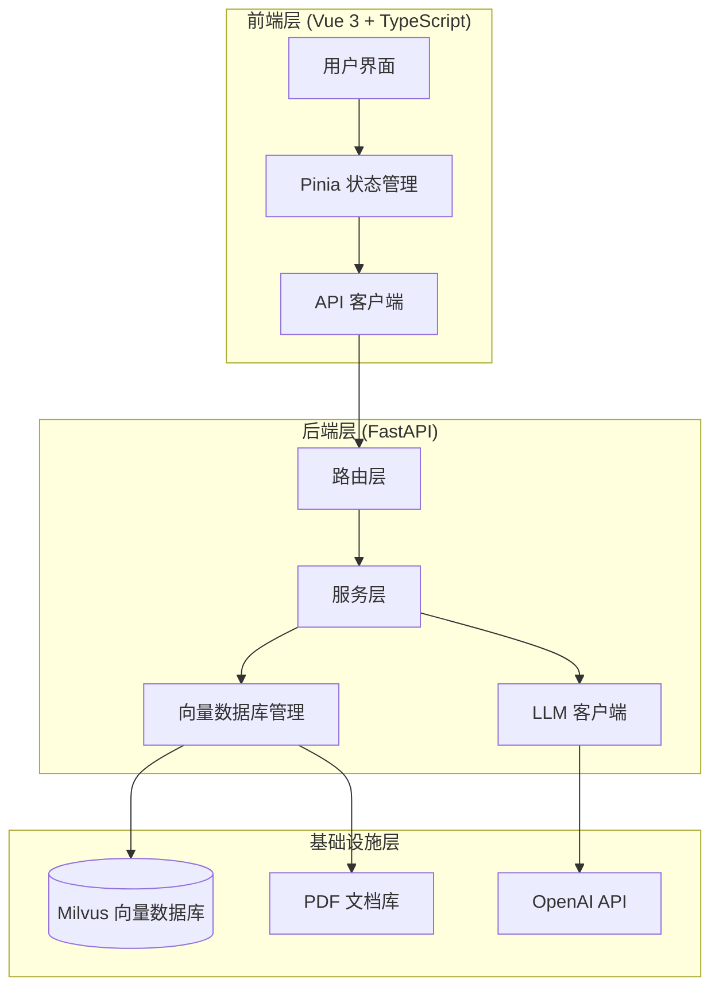
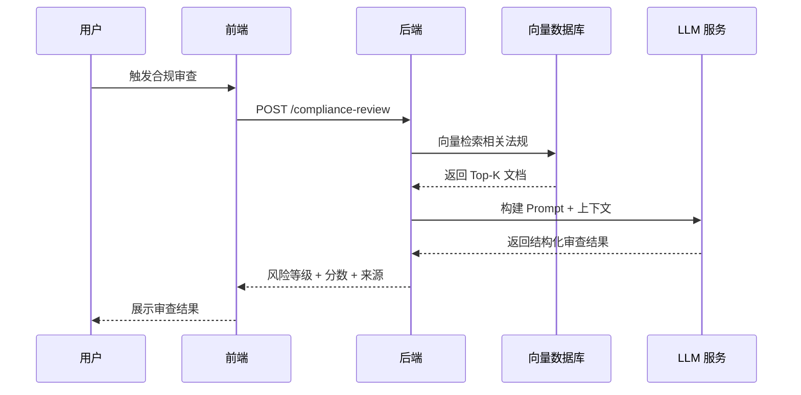
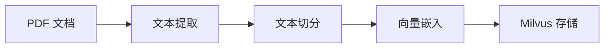

## 背景

医药行业会议活动是反腐败审查和合规监管的重点领域。2023 年以来，国家卫健委、市场监管总局等多部门联合发布了一系列政策文件，明确禁止"站台式讲课"、"餐桌式会议"、讲课费与销量挂钩等违规行为。

企业面临的核心挑战：

- 会议活动数量大，人工审查效率低
- 合规法规分散，审查标准难以统一
- 违规模式隐蔽，人工识别困难
- 审查记录不完整，难以支撑审计追溯

传统规则引擎方法的局限性在于：违规表述多样化难以穷举、上下文语义理解要求高、法规更新频繁导致规则维护成本高。

## 技术动机

大语言模型（LLM）结合检索增强生成（RAG）技术为此类场景提供了可行的技术路径：

| 传统规则引擎 | LLM + RAG |
|-------------|-----------|
| 关键词穷举 | 语义理解，识别隐晦表述 |
| 规则硬编码 | 基于知识库推理 |
| 输出非结构化 | 结构化 JSON 输出 |
| 规则更新需改代码 | 知识库更新无需修改模型 |

## 核心洞察

本项目的设计基于四个核心洞察：

1. **领域知识结构化**：将分散的法规文件、合规指引、违规案例转化为可检索的向量知识库
2. **审查逻辑外化**：通过 Prompt 将专家审查逻辑编码为 LLM 可执行的指令
3. **风险量化输出**：将定性的合规判断转化为定量的风险评分（0-100 分），便于分级处理
4. **证据链闭环**：审查结论附带法规引用和来源文档，支持审计追溯

## 系统架构

### 整体架构

### 数据流

## RAG 实现

### 知识库构建

知识库涵盖多层级法规文件，例如：

- 国家级法规：《反不正当竞争法》《药品管理法》
- 部委文件：《纠正医药购销领域和医疗服务中不正之风工作要点》《医药代表管理办法》《中央和国家机关培训费管理办法》
- 行业准则：RDPAC Code of Practice 2023、《外资医药企业合规经营指引》
- 地方指引：《重庆市医药领域反商业贿赂合规指引》
- 执法文件：《关于加强医疗监督跨部门执法联动工作的意见》《关于医务人员学术讲课取酬的工作提示》

关键设计决策：

- **文本切分**：采用 LangChain 的 RecursiveCharacterTextSplitter，chunk_size=800，overlap=200
- **中文优化**：分隔符列表包含中文标点（句号、问号、分号等），避免在句子中间切断
- **元数据保留**：每个 chunk 关联源文件名、页码、块索引，支持来源追溯

### 检索策略

- 索引类型：IVF_FLAT
- 距离度量：内积（IP），等效于归一化后的余弦相似度
- 返回 Top-K 相关文档作为 LLM 上下文

## Prompt 工程

### 角色定义

Prompt 将 LLM 定位为"资深医疗合规审查专家"，具备以下能力：

- 精通全球及区域医疗行业合规准则（IFPMA, EFPIA, RDPAC, PhRMA）
- 熟悉反商业贿赂法（FCPA, UKBA, 中国刑法）
- 擅长识别隐蔽的合规风险

### 审查维度

| 维度 | 权重 | 审查要点 |
|------|------|----------|
| 合法性与主体资质 | 25% | 授权链条、主体真实性、地点合规 |
| 活动性质与学术实质 | 35% | 日程逻辑、非学术活动、利益独立性 |
| 公允价值与财务透明度 | 25% | 费用公允性、票款一致性、频次累积 |
| 敏感信息与数据安全 | 15% | 合规词汇监测、个人信息保护 |

### 输出约束

强制 LLM 输出结构化 JSON，包含 risk_level、risk_score（0-100）、summary、risk_reasons。

评分逻辑：0-69 分 Low（绿灯），70-89 分 Medium（黄灯），90-100 分 High（红灯）。

### 风险等级校验

后端实现了风险等级与分数的一致性校验：即使 LLM 输出的等级与分数不一致，系统也会根据分数自动修正等级。这一设计体现了对 LLM 输出不确定性的工程化处理——信任但验证。

## 技术栈

| 层级 | 技术选型 |
|------|----------|
| 前端 | Vue 3 + TypeScript + Vite + Element Plus + Pinia + Tailwind CSS |
| 后端 | FastAPI + Pydantic + loguru |
| 向量数据库 | Milvus |
| PDF 处理 | PyMuPDF |
| 文本切分 | langchain-text-splitters |
| 测试 | Vitest（前端）|

## 工程特性

- **可观测性**：loguru 结构化日志，健康检查端点
- **可扩展性**：知识库脚本化更新，Prompt 外化，配置驱动
- **类型安全**：前端 TypeScript 严格模式，后端 Pydantic 模型
- **来源追溯**：审查结果附带源文件、页码、相似度分数

## 局限性

- 知识库更新需手动执行脚本，缺乏自动化机制
- 审查准确性依赖 LLM 能力，存在误判可能
- 审查记录存储在前端 localStorage，缺乏后端持久化

## 总结

本项目展示了一个完整的 LLM 应用工程实践：将领域专家知识编码为向量知识库和 Prompt，通过 RAG 架构实现知识增强的智能审查，将定性判断转化为定量评分，并保留完整的证据链支持审计追溯。项目在架构设计和工程实践方面体现了 LLM 应用落地的典型路径。
