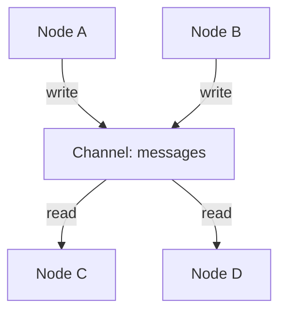

## 问题的起点：MapReduce 无法解决的架构困境

2003年，Google发布了GFS与MapReduce。这套组合横扫了日志分析、索引构建等批处理场景。但当工程师尝试用它计算PageRank时，系统的架构缺陷暴露无遗。

PageRank本质是图算法（Graph Algorithm）。网页构成节点（Vertex），超链接构成边（Edge）。算法需要迭代计算，直至节点权重收敛。这种计算模式与MapReduce的设计哲学存在根本性冲突。

具体来说，MapReduce在三个维度上失效：

**状态无法驻留**  
MapReduce设计为无状态。每次迭代结束后，整个图的状态必须序列化，写入GFS磁盘。下一次迭代启动时，再从磁盘反序列化加载。这个过程在单次迭代中尚可接受，但PageRank通常需要50至100次迭代才能收敛。

**IO成为瓶颈**  
假设图规模为10亿节点，每个节点状态占1KB。单次迭代的磁盘写入量达到1TB。如果迭代100次，总IO开销接近100TB。在2000年代末期的硬件条件下，这直接导致计算时间从小时级膨胀到天级。

**数据局部性丧失**  
MapReduce针对行式数据（如日志）优化，Mapper处理独立数据分片，Reducer合并结果。但图计算的核心是拓扑关系。节点A的状态更新依赖其邻居节点B、C、D的状态。MapReduce无法感知这种拓扑依赖，导致大量跨机器的数据传输与反复的全局同步。

用一个类比：MapReduce试图用卡车配送披萨。卡车适合批量运输货物，但披萨需要高频次、低延迟的点对点传递。

## Pregel 的诞生：重新定义计算范式

2010年，Google在SIGMOD发表论文《Pregel: A System for Large-Scale Graph Processing》。这篇论文标志着大规模数据处理从"通用模型时代"进入"专用化计算时代"。

> 命名源自普鲁士柯尼斯堡的普雷格尔河（Pregel River）。欧拉的七桥问题发生于此，那是图论的起源。
{: .prompt-info }

### 核心哲学：Think Like a Vertex

Pregel抛弃了MapReduce的"全局视角"，提出以顶点为中心（Vertex-centric）的编程模型。

在MapReduce中，开发者需要设计Mapper和Reducer，控制全局数据流。在Pregel中，开发者只需为单个节点定义行为逻辑。系统自动将这套逻辑分发到所有节点，形成分布式计算。

用代码思维类比：MapReduce要求你写一个上帝类（God Class），控制整个流程；Pregel让你写一个节点类（Vertex Class），系统自动实例化亿万个对象，并行执行。

### 架构核心：BSP 模型

Pregel采用BSP（Bulk Synchronous Parallel，整体同步并行）模型。计算过程分解为一系列Superstep（超步），每个Superstep包含三个阶段：


**计算阶段（Compute）**  
每个节点读取上一个Superstep接收的消息，结合当前状态，执行用户定义的计算逻辑。节点可以修改自身状态，或决定进入休眠（Vote to Halt）。

**通信阶段（Communicate）**  
节点向邻居发送消息。这些消息不会立即送达，而是缓存在系统中，等待下一个Superstep时被目标节点读取。

**同步栅栏（Barrier Synchronization）**  
所有节点必须完成当前Superstep的计算与消息发送，系统才能进入下一个Superstep。这是BSP模型的核心约束，确保了数据一致性，避免了竞态条件与死锁。

### 状态驻留：突破IO瓶颈

与MapReduce不同，Pregel的Worker进程将图分片长期驻留在内存中。Superstep 1与Superstep 2之间，图的拓扑结构与节点状态保持在RAM，只有消息需要跨节点传输。

这一设计将迭代计算的IO开销从"全量序列化"降低到"增量消息传输"。假设每个节点平均向3个邻居发送消息，消息大小为100字节，10亿节点的单次迭代网络流量为300GB。相比MapReduce的1TB磁盘IO，性能提升超过一个数量级。

## 工程实现的关键细节

### 伪代码示例：最大值传播算法

以下伪代码展示了Pregel的编程范式。假设图中每个节点持有一个数值，算法目标是让所有节点最终都持有全局最大值：

```python
class MaxValueVertex(PregelVertex):
    def compute(self, messages):
        # 读取当前节点的值
        current_max = self.value
        
        # 检查接收的消息中是否有更大的值
        for msg in messages:
            if msg > current_max:
                current_max = msg
        
        # 如果值发生变化，更新状态并通知邻居
        if current_max > self.value:
            self.value = current_max
            self.send_messages_to_neighbors(current_max)
        else:
            # 值未变化，投票进入休眠状态
            # 除非下次收到新消息，否则不再参与计算
            self.vote_to_halt()
```

这段代码会被系统复制到所有节点。初始时，每个节点向邻居发送自己的值。随后，每个Superstep中，节点比较接收的值与当前值，保留更大者并继续传播。当所有节点都投票休眠时，算法终止。

### 容错机制：Checkpointing

在千台机器的集群中，硬件故障是常态而非异常。Pregel使用Checkpointing机制应对：

- Master节点定期（如每10个Superstep）命令所有Worker将节点状态写入GFS
- 每个Checkpoint包含节点状态、拓扑结构、当前Superstep编号
- 若Worker故障，系统回滚到最近的Checkpoint，重新分配分片

这种机制的代价是额外的磁盘IO，但相比从头重算，开销可控。

### 性能优化：Combiner

Pregel借鉴了MapReduce的Combiner思想。假设节点A需要向节点B发送10条数值消息。系统可以在发送端先将这10个数值求和，只发送一个汇总值。

这一优化在PageRank计算中尤为关键。每个网页可能有数百个入链，如果每个入链都独立发送消息，网络带宽将成为瓶颈。通过Combiner，消息量可降低两个数量级。

## 后Pregel时代：开源实现与范式演进

### Apache Giraph：工业级落地

Google论文发表后，Apache基金会启动了Giraph项目，这是Pregel最著名的开源实现（Java编写）。

Facebook基于Giraph处理万亿级社交关系图。他们优化了分片策略、消息压缩、内存管理，在某些场景下性能超越Google内部实现。这验证了Pregel范式的通用性。

### Spark GraphX：统一技术栈

随着Spark的崛起，GraphX将Pregel模型整合进Spark生态。底层基于RDD，但向上提供了`pregel()`操作符，语义与Pregel一致。

这一设计的价值在于技术栈统一。团队无需为图计算单独维护Giraph集群，可以在同一个Spark任务中完成ETL、SQL查询、图计算的全流程。

### 现代挑战：异步计算与GNN

到2025年，同步BSP模型暴露出两个瓶颈：

**Straggler Problem（掉队者问题）**  
若某台机器处理的节点邻居数量异常庞大（如社交网络中的超级节点），其计算时间远超其他机器。BSP模型要求所有节点同步，导致整个集群等待这台慢机器。后续系统（如GraphLab/PowerGraph）引入异步计算，允许快节点先行推进。

**图神经网络（GNN）的崛起**  
现代图计算的重心从传统算法（最短路径、PageRank）转向图机器学习。在Python生态中，DGL（Deep Graph Library）与PyTorch Geometric成为主流。

有趣的是，GNN的核心机制Message Passing Neural Networks（MPNN）在逻辑上延续了Pregel的消息传递范式。只不过，节点的compute()函数从简单的加法变成了多层神经网络的张量运算。

## 架构思考：范式而非工具

Pregel的价值不在于某个具体实现，而在于它确立的计算范式。

当你在Spark GraphX中调用`.pregel()`，或在PyTorch Geometric中编写`message()`与`update()`函数时，你在延续Pregel确立的思维模式：**将全局计算问题分解为局部节点行为，通过消息传递与同步机制，涌现出分布式算法**。

这是计算模型设计的典范：抽象层次恰当，既隐藏了分布式系统的复杂性（分片、容错、负载均衡），又暴露了足够的控制力（节点逻辑、消息定义）。

在架构设计中，Pregel提供的启示是：**当通用框架无法高效解决特定问题域时，不要妥协于性能损失，而应重新审视计算范式本身**。MapReduce无法高效处理图计算，不是因为工程实现不够好，而是因为范式本身与问题域不匹配。

Pregel的诞生，证明了范式革新的价值。

## LangGraph：Pregel 范式的降维适配

Google Pregel的设计目标是在万台机器上处理PB级图数据。LangGraph 1.x的Pregel实现则面向完全不同的场景：在单个进程中，管理大语言模型（LLM）的循环推理过程。

两者的体量差异巨大，但共享同一套拓扑语义（Topology Semantics）：将全局计算分解为节点的局部行为，通过消息传递与同步栅栏，驱动系统状态演进。

### 问题域的转变

LangGraph面对的不是分布式系统的工程挑战，而是Agent编排的控制流问题。

传统的Agent实现本质是`while`循环加条件分支。这种代码在原型阶段可行，但当Agent需要支持暂停、回滚、人工干预时，混乱不可避免。状态散落在局部变量中，控制流通过`if-else`嵌套，回溯与调试成为噩梦。

LangGraph借用BSP模型的结构化语义，将Agent的行为约束在明确的计算图中。节点（Node）定义行为逻辑，边（Edge）定义转移条件，状态（State）通过通道（Channel）传递。这套抽象强制开发者将"行为"与"数据"解耦，避免了代码退化为过程式脚本。

### 架构核心：单机版BSP的实现

LangGraph的核心实现位于`langgraph.pregel`模块。其运行逻辑是一个循环，直至所有节点进入休眠：

```python
# 伪代码：LangGraph的Superstep循环
while True:
    # Phase 1: Planning - 读取Channel状态，决定本轮激活哪些节点
    tasks = plan_next_step(channels)
    
    if not tasks:
        break  # 无节点激活，退出循环
        
    # Phase 2: Execution - 并行执行激活的节点
    # 这里的并行是asyncio.gather或ThreadPool，非跨机器
    writes = await execute_parallel(tasks)
    
    # Phase 3: Update - 将节点输出写入Channel
    apply_writes_to_channels(channels, writes)
    
    # Phase 4: Checkpoint - 持久化当前状态
    save_checkpoint(channels)
```

这个循环的逻辑与Google Pregel一致，但所有操作发生在单个进程的内存空间。"并行"通过Python的`asyncio`或线程池实现，而非跨网络的RPC调用。

### 关键设计变更：Channel取代消息传递

Google Pregel中，节点通过直接消息传递通信。节点A向节点B发送消息，消息通过网络传输，节点B在下一个Superstep读取。

LangGraph引入了Channel（通道）这一中间层。节点不直接向其他节点发送消息，而是向Channel写入数据。其他节点订阅Channel，读取最新状态。



这一设计的动机是工程妥协而非理论创新。LLM Agent的上下文通常包含数十轮对话历史、工具调用记录、中间推理结果，总规模可达数MB。如果每次节点调用都复制整个上下文，内存开销与序列化成本不可接受。

Channel本质是共享状态（Shared State）。所有节点持有对同一块内存的引用，通过Reducer（归约函数）处理并发写入：

- `messages` Channel的Reducer是`operator.add`，追加新消息到列表
- `current_step` Channel的Reducer是`lambda x, y: y`，直接覆盖旧值

这将"消息传递"转化为"状态共享"，规避了数据拷贝的开销。

### Checkpointing：从容错到时间旅行

Google Pregel的Checkpointing是防御性设计。每隔数十个Superstep，系统将状态写入GFS，应对机器故障。Checkpoint的频率越低，IO开销越小，但故障恢复的代价越高。

LangGraph的Checkpointing是功能性设计。每个Superstep结束后，系统都会将所有Channel的状态序列化，存入数据库（SQLite/Postgres/Redis），并生成时间戳标识（`thread_ts`）。

这一设计支持三种能力：

**Interrupt（中断）**  
在节点执行前标记`interrupt_before`，系统在该节点执行前抛出异常，冻结状态。开发者可以检查状态，决定是否继续。

**Modify（修改）**  
直接修改Checkpoint中的状态。例如，Agent准备调用工具，但参数错误。开发者可以修改参数值，然后恢复执行。

**Resume（恢复）**  
从指定Checkpoint恢复执行。系统从数据库加载状态，假装上一步刚刚完成，继续进入下一个Superstep。

这种设计的代价是IO开销剧增。Google Pregel只在容错时写盘，LangGraph每步都写库。如果Checkpointer使用Postgres但未优化索引，单次写入延迟可达数百毫秒，Agent的响应速度直接崩溃。

### Interrupter：对BSP模型的功能性扩展

Google Pregel没有"暂停"概念。计算启动后，要么迭代收敛（所有节点Vote to Halt），要么发生错误。不可能在第50轮迭代时暂停，修改某个节点的状态，然后继续。

LangGraph的Interrupt机制通过异常控制流实现：

1. 在Plan阶段，检查是否有`interrupt_before`或`interrupt_after`标记
2. 若存在，抛出特殊异常，终止当前Event Loop
3. 因为Checkpointing已保存状态，终止是安全的
4. 调用`.stream(Command(resume=...))`时，从数据库加载状态，继续执行

这一机制的核心价值是Human-in-the-Loop（人在回路）。Agent在调用外部工具或做出关键决策前，暂停等待人工审核。审核通过后，恢复执行。审核拒绝时，修改状态后重新执行。

### 编译过程：从DSL到状态机

开发者在LangGraph中编写的是`StateGraph`，这是一套高层DSL（领域特定语言）。当调用`.compile()`时，LangGraph将其转换为底层的Pregel对象：

- Node被编译为Pregel的处理单元（Processor）
- Conditional Edge被编译为路由逻辑（Router）
- Schema（TypedDict）被解析为一组Channel

这是典型的编译过程。`StateGraph`是源代码，Pregel是汇编指令。开发者在抽象层操作，运行时在底层执行。

## 架构对比：分布式吞吐 vs. 单机控制流

Google Pregel与LangGraph的Pregel实现共享BSP范式，但设计目标截然不同：

| 维度 | Google Pregel | LangGraph Pregel |
|------|--------------|------------------|
| **规模** | 千台机器、PB级数据 | 单进程、MB级状态 |
| **优化目标** | 吞吐量（Throughput） | 控制流（Control Flow） |
| **消息传递** | 跨网络RPC | 内存共享（Channel） |
| **Checkpointing** | 容错（每N步） | 时间旅行（每步） |
| **中断机制** | 不支持 | 核心特性 |
| **容错代价** | IO延迟可接受 | IO延迟是瓶颈 |

LangGraph的Pregel是"降维适配"而非"创新突破"。它将分布式图计算的范式移植到单机Agent编排场景，用BSP的结构化约束，取代了过程式脚本的混乱。

这一设计的价值在于：**它证明了计算范式的可移植性**。BSP模型最初为分布式系统设计，但其核心语义——局部行为、消息传递、同步栅栏——在完全不同的问题域依然有效。

当你在LangGraph中定义`compute()`函数，或在PyTorch Geometric中编写`message()`和`update()`时，你在延续同一套思维模式：**将全局问题分解为局部行为，让系统涌现出复杂算法**。

这是Pregel范式的持久生命力。
