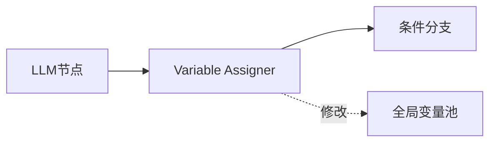
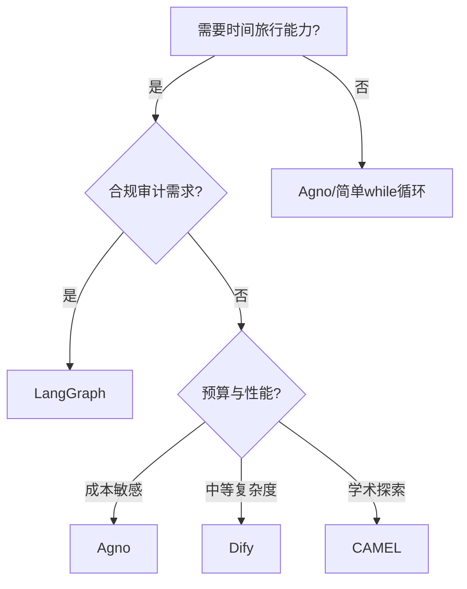

## 时间旅行的架构定义

在软件工程中，词汇的精确性至关重要。

所谓"时间旅行"（Time Travel），指的是加载历史某个特定时刻的状态（Checkpoint），修改其中的变量（State Mutation），然后从那个分叉点（Fork）继续执行，衍生出新的未来。

这不是"重试"（Retry），也不是"持久化"（Persistence）。前者只是重新运行相同逻辑，后者只是保存最终结果。时间旅行要求系统具备三个原子能力：

**快照加载（Checkpoint Loading）**  
系统能够提取历史执行序列中任意时间戳 $t$ 的完整状态变量 $S_t$。这要求每个计算步骤的状态都被序列化存储，而非仅保留最终态。

**状态突变（State Mutation）**  
允许开发者或系统策略在保持上下文一致性的前提下，对 $S_t$ 中的特定变量 $V$ 进行修改，生成变异状态 $S'_t$。这不是简单的赋值，而是需要理解状态的语义结构（如列表追加 vs 值覆盖）。

**分叉执行（Forking）**  
从 $S'_t$ 点启动一个新的执行线程，该线程与原始执行序列在逻辑上隔离。系统需要维护多条时间线的并存，而不会相互污染。

本文针对2025年底至2026年初的四个主流LLM编排框架——LangGraph、Dify、CAMEL与Agno，通过源码逻辑与架构设计的解构，评估其对时间旅行的原生支持程度。

## LangGraph：Pregel 引擎的强一致性溯源

LangGraph将LLM应用视为显式状态机。其核心设计是：每个图的执行步骤（Superstep）都会触发Checkpointer的持久化动作。

### Checkpointer 架构

LangGraph的持久化层采用插件化设计，支持从简单的`MemorySaver`到生产级的`PostgresSaver`。其时间旅行的实现依赖于二元寻址：

- `thread_id`：标识一个执行会话（对话或工作流实例）
- `checkpoint_id`：标识该会话中的某个具体快照点

当工作流在`thread_id: A`下执行时，系统为每个节点的输出生成唯一的`checkpoint_id`。每个快照`StateSnapshot`包含：

```python
@dataclass
class StateSnapshot:
    values: dict          # 状态变量的当前值
    next: tuple[str]      # 下一步将执行的节点
    config: dict          # 运行配置（包含checkpoint_id）
    metadata: dict        # 时间戳、父快照ID等元信息
    created_at: str       # 快照创建时间
    parent_config: dict   # 父快照的引用（支持回溯）
```

这种设计不仅记录"数据是什么"，还记录"逻辑运行到了哪里"。

### 状态突变的 Reducer 机制

LangGraph的`update_state()`不是简单赋值。它引入了Reducer概念，处理累积型变量：

```python
from typing import Annotated
from operator import add

class State(TypedDict):
    messages: Annotated[list, add]  # 追加模式
    counter: int                     # 覆盖模式
```

当调用`update_state({"messages": [new_msg]})`时，`new_msg`会被追加到历史中，而非覆盖。这在处理对话历史时至关重要。

### 分叉操作的实现

LangGraph的分叉通过`get_state_history()`和`update_state()`配合实现：

```python
# 1. 获取历史快照列表
history = graph.get_state_history(config)

# 2. 选择第5个快照
target_snapshot = list(history)[5]

# 3. 修改状态（不破坏原快照）
graph.update_state(
    target_snapshot.config,
    {"counter": 100}  # 注入新值
)

# 4. 从修改后的状态继续执行
result = graph.invoke(None, target_snapshot.config)
```

关键点：`update_state()`不修改原始快照，而是创建一个新快照（新的`checkpoint_id`），从而实现逻辑分叉。

| 维度 | 技术实现 | 工程意义 |
|------|---------|---------|
| **快照粒度** | 节点级（Per-node superstep） | 可回溯到任意逻辑节点执行前后 |
| **寻址模式** | (thread_id, checkpoint_id) | 实现类MVCC的执行分支管理 |
| **存储格式** | 序列化二进制或JSON | 保证跨环境的状态一致性 |
| **恢复机制** | invoke(None, config) | 符号执行而非重新开始 |

## Dify：队列引擎的节点级重试

Dify的架构演进到基于Celery/Redis的队列引擎，改善了并行分支管理。但其"时间旅行"更多体现在调试模式的节点重试，而非系统级状态分叉。

### Variable Assigner 的局部突变

Dify引入了`Variable Assigner`节点，允许在工作流中显式修改变量：



这满足了"状态突变"的表层需求，但存在关键缺陷：

**作用域混乱**  
在复杂的并行分支中，Dify难以保证一个分支的状态突变不干扰另一个分支。变量池是全局共享的，缺乏分支隔离。

**历史覆盖风险**  
Dify的修订历史（Revision History）在v1.11.4版本曝出逻辑缺陷：查看历史版本会自动覆盖当前草稿。这反映了"配置版本"与"执行状态"隔离的缺失。

### 灵活的执行起点

Dify支持从任意节点开始执行（Flexible Execution Start Points），这对局部重试有效。但由于缺乏不可变快照机制，当执行从历史节点重启时，其上下文环境依赖当前全局状态，而非历史时刻的精确镜像。

**判决**：Dify提供了"时间旅行"的用户界面（调试模式可点击节点重新运行），但没有"时间旅行"的编程接口（无法在代码中调用`dify.fork_state(step=5, new_vars={...})`）。

## Agno：极简主义的会话状态

Agno（原Phidata）走的是极致简洁路线。其核心状态载体是`session_state`字典。

### SqlWorkflowStorage 的持久化

Agno使用`SqlWorkflowStorage`实现状态持久化。当工作流结束或手动调用`write_to_storage()`时，当前的`session_state`字典被整体序列化存入数据库：

| 特性 | Agno实现 | 与时间旅行的相关性 |
|------|---------|------------------|
| **状态载体** | 扁平/嵌套的Python字典 | 易于突变，但缺乏细粒度版本控制 |
| **持久化触发** | 工作流启动加载，结束时保存 | 仅保存"最终态"，不支持中间过程回溯 |
| **缓存机制** | 基于session_state的结果缓存 | 可通过缓存重放实现部分效果 |
| **性能表现** | 实例化耗时 ~2µs | 高性能使大规模并行分叉在成本上可行 |

### 架构哲学的权衡

Agno的设计理念是"Python原生"，规避了复杂的图抽象。它宣称比LangGraph快529倍，原因是：**不做每一步的深层状态快照**。

这是典型的性能与能力的权衡。Agno没有原生提供"加载旧快照并分叉"的API。如需实现，开发者必须在应用层手动管理多个`session_id`。

**判决**：Agno支持会话持久化，但这只是"存档"而非"时间旅行"。你可以关机明天继续聊，但不能"回到昨天第三句话，把参数A改成B，生成平行宇宙"。

## CAMEL：存储模块化的松散控制

CAMEL作为多智能体角色扮演框架，其状态管理分布在Storage模块中。它将存储抽象为Key-Value和VectorDB两大类。

### Message Log 的记忆注入

在CAMEL中，"状态"通常被定义为`BaseMessage`序列。虽然CAMEL允许通过`record_message()`手动向内存注入历史信息，改变Agent后续决策，但这更像"记忆注入"而非"计算状态回溯"。

```python
# 手动切片历史并重新运行
chat_history = agent.get_history()
truncated = chat_history[:5]  # 截取前5轮
agent.init_chat(history=truncated, new_prompt="...")
```

这不是时间旅行，这是Python的List Slicing。这是语言特性，不是框架特性。

**判决**：CAMEL提供了存储层接口，但缺乏框架级的原子快照隔离机制。时间旅行需要开发者在业务代码中硬编码实现。

## 资源代价的量化对比

时间旅行不是免费的。随着执行步数 $N$ 的增加，全量快照存储带来显著开销。

| 框架 | 状态持久化成本 | 分叉灵活性 | 溯源可靠性 | 典型应用场景 |
|------|--------------|----------|----------|------------|
| **LangGraph** | 极高（全量Checkpoint） | 极高（ID级隔离） | 极强（不可变快照） | 金融审计、法律Agent |
| **Dify** | 中（数据库记录） | 中（手动跳转） | 一般（覆盖风险） | 企业RAG、低代码流程 |
| **Agno** | 极低（单Session镜像） | 弱（需手动管理ID） | 一般（仅最终态） | 高并发客服、轻量自动化 |
| **CAMEL** | 低（Message Log） | 中（手动构造Context） | 弱（缺乏框架保护） | 学术研究、多角色模拟 |

在2026年的性能基准测试中，Agno创建带1个工具的Agent比LangGraph快近10,000倍，内存消耗仅2.5KB vs 137KB。这背后的代价是：**Agno放弃了中间状态的版本控制**。

## 源码层面的真实性验证

### LangGraph：执行引擎级支持

LangGraph的核心`Pregel`类将状态管理与拓扑执行解耦。在`Pregel.invoke()`过程中：

1. 检查`config`中是否带有`checkpoint_id`
2. 若存在，调用`checkpointer.get(checkpoint_id)`恢复运行内存
3. 定位到对应的`next_nodes`
4. 从该点继续执行，而非从头开始

这是指令级的恢复能力，是精准时间旅行的基石。

### Dify：应用层逻辑模拟

Dify的"恢复"逻辑在`WorkflowCycleManage`层面，更像是"带书签的脚本"。当用户点击重试时，它根据数据库中记录的"最后成功节点"重新触发后续节点执行。

由于缺乏对中间堆栈、局部变量及LLM KV缓存的精确快照，其时间旅行在处理高度动态的状态突变时容易出现状态漂移。

### Agno与CAMEL：外挂式存储

这两者本质是无状态（Stateless）驱动程序。状态持久化像是外挂的"记事本"。你可以手动在记事本上修改内容并重新运行程序，但这不是框架级的时间旅行机制。

## 技术选型的决策树



**高风险决策场景**  
涉及金融、法律、医疗的系统，LangGraph是唯一的合规选择。其Checkpoint机制提供完整的审计追踪（Audit Trail）。当发生误判时，审计员可回溯到决策时刻，修改风险系数变量，重放执行以证明决策逻辑的公正性。

**大规模高并发场景**  
需要同时支撑数万个简单Agent会话（如电商导购），Agno的高性能架构更合适。虽然缺乏原生时间旅行API，但其低延迟和低内存足迹意味着可以更廉价地通过多实例并行探索分歧路径。

**知识导向的低代码开发**  
主要依赖知识库（RAG）且逻辑相对固定的企业工具，Dify提供最佳性价比。虽然在状态溯源上存在漏洞，但其可视化画布和队列引擎足以应对大多数线性或简单分支的工作流。

**学术探索与多智能体实验**  
CAMEL提供最灵活的基础设施。由于没有强加复杂的图管理层，研究员可以自由地在存储层之上构建自定义的MCTS或搜索算法，探索多Agent协作的最优解。

## 架构真相的冷峻判决

源码揭示了一个事实：**目前只有LangGraph真正实现了分布式执行状态的原子快照与分叉机制**。

其他框架所谓的"时间旅行"，大多是基于数据库CRUD实现的逻辑模拟。这不是批评，而是架构权衡的必然结果。

LangGraph的架构虽然重，但建立在正确的计算机科学原理之上——状态的不可变性与显式转换。对于追求极致确定性和复杂分歧路径管理的开发者，忍受其学习曲线和存储成本是通往"可重构未来"的必然代价。

相反，Dify和Agno的流行反映了工业界对开发效率的极度渴求。然而，作为架构师，必须预见到：当这些轻量级应用需要深度溯源或在复杂故障中自愈时，由于底层缺乏时间旅行的原生语义支持，应用层将背负巨大的技术债务。

**最终调研结果**：
- **LangGraph**：深度支持。通过Checkpointer实现原生快照、突变与分叉
- **Dify**：部分支持。仅限节点级重试与手动变量修改，缺乏系统级分叉快照隔离
- **Agno**：基础支持。通过全局Session缓存模拟，缺乏细粒度版本控制与回溯
- **CAMEL**：手动支持。提供存储层接口，但需开发者自行实现时间旅行逻辑

在代码即真相的时代，开发者应根据应用对"历史确定性"的敏感程度，谨慎选择底层执行引擎。架构决策不是零和游戏，而是在能力、性能、复杂度三者间找到项目特定的平衡点。
