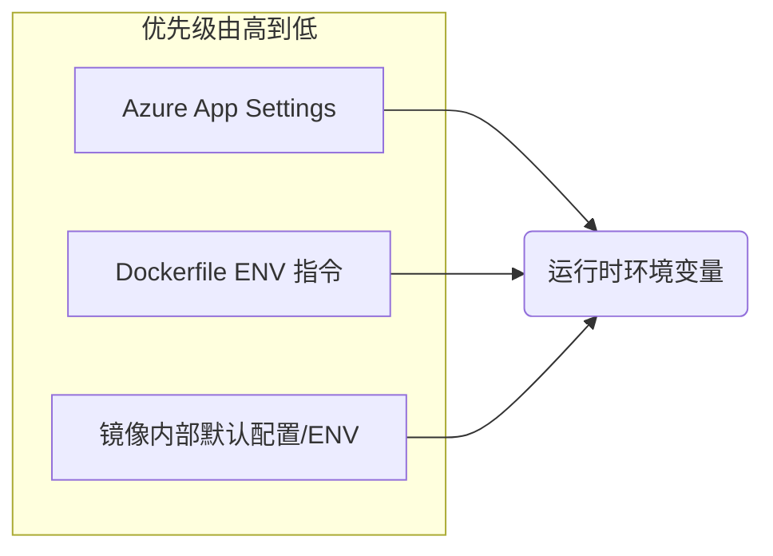

> 面向 LLM 工程师与 DevOps 架构师的 Azure Container Registry (ACR) 与 Web App for Containers 部署流程与高级配置实战。

**文档信息**
- 作者: Alden
- 创建时间: 2025-11-13
- 环境: Azure China Cloud (世纪互联)

| ENV | ResourceGroup | ACR | Web App |
|:---|:---|:---|:---|
| dev | ChatBot_DevelopTest | acrchatbottst | chatbottest |
| prod | ChatBotService | acrchatbotprd | chatbotprod |

## 部署流程架构概览

标准容器化交付流程，聚焦 Azure CLI 自动化实现。

```

[本地镜像构建/更新] → [ACR身份认证与推送] → [App Service容器配置与AppSettings] → [应用重启与健康检查]

````

---

## 核心部署流程实战

### 1. Azure CLI 环境准备与订阅切换

确保 Az CLI 处于正确的订阅上下文。Azure China 环境需特别注意登录端点。

#### 登录与环境检查

```bash
# 检查当前登录状态与默认订阅
az account show

# Azure 中国区登录流程
az login

# 设备代码登录页面: [https://microsoft.com/deviceloginchina](https://microsoft.com/deviceloginchina)
# 根据提示输入代码完成认证
````

#### 切换至目标订阅

**推荐使用订阅 ID 进行精确切换**，避免名称冲突。

```bash
# 查看所有可用订阅
az account list --output table

# 切换到目标订阅
az account set --subscription <SUBSCRIPTION_ID>

# 验证当前上下文
az account show --query "{Name:name, ID:id}" -o table
```

-----

### 2\. 资源定位与依赖性检查

部署前先定位 ACR 和 Web App 资源。

#### 锁定 ACR 实例

查询订阅下所有 ACR 实例，获取目标 ACR 的 Login Server FQDN。

```bash
# 全局搜索 ACR 实例名称
az acr list --query "[].name" -o tsv

# 查看 ACR 详细信息，获取 Login Server FQDN
az acr show --name acrchatbottst --query "{Name:name, LoginServer:loginServer, ResourceGroup:resourceGroup}" -o table
```

**输出示例**

```
Name              LoginServer                     ResourceGroup
----------------- ------------------------------- ------------------------------------
acrchatbottst  acrchatbottst.azurecr.cn     ChatBot_DevelopTest
```

#### 锁定 Web App 资源

```bash
# 列出目标资源组下所有 Web App
az webapp list --resource-group ChatBot_DevelopTest --output table

# 查看特定 Web App 详情，确认当前部署状态
az webapp show --name chatbottest --resource-group ChatBot_DevelopTest --output table
```

-----

### 3\. 镜像推送与注册表认证

通过 Azure AD 身份登录 ACR，获取临时令牌。避免使用 Admin User 静态密钥。

#### 使用 Azure AD 身份登录 ACR

```bash
# 基于当前 az login 的身份进行 Docker 客户端登录
az acr login --name acrchatbottst

# 预期输出: Login Succeeded
```

> `az acr login` 通过 Azure AD 凭证为 Docker 客户端生成短期令牌，比 Admin User 静态密码更符合零信任架构。
{: .prompt-info }

#### 标记与推送本地镜像

本地镜像需标记为 ACR 注册表完整路径。

```bash
# 格式: docker tag <本地镜像:标签> <ACR登录服务器>/<仓库名>:<标签>
docker tag -api-service:dev-feat-async acrchatbottst.azurecr.cn/-api-service:dev-feat-async

# 推送镜像
docker push acrchatbottst.azurecr.cn/-api-service:dev-feat-async
```

#### 验证镜像推送

检查目标仓库中的标签列表。

```bash
# 查看仓库中的所有标签
az acr repository show-tags --name acrchatbottst --repository -api-service --orderby time_desc --output table
```

-----

### 4\. App Service 容器配置与应用设置 (App Settings)

容器部署的核心在于正确配置镜像源和服务端口。

#### 容器镜像更新

CLI 单条命令完成镜像路径和标签更新。

```bash
az webapp config container set \
  --name chatbottest \
  --resource-group ChatBot_DevelopTest \
  --docker-custom-image-name acrchatbottst.azurecr.cn/-api-service:dev-feat-async \
  --docker-registry-server-url [https://acrchatbottst.azurecr.cn](https://acrchatbottst.azurecr.cn)
```

#### 环境变量配置与管理

Web App for Containers 中，**App Settings 即容器内环境变量**。`WEBSITES_PORT` 是容器启动的关键配置。

> **Critical:** 必须设置 `WEBSITES_PORT` 环境变量，值需与容器内应用实际监听端口一致（如 Uvicorn/Gunicorn 监听端口）。否则 App Service 无法将流量路由到应用，导致 503 错误。
{: .prompt-danger }

```bash
# 批量设置关键环境变量 (KEY=VALUE 格式)
az webapp config appsettings set \
  --name chatbottest \
  --resource-group ChatBot_DevelopTest \
  --settings WEBSITES_PORT=8055 LOG_LEVEL=INFO ENVIRONMENT=production

# 验证所有环境变量 (注意：安全敏感值可能被隐藏)
az webapp config appsettings list \
  --name chatbottest \
  --resource-group ChatBot_DevelopTest \
  --output table

# 删除不再需要的环境变量
az webapp config appsettings delete \
  --name chatbottest \
  --resource-group ChatBot_DevelopTest \
  --setting-names OLD_VAR_NAME
```

#### 应用重启

配置更改和镜像更新后需重启应用。

```bash
az webapp restart --name chatbottest --resource-group ChatBot_DevelopTest
```

-----

## 关键概念与高阶解读

### 容器注册表 ACR 身份验证模型

| 命令 | 目的 | 授权对象 |
|:---|:---|:---|
| `az login` | 登录 Azure 资源管理器 (ARM) | Azure CLI (用于管理：创建、查看、更新资源) |
| `az acr login` | 登录 ACR 注册表 | Docker 客户端 (用于数据操作：`docker push`/`pull`) |

**ACR Admin User (静态凭证) 与 Azure AD (动态凭证)**

| 状态 | 安全性 | 适用场景 | 备注 |
|:---|:---|:---|:---|
| **False (推荐)** | 高 - 基于 RBAC，短期令牌 | 生产环境、CI/CD (使用服务主体/托管标识) | 遵循最小权限原则 |
| **True** | 低 - 静态密码，泄露风险高 | 仅用于无法使用 Azure AD 的遗留工具/本地调试 | 仅在特殊情况下启用 |

-----

### App Service 环境变量优先级

变量加载顺序决定最终生效值。



**优先级规则**: **App Settings** (由 Azure 注入) \> **Dockerfile ENV** \> **镜像内默认/硬编码**。

-----

## 常见问题排查与高级解决方案

### 故障 1：App Service 无法拉取镜像 (401 Unauthorized)

**症状**: 部署日志显示 `"Failed to pull image: unauthorized: authentication required"`

**根因**: Web App 缺乏从 ACR 拉取镜像的权限。

#### 高级解决方案：使用系统分配的托管标识 (MSI)

最安全方案，避免在 App Settings 中存储静态凭证。

```bash
# 步骤 1: 为 Web App 启用系统分配的托管标识 (System-Assigned Managed Identity)
az webapp identity assign --name chatbottest --resource-group ChatBot_DevelopTest

# 获取 MSI 的 Principal ID (作为分配角色时的 Assignee)
MSI_PRINCIPAL_ID=$(az webapp identity show --name chatbottest --resource-group ChatBot_DevelopTest --query principalId -o tsv)

# 步骤 2: 为此 MSI 授予 ACR Puller 角色
# 确保角色分配作用域指向 ACR 资源
ACR_ID=$(az acr show --name acrchatbottst --query id -o tsv)

az role assignment create \
  --assignee $MSI_PRINCIPAL_ID \
  --role AcrPull \
  --scope $ACR_ID
```

> 启用 MSI 并授予 `AcrPull` 权限，App Service 通过 Azure AD 身份访问 ACR，无需管理密钥或密码。
{: .prompt-tip }

### 故障 2：容器启动超时 (503 Service Unavailable)

**症状**: 部署成功，但应用无法访问，日志显示 `"Container didn't respond to HTTP pings..."`

**根因**:

1.  容器应用监听端口与 `WEBSITES_PORT` 不匹配。
2.  容器应用启动时间过长，超过平台限制。

#### 诊断与解决方案

1.  **端口匹配验证** (P0 优先级)


```bash
# 确认 WEBSITES_PORT 设置
az webapp config appsettings list --name chatbottest --resource-group ChatBot_DevelopTest --query "[?name=='WEBSITES_PORT'].value" -o tsv
# 确认应用代码或 Dockerfile 实际监听的端口
```

2.  **启动超时调整**

LLM 服务容器启动时间较长，需调整超时限制。

```bash
# 设置容器启动超时至 300 秒 (5 分钟)
az webapp config appsettings set \
  --name chatbottest \
  --resource-group ChatBot_DevelopTest \
  --settings WEBSITES_CONTAINER_START_TIME_LIMIT=300

# 重启应用以应用新配置
az webapp restart --name chatbottest --resource-group ChatBot_DevelopTest
```

3.  **实时日志跟踪**

通过 `log tail` 持续查看容器 stdout/stderr 输出。

```bash
az webapp log tail \
  --name chatbottest \
  --resource-group ChatBot_DevelopTest
```

-----

## CI/CD 集成与自动化范例

### GitHub Actions 自动化部署流程

基于服务主体 (Service Principal) 的 CI/CD 模板。

```yaml
name: Container CI/CD to Azure Web App

on:
  push:
    branches: [ main ]
  workflow_dispatch:

env:
  ACR_NAME: ${{ secrets.ACR_NAME }}
  IMAGE_NAME: -api-service
  WEBAPP_NAME: chatbottest
  RG_NAME: ChatBot_DevelopTest
  TAG: ${{ github.sha }}

jobs:
  deploy:
    runs-on: ubuntu-latest
    steps:
      - uses: actions/checkout@v4
      
      # 1. Azure 登录 (使用服务主体凭证)
      - name: Azure Login
        uses: azure/login@v2
        with:
          creds: ${{ secrets.AZURE_CREDENTIALS }} # 服务主体 JSON
          enable-AzPSSession: true
      
      # 2. Docker 构建与推送至 ACR
      - name: Build and Push Docker Image
        run: |
          ACR_LOGIN_SERVER=$(az acr show --name $ACR_NAME --query loginServer -o tsv)
          IMAGE_FQDN=$ACR_LOGIN_SERVER/$IMAGE_NAME:$TAG
          
          # 使用 az acr login 进行 Docker 登录
          az acr login --name $ACR_NAME
          docker build -t $IMAGE_FQDN .
          docker push $IMAGE_FQDN

      # 3. 部署到 Web App for Containers
      - name: Deploy to Azure Web App
        uses: azure/webapps-deploy@v2
        with:
          app-name: ${{ env.WEBAPP_NAME }}
          resource-group: ${{ env.RG_NAME }}
          images: ${{ env.ACR_NAME }}.azurecr.cn/${{ env.IMAGE_NAME }}:${{ env.TAG }}
```

{: file=".github/workflows/deploy.yml" }

> `secrets.AZURE_CREDENTIALS` 通过 `az ad sp create-for-rbac` 生成，需具备 Contributor 或自定义部署角色权限。
{: .prompt-info }

-----

## 最佳实践与工程建议

| 领域 | 实践 | 收益 |
|:---|:---|:---|
| **身份验证** | Web App 访问 ACR 使用系统托管标识 (MSI) + AcrPull RBAC。 | 零密码管理，动态令牌，符合零信任架构。|
| **镜像标签** | 使用 Git SHA 或语义化版本 (`v1.2.3`)，禁用 `latest` 标签。 | 部署可追溯，支持快速回滚。 |
| **网络安全** | 生产环境 ACR 启用私有端点，Web App 通过 VNet 集成访问。 | 流量不经公网，满足合规要求。 |
| **配置管理** | 敏感配置使用 Deployment Slot Setting 标记为粘滞 (sticky)。 | 蓝绿部署时关键密钥不会随 Slot 交换。 |
| **容器端口** | 显式设置 `WEBSITES_PORT` 环境变量。 | 确保 App Service 反向代理正确路由到容器监听端口。 |

-----

## 参考链接

  - Azure CLI 文档: [https://docs.azure.cn/cli/](https://docs.azure.cn/cli/)
  - App Service Linux 容器配置: [https://docs.azure.cn/app-service/containers/](https://docs.azure.cn/app-service/containers/)
  - Azure 托管标识: [https://docs.azure.cn/active-directory/managed-identities-azure-resources/](https://www.google.com/search?q=https://docs.azure.cn/active-directory/managed-identities-azure-resources/)
