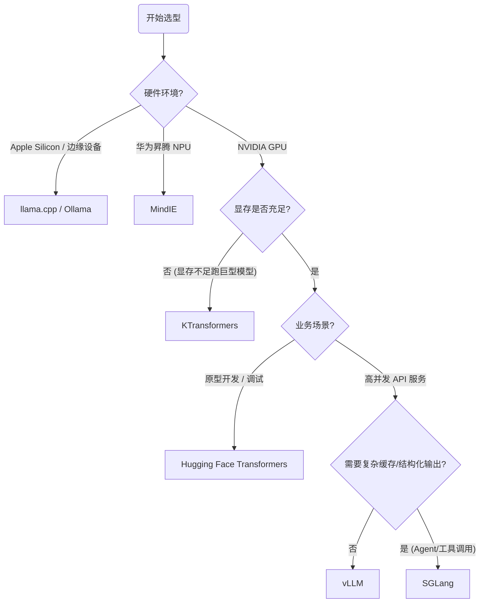

在 LLM 的工程化落地中，模型权重仅仅是“静态的代码”，而推理引擎则是负责加载、调度并执行这些代码的**“运行时环境（Runtime）”**。

> **背景视角：为什么需要推理引擎？**
>
> 对于有技术背景的开发者而言，理解推理引擎的本质，实际上就是理解如何在一个受限的硬件环境（有限的显存容量、受限的内存带宽、固定的计算单元）中，对一个计算密集型且访存密集型的进程进行**极致的资源调度与优化**。
{: .prompt-info }

为了帮助开发者快速选型，我们在深入技术细节之前，首先总结了主流引擎的核心特性对比与决策建议。

## 🧭 核心结论：技术栈决策指南

我们将各引擎的关键特性与 **操作系统概念** 进行映射，助你快速做出架构决策：

| 引擎 | OS 类比 | 最佳场景 | 关键技术 |
| :--- | :--- | :--- | :--- |
| **Transformers** | 解释型语言 | 原型验证、代码调试 | 动态图 (Eager Execution) |
| **llama.cpp** | 嵌入式 C (裸机) | 端侧设备 (Mac/IoT) | 量化 (GGUF), SIMD/Metal |
| **vLLM** | 操作系统 (分页) | 生产环境、高并发 API | PagedAttention, Continuous Batching |
| **SGLang** | 缓存系统 (L2 Cache) | 复杂 Agent、多轮对话 | Radix Attention, 结构化生成 |
| **KTransformers** | 交换分区 (Swap) | 单机跑巨型模型 | 异构计算 (CPU+GPU Offload) |
| **MindIE** | 新指令集 (RISC) | 国产算力 (华为昇腾) | CANN, NPU 优化 |

### 选型建议

请根据您的具体使用场景参考以下路径：

1.  **个人玩家 / Mac 用户**：首选 **llama.cpp**。
    > **Ollama 用户请注意**
    > 广受欢迎的 Ollama 工具，其底层核心正是封装了 `llama.cpp`。它提供了一套易用的命令行与服务接口，而非独立的推理引擎。
    {: .prompt-tip }
2.  **企业服务 / API 开发**：首选 **vLLM**。
    *   *进阶需求*：若涉及复杂 Prompt 复用（如长 System Prompt）或需强制 JSON 输出，建议升级为 **SGLang**。
3.  **硬件受限跑大模型**：显存不够内存来凑，使用 **KTransformers**。
4.  **信创国产化**：基于华为昇腾硬件，必须使用 **MindIE**。



---

## 三大里程碑引擎深度剖析

下面将重点剖析大模型推理领域的三大里程碑——**Transformers**、**llama.cpp** 与 **vLLM** 的技术本质。

### 1. Transformers：解释型语言般的通用基准

Hugging Face 的 Transformers 库在 LLM 领域的地位，类似于编程语言中的 **Python 标准库**。它是所有模型架构的基准实现，强调通用性、易读性与兼容性。

#### 核心机制：Eager Execution (动态图)
Transformers 采用动态图模式。在推理过程中，每一步都会完整调用深度学习框架（如 PyTorch）的算子。这种方式逻辑清晰，代码与模型结构一一对应，非常适合学习。

#### 内存模型：连续分配的痛点
其性能瓶颈往往不在于“内存对齐”，而在于 **KV Cache** 的连续内存分配策略。

*   **搬运而非复用**：在 PyTorch 原生实现中，KV Cache 通常要求在逻辑和物理上都是连续的。随着对话序列的增长（Token 增加），系统往往需要重新申请更大的连续显存块，并将旧数据拷贝过去（Concat 操作）。
*   **显存碎片与浪费**：这种方式类似于 C++ `std::vector` 的扩容机制，不仅导致显存碎片化，预分配策略也会造成大量显存闲置，极大地限制了 Batch Size 的提升。

> **适用场景**：代码验证与原型开发。就像写算法题优先用 Python 验证逻辑，Transformers 兼容性最强，适合调试 Output Logits、理解模型结构或进行学术研究。
{: .prompt-info }

### 2. llama.cpp：嵌入式思维下的“裸机”优化

如果 Transformers 是高层的脚本语言，`llama.cpp` 就是针对特定硬件手写的 **嵌入式 C/C++ 代码**。它的核心哲学是在通用消费级硬件上极致“压榨”性能，打破 NVIDIA GPU 的垄断。

#### 核心技术：量化 (GGUF) 与 内存墙突破
`llama.cpp` 引入了 **GGUF** (GPT-Generated Unified Format) 格式。这不仅是一种支持 `mmap`（内存映射）的快速加载格式，更统一了元数据存储。

*   **精度换带宽**：LLM 推理本质上受限于内存带宽而非计算速度。GGUF 将 FP16 权重压缩至 4-bit 甚至更低，不仅减少了显存占用（让 8G 显存跑 7B 模型成为可能），更重要的是大幅减少了从显存搬运数据到计算单元的时间，从而显著提升推理速度。

#### 计算优化：异构加速与 SIMD
它不依赖庞大的 CUDA 运行时，而是针对不同架构手写底层优化：
*   **CPU 端**：使用 AVX-512 (x86) 或 NEON (ARM) 等 SIMD 指令集进行并行计算。
*   **Apple Silicon**：深度集成 Metal API，利用苹果统一内存架构（Unified Memory），让 CPU 和 GPU 协同工作。

> **适用场景**：端侧部署。在无高端 NVIDIA GPU 的环境（如手机、MacBook、树莓派）下运行 LLM 的最佳选择。
{: .prompt-tip }

### 3. vLLM：引入操作系统的“分页内存管理”

当场景从个人实验转变为企业级高并发服务器时，瓶颈变成了 **显存利用率** 和 **吞吐量**。vLLM 的出现是里程碑式的，它引入了操作系统的核心思想。

#### 架构创新：PagedAttention
vLLM 的核心贡献是将操作系统中 **虚拟内存** 和 **分页** 的概念引入了 KV Cache 管理。

*   **非连续物理内存**：PagedAttention 允许逻辑上连续的 Key/Value 向量，在物理显存中分散存储在不连续的内存页（Blocks）中。
*   **消除碎片**：这彻底消除了因预分配不足或扩容导致的“内部碎片”和“外部碎片”，使得显存利用率接近理论极限。

#### 性能表现：Continuous Batching
得益于高效的内存管理，vLLM 实现了 **Continuous Batching（连续批处理）**。它不需要等待一个 Batch 中所有请求都生成完毕才处理下一个，而是能在任意时刻插入新请求或释放已完成请求的资源。这使其成为了构建企业级 LLM 服务的工业标准。

---

## 进阶生态与特化引擎

除了上述三大主流框架，还有针对特定技术栈或硬件环境优化的引擎。

### 算子编程与中间件
*   **Triton (语言/编译器)**：由 OpenAI 开发，它不是 vLLM 的附属，而是一种类似 Python 的 GPU 编程语言。它旨在替代复杂的 CUDA C++ 开发，允许开发者高效编写矩阵乘法与 FlashAttention 等算子。vLLM、Unsloth 等框架底层均大量使用了 Triton 编写的算子来加速计算。

### 复杂调度与 Agent 优化
*   **SGLang (结构化与缓存)**：虽然 SGLang 借鉴了 vLLM 的部分思想，但它是一个独立的推理引擎。其核心创新在于：
    1.  **Radix Attention**：基于前缀树（Radix Tree）管理 KV Cache，实现了跨请求的 Prompt 缓存（自动识别并缓存多轮对话或 Agent 任务中的公共前缀）。这就像 CPU 的 **L2 Cache**，实现“一次计算，多次复用”。
    2.  **结构化生成**：原生支持强制模型输出符合 JSON Schema 或 Regex 格式，非常适合工具调用（Function Calling）场景。

### 异构与国产化
*   **KTransformers (异构卸载)**：清华大学推出的框架。它通过层级或算子级的异构调度，将模型的冷数据（如部分权重）Swap 到 CPU 内存，热数据留在 GPU。
    > **MoE 的福音**
    > 虽然支持稠密模型，但它对 MoE (混合专家模型) 的优化尤为显著。利用 MoE 的稀疏激活特性，仅计算被激活的专家模块，使得在单张 24G 显存的卡上流畅运行 **DeepSeek-67B/V3** 等巨型模型成为可能。
    {: .prompt-info }

*   **华为 MindIE (硬件抽象)**：在国产化路径上，MindIE 是华为昇腾（Ascend）硬件的专用运行时。它底层对接 CANN（对标 CUDA），针对 NPU 的 Cube Unit 进行了深度优化，是在非 NVIDIA 硬件上进行高性能推理的关键基础设施。
```