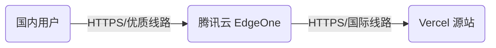

## 1. 背景与问题分析

### 1.1 现状（2025年）

对于前端开发者而言，Vercel 是部署 Next.js/Vue 等静态或 Serverless 站点的首选平台。然而，在中国大陆地区，Vercel 面临着严重的访问体验问题：

*   **网络阻断与高延迟**：Vercel 官方提供的 Anycast IP（如 `76.76.21.21`）及默认域名 `cname-china.vercel-dns.com`{: .filepath} 在国内的连通性逐年下降，常出现丢包、重置（RST）或高达 300ms+ 的延迟。
*   **SSL 握手失败**：由于网络干扰，HTTPS 握手阶段经常超时。

### 1.2 需求目标

我们需要一个“中间层”来代理流量，具体要求如下：

1.  **低成本**：尽量免费，或者控制在极低的一年一付成本内。
2.  **高性能**：显著降低国内访问延迟，解决丢包问题。
3.  **低维护**：不希望自行维护复杂的 VPS 运维工作（如系统更新、防火墙配置）。
4.  **HTTPS 自动化**：自动管理 SSL 证书。

---

## 2. 方案选型与架构设计

在对比了自建 VPS 反向代理、Cloudflare SaaS 优选 IP 等方案后，最终选择了 **腾讯云 EdgeOne（边缘安全加速平台）**。

### 2.1 架构拓扑



### 2.2 选型理由

*   **EdgeOne 个人免费版**：提供每月 50GB 流量 + 300 万次请求，包含 HTTP/3、Brotli 压缩等高级功能，完全满足个人博客或小型项目需求。
*   **线路优势**：即使是免费版（非中国大陆加速区域），其提供的香港/新加坡节点对国内 ISP 的 peering（互联）质量远优于 Vercel 直连美国。
*   **全托管 SSL**：内置免费证书申请与续期，无需在源站处理证书。

---

## 3. 前置准备：域名策略（关键）

### 3.1 为什么必须要有自定义域名？

在实战中，许多开发者试图直接在 EdgeOne 中添加 `project.vercel.app`，这是不可行的。

> ⚠️ **注意：** CDN/WAF 类产品要求用户拥有域名的 DNS 解析权限（NS 记录或 CNAME 权限）。我们需要构建 `User -> Custom Domain -> Vercel Domain` 的链路。
{: .prompt-warning }

### 3.2 成本控制策略

为了极致的低成本，建议在阿里云、腾讯云等注册商购买冷门后缀域名。

*   **推荐后缀**：`.top` / `.xyz` / `.club` / `.site`
*   **成本**：首年通常仅需 **6 - 15 CNY**。
*   **实名认证**：根据《互联网域名管理办法》，在大陆注册商购买域名必须创建"信息模板"并完成实名认证（上传身份证），否则域名会处于 `ServerHold`{: .filepath} 状态无法解析。

> **实战案例**：在本教程中，我们以购买阿里云的 `.club` 域名为例，年费仅约 10 元。
{: .prompt-info }

---

## 4. 实施步骤：EdgeOne 配置详解

### 4.1 创建站点

1.  登录 [腾讯云 EdgeOne 控制台](https://console.cloud.tencent.com/edgeone)。
2.  点击 **“添加站点”**。
3.  输入你刚购买的自定义域名（例如 `happytest.club`）。
4.  **套餐选择**：务必选择 **“个人版 (Personal)”**，这是免费套餐。

### 4.2 接入模式与源站配置（核心难点）

这是最容易出错的环节，涉及反向代理的核心原理：**Host Header 重写**。

进入“源站配置”页面，请严格按以下参数填写：

| 配置项 | 填写值/选择 | 技术解析 |
| :--- | :--- | :--- |
| **加速域名** | `www` (或 `@`) | 定义用户访问的入口，如 `www.happytest.club`。 |
| **源站类型** | **域名 (Domain)** | |
| **源站地址** | `your-project.vercel.app`{: .filepath} | **不要填 IP**。Vercel 的 Anycast IP 会动态变化，填域名利用 DNS 动态解析更稳。 |
| **回源协议** | **HTTPS** | Vercel 强制要求 HTTPS 连接，HTTP 会导致 308 重定向循环或错误。 |
| **回源端口** | `443` | 配合 HTTPS 协议。 |
| **回源 HOST** | **自定义 (Custom)** <br> `your-project.vercel.app`{: .filepath} | **⚠️ 最关键配置**。<br>Vercel 的网关是基于 Host 头分发请求的。如果透传 `www.happytest.club`{: .filepath}，Vercel 不识别该域名（除非你在 Vercel 侧也绑定了该域名），必须重写为 Vercel 分配的二级域名。 |

### 4.3 验证方式选择

EdgeOne 提供三种验证域名权属的方式，推荐选择 **“自动验证”**。

*   **原理**：EdgeOne 会轮询检测该域名是否已 CNAME 指向了 EdgeOne 分配的目标地址。一旦 DNS 生效，即视为验证通过。

---

## 5. DNS 解析与流量切换

配置完成后，EdgeOne 会生成一个 CNAME 目标地址，格式通常为 `*.eo.dnse5.com`{: .filepath} 或 `*.eo.dnsv1.com`{: .filepath}。

### 5.1 配置 CNAME

前往域名注册商（如阿里云 DNS 控制台）：

1.  找到你的域名，点击“解析设置”。
2.  添加记录：
    *   **记录类型**：`CNAME`
    *   **主机记录**：`www` (与 EdgeOne 中配置的加速域名一致)
    *   **记录值**：粘贴 EdgeOne 提供的 `xxxx.eo.dnse5.com` 地址。
    *   **TTL**：默认 10 分钟即可。

### 5.2 验证解析生效

在本地终端（Windows CMD 或 macOS Terminal）使用 `nslookup` 或 `dig` 命令验证：

```bash
nslookup www.happytest.club
```

**预期输出**：

```console
Non-authoritative answer:
Name:    www.happytest.club.eo.dnse5.com  <-- 看到这个别名，说明 CNAME 已接管
Address: 43.174.xxx.xxx                <-- EdgeOne 的边缘节点 IP
Aliases: www.happytest.club
```

---

## 6. SSL/HTTPS 安全配置

很多用户在 DNS 生效后立即访问，会发现浏览器提示“不安全”或证书错误，这是因为证书签发存在延迟。

### 6.1 证书自动化流程

1.  **触发机制**：只有当 EdgeOne 检测到 CNAME 解析生效后，才会向 CA 机构（TrustAsia 或 Let's Encrypt）发起证书申请。
2.  **耗时**：通常需要 **10 - 20 分钟**。
3.  **操作**：在 EdgeOne 后台“HTTPS 配置”中，确保“SSL 状态”为开启。

### 6.2 强制 HTTPS (Force HTTPS)

为了安全性，建议在 EdgeOne 后台开启 **“强制 HTTPS”** 功能。

> 当用户访问 `http://www.happytest.club` 时，EdgeOne 会返回 `301 Moved Permanently` 状态码，自动跳转到 `https://`，确保全程加密。
{: .prompt-tip }

---

## 7. 最终效果验收与故障排查

### 7.1 连通性测试 (Ping)

相比直连 Vercel 的高丢包率，经过 EdgeOne 加速后的网络表现通常如下：

```console
ping www.happytest.club
# 典型结果：
# 往返时间：最短 = 94ms，最长 = 117ms，平均 = 108ms
# 丢失 = 0 (0% 丢失)
```

100ms 左右的延迟对于非大陆直连（通常走香港/新加坡/日本节点）是非常优秀的成绩，最重要的是 **0% 丢包**，保证了页面加载的完整性。

### 7.2 常见错误排查 (Troubleshooting)

| 现象 | 可能原因 | 解决方案 |
| :--- | :--- | :--- |
| **浏览器报 404 / 502** | 回源 Host 配置错误 | 检查 EdgeOne 源站配置，确认 **回源 Host** 选的是"自定义"且填入了 `xxx.vercel.app`{: .filepath}。 |
| **浏览器报 SSL_ERROR...** | 证书未就绪 | DNS 刚生效，证书正在签发中。**等待 15 分钟**后再试。 |
| **Ping 通但无法访问** | 浏览器缓存 | Chrome 开启无痕模式测试，或在终端运行清除 DNS 缓存命令。 |
| **阿里云提示解析冲突** | 存在同名记录 | 删除该域名下原有的 A 记录或 CNAME 记录（如阿里云默认的停车页）。 |

---

## 8. 总结

通过本教程的方案，我们仅花费了**约 10 元人民币/年**（购买域名的费用），就完成了一套企业级的边缘加速架构搭建。

**方案收益对比：**

| 指标 | Vercel 直连 | 腾讯云 EdgeOne 代理 |
| :--- | :--- | :--- |
| **可用性** | 差 (经常被阻断) | **高 (99.9%+)** |
| **延迟** | 300ms+ (不稳定) | **~100ms (稳定)** |
| **丢包率** | 高 | **极低** |
| **SSL 证书** | 易握手超时 | **EdgeOne 边缘终结，秒开** |
| **成本** | 免费 | **几乎免费 (仅域名费)** |

这套方案不仅解决了 Vercel 的访问问题，其原理同样适用于 Netlify、GitHub Pages 等其他境外静态托管服务，是目前个人开发者性价比最高的网络优化实践。