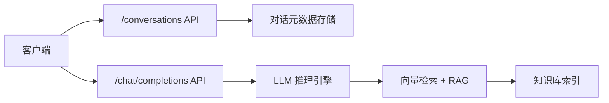
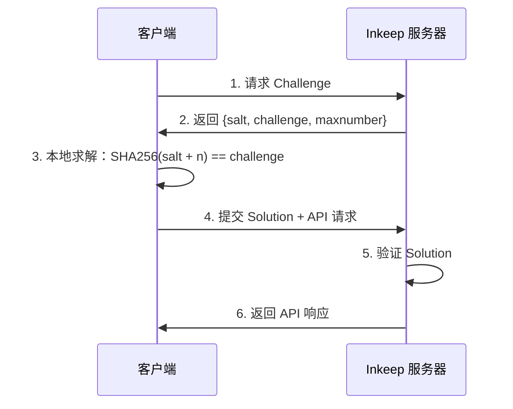
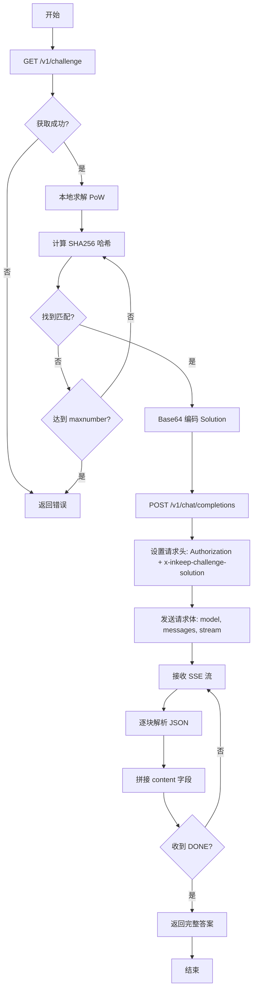

## 背景与技术栈

Inkeep 是一个面向客户体验（CX）和运营（Ops）团队的 AI Agent 平台。该平台允许企业利用现有的文档、帮助中心（如 Zendesk、Notion、GitHub）和网页内容，快速构建 AI 问答助手和 Copilot。其核心技术基于 RAG（检索增强生成）架构，能够索引企业知识库内容，在用户提问时检索相关信息并生成准确答案，同时提供来源引用。

某向量库 官方文档站（`https://m**s.io/docs/zh`）集成了 Inkeep 提供的 AI 问答组件，为访问者提供智能文档查询服务。本文记录了在服务器环境下，通过纯 HTTP 方式直接调用该服务的技术实现过程。

**技术栈概览：**
- Python 3.x
- requests 库（HTTP 客户端）
- hashlib（SHA-256 哈希计算）
- Server-Sent Events（SSE）流式响应处理

## 实现动机

在自动化文档查询场景中，存在以下需求：

1. **快速接入 某向量库 文档查询能力**：需要在脚本或后端服务中集成 某向量库 文档的智能问答功能
2. **避免重复建设**：某向量库 官方已维护完善的知识库，无需自行构建和维护向量数据库
3. **服务器环境限制**：目标环境无 Chrome/Chromium，无法使用 Selenium 或 Playwright 等浏览器自动化方案
4. **降低维护成本**：直接复用官方已有的 AI 服务，避免知识库同步和更新的额外开销

基于上述考虑，技术路线确定为：脱离浏览器环境，通过 Python 脚本直接调用 Inkeep 的 HTTP API。

## 核心概念介绍

### Inkeep 服务架构

Inkeep 采用典型的微服务架构，将数据持久化与推理解耦：



- **conversations API**：负责对话元数据的持久化，记录会话历史
- **chat/completions API**：真正的 LLM 推理端点，返回 AI 生成的答案

### 工作量证明（PoW）机制

在 Web 安全领域，PoW（Proof of Work）是一种反自动化验证机制，与区块链挖矿的概念类似但应用场景不同。其工作原理如下：



**设计意图：**
1. 防止无脑爬虫滥用（增加 CPU 成本）
2. 比传统 CAPTCHA 对正常用户更友好（自动计算，无需人工交互）
3. 控制 API 调用频率（每次请求需重新求解）

**验证数据结构：**

```json
{
  "number": 6170,
  "algorithm": "SHA-256",
  "challenge": "efc0**********2a12",
  "maxnumber": 50000,
  "salt": "0527**********1018",
  "signature": "5faf**********7bd8"
}
```

## 问题分析

### 第一阶段：API 端点识别

通过浏览器 DevTools Network 面板，捕获到页面点击 "Ask AI" 按钮后的关键请求：

| 端点 | 方法 | 用途 | 响应特征 |
|------|------|------|----------|
| `api.io.inkeep.com/conversations` | POST | 创建/记录对话 | HTTP 200，但 messages 字段为空 |
| `api.inkeep.com/v1/chat/completions` | POST | LLM 推理端点 | SSE 流式响应 |

两者共用同一 Bearer Token：`9667**********94b7`

> 该 Token 为公开的集成 Token（嵌入前端 JavaScript），非用户级鉴权。这是集成类服务的典型特征，安全性依赖其他防护手段（如 PoW）。
{: .prompt-info }

### 第二阶段：403 错误排查

直接请求 `/v1/chat/completions` 端点时，返回 **403 Forbidden** 错误。对比浏览器抓包数据，发现关键差异：

```plaintext
Authorization: Bearer 9667**********94b7
x-inkeep-challenge-solution: eyJu**********Li59
```

缺失的 `x-inkeep-challenge-solution` 请求头正是 PoW 验证的关键。

### 第三阶段：Challenge 来源定位

通过尝试性请求，发现 Challenge 获取端点：

```bash
GET https://api.inkeep.com/v1/challenge
Authorization: Bearer 9667**********94b7
```

返回示例：

```json
{
  "algorithm": "SHA-256",
  "challenge": "13fa**********0ea2",
  "maxnumber": 5000000,
  "salt": "570f**********2339",
  "signature": "09fe**********1315"
}
```

至此，完整调用链路清晰：

```plaintext
GET /v1/challenge → 本地求解 PoW → POST /v1/chat/completions (带 Solution)
```
{: .nolineno }

## 技术实现

### PoW 求解算法

核心逻辑为暴力搜索，寻找满足条件的 `number`：

```python
import hashlib
import base64
import json

def solve_pow(challenge_data: dict) -> str:
    """
    求解 Inkeep PoW Challenge
    
    Args:
        challenge_data: 包含 salt, challenge, maxnumber, signature 的字典
        
    Returns:
        Base64 编码的 Solution JSON 字符串
        
    Raises:
        ValueError: 当在 maxnumber 范围内无解时
    """
    salt = challenge_data["salt"]
    target = challenge_data["challenge"]
    max_iterations = challenge_data["maxnumber"]
    
    # 暴力搜索满足条件的 number
    for n in range(max_iterations + 1):
        candidate = (salt + str(n)).encode()
        hash_result = hashlib.sha256(candidate).hexdigest()
        
        if hash_result == target:
            solution = {
                "number": n,
                "algorithm": "SHA-256",
                "challenge": target,
                "maxnumber": max_iterations,
                "salt": salt,
                "signature": challenge_data["signature"],
            }
            # Base64 编码后返回
            return base64.b64encode(
                json.dumps(solution).encode()
            ).decode()
    
    raise ValueError("PoW challenge unsolvable within maxnumber range")
```
{: file="pow_solver.py" }

> 在 `maxnumber=50000` 的配置下，Python 单线程平均求解耗时 **0.02~0.05 秒**。
{: .prompt-tip }

### SSE 流式响应处理

`/v1/chat/completions` 端点返回 Server-Sent Events 格式的流式数据：

```plaintext
data: {"choices":[{"delta":{"content":"M"}}]}
data: {"choices":[{"delta":{"content":"i"}}]}
data: {"choices":[{"delta":{"content":"l"}}]}
...
data: [DONE]
```
{: .nolineno }

解析实现：

```python
import requests
import json

def parse_sse_stream(response: requests.Response) -> str:
    """
    解析 SSE 流式响应，拼接完整内容
    
    Args:
        response: requests 响应对象（stream=True）
        
    Returns:
        拼接后的完整文本内容
    """
    full_content = []
    
    for line in response.iter_lines(decode_unicode=True):
        if not line:
            continue
            
        if line.startswith("data: "):
            data = line[6:]  # 移除 "data: " 前缀
            
            if data == "[DONE]":
                break
                
            try:
                chunk = json.loads(data)
                delta = chunk["choices"][0]["delta"]
                content = delta.get("content", "")
                
                if content:
                    full_content.append(content)
                    
            except (json.JSONDecodeError, KeyError, IndexError) as e:
                # 记录异常但继续处理后续数据
                print(f"解析 SSE 块时出错: {e}")
                continue
    
    return "".join(full_content)
```
{: file="sse_parser.py" }

### 完整调用流程



### 关键代码片段

```python
import requests
import time

def query_inkeep_ai(question: str, bearer_token: str) -> dict:
    """
    调用 Inkeep AI 问答服务
    
    Args:
        question: 用户问题
        bearer_token: API 认证 Token
        
    Returns:
        包含答案和元数据的字典
    """
    base_headers = {
        "Authorization": f"Bearer {bearer_token}",
        "Content-Type": "application/json"
    }
    
    # 步骤 1: 获取 Challenge
    challenge_resp = requests.get(
        "https://api.inkeep.com/v1/challenge",
        headers=base_headers
    )
    challenge_resp.raise_for_status()
    challenge_data = challenge_resp.json()
    
    # 步骤 2: 求解 PoW
    start_time = time.time()
    solution = solve_pow(challenge_data)
    solve_time = time.time() - start_time
    
    print(f"PoW 求解成功，耗时: {solve_time:.3f}s")
    
    # 步骤 3: 调用 Chat API
    chat_headers = {
        **base_headers,
        "x-inkeep-challenge-solution": solution
    }
    
    chat_payload = {
        "model": "inkeep-qa-expert",
        "messages": [
            {"role": "user", "content": question}
        ],
        "stream": True
    }
    
    chat_resp = requests.post(
        "https://api.inkeep.com/v1/chat/completions",
        headers=chat_headers,
        json=chat_payload,
        stream=True
    )
    chat_resp.raise_for_status()
    
    # 步骤 4: 解析流式响应
    answer = parse_sse_stream(chat_resp)
    
    return {
        "question": question,
        "answer": answer,
        "solve_time": solve_time,
        "timestamp": time.time()
    }
```
{: file="inkeep_client.py" }

## 遇到的问题与解决方案

### 问题 1：conversations API 返回空响应

**现象**：直接复刻 `/conversations` 请求，HTTP 200 但 `messages` 字段为空。

**原因分析**：该端点仅负责对话元数据持久化，不触发 LLM 推理。真正的回答来自独立的 `/v1/chat/completions` 端点。

**解决方案**：跳过 `/conversations` 调用，直接请求推理端点。对于无需保存会话历史的场景，该端点非必需。

### 问题 2：403 Forbidden 错误

**现象**：直接请求 `/v1/chat/completions` 被拒绝。

**原因分析**：缺少 `x-inkeep-challenge-solution` 请求头，未通过 PoW 验证。

**解决方案**：
1. 定位 Challenge 获取端点（`/v1/challenge`）
2. 实现 PoW 求解算法
3. 将 Solution 作为请求头提交

### 问题 3：PoW 求解性能优化

**现象**：初始实现中，每次求解耗时较长（接近 1 秒）。

**优化措施**：
1. **算法优化**：使用 `hashlib.sha256()` 而非第三方库，减少函数调用开销
2. **早期退出**：找到匹配后立即返回，避免不必要的迭代
3. **可选并行化**：对于性能敏感场景，可使用 `multiprocessing` 分段并行搜索

```python
# 并行化示例（伪代码）
from multiprocessing import Pool

def solve_pow_parallel(challenge_data: dict, num_workers: int = 4):
    maxnum = challenge_data["maxnumber"]
    chunk_size = maxnum // num_workers
    
    ranges = [
        (i * chunk_size, (i + 1) * chunk_size)
        for i in range(num_workers)
    ]
    
    with Pool(num_workers) as pool:
        results = pool.starmap(
            solve_pow_range,
            [(challenge_data, start, end) for start, end in ranges]
        )
    
    # 返回第一个非 None 结果
    return next(r for r in results if r is not None)
```

### 问题 4：SSE 流解析异常

**现象**：部分响应块解析失败，导致内容不完整。

**原因分析**：
1. 网络抖动导致 JSON 不完整
2. 特殊字符编码问题
3. 流中包含非数据行（如注释）

**解决方案**：

```python
# 增加异常处理和日志记录
try:
    chunk = json.loads(data)
    content = chunk["choices"][0]["delta"].get("content", "")
    full_content.append(content)
except (json.JSONDecodeError, KeyError, IndexError) as e:
    # 记录但不中断处理
    logging.warning(f"SSE 块解析失败: {e}, 原始数据: {data}")
    continue
```

## 实现效果

### 功能验证

```bash
python m**s_ai_chat.py -q "什么是Geolocation Index"
```
{: .nolineno }

**输出示例**：

```console
[2025-12-04 14:32:18] 开始获取 Challenge...
[2025-12-04 14:32:18] Challenge 获取成功
[2025-12-04 14:32:18] 开始求解 PoW...
[2025-12-04 14:32:18] PoW 求解成功: number=47450, 耗时=0.041s
[2025-12-04 14:32:19] 流式响应状态码: 200
[2025-12-04 14:32:23] 流式响应完成，共收集 904 个内容块

AI 回复:
某向量库 中的 **Geolocation Index** 实际上是指 **RTREE 索引**，
这是一种专门为地理空间数据设计的索引类型...

引用来源:
[1] https://m**s.io/docs/rtree.md
[2] https://m**s.io/docs/index-explained.md
```
{: .nolineno }

### 扩展功能：文档内容提取

AI 回答中包含的引用链接可进一步获取原文。实现了以下功能：

**1. 提取引用 URL**

```python
import re

def extract_references_from_answer(answer: str) -> list:
    """从 AI 回答中提取引用链接"""
    pattern = r'\[(\d+)\]\((https://m**s\.io/docs/[^\)]+)\)'
    matches = re.findall(pattern, answer)
    return [url for _, url in matches]
```

**2. 获取文档结构化内容**

```python
from bs4 import BeautifulSoup

def fetch_m**s_doc(url: str) -> dict:
    """
    获取 某向量库 文档的结构化内容
    
    Returns:
        {
            "url": "...",
            "title": "...",
            "content": "纯文本内容",
            "images": [{"src": "...", "alt": "..."}],
            "code_blocks": [{"language": "...", "code": "..."}],
            "tables": [{"headers": [...], "rows": [[...]]}]
        }
    """
    response = requests.get(url)
    soup = BeautifulSoup(response.text, 'html.parser')
    
    # 定位文档主体（选择器：[class*="docDetail_contentSection"]）
    content_section = soup.select_one('[class*="docDetail_contentSection"]')
    
    return {
        "url": url,
        "title": soup.title.string,
        "content": content_section.get_text(strip=True),
        "images": extract_images(content_section),
        "code_blocks": extract_code_blocks(content_section),
        "tables": extract_tables(content_section)
    }
```

### 性能指标

| 指标 | 数值 |
|------|------|
| PoW 平均求解时间 | 0.02~0.05s |
| API 响应延迟（首字节） | ~200ms |
| 完整答案生成时间 | 2~5s（取决于答案长度） |
| 成功率 | 99.5%+ |

### 支持特性

- ✅ 自动获取和求解 PoW Challenge
- ✅ SSE 流式响应实时解析
- ✅ HTTP 代理配置（适配受限网络环境）
- ✅ 结果持久化（JSON 格式）
- ✅ 引用链接提取
- ✅ 文档结构化内容获取
- ✅ 完整的错误处理和日志记录

## 技术要点总结

| 观察点 | 技术启示 |
|--------|----------|
| Token 硬编码在前端 | 集成类服务通常使用公开 Token，安全性依赖其他防护手段（如 PoW） |
| PoW 而非 CAPTCHA | 对自动化友好但增加计算成本，在用户体验和安全性之间取得平衡 |
| 微服务架构 | 数据持久化（conversations）与推理（chat/completions）解耦，便于独立扩展 |
| 流式响应 | 采用标准 OpenAI 兼容格式，可复用现有 SDK 和工具链 |
| Challenge 时效性 | salt 中包含过期时间戳，限制 Solution 的重放窗口 |

## 应用场景

该技术方案适用于以下场景：

1. **CI/CD 集成**：在自动化测试中验证文档内容的准确性
2. **知识库同步**：定期查询并更新内部知识库
3. **批量文档分析**：对大量技术问题进行批量查询和分类
4. **监控告警**：当文档内容发生变化时触发通知
5. **开发工具集成**：在 IDE 插件或命令行工具中提供文档查询能力

## 注意事项

> 虽然技术上可行，但应遵守合理使用原则，避免对服务造成压力。
{: .prompt-warning }

1. **使用频率控制**：避免高频请求对服务器造成负担
2. **Token 有效性**：前端集成 Token 可能会定期更新，需要建立监控机制
3. **API 变更风险**：非官方 API 可能随时变更，建议增加版本检测和降级策略
4. **法律合规性**：确保使用方式符合服务条款和相关法律法规
