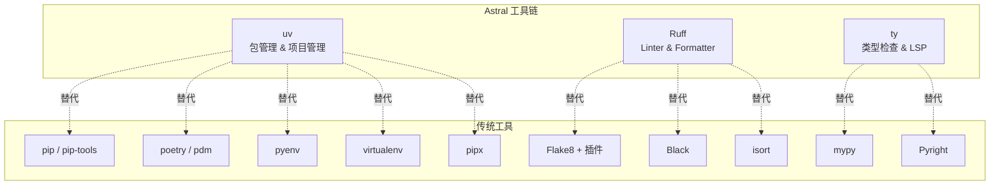
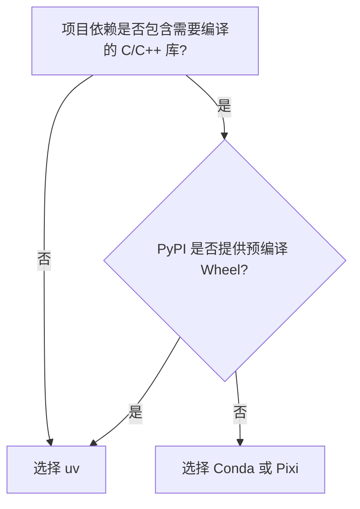
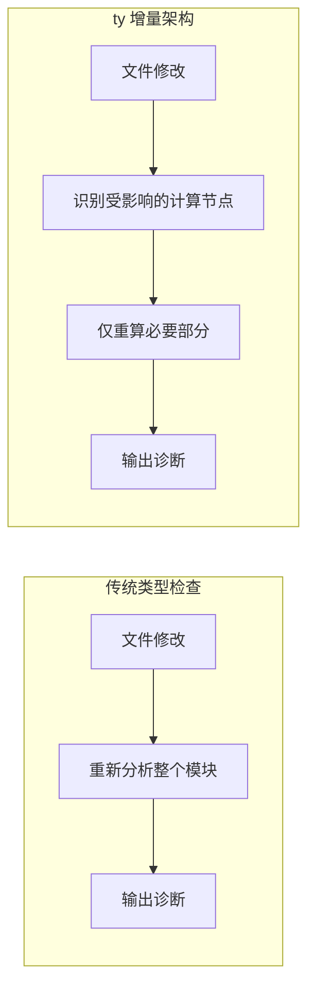

Python 生态系统长期面临工具链碎片化的问题：包管理依赖 pip/poetry/pdm，虚拟环境需要 virtualenv/venv，Python 版本管理借助 pyenv，代码检查使用 Flake8 + Black + isort 的组合，类型检查则在 mypy 和 Pyright 之间选择。这种状态在 2024-2025 年间发生了显著变化——Astral 公司推出的 Rust 原生工具链正在逐步整合这些分散的功能。

本文基于 Astral 官方发布的技术资料，梳理 uv、Ruff、ty 三个核心工具的技术特性与设计理念。

## 工具链全景



三个工具共享相同的设计原则：

- 单一二进制文件，无运行时依赖
- Rust 实现，追求极致性能
- 兼容现有生态（pyproject.toml、LSP 协议等）
- MIT 开源协议

## uv：统一的包与项目管理器

uv 的定位是 Python 包管理和项目管理的统一入口，其功能覆盖范围包括：

| 功能域 | 替代工具 | uv 对应命令 |
|--------|----------|-------------|
| 包安装 | pip | `uv pip install` |
| 依赖锁定 | pip-tools | `uv lock` |
| 虚拟环境 | virtualenv | `uv venv` |
| 项目管理 | poetry / pdm | `uv init` / `uv add` |
| Python 版本 | pyenv | `uv python install` |
| 工具执行 | pipx | `uvx` / `uv tool run` |

### 性能特征

uv 官方宣称的性能数据：相比 pip 快 10-100 倍。这一性能优势来源于几个技术决策：

1. **全局缓存机制**：使用 Copy-on-Write 和硬链接技术实现依赖去重，减少磁盘 I/O
2. **Rust 并行解析**：依赖解析过程充分利用多核 CPU
3. **确定性锁文件**：`uv.lock` 提供跨平台的可复现构建

### 核心命令

```bash
# 项目初始化
uv init myproject

# 添加依赖
uv add requests fastapi

# 同步环境（根据 uv.lock）
uv sync

# 生成/更新锁文件
uv lock

# 执行命令行工具（无需预安装）
uvx ruff check .

# 管理 Python 版本
uv python install 3.12
```

### Workspace 支持

uv 支持 Cargo 风格的工作空间（Workspace），适用于 Monorepo 场景：

```toml
# pyproject.toml (根目录)
[tool.uv.workspace]
members = ["packages/*"]
```

工作空间内的所有包共享同一个 `uv.lock` 文件，确保依赖版本一致性。

### uv 与 Conda 的生态位差异

uv 和 Conda 是两个不同生态位的工具，理解其本质区别有助于工程选型。

| 维度 | uv | Conda |
|------|-----|-------|
| 包来源 | PyPI（`.whl` 和源码包） | Conda Channels（预编译二进制包） |
| 管理范围 | Python 包 + Python 解释器 | 跨语言：Python、CUDA、GCC、R、FFmpeg 等 |
| 环境位置 | 项目级（`.venv` 在项目根目录） | 集中式（默认 `~/anaconda3/envs/`） |
| 依赖解析 | PubGrub 算法（Rust），100ms 级别 | SAT Solver，复杂环境下可能耗时较长 |
| 系统依赖 | 不处理，需自行安装编译器 | 自带编译器和系统库，与宿主系统隔离 |

**核心差异在于非 Python 依赖的处理能力。**

对于纯 Python 项目或有良好 Wheel 支持的库（FastAPI、Django、常规数据分析），uv 是更优选择——速度快、符合标准、轻量。

对于重度科学计算场景（Deep Learning、生物信息学、地理信息系统），Conda 仍有不可替代性。以 GDAL 为例：
- uv/pip：需手动 `apt-get install libgdal-dev`，处理版本对齐，可能遇到编译问题
- Conda：`conda install gdal` 直接获取包含所有 C++ 动态链接库的二进制包

#### 混合工作流

2025 年的常见实践是 **Conda 做底座，uv 做管理**：

```bash
# 用 Conda 创建包含系统级依赖的环境
conda create -n ml-lab python=3.11 pytorch cuda-toolkit -c pytorch -c nvidia

# 激活后使用 uv 安装上层业务库
conda activate ml-lab
uv pip install transformers pandas matplotlib
```

> 原则：底层框架（CUDA、PyTorch）用 Conda，上层应用库用 uv。避免两者互相覆盖依赖。
{: .prompt-tip }

#### Pixi：Rust 时代的 Conda 替代

如果需要 Conda 的二进制管理能力但追求 uv 级别的速度，可以关注 **Pixi**——基于 Rust 重写的 Conda 包管理器（底层使用 `rattler`），兼容 Conda 协议且支持项目级配置。

#### 选型判断



简化判断：Web 服务、工具脚本、Docker 部署场景选 uv；科研、AI 训练、Windows 上难编译的库选 Conda/Pixi。

## Ruff：代码质量工具的整合

Ruff 将 Linter 和 Formatter 功能整合到单一工具中，其设计目标是替代 Flake8（及其插件生态）、Black、isort、pydocstyle、pyupgrade、autoflake 等工具的组合。

### 功能特性

| 特性 | 说明 |
|------|------|
| 规则数量 | 800+ 条内置规则 |
| 插件兼容 | 原生实现 flake8-bugbear、flake8-comprehensions 等主流插件 |
| 自动修复 | 支持 `--fix` 自动修正可修复的问题 |
| 格式化 | 内置 Black 兼容的代码格式化器 |
| 导入排序 | 内置 isort 兼容的导入排序 |
| 缓存 | 内置缓存，跳过未修改文件 |

### 性能数据

官方基准测试显示，Ruff 在 CPython 代码库上的 Lint 速度比 Flake8 快 10-100 倍。这一性能使得"保存即检查"的工作流在大型代码库上也能保持即时响应。

### 配置示例

```toml
# pyproject.toml
[tool.ruff]
line-length = 88
target-version = "py312"

[tool.ruff.lint]
select = ["E", "F", "I", "UP", "B"]
ignore = ["E501"]

[tool.ruff.format]
quote-style = "double"
```

### 已采用的项目

Ruff 已被多个知名开源项目采用：

- Apache Airflow
- Apache Superset
- FastAPI
- Hugging Face
- Pandas
- SciPy

## ty：高性能类型检查器与语言服务器

ty 是 Astral 工具链的最新成员，定位为 mypy 和 Pyright 的替代方案。其核心特点是从设计之初就面向语言服务器（LSP）场景优化。

### 架构设计

ty 的架构围绕"增量计算"构建。传统类型检查器在文件修改后通常需要重新分析大量代码，而 ty 采用了受 Rust-analyzer 启发的 Salsa 计算框架，实现细粒度的增量分析——仅重新计算受变更影响的部分。



### 性能基准

官方提供的基准测试数据（M4 芯片）：

**命令行类型检查（home-assistant 项目，无缓存）：**

| 工具 | 耗时 |
|------|------|
| ty | 2.19s |
| Pyrefly | 5.32s |
| Pyright | 19.62s |
| mypy | 45.66s |

**语言服务器增量更新（PyTorch 项目，编辑文件后重新计算诊断）：**

| 工具 | 耗时 |
|------|------|
| ty | 4.5ms |
| Pyright | 370.5ms |
| Pyrefly | 2.60s |

ty 在增量场景下的性能优势尤为明显：比 Pyright 快约 80 倍，比 Pyrefly 快约 500 倍。

### 类型系统特性

ty 在类型系统层面引入了一些高级特性：

- **一等交集类型（Intersection Types）**：更精确地建模 Python 的动态类型模式
- **高级类型收窄（Type Narrowing）**：在控制流分析中提供更准确的类型推断
- **可达性分析（Reachability Analysis）**：识别不可达代码路径

### 诊断系统

ty 的诊断输出设计参考了 Rust 编译器的错误信息风格，支持：

- 跨文件上下文引用：单条诊断可以同时展示错误位置和相关定义位置
- 结构化输出：便于 IDE 集成和自动化工具解析

例如，当向 TypedDict 赋值类型不匹配时，ty 会同时显示赋值位置的类型错误和 TypedDict 中对应字段的声明位置。

### 语言服务器能力

ty 作为 LSP 实现，支持标准的语言服务器功能：

- Go to Definition
- Symbol Rename
- Auto-Complete
- Auto-Import
- Semantic Syntax Highlighting
- Inlay Hints

安装方式：

```bash
# 命令行工具
uv tool install ty@latest

# VS Code 扩展
# 在扩展市场搜索 "ty" 安装
```

## pyproject.toml 统一配置

现代 Python 项目倾向于将所有工具配置集中到 `pyproject.toml` 中。以下是一个整合 uv、Ruff、ty 配置的示例：

```toml
[project]
name = "myproject"
version = "0.1.0"
requires-python = ">=3.11"
dependencies = [
    "fastapi>=0.100.0",
    "pydantic>=2.0",
]

[tool.uv]
dev-dependencies = [
    "ruff>=0.8.0",
    "ty>=0.1.0",
    "pytest>=8.0",
]

[tool.ruff]
line-length = 88
target-version = "py311"

[tool.ruff.lint]
select = ["E", "F", "I", "UP", "B", "SIM"]

[tool.ruff.format]
quote-style = "double"

# ty 配置（如有）
# [tool.ty]
# python-version = "3.11"
```

## CI/CD 集成实践

Rust 工具链的高性能特性使得 CI 流水线可以在较短时间内完成完整的代码质量检查。

### GitHub Actions 示例

```yaml
name: CI

on: [push, pull_request]

jobs:
  check:
    runs-on: ubuntu-latest
    steps:
      - uses: actions/checkout@v4
      
      - name: Setup uv
        uses: astral-sh/setup-uv@v4
        with:
          enable-cache: true
          cache-dependency-glob: "uv.lock"
      
      - name: Install dependencies
        run: uv sync --frozen
      
      - name: Lint
        run: uv run ruff check .
      
      - name: Format check
        run: uv run ruff format --check .
      
      - name: Type check
        run: uv run ty check .
```

### 缓存策略

uv 的全局缓存机制配合 CI 缓存可以显著减少依赖安装时间：

- 使用 `uv sync --frozen` 确保依赖版本与 `uv.lock` 完全一致
- 缓存 key 基于 `uv.lock` 文件哈希
- 定期使用 `uv cache prune --ci` 清理过期缓存

## 运行时库的 Rust 化趋势

工具链之外，Python 生态中的性能敏感库也在采用 Rust 重写核心逻辑：

| 库 | Rust 组件 | 性能提升 |
|----|-----------|----------|
| Pydantic 2.x | pydantic-core | 5-20x（数据校验） |
| Polars | 核心引擎 | DataFrame 操作显著优于 Pandas |
| cryptography | 密码学原语 | - |

这些库通过 PyO3 实现 Rust 与 CPython 的绑定，在保持 Python API 不变的前提下提升底层性能。

## 技术背景：为什么是 Rust

Rust 在 Python 工具链中的应用并非偶然，其技术特性与 Python 工具的需求高度契合：

**并行计算能力**

Python 的 GIL（全局解释器锁）限制了纯 Python 代码的多核利用率。Rust 的所有权模型在编译期保证内存安全，允许工具在依赖解析、类型推断等任务中实现真正的并行计算。

**内存安全**

相比 C 扩展，Rust 消除了空指针引用、缓冲区溢出等常见内存安全问题，同时保持接近 C 的性能。

**零成本抽象**

Rust 的零成本抽象允许编写高层次的代码而不牺牲运行时性能，这对于需要处理复杂数据结构（如 AST、类型图）的工具尤为重要。

## 小结

Astral 的工具链代表了 Python 生态工具整合的一个方向：通过 Rust 实现性能提升，通过功能整合减少工具碎片化。

当前状态：
- uv：已进入稳定阶段，可用于生产环境
- Ruff：已被广泛采用
- ty：Beta 阶段，官方建议有经验的用户在生产环境试用

对于新项目，这套工具链提供了一个相对统一的开发体验；对于存量项目，可以根据实际需求逐步迁移。
