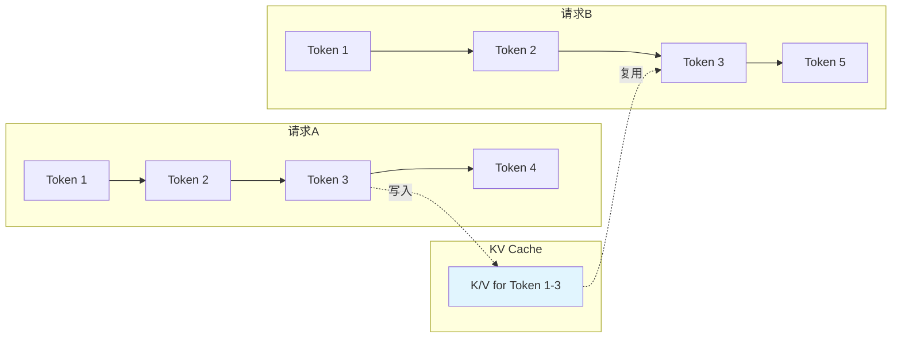
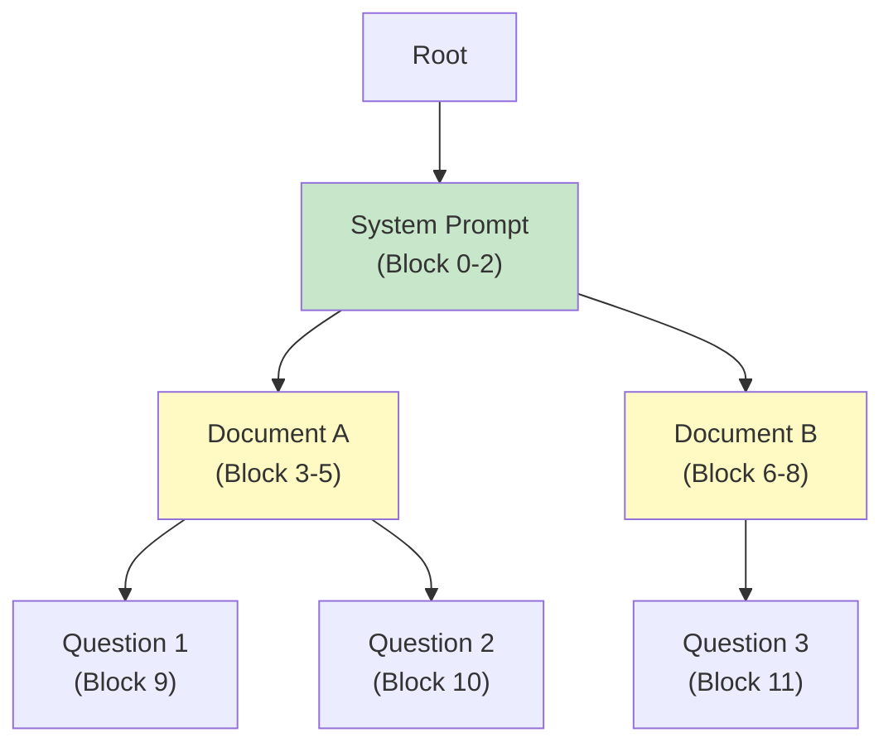
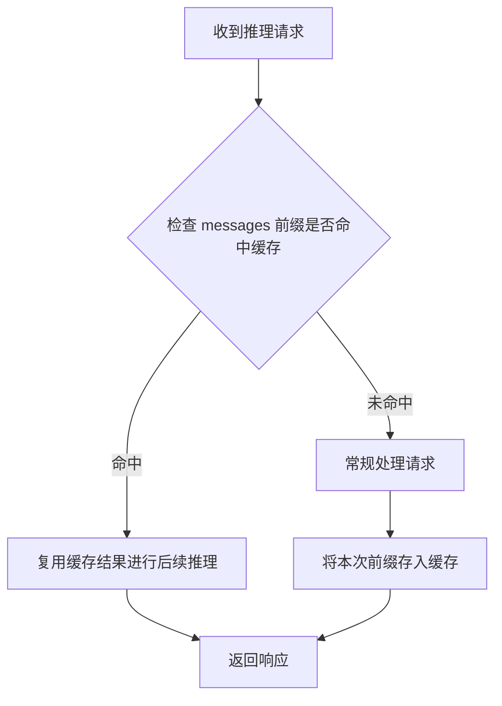
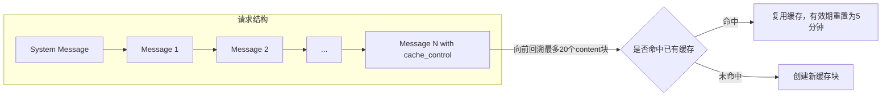
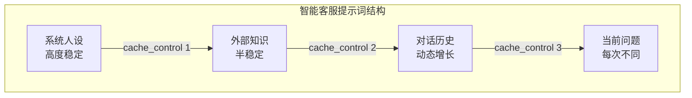
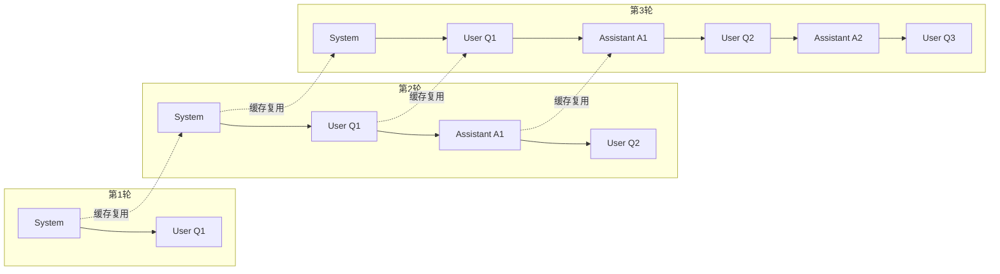

## 上下文缓存的核心动机

大模型推理场景中，不同请求之间往往存在大量重复的输入内容。典型场景包括：

- 多轮对话中累积的历史消息
- 针对同一长文档的多次提问
- 固定的 System Prompt 或 Few-shot 示例

这些重复内容在每次请求时都需要重新计算 KV Cache，造成计算资源浪费和响应延迟。上下文缓存（Context Cache）技术通过缓存请求的公共前缀，实现计算复用，在不影响输出质量的前提下降低延迟与成本。

## 技术原理：KV Cache 复用机制

Prompt Cache 的本质是**以显存空间换取计算时间和 I/O 带宽**的工程优化。对于 API 厂商，这是降低 TTFT（Time to First Token）和提升吞吐量的关键手段；对于用户，则是降低长 Context 成本的利器。

### KV Cache 的持久化基础

Transformer 推理过程中，Prefill 阶段计算量最大的是 Self-Attention：

$$
\text{Attention}(Q, K, V) = \text{softmax}\left(\frac{QK^T}{\sqrt{d_k}}\right)V
$$

对于长度为 $L$ 的 Prompt，每次请求都需重新生成所有 token 的 Query、Key、Value 向量。

Prompt Cache 的核心逻辑：若 $Prompt_A$ 和 $Prompt_B$ 共享相同前缀 $P$（长度为 $N$），则 $P$ 在 Transformer 各层生成的 $K_{1:N}$ 和 $V_{1:N}$ 矩阵完全一致（假设位置编码相对位置不变）。将这部分 KV 矩阵驻留在 GPU HBM 或 Host DRAM 中，新请求命中前缀时直接 Retrieve，跳过 $N$ 个 token 的计算。



### Radix Attention：跨请求的缓存管理

主流推理框架（SGLang、vLLM 等）采用 **Radix Tree（基数树）** 管理显存中的 KV Block，实现跨 Request 的 Cache 复用：

- **节点（Node）**：代表一段连续 token 的 KV Cache，对应 PagedAttention 中的物理 Block
- **边（Edge）**：代表该 token 序列之后的下一个 token



工作流程：

1. **Lookup**：新 Prompt 进入时，将 token ID 序列作为 Key 在 Radix Tree 中进行前缀匹配
2. **Hit**：匹配到的最长路径对应的 KV Blocks 被锁定，跳过重计算
3. **Branching**：新 Prompt 在某节点后分叉时，在树上创建新分支
4. **Eviction**：显存不足时，采用 LRU 策略从叶子节点开始剪枝，释放物理 Block

> SGLang 的 RadixAttention 使得不同请求间共享前缀 KV Cache 成为可能，甚至支持多轮对话中"回滚"到某个历史状态的高效分支生成。
{: .prompt-tip }

### RoPE 与前缀匹配的约束

现代 LLM（Llama 3、Qwen 2、Mistral 等）普遍使用 **RoPE（Rotary Positional Embeddings）**，Key 和 Query 向量会根据绝对位置 $m$ 旋转角度 $f(x, m)$。

这带来一个关键约束：**Prompt Cache 必须是严格的前缀匹配**。

| 场景 | 缓存内容 | 新请求 | 结果 |
|------|----------|--------|------|
| 前缀匹配 | `[A, B]` | `[A, B, E]` | ✅ 命中。A、B 位置索引不变（0、1） |
| 后缀匹配 | `[A, B]` | `[X, A, B]` | ❌ 失效。A 位置从 0 变为 1，RoPE 角度改变 |
| 中间插入 | `[A, B, C]` | `[A, X, B, C]` | ❌ 失效。B、C 位置偏移 |

### 显存压力与 Trade-offs

KV Cache 的显存开销是最大的成本因素。以 Llama-3-70B（GQA）为例，float16 下每个 token 的 KV Cache 大小约为：

$$
\text{Size per token} = 2 \times n_{\text{layers}} \times d_{\text{model}} \times \text{bytes} / n_{\text{heads\_share}}
$$

性能收益与资源消耗的权衡：

| 指标 | Cache Hit 效果 |
|------|----------------|
| TTFT | 极大降低。100k context 的 Prefill 可能需数秒，Cache Hit 后仅需几十毫秒 |
| 吞吐量 | 显著提升。GPU 算力不再浪费在重复矩阵乘法上 |
| 显存压力 | 主要成本。需配合 Host DRAM Offloading 或 NVMe SSD 换出冷 Cache |

---

以上是 Prompt Cache 的通用技术原理。不同厂商在此基础上提供了各自的产品化实现，以下以阿里云百炼平台的通义千问系列模型为例，介绍其上下文缓存的具体工程实践。

## 两种缓存模式对比

上下文缓存提供两种工作模式，分别面向不同的确定性与成本需求：

| 特性 | 隐式缓存 | 显式缓存 |
|------|----------|----------|
| 启用方式 | 自动开启，无需配置 | 需主动添加 `cache_control` 标记 |
| 命中确定性 | 不确定，由系统判定 | 确定性命中 |
| 最小缓存 Token 数 | 256 | 1024 |
| 缓存有效期 | 不确定，系统定期清理 | 5 分钟（命中后重置） |
| 创建缓存计费 | 输入单价 100% | 输入单价 125% |
| 命中后计费 | 输入单价 20% | 输入单价 10% |

> 两种模式互斥，单个请求只能应用其中一种。
{: .prompt-info }

## 隐式缓存的工作机制

隐式缓存对调用方完全透明，系统自动执行以下流程：



### 前缀匹配原则

隐式缓存基于严格的前缀匹配。假设系统已缓存内容 `ABCD`：

- 请求 `ABE` → 可能命中前缀 `AB`
- 请求 `BCD` → 无法命中（非前缀匹配）

这一特性决定了提示词的组织策略：**将稳定内容置于开头，变化内容置于末尾**。

### 视觉模型的特殊考量

对于视觉理解模型，内容顺序影响命中概率：

- 对同一图像/视频多次提问 → 将媒体内容放在文本前
- 对不同图像/视频提问相同问题 → 将文本放在媒体内容前

### 命中结果获取

缓存命中信息通过响应的 `usage` 字段返回：

```json
{
  "usage": {
    "prompt_tokens": 3019,
    "completion_tokens": 104,
    "total_tokens": 3123,
    "prompt_tokens_details": {
      "cached_tokens": 2048
    }
  }
}
```

`cached_tokens` 表示命中缓存的 Token 数量，是 `prompt_tokens` 的子集。

## 显式缓存的精细控制

显式缓存通过在 `messages` 中添加 `cache_control` 标记实现：

```python
messages = [
    {
        "role": "system",
        "content": [
            {
                "type": "text",
                "text": long_text_content,
                "cache_control": {"type": "ephemeral"}
            }
        ]
    },
    {"role": "user", "content": "问题内容"}
]
```

### 缓存块的创建与命中

系统以 `cache_control` 标记位置为终点，向前回溯最多 20 个 content 块进行匹配：



### 多标记策略

单次请求最多支持 4 个缓存标记，适用于提示词由多个重用频率不同部分组成的场景：



通过分层缓存，即使外部知识变化，系统人设部分仍可命中缓存。

### 计费模型

显式缓存的计费逻辑：

$$
\text{总输入费用} = \underbrace{N_{\text{create}} \times 1.25P}_{\text{创建缓存}} + \underbrace{N_{\text{hit}} \times 0.1P}_{\text{命中缓存}} + \underbrace{N_{\text{other}} \times P}_{\text{其他Token}}
$$

其中 $P$ 为标准输入单价。

若新缓存内容包含已有缓存作为前缀，仅对增量部分按创建缓存计费。例如：

- 已有 1200 Token 的缓存 A
- 新请求需缓存 1500 Token 的内容 AB
- 前 1200 Token 按命中计费（10%），新增 300 Token 按创建计费（125%）

## 典型应用场景

### 长文本问答

针对固定长文本（小说、法律文件、代码仓库）的多次提问：

```python
# 第一次请求
messages = [
    {"role": "system", "content": "你是一个语文老师..."},
    {"role": "user", "content": "<文章内容> 这篇课文表达了作者怎样的思想感情？"}
]

# 后续请求 - 相同前缀，不同问题
messages = [
    {"role": "system", "content": "你是一个语文老师..."},
    {"role": "user", "content": "<文章内容> 请赏析这篇课文的第三自然段。"}
]
```

### 多轮对话

对话历史作为前缀自然累积，随轮数增加缓存收益递增：



### 代码补全

用户持续编码过程中，代码前缀保持不变，缓存可显著提升补全响应速度。

### Few-shot / 角色扮演

大量示例或人设描述作为稳定前缀，仅用户输入变化：

```python
system_prompt = """你是一位经验丰富的营销专家。请针对不同产品提供详细的营销建议，格式如下：
1. 目标受众：xxx
2. 主要卖点：xxx
...
12. 长期发展策略：xxx
"""

# 不同产品的请求共享 system_prompt 缓存
messages_1 = [
    {"role": "system", "content": system_prompt},
    {"role": "user", "content": "请为一款新上市的智能手表提供营销建议。"}
]

messages_2 = [
    {"role": "system", "content": system_prompt},
    {"role": "user", "content": "请为一款新上市的笔记本电脑提供营销建议。"}
]
```

## 工程实践要点

### 隐式缓存优化策略

1. **提示词结构化**：稳定内容前置，变化内容后置
2. **Token 数量控制**：确保可缓存内容超过 256 Token
3. **批量请求注意**：Batch 方式调用无法享受缓存折扣

### 显式缓存使用约束

| 约束项 | 限制值 |
|--------|--------|
| 最小可缓存 Token 数 | 1024 |
| 单次请求最大标记数 | 4 |
| 缓存有效期 | 5 分钟 |
| 前缀匹配回溯深度 | 20 个 content 块 |
| `type` 字段值 | 仅支持 `ephemeral` |

### 可缓存的消息类型

- System Message
- User Message
- Assistant Message
- Tool Message（工具执行结果）

若请求包含 `tools` 参数，缓存标记还会缓存工具描述信息。

## OpenAI 兼容接口调用示例

以下示例基于 OpenAI SDK，通过兼容接口调用支持上下文缓存的模型。

### 隐式缓存调用

隐式缓存无需额外配置，直接发送请求即可。缓存命中信息通过 `usage.prompt_tokens_details.cached_tokens` 获取：

```python
from openai import OpenAI
import os

client = OpenAI(
    api_key=os.getenv("DASHSCOPE_API_KEY"),
    base_url="https://dashscope.aliyuncs.com/compatible-mode/v1",
)

# 长文本作为稳定前缀
long_document = "<长文档内容>" * 200

def ask_question(question: str):
    response = client.chat.completions.create(
        model="qwen-plus",
        messages=[
            {"role": "system", "content": "你是一个文档分析助手。"},
            {"role": "user", "content": f"{long_document}\n\n问题：{question}"}
        ]
    )
    # 获取缓存命中信息
    cached = response.usage.prompt_tokens_details.cached_tokens
    total = response.usage.prompt_tokens
    print(f"命中缓存: {cached}/{total} tokens ({cached/total*100:.1f}%)")
    return response.choices[0].message.content

# 第一次请求 - 创建缓存
ask_question("这篇文档的主题是什么？")

# 第二次请求 - 可能命中缓存
ask_question("请总结文档的核心观点。")
```
{: file="implicit_cache.py" }

### 显式缓存调用

显式缓存需要将 `content` 改为数组形式，并添加 `cache_control` 标记：

```python
from openai import OpenAI
import os

client = OpenAI(
    api_key=os.getenv("DASHSCOPE_API_KEY"),
    base_url="https://dashscope.aliyuncs.com/compatible-mode/v1",
)

# 模拟代码仓库内容（需超过 1024 Token）
code_repository = "<Your Code Here>" * 400

def analyze_code(question: str):
    response = client.chat.completions.create(
        model="qwen3-coder-plus",
        messages=[
            {
                "role": "system",
                "content": [
                    {
                        "type": "text",
                        "text": code_repository,
                        "cache_control": {"type": "ephemeral"}  # 显式缓存标记
                    }
                ]
            },
            {"role": "user", "content": question}
        ]
    )
    details = response.usage.prompt_tokens_details
    print(f"创建缓存: {details.cache_creation_input_tokens} tokens")
    print(f"命中缓存: {details.cached_tokens} tokens")
    return response.choices[0].message.content

# 第一次请求 - 创建缓存
analyze_code("这段代码的功能是什么？")
# 输出: 创建缓存: 1605 tokens, 命中缓存: 0 tokens

# 第二次请求 - 确定性命中
analyze_code("这段代码有哪些可以优化的地方？")
# 输出: 创建缓存: 0 tokens, 命中缓存: 1605 tokens
```
{: file="explicit_cache.py" }

### 多轮对话中的显式缓存

在持续对话场景，为每轮最后一个 content 添加缓存标记，实现对话历史的增量缓存：

```python
from openai import OpenAI
import os

client = OpenAI(
    api_key=os.getenv("DASHSCOPE_API_KEY"),
    base_url="https://dashscope.aliyuncs.com/compatible-mode/v1",
)

system_prompt = "你是一个知识渊博的助手。" * 400  # 确保超过 1024 Token
messages = [{"role": "system", "content": system_prompt}]

def chat(user_input: str):
    # 为当前用户输入添加缓存标记
    messages.append({
        "role": "user",
        "content": [
            {
                "type": "text",
                "text": user_input,
                "cache_control": {"type": "ephemeral"}
            }
        ]
    })
    
    response = client.chat.completions.create(
        model="qwen3-coder-plus",
        messages=messages
    )
    
    # 将助手回复加入历史（不带缓存标记）
    messages.append(response.choices[0].message)
    
    details = response.usage.prompt_tokens_details
    uncached = response.usage.prompt_tokens - details.cache_creation_input_tokens - details.cached_tokens
    print(f"[Cache] 创建: {details.cache_creation_input_tokens}, "
          f"命中: {details.cached_tokens}, 未缓存: {uncached}")
    
    return response.choices[0].message.content

# 多轮对话 - 每轮命中前一轮缓存，同时创建新缓存
chat("什么是量子计算？")
chat("它和经典计算有什么区别？")
chat("目前有哪些实际应用？")
```
{: file="multi_turn_cache.py" }

### 多标记精细控制

对于复杂提示词结构，使用多个缓存标记分别缓存不同稳定性的内容：

```python
messages = [
    # 系统人设 - 高度稳定
    {
        "role": "system",
        "content": [
            {
                "type": "text",
                "text": "<详细的系统人设描述>",
                "cache_control": {"type": "ephemeral"}
            }
        ]
    },
    # 外部知识 - 半稳定（可能随检索结果变化）
    {
        "role": "user",
        "content": [
            {
                "type": "text",
                "text": "<从知识库检索的相关文档>",
                "cache_control": {"type": "ephemeral"}
            }
        ]
    },
    # 对话历史 - 动态增长
    {"role": "assistant", "content": "之前的回复..."},
    {
        "role": "user",
        "content": [
            {
                "type": "text",
                "text": "<历史对话内容>",
                "cache_control": {"type": "ephemeral"}
            }
        ]
    },
    # 当前问题 - 每次不同，不缓存
    {"role": "user", "content": "当前的具体问题"}
]
```
{: file="multi_marker_cache.py" .nolineno }

> 单次请求最多支持 4 个 `cache_control` 标记。若超过 4 个，仅最后 4 个生效。
{: .prompt-warning }

## 成本收益分析

以 10,000 输入 Token 的请求为例，假设 5,000 Token 命中缓存：

**隐式缓存场景：**

$$
\text{费用比例} = \frac{5000 \times 100\% + 5000 \times 20\%}{10000 \times 100\%} = 60\%
$$

**显式缓存场景（首次创建后命中）：**

$$
\text{费用比例} = \frac{5000 \times 100\% + 5000 \times 10\%}{10000 \times 100\%} = 55\%
$$

显式缓存在高频命中场景下成本优势更明显，但需承担首次创建的 125% 开销。选择策略取决于：

- 请求频率与缓存命中率预期
- 对命中确定性的要求
- 提示词结构的稳定程度

## 主流厂商 Cache 策略对比

除阿里云百炼外，OpenAI、Anthropic、Google Gemini、Azure OpenAI 等厂商也提供了各自的 Prompt Cache 实现。这些方案代表了三种不同的工程哲学：

- **显式断点（Explicit Breakpoints）**：开发者精细控制缓存边界
- **状态化对象（Stateful Objects）**：Context 作为独立云资源管理
- **隐式自动（Implicit / Automatic）**：黑盒优化，对调用方透明

### 厂商特性总览

| 特性 | Anthropic (Claude) | Google (Gemini) | OpenAI (GPT-4o) | Azure OpenAI |
|------|-------------------|-----------------|-----------------|--------------|
| 模式 | 显式（标记断点） | 显式（资源对象） | 隐式（自动） | 隐式（自动） |
| 控制力 | 中 | 高 | 低 | 低 |
| 最小 Token | 1024 (Sonnet/Opus) | ~32,000 | 1024 | 1024 |
| TTL | 5 分钟（自动刷新） | 1 小时+（可付费持久化） | 5-10 分钟 | 5-10 分钟 |
| 价格模型 | 写入 +25%，读取 -90% | 存储费（按时）+ 创建费 | 写入无感，读取 -50% | Standard: -50%；PTU: 已含 |

### Anthropic Claude：显式断点模式

Anthropic 采用 **Ephemeral Explicit Caching**，通过 `cache_control` 标记手动指定缓存边界：

```python
import anthropic

client = anthropic.Anthropic()
response = client.messages.create(
    model="claude-3-5-sonnet-20241022",
    max_tokens=1024,
    system=[
        {"type": "text", "text": "You are a coding assistant."},
        {
            "type": "text",
            "text": "<insert_very_long_documentation_here>",
            "cache_control": {"type": "ephemeral"}  # 断点标记
        }
    ],
    messages=[{"role": "user", "content": "How do I use function X?"}]
)
# 检查 usage: cache_creation_input_tokens / cache_read_input_tokens
```
{: file="anthropic_cache.py" .nolineno }

工程约束：最多 4 个断点，Cache 块至少 1024 tokens（Haiku 为 2048）。

### Google Gemini：状态化对象模式

Gemini 将 Cache 视为独立的云资源，需先创建 `CachedContent` 对象再引用：

```python
from google import genai
from google.genai import types

client = genai.Client()

# 1. 创建 Cache 对象
cache_obj = client.caches.create(
    model="gemini-1.5-pro-002",
    config=types.CreateCachedContentConfig(
        display_name="project_codebase_v1",
        system_instruction="You are an expert analyzing this codebase.",
        contents=[types.Content(role="user", parts=[types.Part(text=huge_text)])],
        ttl="3600s",  # 1 小时
    )
)

# 2. 在请求中引用
response = client.models.generate_content(
    model="gemini-1.5-pro-002",
    config=types.GenerateContentConfig(cached_content=cache_obj.name),
    contents="Where is the authentication logic?"
)
```
{: file="gemini_cache.py" .nolineno }

适用场景：超长 Context（整本书、1 小时视频）的高频复用。需注意存储费用按时计费。

### OpenAI：隐式自动模式

OpenAI 采用完全透明的 **Automatic Prefix Caching**，无需修改代码：

```python
# 无特殊参数，仅需保证 Prompt 结构的前缀稳定性
response = client.chat.completions.create(
    model="gpt-4o",
    messages=[
        {"role": "system", "content": static_huge_system_prompt},  # 静态前缀
        {"role": "user", "content": static_context_documents},
        {"role": "user", "content": dynamic_user_query}  # 动态内容置于末尾
    ]
)
# 检查 usage.prompt_tokens_details.cached_tokens
```
{: file="openai_cache.py" .nolineno }

触发条件：Prompt ≥ 1024 tokens，前缀完全一致。TTL 为 5-10 分钟，依赖集群负载和路由策略。

> 哪怕 System Prompt 变了一个标点符号，或因 `datetime.now()` 插入导致前缀变化，缓存都会完全失效。务必将动态变量移到 Prompt 尾部。
{: .prompt-warning }

### Azure OpenAI：双层缓存架构

Azure OpenAI 在模型层 Prompt Caching 之上，还提供架构层的 Semantic Caching：

**模型层（Prompt Caching）**：
- 机制同 OpenAI，隐式自动
- Standard 部署：命中后 ~50% 折扣
- PTU 部署：命中等效于提升吞吐量（已包含在预付费中）

**架构层（Semantic Caching）**：
- 结合 Azure API Management + Redis
- 基于 Embedding 相似度匹配历史问答
- 命中后直接返回缓存结果，不经过 LLM（延迟 < 50ms）
- 适用于 FAQ 等高频重复查询，不适合动态 RAG

Azure 特有优势：Cache 严格隔离在 Subscription/Deployment 边界内，符合企业合规要求。

### 选型决策

- **Agent 场景，Context 局部静态**：Anthropic 断点机制最灵活
- **超长文档分析（财报、视频）**：Gemini Object 模式最省钱且稳定
- **常规 RAG 优化**：OpenAI/Azure 最省心，注意动态内容后置
- **企业级高频 FAQ**：Azure Semantic Cache 直接拦截请求

## 参考来源

- [阿里云百炼 - 上下文缓存](https://help.aliyun.com/zh/model-studio/context-cache)
- [OpenAI - Prompt Caching](https://platform.openai.com/docs/guides/prompt-caching)
- [OpenAI Blog - API Prompt Caching](https://openai.com/index/api-prompt-caching/)
- [Anthropic - Prompt Caching](https://docs.anthropic.com/en/docs/build-with-claude/prompt-caching)
- [Google Cloud - Context Cache](https://cloud.google.com/vertex-ai/generative-ai/docs/context-cache/context-cache-use)
- [Azure OpenAI - Prompt Caching](https://learn.microsoft.com/en-us/azure/ai-foundry/openai/how-to/prompt-caching)
- [PromptHub - Prompt Caching Comparison](https://www.prompthub.us/blog/prompt-caching-with-openai-anthropic-and-google-models)
