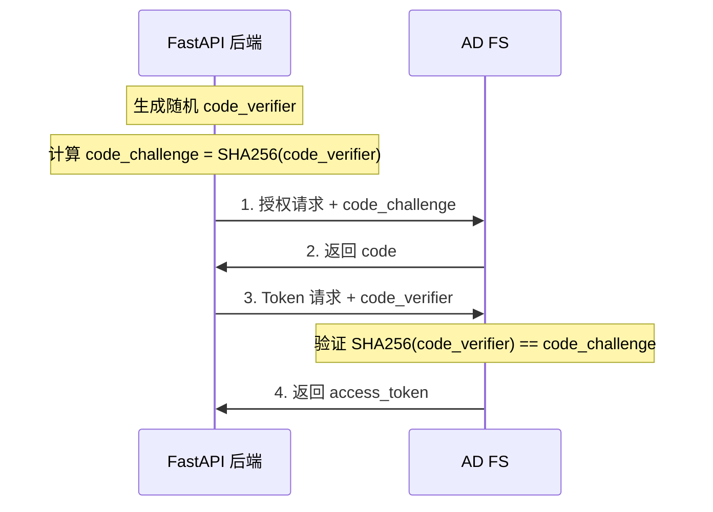

在企业级系统集成场景中，身份认证是绑定内部系统与企业用户体系的关键环节。本文基于 Python 3.10+ 和 FastAPI 技术栈，记录 OAuth 2.0 Authorization Code Flow 与 AD FS 集成的完整实现路径。

## 核心概念

### AD FS 是什么

AD FS (Active Directory Federation Services) 是 Windows Server 内置的联合身份验证服务，充当企业内部 Active Directory 与外部应用之间的"身份中介"。

核心职责：

- **身份联合**：将 AD 域账户的身份信息以标准协议（SAML、OAuth 2.0、OpenID Connect）暴露给外部应用
- **单点登录 (SSO)**：用户登录一次 AD FS，即可访问所有已注册的应用，无需重复输入凭据
- **声明转换**：将 AD 属性（如 `sAMAccountName`、`mail`、`memberOf`）映射为 Token 中的 Claims

在 OAuth 2.0 场景中，AD FS 扮演 **Authorization Server（授权服务器）** 角色，负责验证用户身份并签发 Access Token。

### OAuth 2.0 协议基础

OAuth 2.0 是一个授权框架，解决的核心问题是：**如何让第三方应用在不获取用户密码的情况下，安全地访问用户资源**。

四个核心角色：

| 角色 | 说明 | 本文对应 |
| :--- | :--- | :--- |
| Resource Owner | 资源所有者（用户） | 企业员工 |
| Client | 请求访问资源的应用 | FastAPI 后端 |
| Authorization Server | 验证身份、签发令牌 | AD FS |
| Resource Server | 托管受保护资源的服务 | 业务 API |

OAuth 2.0 定义了四种授权模式，其中 **Authorization Code Flow（授权码模式）** 安全性最高，适用于有后端服务器的 Web 应用。

## Authorization Code Flow 流程详解

授权码模式的核心思想是**两步换取**：先用用户授权换取一次性授权码（code），再用授权码换取访问令牌（access_token）。授权码只能使用一次且有效期极短（通常 10 分钟），即使被截获也难以利用。

完整流程如下：


关键参数说明：

| 参数 | 说明 | 示例值 |
| :--- | :--- | :--- |
| `client_id` | 在 ADFS 注册的应用标识 | `6731de76-14a6-49ae-97bc-6eba6914391e` |
| `resource` | 请求访问的资源标识符 | `MiddleTierOAuth` |
| `response_type` | 授权类型，固定为 `code` | `code` |
| `redirect_uri` | 授权成功后的回调地址 | `http://localhost:8000/callback` |

## 基础实现：python-jose + httpx

这是一个轻量级实现方案，手动处理 OAuth 流程的每个步骤。

依赖安装：

```bash
pip install fastapi uvicorn httpx python-jose[cryptography]
```

完整实现：

```python
import httpx
from fastapi import FastAPI, Request, HTTPException
from fastapi.responses import RedirectResponse
from jose import jwt

app = FastAPI()

# ADFS 配置参数
CLIENT_ID = "6731de76-14a6-49ae-97bc-6eba6914391e"
AUTHORITY_URL = "https://adfs.example.com/adfs/oauth2/authorize"
TOKEN_URL = "https://adfs.example.com/adfs/oauth2/token"
REDIRECT_URI = "http://localhost:8000/callback"
RESOURCE = "MiddleTierOAuth"

@app.get("/login")
async def login():
    """重定向用户到 ADFS 登录页面"""
    params = {
        "client_id": CLIENT_ID,
        "response_type": "code",
        "redirect_uri": REDIRECT_URI,
        "resource": RESOURCE,
        "response_mode": "query"
    }
    auth_url = f"{AUTHORITY_URL}?{'&'.join([f'{k}={v}' for k, v in params.items()])}"
    return RedirectResponse(auth_url)

@app.get("/callback")
async def callback(code: str):
    """处理 ADFS 回调，用授权码换取 Token"""
    if not code:
        raise HTTPException(status_code=400, detail="Authorization code not found")

    async with httpx.AsyncClient() as client:
        data = {
            "grant_type": "authorization_code",
            "client_id": CLIENT_ID,
            "code": code,
            "redirect_uri": REDIRECT_URI,
        }
        response = await client.post(TOKEN_URL, data=data)

    if response.status_code != 200:
        raise HTTPException(status_code=400, detail="Failed to fetch token")

    token_data = response.json()
    access_token = token_data.get("access_token")

    # 解析 JWT 中的用户信息
    # 注意：生产环境必须校验签名
    payload = jwt.get_unverified_claims(access_token)
    user_name = payload.get("unique_name")

    return {
        "message": "登录成功",
        "user": user_name,
        "access_token": access_token
    }
```

`unique_name` 是 ADFS 默认的用户身份声明字段，存储在 JWT 的 Claims 中。

> 示例代码使用 `get_unverified_claims` 仅用于演示。生产环境必须从 ADFS 元数据地址获取公钥，并在 `jwt.decode` 时传入以验证 Token 签名。
{: .prompt-warning }

## 技术选型：Authlib vs python-jose

在 Python OAuth 生态中，这两个库的定位完全不同。

### python-jose

JOSE (JSON Object Signing and Encryption) 规范的 Python 实现，专注于 JWT 数据层面的操作：

- 解析 JWT 结构
- 验证签名（JWS）
- 处理加密（JWE）
- 提取 Claims

它不关心 OAuth 协议流程，不知道如何构造授权 URL，也不知道如何向 ADFS 申请 Token。

### Authlib

完整的身份验证/授权协议框架，实现了 OAuth 1.0、OAuth 2.0、OpenID Connect 等协议：

- 自动处理授权码交换流程
- 内置 CSRF 防护（state 参数）
- 自动管理 Token 刷新
- 原生支持 FastAPI、Flask、Django

### 对比矩阵

| 特性 | Authlib | python-jose |
| :--- | :--- | :--- |
| 定位 | 协议级框架 | 数据级工具 |
| 关注点 | 流程（如何获取令牌） | 数据（令牌内容） |
| 自动处理 | 授权码交换、Token 刷新 | 无 |
| 使用难度 | 上手稍复杂，成型代码精简 | 上手简单，需手写 HTTP 请求 |
| 推荐场景 | 企业级集成（ADFS, Okta, Google） | 轻量级（仅解析现成 Token） |

简言之：Authlib 是自动驾驶仪（处理整个 OAuth 航程），python-jose 是验钞机（只检查 Token 真伪和内容）。

FastAPI 官方文档使用 python-jose 是因为教程侧重于 JWT 验证本身。但在标准的 OAuth2 企业集成场景中，Authlib 能显著减少关于刷新令牌和安全性检查的底层代码。

## Authlib 实现方案

依赖安装：

```bash
pip install fastapi uvicorn authlib itsdangerous httpx
```

`itsdangerous` 用于 FastAPI 的 Session 管理，存储 OAuth state 参数。

完整实现：

```python
from fastapi import FastAPI, Request, HTTPException
from fastapi.responses import RedirectResponse
from authlib.integrations.starlette_client import OAuth
from starlette.middleware.sessions import SessionMiddleware

app = FastAPI()

# SessionMiddleware 用于存储 OAuth state 参数，防止 CSRF 攻击
app.add_middleware(SessionMiddleware, secret_key="YOUR_INTERNAL_SECRET_KEY")

# ADFS 配置
ADFS_CLIENT_ID = "6731de76-14a6-49ae-97bc-6eba6914391e"
ADFS_CLIENT_SECRET = "YOUR_CLIENT_SECRET"  # 公有客户端可为空
ADFS_AUTHORIZE_URL = "https://adfs.example.com/adfs/oauth2/authorize"
ADFS_TOKEN_URL = "https://adfs.example.com/adfs/oauth2/token"
ADFS_RESOURCE = "MiddleTierOAuth"

oauth = OAuth()
oauth.register(
    name='adfs',
    client_id=ADFS_CLIENT_ID,
    client_secret=ADFS_CLIENT_SECRET,
    authorize_url=ADFS_AUTHORIZE_URL,
    access_token_url=ADFS_TOKEN_URL,
    client_kwargs={
        'scope': 'openid profile',
        'resource': ADFS_RESOURCE  # ADFS 特有参数
    },
)

@app.get("/login")
async def login(request: Request):
    """Authlib 自动生成带 state 的授权 URL"""
    redirect_uri = request.url_for('auth_callback')
    return await oauth.adfs.authorize_redirect(request, str(redirect_uri))

@app.get("/auth/callback")
async def auth_callback(request: Request):
    """Authlib 自动完成 code 换 Token 流程"""
    try:
        token = await oauth.adfs.authorize_access_token(request)
    except Exception as e:
        raise HTTPException(status_code=400, detail=f"认证失败: {str(e)}")

    user_info = token.get('userinfo')
    if not user_info:
        user_info = token.get('access_token')

    request.session['user'] = user_info
    return {"message": "登录成功", "token_data": token}

@app.get("/logout")
async def logout(request: Request):
    """注销逻辑"""
    request.session.pop('user', None)
    logout_url = f"https://adfs.example.com/adfs/oauth2/logout?client_id={ADFS_CLIENT_ID}"
    return RedirectResponse(url=logout_url)
```

### Authlib 的技术细节

**State 参数防护**：Authlib 强制使用 `state` 参数防止 CSRF 攻击。用户点击登录时，Authlib 随机生成一个字符串存入 Session（Cookie），并与 ADFS 回调时的值做比对。

**Resource 参数处理**：ADFS 环境通常要求 `resource` 参数。Authlib 通过 `client_kwargs` 传参，确保生成的授权链接中包含 `&resource=MiddleTierOAuth`。

**Token 换取自动化**：`authorize_access_token(request)` 一行代码自动完成：获取授权码、构造 POST 请求、处理 Header 和数据编码、解析返回的 JSON。

### 引入 PKCE 加固安全

PKCE (Proof Key for Code Exchange，读作 "pixy") 是 OAuth 2.0 的安全扩展（RFC 7636），最初为移动端和 SPA 设计，现已成为所有公开客户端的推荐实践。

**解决的问题**：传统授权码模式中，如果攻击者截获了 `code`（例如通过恶意浏览器插件或日志泄露），可以直接用它换取 Token。PKCE 通过"证明你是发起请求的那个人"来防止这种攻击。

**工作原理**：



即使攻击者截获了 `code`，由于不知道 `code_verifier`，也无法完成 Token 交换。

**Authlib 启用 PKCE**：

```python
oauth.register(
    name='adfs',
    client_id=ADFS_CLIENT_ID,
    client_secret=ADFS_CLIENT_SECRET,
    authorize_url=ADFS_AUTHORIZE_URL,
    access_token_url=ADFS_TOKEN_URL,
    client_kwargs={
        'scope': 'openid profile',
        'resource': ADFS_RESOURCE,
        'code_challenge_method': 'S256'  # 启用 PKCE
    },
)
```

Authlib 会自动处理 `code_verifier` 的生成、存储（Session）和发送，无需手动干预。

> AD FS 从 Windows Server 2016 开始支持 PKCE。如果你的 AD FS 版本较旧，需要确认是否支持此特性。
{: .prompt-info }

## 前后端分离架构：REDIRECT_URI 的选择

在 Vue 3 + FastAPI 的前后端分离架构中，`REDIRECT_URI` 应该填前端地址还是后端地址？

**结论：填后端地址。**

### 方案对比

#### 方案一：后端地址（推荐）

`REDIRECT_URI = "http://localhost:8000/auth/callback"`

认证流程：


优势：

- **Authlib 兼容性**：`authorize_access_token` 需要直接处理回调请求，自动校验 `state`（存储在后端 Session）。填前端地址会导致 Session 校验失效。
- **安全性**：授权码 `code` 不经过前端业务逻辑，直接由后端捕获，减少被劫持或在浏览器历史记录中泄露的风险。
- **协议合规**：Authorization Code 应直接返回给业务系统后台处理。

#### 方案二：前端地址

`REDIRECT_URI = "http://localhost:5173/callback"`

认证流程：

1. ADFS 验证成功后，浏览器跳转到前端 `http://localhost:5173/callback?code=xxx`
2. Vue 在 `onMounted` 中提取 URL 里的 `code`
3. Vue 通过 Axios 调用后端接口 `POST /api/exchange_token` 传递 `code`
4. 后端再去 ADFS 换取 Token

缺点：

- Authlib 难以使用，需手动处理所有校验（如 `state` 校验）
- 用户体验破碎：前端需要先加载一个空的回调处理页面，再发一次请求

### 后端回调的最佳实践

后端回调接口最后应将用户"送回"前端：

```python
@app.get("/auth/callback")
async def auth_callback(request: Request):
    token = await oauth.adfs.authorize_access_token(request)

    user_info = token.get('userinfo') or {}
    username = user_info.get('unique_name')

    # 生成应用自己的 JWT
    my_app_token = create_app_jwt(username)

    # 方式 A: URL 参数传回（简单但安全性稍低）
    # frontend_url = f"http://localhost:5173/login-success?token={my_app_token}"
    # return RedirectResponse(url=frontend_url)

    # 方式 B: HttpOnly Cookie（更安全，推荐）
    response = RedirectResponse(url="http://localhost:5173/dashboard")
    response.set_cookie(key="auth_token", value=my_app_token, httponly=True)
    return response
```

> 由于是浏览器级别的重定向（302 Redirect），这一步不涉及 CORS 跨域问题。跨域只发生在后续用 Axios 从 Vue 访问 FastAPI 接口时。
{: .prompt-info }

## 生产环境注意事项

### JWT 签名验证与 JWKS 缓存

生产环境必须验证 Token 签名，确保 Token 确实由 AD FS 签发且未被篡改。AD FS 的公钥通过 JWKS (JSON Web Key Set) 端点动态发布，且会定期轮转。

**为什么需要 JWKS 缓存器**：

- **性能**：每次验证 Token 都请求 JWKS 端点会产生不必要的网络开销
- **可用性**：如果 AD FS 短暂不可用，缓存的公钥仍可继续验证 Token
- **密钥轮转**：AD FS 会定期更换签名密钥，缓存器需要能够自动刷新

**使用 PyJWT + PyJWKClient 实现**：

```python
import jwt
from jwt import PyJWKClient

# JWKS 端点（从 OpenID 元数据获取）
JWKS_URL = "https://adfs.example.com/adfs/discovery/keys"

# 创建带缓存的 JWKS 客户端
# lifespan: 缓存有效期（秒），max_cached_keys: 最大缓存密钥数
jwks_client = PyJWKClient(JWKS_URL, lifespan=3600, max_cached_keys=16)

def verify_token(access_token: str) -> dict:
    """验证 AD FS 签发的 JWT"""
    try:
        # 从 JWKS 获取签名密钥（自动缓存）
        signing_key = jwks_client.get_signing_key_from_jwt(access_token)

        # 验证并解码 Token
        payload = jwt.decode(
            access_token,
            signing_key.key,
            algorithms=["RS256"],
            audience=ADFS_CLIENT_ID,  # 验证 aud claim
            options={"verify_exp": True}  # 验证过期时间
        )
        return payload
    except jwt.ExpiredSignatureError:
        raise HTTPException(status_code=401, detail="Token 已过期")
    except jwt.InvalidTokenError as e:
        raise HTTPException(status_code=401, detail=f"Token 无效: {str(e)}")
```

**密钥轮转处理**：当 AD FS 轮转密钥时，新签发的 Token 使用新密钥签名。`PyJWKClient` 会根据 Token Header 中的 `kid` (Key ID) 自动匹配正确的公钥。如果缓存中没有对应的 `kid`，会自动刷新 JWKS。

**手动实现 JWKS 缓存器**（更细粒度控制）：

```python
import httpx
from datetime import datetime, timedelta
from jose import jwt, jwk
from jose.exceptions import JWTError

class JWKSCache:
    """JWKS 缓存器，支持自动刷新和密钥轮转"""

    def __init__(self, jwks_url: str, cache_ttl: int = 3600):
        self.jwks_url = jwks_url
        self.cache_ttl = cache_ttl
        self._keys: dict = {}
        self._expires_at: datetime = datetime.min

    async def get_key(self, kid: str) -> dict:
        """根据 kid 获取公钥，必要时刷新缓存"""
        if datetime.now() >= self._expires_at or kid not in self._keys:
            await self._refresh()

        if kid not in self._keys:
            raise JWTError(f"Unknown kid: {kid}")

        return self._keys[kid]

    async def _refresh(self):
        """从 JWKS 端点刷新公钥"""
        async with httpx.AsyncClient() as client:
            response = await client.get(self.jwks_url)
            response.raise_for_status()
            jwks = response.json()

        self._keys = {
            key["kid"]: jwk.construct(key)
            for key in jwks.get("keys", [])
        }
        self._expires_at = datetime.now() + timedelta(seconds=self.cache_ttl)

# 使用示例
jwks_cache = JWKSCache("https://adfs.example.com/adfs/discovery/keys")

async def verify_token_manual(access_token: str) -> dict:
    """使用自定义缓存器验证 Token"""
    # 解析 Header 获取 kid
    unverified_header = jwt.get_unverified_header(access_token)
    kid = unverified_header.get("kid")

    # 获取对应的公钥
    public_key = await jwks_cache.get_key(kid)

    # 验证签名
    payload = jwt.decode(
        access_token,
        public_key,
        algorithms=["RS256"],
        audience=ADFS_CLIENT_ID
    )
    return payload
```

> 建议 JWKS 缓存 TTL 设置为 1 小时左右。太短会频繁请求 AD FS，太长可能导致密钥轮转后验证失败。
{: .prompt-tip }

### 其他生产环境要点

### 其他生产环境要点

**Redirect URI 一致性**：代码中通过 `request.url_for` 生成的地址必须与 ADFS 后台注册的地址完全一致。

**SSL 证书**：测试环境如果 ADFS 使用自签名证书，开发阶段可能需要配置不校验 SSL。生产环境必须启用证书验证。

**注销端点**：ADFS 的注销端点为 `/adfs/oauth2/logout`，需携带 `id_token_hint` 参数实现完整的单点注销。

## 总结

| 场景 | 推荐方案 |
| :--- | :--- |
| 快速原型/脚本测试 | python-jose + httpx 手动实现 |
| 企业级生产集成 | Authlib + SessionMiddleware + PKCE |
| 前后端分离架构 | REDIRECT_URI 填后端地址 |
| Token 签名验证 | PyJWKClient 或自定义 JWKS 缓存器 |

Authlib 在处理 ADFS 这类标准 OAuth2 企业集成时，能显著减少底层代码。配合 PKCE 扩展可防止授权码劫持，JWKS 缓存器则解决了公钥动态轮转的问题。其 `authorize_redirect` 和 `authorize_access_token` 两个方法封装了完整的授权码流程，包括 state 防护、PKCE 验证、Token 交换和 JWT 解析。
