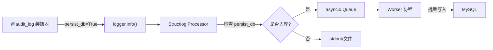
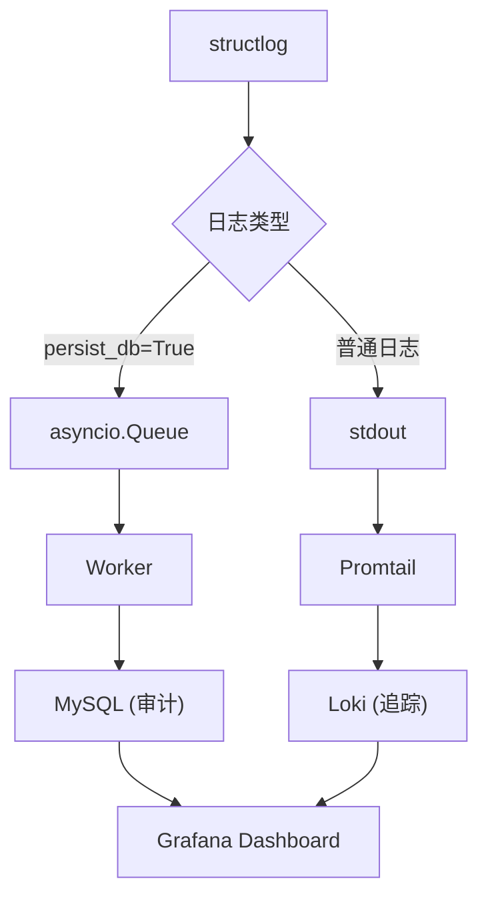

在异步 Python 后端架构中，日志持久化是一个权衡**系统解耦**与**事务一致性**的过程。本文基于 Python 3.10+、Pydantic 2.x、structlog、SQLAlchemy 和 MySQL 8.x 技术栈，探讨两种主流方案的工程权衡。

## 工程悖论：隐式自动化 vs 显式意图

日志持久化的核心矛盾在于：**自动化程度越高，控制力越弱**。

### 方案定义

**方案 A：Structlog Processor（隐式自动化）**

自定义一个 structlog 处理器，截获日志字典，利用 `asyncio.create_task` 或后台队列将数据通过 `AsyncSession` 写入数据库。业务代码只需调用 `log.info("user_login", user_id=1)`，剩下的交给 Pipeline。

**方案 B：Service 层显式调用（显式意图）**

在业务逻辑中手动注入 `LogService`，显式调用 `await log_service.create_log()` 保存方法。

这是"拦截式全自动"与"声明式手动控制"的对决。在深入对比之前，先理解两者共同面临的底层挑战。

---

## 底层机制剖析：异步写库的三大陷阱

无论选择方案 A 还是方案 B，只要是异步写库，都会遇到以下三个核心问题。

### 陷阱一：并发失控——连接池如何被 Fire-and-Forget 冲垮

**触发频率差异**

- **方案 B**：显式调用，通常只有"关键业务"才记入数据库。一个请求可能只触发 1-2 次 `create_log()`。
- **方案 A**：拦截式。配置不当时，项目中所有 `logger.info()`、`logger.error()` 甚至第三方库的日志都会触发 Processor。一个复杂请求可能产生几十条日志，数据库写入请求可能是方案 B 的 10-100 倍。

**Fire-and-Forget 风险**

开发者为了不影响主业务响应速度，常在 Processor 里写 `asyncio.create_task(save_to_db(log))`。这是"发射后不管"的操作——高并发下，每条日志瞬间开启新任务抢连接池，任务迅速堆积，连接池溢出。

**连接复用能力**

- **方案 B**：可复用当前 Request 已开启的 `AsyncSession`。业务本来就要操作 DB，日志只是多执行一条 SQL。
- **方案 A**：Processor 运行在日志系统上下文中，拿不到当前 Request 的 Session（除非通过 ContextVars 强行传递），通常需要从 `sessionmaker` 重新申请独立连接。

### 陷阱二：上下文断裂——Trace ID 如何在异步环境中丢失

在异步任务中，如果不手动传递，`Trace ID` 或 `Request ID` 会丢失。

**解决方案：ContextVars**

利用 `structlog.contextvars` 模块，在 Web 框架的 Middleware 层生成 `trace_id` 并绑定到 `structlog.contextvars`，该请求链路下所有日志都会自动携带这个 ID。

```python
import structlog

# 在 Middleware 中绑定
structlog.contextvars.bind_contextvars(trace_id="abc-123", user_id=42)

# 在业务深处打日志，自动带上上下文
log = structlog.get_logger()
log.info("database_query", table="users")  # 自动包含 trace_id 和 user_id
```

### 陷阱三：IO 阻塞——日志写入不应拖慢业务响应

如果在 Processor 里直接 `await session.execute(...)`，会阻塞整个日志流水线。

**解决方案：asyncio.Queue 削峰填谷**

`asyncio.Queue` 是 Python 标准库为异步编程设计的"生产者-消费者"队列：

1. **Processor（生产者）**：把日志丢进 `asyncio.Queue`（微秒级内存操作）
2. **Worker（消费者）**：后台协程从 Queue 取数据写入 DB（频率受控）

| 特性 | asyncio.Queue | Redis |
| :--- | :--- | :--- |
| **存储位置** | 当前进程内存 | 独立中间件 |
| **进程崩溃** | 数据全部丢失 | 数据保留 |
| **适用场景** | 性能缓冲、削峰填谷 | 跨进程通信、高可靠性 |

---

## 方案深度对比

理解了底层机制后，再来对比两种方案的优劣。

### 方案 A：Structlog Processor

**优点**

1. **极度解耦**：业务代码完全不感知"持久化日志"的存在
2. **强制一致性**：确保所有符合特定级别的日志都被记录，不会因开发者遗漏而丢失
3. **标准化**：日志格式在处理器内部统一转化，维护成本低

**缺点**

1. **生命周期管理陷阱**：处理器通常是同步调用的，执行异步数据库写入需要精细处理 `event_loop`
2. **连接池压力**：高并发下容易瞬间耗尽连接池
3. **范围扩散**：一旦配置了数据库 Processor，所有 `logger.info` 都会经过处理器

### 方案 B：Service 层显式调用

**优点**

1. **显式即清晰**：遵循 Python 之禅 "Explicit is better than implicit"
2. **事务控制精准**：可选择放入同一事务或独立 Session
3. **类型安全**：利用 Pydantic 定义严格入参，避免运行时报错

**缺点**

1. **代码侵入性强**：业务逻辑中充斥日志调用代码
2. **容易遗漏**：新开发者可能忘记调用
3. **性能同步**：不小心写成同步等待会增加 API 响应延迟

### 选型矩阵

| 维度 | 方案 A (Processor) | 方案 B (Service) |
| :--- | :--- | :--- |
| **关注点分离** | 极佳 (AOP 思想) | 一般 (业务与审计混合) |
| **性能影响** | 较小 (后台异步) | 中等 (取决于是否 await) |
| **实现难度** | 较高 (异步任务与 Session 生命周期) | 较低 (标准 CRUD) |
| **数据可靠性** | 较低 (内存队列易丢失) | 较高 (与业务强绑定) |
| **适用场景** | 全量日志、技术监控 | 审计日志、关键业务凭据 |

---

## 最佳实践：混合架构方案

将 AOP + 装饰器 + Processor + Worker 整合为完整的推荐模型。



### 架构分层

| 层级 | 职责 | 解决的问题 |
| :--- | :--- | :--- |
| **声明层 (Decorator)** | 显式标记哪些业务需要入库 | 避免全量拦截导致 MySQL 爆炸 |
| **上下文层 (ContextVars)** | 自动收集业务元数据 | 保证 Trace ID 不丢失 |
| **传输层 (Queue)** | 内存缓冲区解耦 | 日志写入不拖慢业务响应 |
| **执行层 (Worker)** | 受控的后台批处理协程 | 解决连接池压力 |

### 完整参考实现

#### 1. 基础配置：structlog + ContextVars

```python
import structlog

def configure_structlog():
    structlog.configure(
        processors=[
            structlog.contextvars.merge_contextvars,  # 合并 AOP 注入的上下文
            structlog.processors.add_log_level,
            structlog.processors.TimeStamper(fmt="iso"),
            structlog.processors.StackInfoRenderer(),
            structlog.processors.format_exc_info,
            structlog.processors.JSONRenderer()
        ],
        logger_factory=structlog.PrintLoggerFactory(),
        cache_logger_on_first_use=True,
    )

configure_structlog()
```

#### 2. 数据模型与队列

```python
from pydantic import BaseModel
import asyncio

class AuditLogSchema(BaseModel):
    user_id: int
    action: str
    status: str
    extra_info: dict | None = None

log_queue = asyncio.Queue(maxsize=1000)

# 敏感字段黑名单
SENSITIVE_KEYS = {'password', 'token', 'secret', 'credit_card'}

def sanitize_kwargs(kwargs: dict) -> dict:
    return {k: "***" if k in SENSITIVE_KEYS else v for k, v in kwargs.items()}
```

#### 3. 声明层：AOP 审计装饰器

```python
import time
import functools
import structlog

def audit_log(action: str):
    """AOP 切面：结构化日志审计"""
    def decorator(func):
        @functools.wraps(func)
        async def wrapper(*args, **kwargs):
            # 绑定上下文 (Task-local，不污染其他并发请求)
            structlog.contextvars.bind_contextvars(
                func_name=action,
                **sanitize_kwargs(kwargs)
            )

            log = structlog.get_logger()
            start = time.perf_counter()
            user_id = getattr(args[0], "user_id", 0) if args else 0

            try:
                result = await func(*args, **kwargs)
                duration = time.perf_counter() - start

                await log.ainfo("audit_event",
                    audit_data=AuditLogSchema(
                        user_id=user_id,
                        action=action,
                        status="success"
                    ).model_dump(),
                    duration=round(duration, 4),
                    persist_db=True)  # 显式标记入库
                return result

            except Exception as e:
                duration = time.perf_counter() - start
                await log.aerror("audit_event",
                    audit_data=AuditLogSchema(
                        user_id=user_id,
                        action=action,
                        status=f"failed: {str(e)}"
                    ).model_dump(),
                    duration=round(duration, 4),
                    error_type=type(e).__name__,
                    persist_db=True)
                raise
        return wrapper
    return decorator
```

#### 4. 传输层：Processor 实现

```python
def db_persistence_processor(logger, method_name, event_dict):
    """只有带 persist_db=True 标记的日志才进队列"""
    persist_db = event_dict.pop("persist_db", False)
    if persist_db:
        audit_data = event_dict.get("audit_data")
        try:
            log_queue.put_nowait(audit_data)
        except asyncio.QueueFull:
            pass  # 队列满时静默丢弃，不影响业务
    return event_dict
```

#### 5. 执行层：批量写入 Worker

```python
from contextlib import asynccontextmanager
from fastapi import FastAPI
from sqlalchemy.ext.asyncio import async_sessionmaker

async def log_writer_worker(session_factory: async_sessionmaker):
    """后台守护协程：批量消耗队列中的日志"""
    print("Log Worker 启动...")
    try:
        while True:
            batch = []
            # 等待第一条日志
            item = await log_queue.get()
            batch.append(item)

            # 尝试凑够 50 条或队列为空
            while len(batch) < 50 and not log_queue.empty():
                batch.append(log_queue.get_nowait())

            # 批量写入
            async with session_factory() as session:
                # await session.execute(insert(LogModel), batch)
                # await session.commit()
                pass

            for _ in range(len(batch)):
                log_queue.task_done()

    except asyncio.CancelledError:
        print("Worker 收到停止信号，正在清理...")

@asynccontextmanager
async def lifespan(app: FastAPI):
    # session_factory = async_sessionmaker(bind=engine)
    worker_task = asyncio.create_task(log_writer_worker(None))
    yield
    worker_task.cancel()
    await asyncio.gather(worker_task, return_exceptions=True)

app = FastAPI(lifespan=lifespan)
```

#### 6. 业务代码体验

```python
@audit_log("user_service.register")
async def register_user(username: str, password: str, email: str):
    if "admin" in username:
        raise ValueError("Admin is reserved")

    # 业务深处打日志，自动带上 AOP 绑定的上下文
    log = structlog.get_logger()
    log.info("database_inserting", table="users")  # 不会进数据库
    return {"id": 1, "username": username}

# 调用
await register_user("john", "secret123", "john@test.com")
```

### Worker 扩展策略

| 负载级别 | 策略 |
| :--- | :--- |
| 低负载 | 单 Worker，逐条写 |
| 中负载 | 单 Worker，批量写 (Batching) |
| 高负载 | 多 Worker 并行 + 批量写 |
| 极高负载/金融级可靠 | 引入 Redis，Worker 独立进程运行 |

---

## 存储后端选型：日志存哪去

前面解决了"怎么发（How）"，现在解决"存哪去（Where）"。

### MySQL 的瓶颈

MySQL 为 OLTP 设计，核心任务是确保 ACID。但日志系统需要 High Write Throughput 和 Complex Full-text Search。

**B+树索引的"写放大"效应**：每插入一条日志，如果有多个索引，数据库必须实时更新所有 B+ 树分支。数据量达到千万级时，频繁触发页分裂，写入性能断崖式下跌。

**Schema 僵化**：`ALTER TABLE` 对大表是噩梦。

**全文检索无力**：`LIKE '%...%'` 是全表扫描。

### Elasticsearch 的优势

**倒排索引**：将所有词语拆解，记录每个词出现在哪些文档里。定位关键字的时间复杂度近乎 `O(1)`。

**LSM-Tree 类似的写入优化**：追加写模式规避了 B+ 树的随机 IO 和页分裂问题。

**Schema-less**：JSON 自动解析字段并建立索引。

**ILM（索引生命周期管理）**：官方支持"热-温-冷"架构。

### MongoDB 的定位

写入性能优于 MySQL，灵活度高，但复杂检索能力弱于 ES。适合"复杂条件过滤，无全文检索"的场景。

### Grafana Loki：云原生新选择

核心哲学：**不索引日志内容，只索引标签（Labels）**。极其轻量、存储成本低，与 Grafana 完美集成。

**接入方式**

```yaml
# docker-compose.yml
services:
  loki:
    image: grafana/loki:latest
    ports:
      - "3100:3100"

  promtail:
    image: grafana/promtail:latest
    volumes:
      - /var/lib/docker/containers:/var/lib/docker/containers:ro

  grafana:
    image: grafana/grafana:latest
    ports:
      - "3000:3000"
```

**标签设计原则**

- **好的 Labels**：`env` (prod/dev), `service` (order-api), `level` (error/info)
- **坏的 Labels**：`user_id`, `request_id`（High Cardinality 问题）

### 存储选型矩阵

| 维度 | MySQL 8.x | MongoDB | Elasticsearch | Grafana Loki |
| :--- | :--- | :--- | :--- | :--- |
| **数据量级** | < 5000 万条 | 5000 万 ~ 10 亿条 | 10 亿条+ | 10 亿条+ |
| **查询需求** | 简单精确查询 | 复杂条件过滤 | 全文检索、聚合分析 | 标签过滤、实时流 |
| **存储成本** | 高 | 中 | 较高 | 低 |
| **运维难度** | 极低 | 中 | 高 | 中 |

### 分类治理建议

| 日志类型 | 特点 | 推荐存储 |
| :--- | :--- | :--- |
| **Audit Logs（审计日志）** | 高价值/低频，需要与业务数据 Join | MySQL |
| **Tracing Logs（追踪日志）** | 低价值/高频，需要快速检索 | Elasticsearch / Loki |

---

## 架构演进路线图

### V1：初创阶段

**方案**：方案 B 显式调用 + MySQL

**特点**：
- 日志只是为了"备查"，每天万级别
- 不引入额外运维负担
- 定期把旧日志 dump 到对象存储

```python
# 简单直接
await log_service.create_audit_log(user_id=1, action="delete")
```

### V2：增长阶段

**方案**：混合 AOP 模式 + MySQL + 异步 Worker

**触发信号**：
- `SELECT count(*) FROM logs` 开始变慢
- 想要做仪表盘看错误率走势

**特点**：
- 装饰器显式声明 + Processor 异步解耦
- asyncio.Queue 缓冲 + 批量写入
- 业务代码保持整洁

### V3：成熟阶段

**方案**：动静分离架构

**特点**：
- **MySQL**：只存审计日志（资金变动、权限修改）
- **Loki/ES**：存系统运行日志（请求响应、错误堆栈）



---

## 总结

| 方案 | 形式 | 耦合度 | 性能 | 适用场景 |
| :--- | :--- | :--- | :--- | :--- |
| **方案 B (简单版)** | `await create_log()` | 强耦合 | 一般 | 小规模系统，日志实时性要求极高 |
| **混合架构** | `@audit_log(...)` + Worker | 极低 | 极佳 | 中大型系统，追求高性能和代码整洁 |

**核心原则**：

1. **审计日志**：选方案 B 或混合架构写入 MySQL（强一致性）
2. **追踪日志**：选方案 A 输出到 Stdout，让 Vector/Promtail 搬运到日志中心
3. **数据结构化**：使用 `structlog` + `Pydantic` 保证数据结构化，未来迁移只需换 Worker 写入逻辑

使用 `structlog` + `Pydantic` 已经是正确的路径——只要数据是结构化的，无论从 MySQL 迁移到 MongoDB 还是 Elasticsearch，都只是换一个 Worker 的写入逻辑。这就是解耦的魅力。
