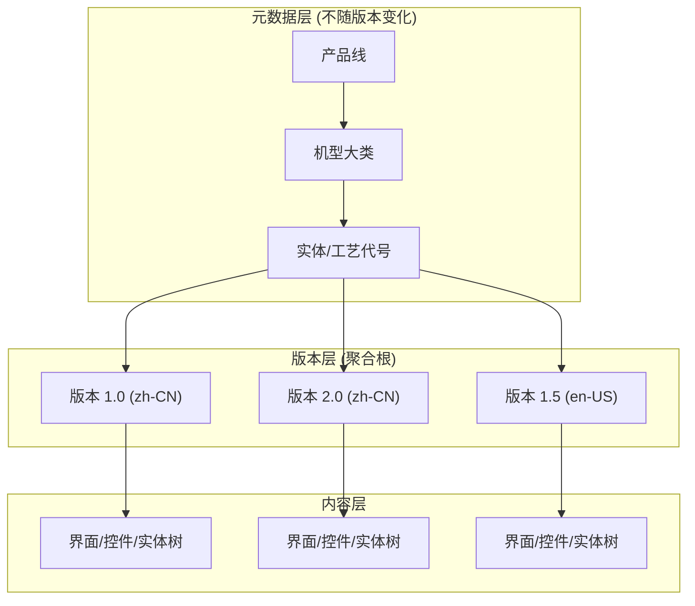
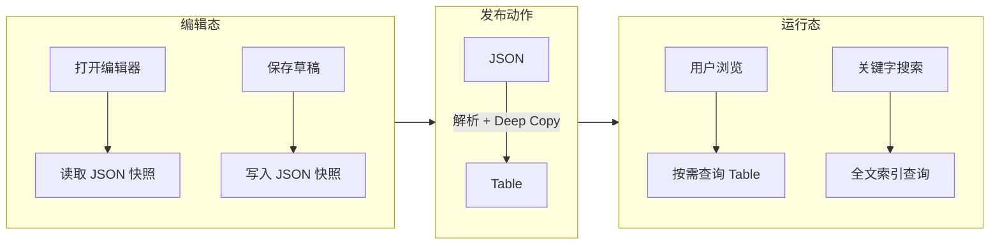

## 问题域

构建一个基于 Web 的实体仿真平台，核心挑战在于**复杂版本控制**与**结构化数据**的结合。系统需要支持：

- 非线性版本演进（从 1.0 分叉出 4.0，而非强制基于 3.0）
- 多语言独立版本序列（中文 v2.0，英文 v1.5）
- 高频编辑暂存与低频版本发布
- 版本隔离的全文检索

简单的 CRUD 模型无法满足这类需求。

## 架构模式：元数据与版本分离

核心设计采用 **"元数据与版本分离"** + **"写入时复制 (Copy-On-Write)"** 模式。



**聚合根定义**：`(实体ID + 语种 + 版本号)` 唯一确定一个模拟实体。所有界面、控件、实体树都挂载在具体的版本 ID 下。

## 版本控制核心表结构

版本主表需要记录版本的"血缘关系"，以支持非线性演进：

```sql
CREATE TABLE `biz_device_version` (
    `id` BIGINT AUTO_INCREMENT PRIMARY KEY,
    `device_id` INT NOT NULL,
    `language_code` VARCHAR(20) NOT NULL DEFAULT 'zh-CN',
    `version_no` VARCHAR(50) NOT NULL,
    
    -- 状态机：DRAFT -> PENDING_APPROVAL -> PUBLISHED -> ARCHIVED
    `status` ENUM('DRAFT', 'PENDING_APPROVAL', 'PUBLISHED', 'ARCHIVED') NOT NULL DEFAULT 'DRAFT',
    
    -- 版本血缘：实现 1.0 -> 4.0 分叉的关键
    `base_version_id` BIGINT NULL COMMENT '基于哪个旧版本创建',
    
    `creator_id` BIGINT NOT NULL,
    `created_at` DATETIME DEFAULT CURRENT_TIMESTAMP,
    
    INDEX `idx_device_lang` (`device_id`, `language_code`, `status`)
);
```

`base_version_id` 字段记录了版本的派生来源。当用户选择"基于 1.0 创建新草稿"时，后端创建新记录并设置 `base_version_id` 指向 1.0 的 ID。

## Deep Copy 的工程复杂度

版本分叉时，需要对界面、控件、实体树执行全量复制。直接使用物理主键关联会导致复制流程异常复杂：

1. 复制所有 Screen，生成 `Old_ID -> New_ID` 映射表
2. 复制所有 Control，更新 `screen_id` 和 `target_screen_id`
3. 复制实体树节点，更新 `linked_screen_id`

这个"ID 重新挂载"过程容易出错，尤其在层级深、节点多的情况下。

**优化方案：引入逻辑 UUID**

```sql
CREATE TABLE `biz_screen` (
    `id` BIGINT AUTO_INCREMENT PRIMARY KEY,
    `version_id` BIGINT NOT NULL,
    `screen_uuid` CHAR(36) NOT NULL,  -- 逻辑标识，跨版本保持不变
    `name` VARCHAR(200) NOT NULL,
    `oss_url` VARCHAR(500) NOT NULL,
    -- ...
);

CREATE TABLE `biz_device_tree` (
    `id` BIGINT AUTO_INCREMENT PRIMARY KEY,
    `version_id` BIGINT NOT NULL,
    `parent_id` BIGINT NULL,
    `name` VARCHAR(100) NOT NULL,
    `linked_screen_uuid` CHAR(36) NULL,  -- 关联逻辑 UUID 而非物理 ID
    `sort_order` INT DEFAULT 0
);
```

优化后的复制流程：

1. 复制 Screen：生成新的物理 `id`，保留原有 `screen_uuid`
2. 复制 Tree：直接复制行，修改 `version_id`，无需修改关联字段

运行时查询：

```sql
SELECT * FROM biz_screen 
WHERE version_id = {新版本ID} AND screen_uuid = '{目标UUID}';
```

逻辑 UUID 解耦了"树结构"与"物理存储行"的强绑定，降低了版本复制的代码复杂度。

## 双模持久化架构

一个关键的架构决策是：**编辑态与运行态采用不同的数据形态**。

### 场景分析

| 场景 | 特征 | 数据访问模式 |
|:---|:---|:---|
| 终端用户浏览/搜索 | 高并发，频次高，只看局部 | 按需加载，毫秒级响应 |
| 操作员编辑 | 低并发，频次低，全量加载 | 打开编辑器时加载全部数据 |

### 为什么编辑态适合 JSON

假设单实体 500 张图，每张图 10 个控件 = 5000 个控件。

- 单个控件 JSON 描述约 300 字节
- 总数据量：`5000 * 300 B ≈ 1.5 MB`
- 加上实体树和元数据，总量约 3-5 MB

从 Table 恢复编辑器状态的流程：

```
数据库 -> 取出 5000 行 -> CPU 循环遍历重组树结构 -> 序列化 -> 前端
```

从 JSON 恢复的流程：

```
数据库 -> 取出字符串 -> 前端
```

后者省去了 Re-hydration（对象重组）的 CPU 开销。对于"打开编辑器"这种需要全量加载的场景，直接读取 JSON 更高效。

### 为什么运行态必须用 Table

运行态需要支持：

- **版本隔离搜索**：`WHERE version_id = {当前版本} AND name LIKE '%keyword%'`
- **按需加载**：进入哪个界面加载哪个界面的配置
- **全文索引**：MySQL 的 `FULLTEXT` 索引无法作用于 JSON 字段内部

如果运行态也用 JSON，每次搜索都需要全量解析，CPU 开销巨大。

### 架构总结



| 场景 | 数据形态 | 理由 |
|:---|:---|:---|
| 编辑态 (Draft) | JSON (Blob) | 全量读写，避免 Object-Relational Impedance Mismatch |
| 运行态 (Published) | Table (Relational) | 按需读取，支持索引和全文搜索 |
| 发布动作 | JSON -> Table | 低频操作，转换开销可接受 |

## 快照表设计

编辑过程中的暂存使用 JSON 存储，避免每次"Ctrl+S"都生成几千行数据库记录：

```sql
CREATE TABLE `biz_version_snapshot` (
    `id` BIGINT AUTO_INCREMENT PRIMARY KEY,
    `version_id` BIGINT NOT NULL,
    `snapshot_name` VARCHAR(100),
    `data_json` LONGTEXT NOT NULL,  -- 完整的界面/控件/树结构
    `created_at` DATETIME DEFAULT CURRENT_TIMESTAMP,
    FOREIGN KEY (`version_id`) REFERENCES `biz_device_version`(`id`) ON DELETE CASCADE
);
```

快照作为"中间存档"或"恢复点"，只有"发布"时才固化为关系型数据。

## 多语言切换的实现

同一实体的不同语言版本被视为独立的模拟实体，拥有各自的版本序列。

运行时语言切换的查询逻辑：

```sql
SELECT * FROM biz_device_version 
WHERE device_id = {当前实体} 
  AND language_code = 'en-US' 
  AND status = 'PUBLISHED' 
ORDER BY id DESC 
LIMIT 1;
```

如果中英文版本号不同步（中文 2.0，英文 1.5），取目标语言的最新发布版本。这种松耦合设计符合"独立演进"的需求。

## 版本隔离搜索

搜索范围严格限制在"当前选中的版本"内：

```sql
SELECT c.*, s.name as screen_name 
FROM biz_control c
JOIN biz_screen s ON c.screen_id = s.id
WHERE c.version_id = {当前版本ID} 
  AND (c.name LIKE '%keyword%' OR s.name LIKE '%keyword%');
```

`version_id` 索引确保查询只扫描当前版本的数据，避免全库扫描。

对于中文搜索，MySQL 8.0 的 ngram 分词器可以支持：

```sql
FULLTEXT KEY `ft_name` (`name`) WITH PARSER ngram
```

## 权限控制

权限精度下沉至实体实例级别：

```sql
CREATE TABLE `sys_device_permission` (
    `id` BIGINT AUTO_INCREMENT PRIMARY KEY,
    `user_id` BIGINT NOT NULL,
    `device_id` INT NOT NULL,
    `permission_code` VARCHAR(50) NOT NULL,  -- VIEW, EDIT, APPROVE
    UNIQUE KEY `uk_user_device_perm` (`user_id`, `device_id`, `permission_code`)
);
```

不同用户可以被赋予针对特定实体的查看、编辑、审核权限。

## 工程权衡

**写性能 vs 读性能**

- 版本发布是低频操作（一天几次），3-5 秒的 Deep Copy 开销可接受
- 用户浏览和搜索是高频操作，必须毫秒级响应
- 不应为了优化发布时间而牺牲日常查询性能

**数据一致性 vs 开发效率**

- JSON 存储无法利用外键约束，引用完整性需要应用层保证
- Table 存储提供数据库级别的约束，但增加了 ORM 转换开销
- 双模架构在两者之间取得平衡

**复杂度 vs 灵活性**

- 逻辑 UUID 增加了一层间接性，但大幅简化了版本复制逻辑
- 版本血缘字段支持非线性演进，但需要额外的 UI 来展示版本树

这套架构针对"复杂版本控制 + 结构化数据"的场景，通过分层设计和场景化的持久化策略，在性能、一致性和开发效率之间取得了平衡。
