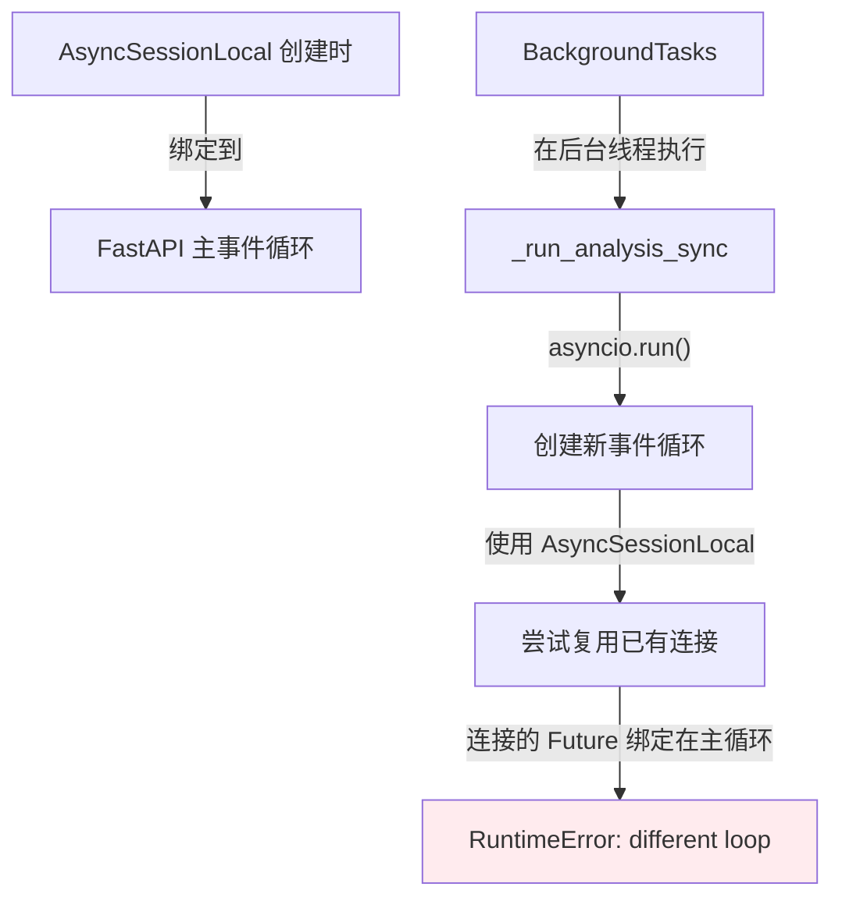
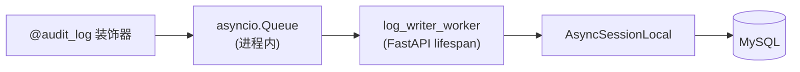
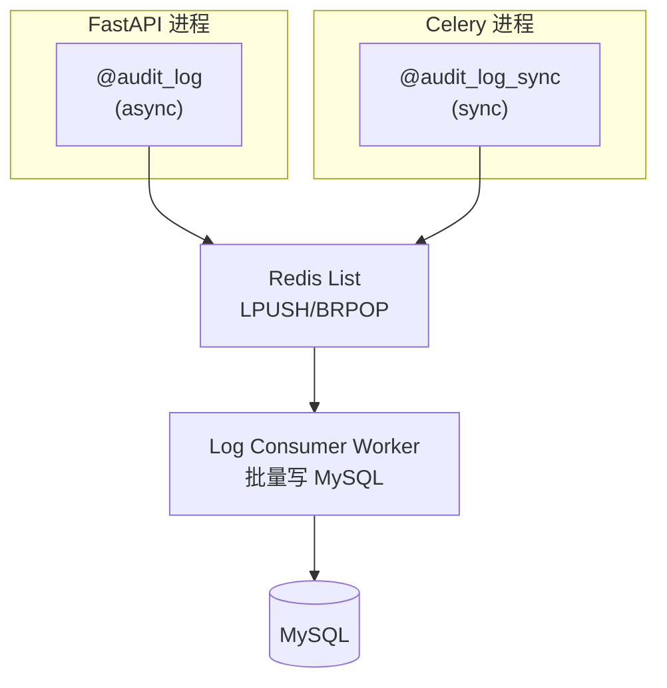
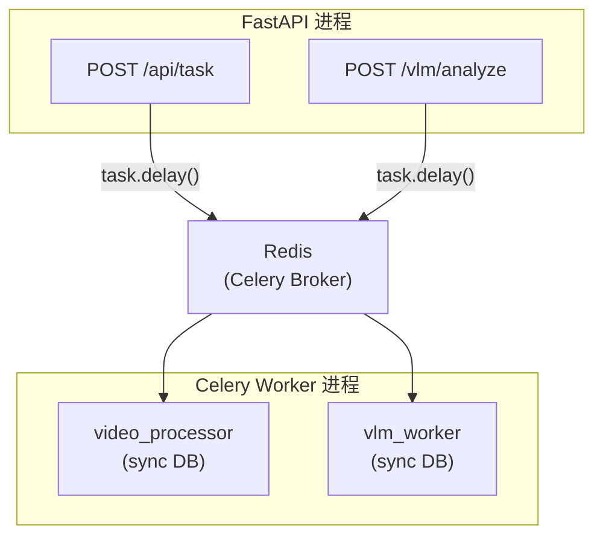

## 背景与技术栈

一个视频处理系统，技术栈如下：

| 组件 | 技术选型 | 运行模式 |
|------|----------|----------|
| Web 框架 | FastAPI | async |
| ORM | SQLAlchemy 2.0 + aiomysql | async |
| ORM (迁移/Worker) | SQLAlchemy 2.0 + pymysql | sync |
| 任务队列 | Celery + Redis | sync (prefork) |
| 日志 | structlog + asyncio.Queue | async |

系统中存在两套数据库会话工厂：

```python
# 同步引擎（Alembic 迁移、Celery Worker）
sync_engine = create_engine(settings.DATABASE_URL, ...)
SessionLocal = sessionmaker(bind=sync_engine)

# 异步引擎（FastAPI API 层、Service 层）
async_engine = create_async_engine(settings.ASYNC_DATABASE_URL, ...)
AsyncSessionLocal = async_sessionmaker(bind=async_engine, class_=AsyncSession)
```
{: file="app/db/database.py" }

这种双引擎设计本身没有问题，问题在于 async/sync 边界的管理。

## 问题一：协程未 await

### 现象

端到端测试中，30 秒视频的切片任务超过 500 秒未完成。Celery Worker 日志显示任务 `succeeded`，但客户端轮询到的状态始终是 `pending`：

```
[WARNING] RuntimeWarning: coroutine 'TaskService.update_task_status' was never awaited
[INFO] Task process_video_task succeeded in 23.1s: {'status': 'completed', 'scenes': 19}
```

关键矛盾点：Celery 日志显示 `succeeded`，但客户端看到的状态是 `pending`。任务执行了，但数据库写入没有生效。

### 根因

`TaskService` 是为 FastAPI 设计的异步服务，方法签名为 `async def`。在同步的 Celery task 中直接调用，只会创建协程对象而不执行：

```python
class TaskService:
    async def update_task_status(self, task_id: str, status: TaskStatus, ...):
        task = await self.get_task(task_id)
        task.status = status
        await self.db.commit()

@celery_app.task
def process_video_task(self, task_id: str, ...):
    task_service = TaskService(db)
    task_service.update_task_status(task_id, TaskStatus.COMPLETED)  # ← 返回协程对象，未执行
```

> `RuntimeWarning: coroutine was never awaited` 不会阻止程序继续执行，但意味着异步操作被跳过。这是一个容易被忽略的警告。
{: .prompt-warning }

### 方案抉择

**方案 A：用 `asyncio.run()` 包装异步调用**

```python
@celery_app.task
def process_video_task(self, task_id: str, ...):
    async def _process():
        async with AsyncSessionLocal() as db:
            task_service = TaskService(db)
            await task_service.update_task_status(task_id, TaskStatus.COMPLETED)
    asyncio.run(_process())
```

| 维度 | 评估 |
|------|------|
| 复杂度 | 中等，需要处理事件循环 |
| 性能 | 有开销（事件循环切换） |
| 稳定性 | **潜在风险**：Celery prefork worker 是 fork 出来的子进程，`asyncio.get_event_loop()` 可能拿到父进程已关闭的循环 |
| 代码维护 | 复用现有代码，但混用 async/sync |

**方案 B：在 Worker 中使用同步数据库操作**

```python
def sync_update_task_status(db: Session, task_id: str, status: TaskStatus, ...):
    task = db.execute(select(Task).where(Task.id == task_id)).scalar_one_or_none()
    if task:
        task.status = status
        db.commit()

@celery_app.task
def process_video_task(self, task_id: str, ...):
    db = SessionLocal()
    try:
        sync_update_task_status(db, task_id, TaskStatus.COMPLETED)
    finally:
        db.close()
```

| 维度 | 评估 |
|------|------|
| 复杂度 | 低，直接同步调用 |
| 性能 | 更高效，原生同步 |
| 稳定性 | 稳定，Celery 天然同步 |
| 代码维护 | 职责分离，各司其职 |

### 决策：选择方案 B

核心理由：

1. **Celery 本质是同步的** - Celery 的 prefork 模型基于多进程，每个 worker 是独立的同步进程，强行塞异步代码是逆流而上
2. **事件循环风险** - `asyncio.get_event_loop()` 在 fork 的 worker 进程中行为不可预测，可能抛出 `RuntimeError: There is no current event loop`
3. **已有同步 Session** - `database.py` 中已经定义了 `SessionLocal`（同步会话工厂），无需额外配置
4. **职责清晰** - FastAPI 用 async，Celery 用 sync，边界分明

> Celery 的 prefork 模型基于多进程，每个 worker 是独立的同步进程。在这种环境中强行使用异步代码会引入不可预测的事件循环问题。
{: .prompt-tip }

## 问题二：SQLAlchemy 外键解析失败

### 现象

修复协程问题后，重启 Celery Worker 出现新错误：

```
sqlalchemy.exc.NoReferencedTableError: Foreign key associated with column 
'tasks.video_id' could not find table 'videos'
```

完整堆栈显示错误发生在 `db.commit()` 时的 flush 阶段。

### 根因

SQLAlchemy ORM 在 flush 时需要解析所有外键关系以确定表的写入顺序。`Task` 模型定义了外键：

```python
class Task(Base):
    __tablename__ = "tasks"
    video_id = Column(String(36), ForeignKey("videos.id"), nullable=False)
```

当 SQLAlchemy 尝试 commit 时，它需要知道 `videos` 表的元数据来解析这个外键。但在 Celery worker 进程中，只导入了 `Task` 和 `Scene` 模型：

```python
from app.models.task import Task, TaskStatus
from app.models.scene import Scene
# Video 模型未导入 → videos 表未注册到 metadata
```

FastAPI 应用启动时通常会在某处（如 `main.py` 或 `models/__init__.py`）导入所有模型，确保它们都注册到 `Base.metadata`。但 Celery worker 是独立进程，只导入了 `video_processor.py` 及其依赖。

### 解决方案

显式导入外键依赖的模型，即使代码中不直接使用：

```python
from app.models.video import Video  # noqa: F401 - 必须导入，Task 外键依赖
```

`# noqa: F401` 注释告诉 linter 这个导入是有意为之，不是未使用的导入。

> 在多进程架构中，每个进程都需要确保所有相关模型被导入。可以在 `models/__init__.py` 中统一导出所有模型，或在 worker 入口处导入。
{: .prompt-tip }

## 问题三：事件循环冲突

### 现象

视频切片任务正常完成后，VLM 分析任务失败：

```
状态: completed, 进度: 100%
切片完成!
[3/5] 启动控件检测...
状态: failed, 进度: 0% (0/0)
错误: Task <Task pending ...> got Future <Future pending> attached to a different loop
```

完整异常堆栈：

```
RuntimeError: Task <Task pending name='Task-150' 
coro=<_run_analysis_sync.<locals>._run_async() running at vlm.py:90> ...> 
got Future <Future pending> attached to a different loop

Traceback:
  File "vlm.py", line 90, in _run_async
    result = await service.analyze_scenes(...)
  File "aiomysql/connection.py", line 494, in ping
    await self._read_ok_packet()
```

### 根因

VLM 分析使用 FastAPI 的 `BackgroundTasks`：

```python
def _run_analysis_sync(task_id: str, detect_type: DetectType, ...):
    async def _run_async():
        async with AsyncSessionLocal() as db:  # ← 问题所在
            service = VLMService(db)
            result = await service.analyze_scenes(...)
    asyncio.run(_run_async())  # ← 创建新事件循环

@router.post("/analyze")
async def analyze_scenes(..., background_tasks: BackgroundTasks):
    background_tasks.add_task(_run_analysis_sync, task_id, ...)
```

问题链条：



1. `AsyncSessionLocal` 是在 FastAPI 启动时创建的，其底层的 `async_engine` 绑定到 FastAPI 的主事件循环
2. `BackgroundTasks` 在后台线程中执行 `_run_analysis_sync`
3. `asyncio.run()` 在该线程中创建一个**新的**事件循环
4. 当 `AsyncSessionLocal()` 创建 session 时，它尝试复用已有的数据库连接
5. 这些连接的 Future 对象绑定在主事件循环上，但当前运行的是新循环
6. 抛出 `got Future attached to a different loop`

### 曾经尝试的补丁方案

在 `asyncio.run()` 内部创建独立的数据库引擎：

```python
async def _run_async():
    # 在新的事件循环中创建独立的数据库引擎和会话
    engine = create_async_engine(settings.ASYNC_DATABASE_URL, pool_size=5, ...)
    async_session = async_sessionmaker(bind=engine, class_=AsyncSession, ...)
    
    async with async_session() as db:
        try:
            service = VLMService(db)
            result = await service.analyze_scenes(...)
        finally:
            await engine.dispose()  # 用完释放

asyncio.run(_run_async())
```

这个方案可以工作，但存在问题：
- 每次任务创建/销毁连接池，开销大
- 补丁式修复，不够优雅
- 如果多处使用 `BackgroundTasks`，需要重复这个模式

### 架构层面的反思

| 场景 | 当前实现 | 问题 |
|------|----------|------|
| 视频切片 | Celery worker | 已改为同步，正常工作 |
| VLM 分析 | FastAPI BackgroundTasks | 事件循环冲突 |

`BackgroundTasks` 的设计初衷是轻量级后台操作：
- 发送邮件通知
- 写入日志
- 清理临时文件

VLM 分析的特点：
- 长时间运行（分钟级）
- IO 密集（调用外部 API）
- 需要进度追踪
- 可能需要重试机制

**结论**：VLM 分析应该迁移到 Celery，与视频切片保持一致的架构。

## 问题四：日志模块的跨进程兼容性

将 VLM 分析迁移到 Celery 之前，需要评估现有日志模块是否支持跨进程场景。

### 原有架构

系统使用了一套基于 structlog + asyncio.Queue 的审计日志方案：



关键组件：

```python
# logger.py - 进程内队列
_log_queue: asyncio.Queue[dict[str, Any]] | None = None

def get_log_queue() -> asyncio.Queue[dict[str, Any]]:
    global _log_queue
    if _log_queue is None:
        _log_queue = asyncio.Queue(maxsize=settings.AUDIT_LOG_QUEUE_SIZE)
    return _log_queue

def _db_persistence_processor(logger, method_name, event_dict):
    persist_db = event_dict.pop("persist_db", False)
    if persist_db:
        audit_data = event_dict.get("audit_data")
        if audit_data:
            get_log_queue().put_nowait(audit_data)  # ← 需要事件循环
    return event_dict
```
{: file="app/core/logger.py" }

```python
# audit.py - 异步装饰器
def audit_log(action: str):
    def decorator(func):
        @functools.wraps(func)
        async def wrapper(*args, **kwargs):  # ← async def
            result = await func(*args, **kwargs)
            log.info("audit_event", audit_data=..., persist_db=True)
            return result
        return wrapper
    return decorator
```
{: file="app/core/audit.py" }

### 问题分析

如果 VLM 分析迁移到 Celery，日志模块面临以下问题：

> ❌ `asyncio.Queue` 在 FastAPI 进程，Celery 无法访问  
> ❌ `@audit_log` 是 async def，无法装饰同步的 Celery task  
> ❌ `log_writer_worker` 只在 FastAPI lifespan 启动  
> ❌ `get_log_queue()` 需要事件循环，Celery prefork 没有
{: .prompt-danger }

| 组件 | 问题 |
|------|------|
| `asyncio.Queue` | **进程内队列**，Celery worker 是独立进程，无法访问 FastAPI 进程的队列 |
| `@audit_log` | 装饰器是 `async def wrapper`，返回协程，无法装饰同步函数 |
| `log_writer_worker` | 只在 FastAPI lifespan 启动，Celery 进程没有这个 worker |
| `get_log_queue()` | 内部调用 `asyncio.Queue()`，需要运行中的事件循环 |

尝试在 Celery worker 中使用 asyncio.Queue：

```python
# Celery worker 中
queue.put_nowait(item)  
# → RuntimeError: no running event loop
```

### 方案评估：Redis 替代 asyncio.Queue

目标架构：



**Redis 队列能解决的问题**：

| 问题 | 解决？ | 说明 |
|------|--------|------|
| 跨进程日志收集 | ✅ | Redis 是进程间共享的 |
| Celery worker 审计日志 | ✅ | 同步 `redis.lpush()` 即可，不需要事件循环 |
| 日志不丢失 | ✅ | Redis 持久化 + 消费确认 |
| 批量写入优化 | ✅ | Consumer 可以 BRPOP 批量消费 |

**Redis 队列不能解决的问题**：

| 问题 | 解决？ | 说明 |
|------|--------|------|
| `@audit_log` 是 async | ❌ | 装饰器本身是 `async def wrapper`，无法装饰同步函数 |
| `structlog.contextvars` | ⚠️ | 同步代码中 contextvars 可用，但 Celery fork 后需要手动绑定 |
| trace_id 传递 | ⚠️ | 需要通过 Celery task 参数显式传递，不能依赖 contextvars 自动传播 |

**关键洞察**：即使改用 Redis，仍需要同步版装饰器 `@audit_log_sync`。

### 同步装饰器的风险评估

日志写入不应阻塞业务。评估同步版装饰器的风险：

| 环节 | 操作 | 耗时 | 阻塞风险 |
|------|------|------|----------|
| `log.info()` | structlog 格式化 | 微秒级 | ❌ 无 |
| `redis.lpush()` | 网络 IO | 1-5ms | ⚠️ 轻微 |
| MySQL 写入 | 由 Consumer Worker 执行 | - | ❌ 不在 Celery 进程 |

**结论**：Redis LPUSH 约 1-5ms，对于 Celery 长任务（秒级/分钟级）可以接受。如果需要进一步优化，可以使用 Redis pipeline 批量推送。

## 最终架构

### 日志模块重构

改造前后对比：

```python
# logger.py (旧)
_log_queue: asyncio.Queue | None = None

def _db_persistence_processor(logger, method_name, event_dict):
    if event_dict.pop("persist_db", False):
        get_log_queue().put_nowait(event_dict.get("audit_data"))
    return event_dict
```

```python
# logger.py (新)
AUDIT_LOG_QUEUE_KEY = "audit_log_queue"

def push_audit_log(data: dict[str, Any]) -> bool:
    """推送审计日志到 Redis 队列，跨进程安全"""
    try:
        client = _get_redis_client()
        client.lpush(AUDIT_LOG_QUEUE_KEY, json.dumps(data, default=str))
        return True
    except Exception:
        return False  # 推送失败时静默处理，不影响业务

def _db_persistence_processor(logger, method_name, event_dict):
    if event_dict.pop("persist_db", False):
        audit_data = event_dict.get("audit_data")
        if audit_data:
            push_audit_log(audit_data)
    return event_dict
```

同步装饰器实现：

```python
def audit_log_sync(action: str):
    """同步审计日志装饰器（Celery 用）"""
    def decorator(func):
        @functools.wraps(func)
        def wrapper(*args, **kwargs):  # 同步
            trace_id = kwargs.get("trace_id", "")  # 从参数获取
            start = time.perf_counter()
            try:
                result = func(*args, **kwargs)
                duration = time.perf_counter() - start
                push_audit_log({
                    "trace_id": trace_id,
                    "action": action,
                    "status": "success",
                    "duration": round(duration, 4),
                })
                return result
            except Exception as e:
                push_audit_log({...})
                raise
        return wrapper
    return decorator
```
{: file="app/core/audit.py" }

### 最终日志架构

```
┌─────────────────────────────────────────────────────────────────┐
│  FastAPI 进程                    Celery Worker 进程             │
│  ┌─────────────┐                 ┌─────────────────┐           │
│  │ @audit_log  │                 │ @audit_log_sync │           │
│  │ (async)     │                 │ (sync)          │           │
│  └──────┬──────┘                 └────────┬────────┘           │
│         │                                 │                     │
│         └────────────┬────────────────────┘                     │
│                      ▼                                          │
│            ┌─────────────────────┐                             │
│            │   Redis List        │                             │
│            │   (LPUSH)           │                             │
│            └──────────┬──────────┘                             │
│                       ▼                                         │
│            ┌─────────────────────┐                             │
│            │  log_writer_worker  │  ← FastAPI lifespan 启动    │
│            │  (BRPOP + 批量写)    │                             │
│            └──────────┬──────────┘                             │
│                       ▼                                         │
│                    MySQL                                        │
└─────────────────────────────────────────────────────────────────┘
```

### VLM 分析迁移到 Celery

VLM Worker 实现要点：

```python
@celery_app.task(bind=True, name="vlm_analyze_task")
def vlm_analyze_task(self, task_id: str, detect_type: DetectType, 
                     scene_ids: list[int] | None = None, trace_id: str = "") -> dict:
    db = SessionLocal()
    try:
        # 查询场景
        scenes = db.execute(select(Scene).where(Scene.task_id == task_id)).scalars().all()
        
        # 进度回调 - 利用 Celery 的 update_state
        def progress_callback(processed: int, total: int):
            self.update_state(
                state="PROGRESS",
                meta={"current": processed, "total": total, "progress": int(processed/total*100)},
            )
        
        # 执行分析（同步版本）
        analyzer = VLMAnalyzer()
        results = analyzer.analyze_scenes_batch(scenes, detect_type, progress_callback)
        return {"task_id": task_id, "status": "completed", "total_scenes": len(results)}
    finally:
        db.close()
```
{: file="app/workers/vlm_worker.py" }

API 层改造要点：

```python
@router.post("/analyze")
async def analyze_scenes(request: VLMAnalyzeRequest, ...):
    # 显式传递 trace_id，不依赖 contextvars 自动传播
    ctx = structlog.contextvars.get_contextvars()
    trace_id = ctx.get("trace_id", "")
    
    celery_task = vlm_analyze_task.delay(
        task_id=task_id,
        detect_type=detect_type,
        scene_ids=request.scene_ids,
        trace_id=trace_id,
    )
    return VLMAnalyzeStartResponse(status="processing", ...)
```

### 最终任务处理架构



## 核心要点

**async/sync 边界管理**

- FastAPI API 层用 async，Celery Worker 用 sync，边界必须清晰
- 混用会导致协程未 await、事件循环冲突等问题
- Celery prefork 模型基于多进程，强行塞异步代码是逆流而上
- `asyncio.run()` 包装方案看似可行，但在 fork 的 worker 进程中行为不可预测

**SQLAlchemy 多进程注意事项**

- ORM 在 flush 时需要解析所有外键关系
- 每个进程都需要确保所有相关模型被导入到 `Base.metadata`
- 建议在 `models/__init__.py` 中统一导出所有模型

**事件循环绑定**

- `AsyncSessionLocal` 创建的连接绑定到创建时的事件循环
- 在新事件循环中使用这些连接会抛出 `got Future attached to a different loop`
- `BackgroundTasks` 不适合长时间运行的任务
- 补丁方案（每次创建独立引擎）可以工作，但开销大且不优雅

**跨进程通信**

- `asyncio.Queue` 是进程内队列，需要运行中的事件循环
- 跨进程通信必须使用 Redis 等外部存储
- 装饰器的 async/sync 属性决定了它能装饰什么函数，需要为不同场景提供不同版本
- `trace_id` 等上下文信息需要通过参数显式传递，不能依赖 contextvars 自动传播
