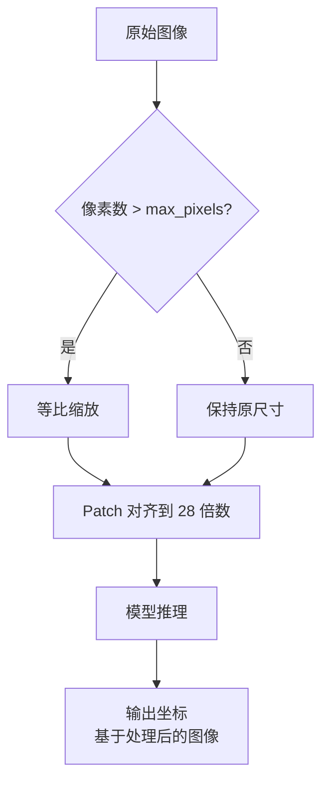
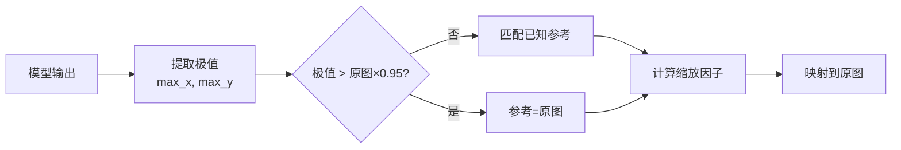

## 问题背景

在基于 Qwen-VL 视觉语言模型（qwen-vl-max-2025-08-13）的 UI 控件检测系统中，模型接收屏幕截图并返回可交互控件的边界框坐标 `bbox_2d: [xmin, ymin, xmax, ymax]`。可视化验证发现异常：部分截图的检测框位置精准，另一部分出现系统性偏移。

> 核心结论：面对黑盒模型，观察和适应优于预测和控制。
{: .prompt-info }

测试样本：

| 样本 | 分辨率 | 像素数 | 长宽比 | 观察结果 |
|------|--------|--------|--------|----------|
| 图1 | 1920×1200 | 2.3MP | 1.60 (16:10) | 检测框整体偏上偏左 |
| 图2 | 1030×770 | 0.79MP | 1.34 (~4:3) | 检测框位置准确 |

关键观察：偏差不是随机抖动，而是整体的方向性漂移。

## 现象与初步分析

### 历史代码的"幸运巧合"

历史代码中存在硬编码的参考分辨率：

```python
DEFAULT_REF_WIDTH = 1440
DEFAULT_REF_HEIGHT = 900

scale_x = img_width / ref_width   # 1920 / 1440 = 1.333
scale_y = img_height / ref_height # 1200 / 900 = 1.333
```

这个 1440×900 对 1920×1200 效果良好，但对 1030×770 效果很差：

$$
\begin{aligned}
\text{ratio}_{1920 \times 1200} &= 1.60 = \text{ratio}_{1440 \times 900} \\
\text{ratio}_{1030 \times 770} &= 1.34 \neq 1.60
\end{aligned}
$$

非均匀缩放（`scale_x=0.715`, `scale_y=0.856`）导致框形状扭曲。这是**数学巧合**而非正确设计。

### 坐标输出的矛盾

根据官方文档，Qwen3-VL 使用 [0-1000] 归一化坐标。但实测数据显示：

```json
// 图1 (1920×1200) 的输出
{"bbox_2d": [1316, 8, 1389, 23]}   // x > 1000！
{"bbox_2d": [1101, 30, 1130, 59]}  
{"bbox_2d": [13, 834, 108, 878]}

// 图2 (1030×770) 的输出
{"bbox_2d": [32, 495, 150, 529]}
```

**关键矛盾**：如果是 [0-1000] 归一化，不应出现 `x=1316` 这样的值。坐标范围 `x=[11, 1417]`, `y=[8, 880]` 远超归一化范围。

## 理论探索与验证

### 归一化坐标验证实验

尝试应用标准归一化还原公式：

$$
x_{\text{real}} = \frac{x_{\text{model}}}{1000} \times W_{\text{image}}
$$

对图1中的 ServiceUser 元素（模型输出 `[1316, 8, 1389, 23]`）：

$$
x_{\text{converted}} = \frac{1316}{1000} \times 1920 = 2527 > 1920
$$

转换后坐标超出图像边界，证明模型输出的不是归一化坐标。

### 坐标极值分析

分析所有元素的坐标极值，发现规律：

| 图片 | 原图尺寸 | 坐标极值 | 极值比例 | 推断 |
|------|---------|----------|----------|------|
| 图1 | 1920×1200 | x=[11, 1417], y=[8, 880] | 1417/880=1.61 | 接近 1440×900 |
| 图2 | 1030×770 | x=[32, 983], y=[8, 764] | 983/764=1.29 | 接近原图尺寸 |

**核心发现**：模型输出的坐标基准因输入图片而异。

$$
\text{坐标基准} = 
\begin{cases}
\text{原图尺寸} & \text{if pixels} < 1.5\text{MP} \\
\text{内部参考尺寸} & \text{if pixels} \geq 1.5\text{MP}
\end{cases}
$$

### 内部处理机制推导

基于 Qwen3-VL 的 Native Dynamic Resolution 机制：



**关键洞察**：模型输出的坐标基于**处理后的图像**，而非原图。大图（2.3MP）触发缩放，缩放后的比例漂移导致坐标偏差。

**`max_pixels` 参数的影响**：

根据社区反馈（Issue #1855），`max_pixels` 是关键参数：

- 当 `图片像素数 < max_pixels` 时：不触发缩放，模型输出坐标直接对应原图，**无需除以 1000**
- 当 `图片像素数 > max_pixels` 时：触发缩放，模型输出坐标基于缩放后的图像

这解释了为什么小图（0.79MP）直接使用坐标准确，而大图（2.3MP）需要坐标映射：

$$
\begin{aligned}
\text{图2} &: 0.79\text{MP} < \text{max\_pixels} \implies \text{无缩放} \\
\text{图1} &: 2.3\text{MP} > \text{max\_pixels} \implies \text{缩放到约 1.5MP}
\end{aligned}
$$

## 解决历程

### 尝试一：预处理图片

思路：手动控制 Padding，消除模型内部不确定性。

结果：**失败**。模型忽略了预处理，内部又做了一轮处理。

教训：不要试图控制黑盒。

### 尝试二：Prompt 注入尺寸

思路：通过 Prompt 引导模型输出基于原图尺寸的坐标。

结果：**部分有效**。小图准确，大图仍偏离。

教训：Prompt Engineering 无法覆盖模型内部处理流程。

### 尝试三：归一化还原

思路：按文档描述，除以 1000 还原坐标。

结果：**失败**。转换后坐标大量超出边界。

| 元素 | 模型输出 | 还原后 | 问题 |
|------|---------|--------|------|
| ServiceUser | [1316, 8, 1389, 23] | [2527, 9, 2667, 27] | x 超出 1920 |
| Light Bulb | [1101, 30, 1130, 59] | [2114, 36, 2170, 70] | x 超出 1920 |

教训：文档描述与实际行为可能不一致。

### 思维转变

经过三次失败，认知转变：

1. 模型是黑盒，无法预测其内部逻辑
2. 不同尺寸图片，坐标输出基准不同
3. 预处理和 Prompt 都无法控制模型

**新策略**：观察 → 推断 → 适应。

## 最终方案

### 自适应坐标适配器

核心思想：通过坐标极值反推模型使用的参考分辨率。



### 推断算法

已知参考分辨率（基于实测）：

```python
KNOWN_REFS = [
    (1440, 900),   # 16:10，大图常用
    (1920, 1080),  # 16:9
    (1280, 720),   # 16:9
]
```

推断逻辑：

1. 坐标极值接近原图（>95%） → 使用原图尺寸
2. 匹配已知参考 → 找差值最小的
3. 兜底策略 → 使用极值作为参考

### 坐标映射

```python
def adapt_coordinates(elements, img_width, img_height):
    # 1. 提取坐标极值
    max_x = max(bbox[2] for bbox in all_bboxes)
    max_y = max(bbox[3] for bbox in all_bboxes)
    
    # 2. 推断参考分辨率
    ref_w, ref_h = infer_reference(max_x, max_y, img_width, img_height)
    
    # 3. 计算缩放因子并映射
    scale_x = img_width / ref_w
    scale_y = img_height / ref_h
    
    if abs(scale_x - 1.0) > 0.01:
        for item in elements:
            item["bbox_2d"] = [
                int(coord * scale) for coord, scale 
                in zip(bbox, [scale_x, scale_y, scale_x, scale_y])
            ]
    
    return elements, {
        "ref": (ref_w, ref_h),
        "scale": (scale_x, scale_y)
    }
```

### 验证结果

| 样本 | 坐标极值 | 推断参考 | 缩放因子 | 效果 |
|------|---------|----------|----------|------|
| 图1 (1920×1200) | 1417×880 | 1440×900 | 1.33×1.33 | 准确 |
| 图2 (1030×770) | 983×764 | 1030×770 | 1.0×1.0 | 准确 |

示例映射：

```python
# 图1的 ServiceUser 元素
原始: [1316, 8, 1389, 23]
映射: [1754, 10, 1851, 30]  # 在边界内 ✓
```

## 跨版本对比

### 坐标系统演进

| 特性 | Qwen2.5-VL | Qwen3-VL | 本项目实测 |
|------|-----------|----------|-----------|
| **坐标系设计** | 绝对像素坐标 | [0-1000] 归一化 | 混合行为 |
| **实际行为** | 依赖预处理尺寸 | 理论归一化 | 基于内部参考尺寸 |

### 理论与实践的差异

**文档描述**：Qwen3-VL 技术报告（Page 7, Section 3.2.4）采用 [0-1000] 归一化坐标。

**实测行为**：坐标极值超过 1000，基于内部参考尺寸的像素坐标。

**关于 [0-1000] vs [0-999]**：

社区存在混淆（Issue #1859）：
- 技术报告和 cookbook 使用 1000
- mobile agent 使用 999（system prompt: "The screen's resolution is 999x999"）

推测 [0, 1000] 实际是指 **[0, 999] 共 1000 个离散值**。但在本项目实测中：
- 小图输出坐标范围接近原图尺寸（max_x=983 for 1030px 宽）
- 大图输出坐标范围超过 1000（max_x=1417）

说明模型并非严格遵循归一化约定。

**可能原因**：
1. qwen-vl-max-2025-08-13 是过渡版本
2. DashScope API 在坐标系统上做了额外处理
3. `max_pixels` 参数影响了坐标输出基准

> 文档描述的是设计意图，实际行为可能因版本、API 封装、部署环境、`max_pixels` 设置而异。工程实践必须以实测数据为准。
{: .prompt-warning }

### 为何选择自适应策略

三种策略对比：

| 策略 | 假设 | 图1 | 图2 | 通用性 |
|------|------|-----|-----|--------|
| 归一化还原 | [0-1000] | 失败 | 失败 | 差 |
| 固定参考 | 1440×900 | 成功 | 失败 | 差 |
| 自适应匹配 | 极值推断 | 成功 | 成功 | 优 |

自适应策略本质是**观察式编程**：不预测模型行为，而是观察输出特征，动态适应。

## 工程洞察

### 黑盒模型的处理原则

**观察优于预测**：通过实测数据观察实际行为，而非假设模型逻辑。

**适应优于控制**：接受模型的不确定性，设计能适应多种情况的方案。

**诊断信息至关重要**：记录中间数据（极值、推断参考、缩放因子），便于排查和优化。

### 文档与实现的鸿沟

官方文档描述归一化坐标，但实测是混合行为。文档描述的是"设计意图"，不一定是"实际行为"。

涉及复杂预处理流程的模型，文档往往无法覆盖所有边界情况。**以实测为准**。

### 问题排查方法论

**可视化验证**：如果只看数字，问题可能隐藏很久。

**对比分析**：准备不同尺寸、不同比例的样本，对比行为差异。

**极值分析**：通过坐标极值反推模型内部状态，是本次解决的核心方法。

**参数排查**：检查 `max_pixels` 等关键参数设置。根据社区反馈，当图片像素数小于 `max_pixels` 时，模型不会缩放图片，输出坐标直接对应原图，此时无需除以 1000。

**假设验证**：明确预期效果，对比实际结果，快速迭代。

### "幸运巧合"的警惕

历史代码的 1440×900 对特定分辨率有效，是因为比例巧合，不是正确设计。

代码"能跑"不代表"正确"。要理解为什么能工作，警惕"歪打正着"。

## 诊断信息设计

返回结果中增加诊断字段：

```json
{
  "diagnostic_info": {
    "coord_range": {"x": [11, 1417], "y": [8, 880]},
    "inferred_reference": [1440, 900],
    "scale_factors": {"scale_x": 1.333, "scale_y": 1.333},
    "mapping_applied": true
  }
}
```

快速排查：

| 现象 | 可能原因 | 解决方案 |
|------|----------|----------|
| 框整体偏小 | 未缩放 | 检查 scale 应用 |
| 框形状扭曲 | scale_x ≠ scale_y | 检查 KNOWN_REFS |
| 坐标超界 | 误用归一化公式 | 检查是否错误除以 1000 |

## 后续优化

### 短期

- 生产环境验证
- 收集更多分辨率样本（2K、4K）
- 完善 `KNOWN_REFS` 列表

**`max_pixels` 参数优化**：

根据社区反馈（Issue #1855），合理设置 `max_pixels` 可以避免不必要的缩放：

```python
# 如果输入图片大多在 2MP 以下，可以设置
max_pixels = 2.5 * 1024 * 1024  # 2.5MP

# 这样小图不会触发缩放，直接使用坐标即可
```

**输入分辨率建议**：

| 场景 | 建议分辨率 | 理由 |
|------|-----------|------|
| GUI 控件检测 | 长边 1024-1280 | 平衡精度与性能 |
| 文字密集界面 | 长边 1280-1440 | 保证 OCR 精度 |
| 大屏幕截图 | 缩放到 1280 | 避免 Token 爆炸 |

### 中期

- 监控坐标推断准确率
- 当 `abs(scale_x - scale_y) > 0.1` 时触发告警
- 建立分辨率到参考分辨率的映射表

### 长期

- 关注 Qwen-VL 版本更新，坐标系统可能改变
- 建立版本与坐标行为的对应关系

## 参考资料

### 官方技术报告

**Qwen3-VL Technical Report**
- arXiv: [2511.21631](https://arxiv.org/abs/2511.21631)
- Page 3-4: Native Dynamic Resolution，SigLIP2-SO-400M
- Page 7, Section 3.2.4: 归一化坐标系统 [0-1000]

**Qwen2.5-VL Technical Report**
- arXiv: [2502.13923](https://arxiv.org/abs/2502.13923)
- Page 5-6: 绝对像素坐标系统

### 社区讨论

**GitHub Issues**:
- [#1486](https://github.com/QwenLM/Qwen3-VL/issues/1486): BBOX 坐标偏差 - Patch Grid 机制（28×28）、Padding 影响
- [#1855](https://github.com/QwenLM/Qwen3-VL/issues/1855): `max_pixels` 参数的关键作用 - 当图片像素数 < max_pixels 时，直接使用坐标无需量化
- [#1859](https://github.com/QwenLM/Qwen3-VL/issues/1859): [0-1000] vs [0-999] 的混淆 - cookbook 用 1000，mobile agent 用 999
- [#1896](https://github.com/QwenLM/Qwen3-VL/issues/1896): 坐标识别准确性 - text grounding 任务难度，除以 1000 能"大致"识别但不精确

**技术博客**:
- Towards Data Science: [Qwen 3 VL 使用指南](https://towardsdatascience.com/how-to-use-frontier-vision-llms-qwen-3-vl-2/)

### 相关技术

- **SigLIP2-SO-400M**: Patch Size 14×14，输入要求 28 的倍数
- **Native Dynamic Resolution**: 保持原始宽高比，动态生成 Token
