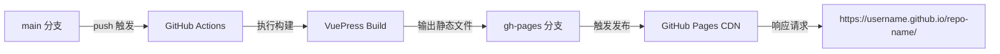
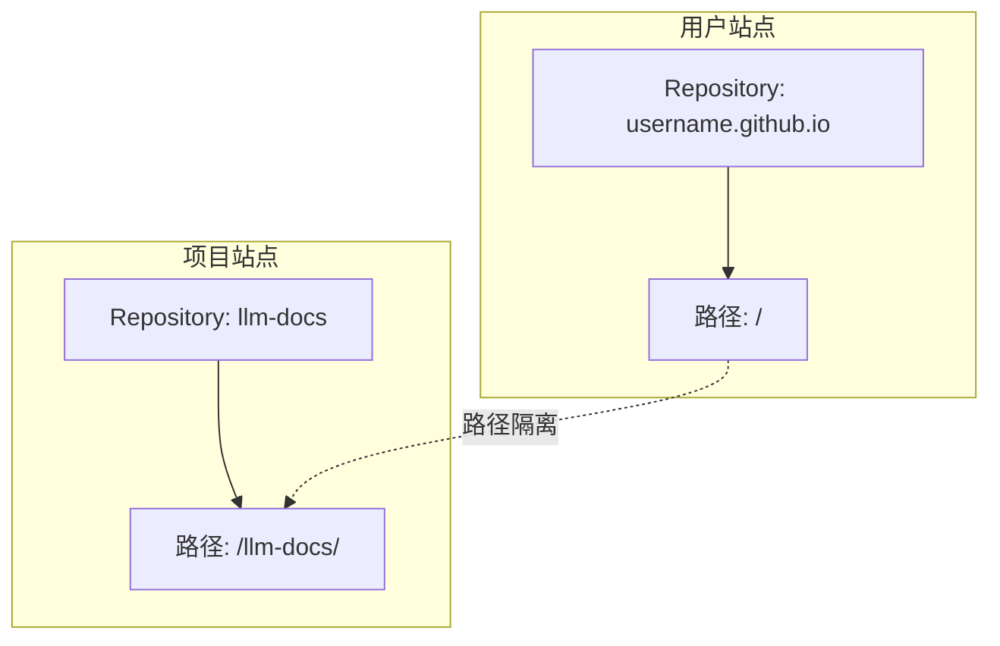
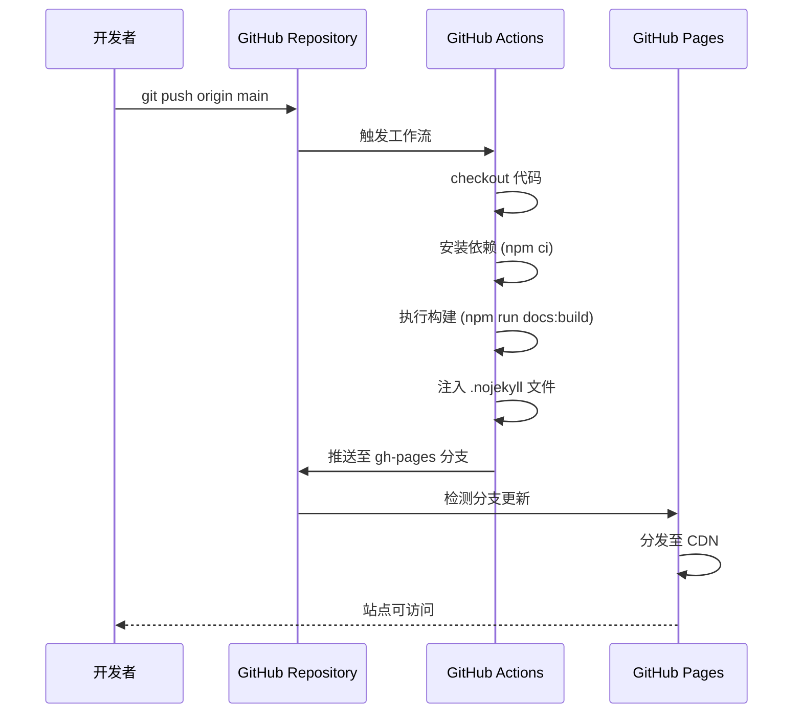
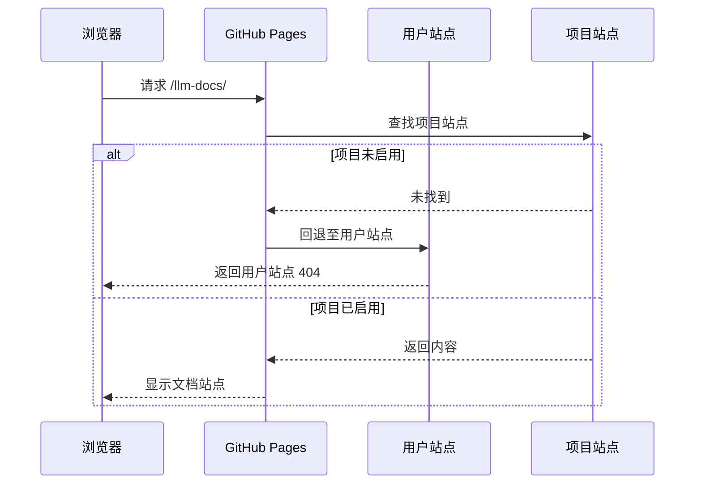

## 部署架构概述

GitHub Pages 提供两种部署模式：用户站点（`username.github.io`）与项目站点（`username.github.io/repo-name`）。本文聚焦项目站点部署，采用源码分支（`main`）与部署分支（`gh-pages`）分离架构。



核心机制：

- **分支隔离**：`main` 存储源码，`gh-pages` 仅存储构建产物，避免混合版本控制
- **自动触发**：基于 GitHub Actions 的 CI/CD 流水线，推送即部署
- **CDN 分发**：GitHub Pages 将内容推送至全球边缘节点，实现就近访问

### 用户站点与项目站点共存机制

GitHub Pages 允许同一账户下部署一个用户站点和多个项目站点，通过路径前缀实现隔离。



隔离机制：

- **路径命名空间**：用户站点占据根路径 `/`，项目站点占据子路径 `/repo-name/`
- **独立部署流程**：各站点使用独立仓库和 CI/CD 流水线，互不干扰
- **资源作用域**：静态资源（CSS、JS、图片）通过路径前缀实现作用域隔离

典型场景：

```
用户站点（个人博客）
Repository: aldenwangexis.github.io
URL: https://aldenwangexis.github.io/
├── index.html
├── posts/
└── assets/

项目站点（技术文档）
Repository: llm-docs
URL: https://aldenwangexis.github.io/llm-docs/
├── index.html
├── guide/
└── assets/
```

## Base 路径配置机制

### 路径解析逻辑

GitHub Pages 将项目站点部署在子路径下（`/repo-name/`），浏览器请求资源时必须携带该前缀。VuePress 通过 `base` 配置项控制构建时生成的资源路径。

| 部署类型 | 仓库名 | 访问地址 | base 配置 |
|---------|--------|---------|----------|
| 用户站点 | `username.github.io` | `https://username.github.io/` | `"/"` |
| 项目站点 | 任意名称 | `https://username.github.io/repo-name/` | `"/repo-name/"` |

### 配置实现

在 `src/.vuepress/config.ts`{: .filepath} 中设置：

```typescript
export default defineUserConfig({
  base: "/llm-docs/",
  // 其他配置项
});
```

### 路径错误导致的资源解析失败

错误配置 `base: "/"` 会导致浏览器向错误路径发起请求：

```html
<!-- 错误配置：base: "/" -->
<link href="/assets/style.css">
<!-- 浏览器请求：https://username.github.io/assets/style.css (404) -->

<!-- 正确配置：base: "/llm-docs/" -->
<link href="/llm-docs/assets/style.css">
<!-- 浏览器请求：https://username.github.io/llm-docs/assets/style.css (200) -->
```

## GitHub Actions 工作流设计

### 工作流配置

在 `.github/workflows/deploy-docs.yml`{: .filepath} 中定义自动化流程：

```yaml
name: 部署文档

on:
  push:
    branches:
      - main

permissions:
  contents: write

jobs:
  deploy-gh-pages:
    runs-on: ubuntu-latest
    steps:
      - name: Checkout
        uses: actions/checkout@v4
        with:
          fetch-depth: 0

      - name: 设置 Node.js
        uses: actions/setup-node@v4
        with:
          node-version: 22
          cache: npm

      - name: 安装依赖
        run: |
          corepack enable
          npm ci

      - name: 构建文档
        env:
          NODE_OPTIONS: --max_old_space_size=8192
        run: |-
          npm run docs:build
          > src/.vuepress/dist/.nojekyll

      - name: 部署文档
        uses: JamesIves/github-pages-deploy-action@v4
        with:
          branch: gh-pages
          folder: src/.vuepress/dist
```

### 关键配置说明

#### 1. `.nojekyll` 文件

GitHub Pages 默认启用 Jekyll 处理器，会忽略以 `_` 开头的文件和目录。VuePress 构建产物包含 `_assets`、`_nuxt` 等目录，必须创建 `.nojekyll` 文件禁用 Jekyll 处理器。

```bash
> src/.vuepress/dist/.nojekyll
```

#### 2. 权限配置

`permissions: contents: write` 授予工作流向 `gh-pages` 分支推送的权限。缺少此配置会导致 Git 推送失败：

```
Error: The process '/usr/bin/git' failed with exit code 128
```

#### 3. 完整 Git 历史

`fetch-depth: 0` 获取完整 Git 历史记录。部分 VuePress 插件（如 `@vuepress/plugin-git`）依赖 Git 历史生成页面元数据（最后更新时间、贡献者信息）。

## 部署流程

### 1. 配置 Base 路径

编辑 `src/.vuepress/config.ts`{: .filepath}，将 `base` 设置为仓库名：

```typescript
base: "/your-repo-name/",
```

### 2. 推送代码触发构建

```bash
git add .
git commit -m "chore: configure GitHub Pages deployment"
git push origin main
```

### 3. 启用 GitHub Pages

访问仓库设置页面：`https://github.com/username/repo-name/settings/pages`

配置项：
- **Source**: `Deploy from a branch`
- **Branch**: `gh-pages`
- **Folder**: `/ (root)`

> 此步骤是站点可访问的必要条件。即使 `gh-pages` 分支已存在构建产物，未在设置中启用仍无法访问。
{: .prompt-warning }

### 4. 验证部署状态

检查 GitHub Actions 执行状态：`https://github.com/username/repo-name/actions`

确认 `gh-pages` 分支更新：

```bash
git fetch origin gh-pages
git log origin/gh-pages --oneline -3
```

访问站点：`https://username.github.io/repo-name/`

## 部署流程可视化



## 常见问题排查

### 问题 1：访问显示 404

**症状**：访问 `https://username.github.io/repo-name/` 返回 404 错误。

**现象分类**：

#### 情况 A：显示用户站点的 404 页面

如果已部署用户站点（如个人博客），项目站点的 404 会显示用户站点的 404 样式。这是正常的路由回退行为：



**排查路径**：

1. **验证 GitHub Pages 启用状态**（最常见原因）

   检查 `Settings → Pages` 中是否已配置 `gh-pages` 分支。即使 GitHub Actions 成功推送至 `gh-pages` 分支，未在设置中启用仍无法访问。

2. **验证 base 路径配置**

   检查 `src/.vuepress/config.ts`{: .filepath} 中的 `base` 值：

   ```typescript
   base: "/repo-name/",  // 必须以 / 开头和结尾
   ```

   验证 `gh-pages` 分支的资源路径：

   ```bash
   git checkout gh-pages
   grep -o 'href="[^"]*"' index.html | head -5
   # 应输出：href="/llm-docs/..." 而非 href="/..."
   ```

3. **验证分支配置匹配**

   确认 `Settings → Pages` 中选择的分支为 `gh-pages`，且 Folder 为 `/ (root)`。

#### 情况 B：显示 GitHub 默认 404

如果显示 GitHub 默认 404 页面（纯白背景），说明仓库不存在或访问权限问题。检查仓库是否为 Public 或已启用 GitHub Pages。

### 问题 2：样式丢失或资源 404

**症状**：页面可访问但样式错乱，浏览器控制台显示 CSS/JS 文件 404。

**原因**：`base` 路径配置错误导致浏览器向错误路径发起资源请求。

**解决方案**：

```typescript
// src/.vuepress/config.ts
base: "/repo-name/",  // 确保与仓库名一致
```

重新构建并推送：

```bash
npm run docs:build
git add .
git commit -m "fix: correct base path configuration"
git push origin main
```

### 问题 3：GitHub Actions 构建失败

**症状**：Actions 页面显示红色失败标记。

**排查步骤**：

1. **查看 Actions 日志**

   点击失败的工作流，展开每个步骤的日志输出。

2. **常见错误类型**

   | 错误信息 | 原因 | 解决方案 |
   |---------|------|---------|
   | `Error: The process '/usr/bin/git' failed with exit code 128` | 缺少写权限 | 添加 `permissions: contents: write` |
   | `npm ERR! code ELIFECYCLE` | 构建失败 | 本地执行 `npm run docs:build` 排查 |
   | `Error: Cannot find module` | 依赖安装失败 | 检查 `package.json` 和 `package-lock.json` |

3. **本地复现**

   在本地环境执行工作流命令：

   ```bash
   npm ci
   npm run docs:build
   ```

### 问题 4：内容未更新

**症状**：GitHub Actions 显示成功，但站点内容仍为旧版本。

**排查路径**：

1. **清除浏览器缓存**

   使用强制刷新：`Ctrl + Shift + R`（Windows/Linux）或 `Cmd + Shift + R`（macOS）。

2. **验证 gh-pages 分支提交时间**

   ```bash
   git log origin/gh-pages --oneline -1 --format="%H %ci"
   ```

   确认提交时间是否为最新。

3. **等待 CDN 传播**

   GitHub Pages 使用 CDN 分发内容，更新需要 1-5 分钟传播至全球节点。可通过添加查询参数绕过缓存：

   ```
   https://username.github.io/repo-name/?t=1234567890
   ```

## 本地测试方法

在推送前进行本地验证，避免生产环境问题：

```bash
# 构建项目
npm run docs:build

# 使用 serve 预览（需安装：npm install -g serve）
npx serve src/.vuepress/dist -s -p 8080

# 访问：http://localhost:8080/repo-name/
```

> 本地预览时必须访问 `http://localhost:8080/repo-name/`，而非 `http://localhost:8080/`，以模拟生产环境的子路径部署。
{: .prompt-tip }
