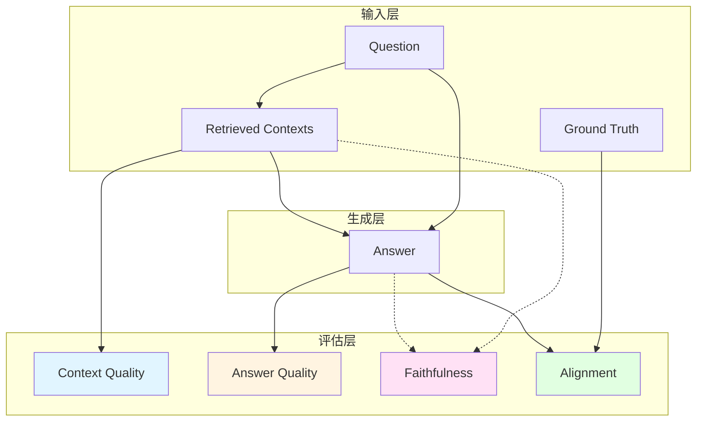
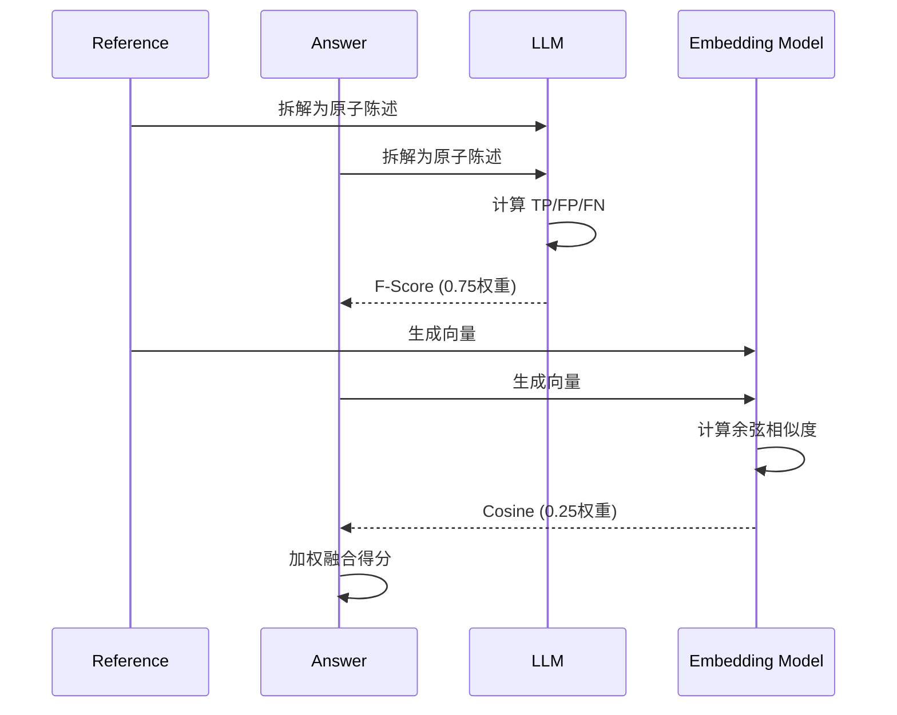
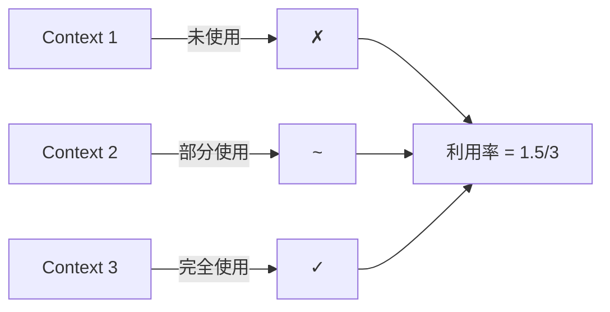
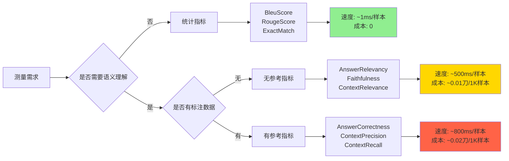
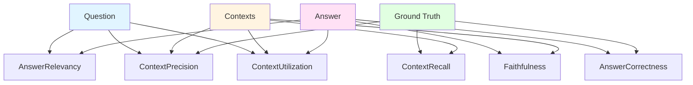
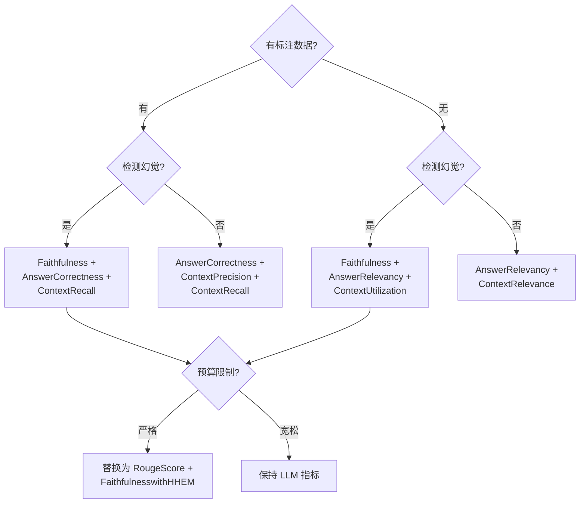

---
指标体系拆解：RAG 质量评估的工程实现
description: 从 30 余个评估指标出发，拆解 RAGAS 质量评估体系的内部运作机制，揭示检索增强生成系统的性能测量逻辑。
author: Alden
date: 2026-01-14 10:00:00 +0800
categories: [LLM Engineering]
tags: [RAG, LLM Ops, Performance, Best Practice, Agent]
pin: false
mermaid: true
math: true
comments: true
---

## 指标体系总览：四层架构

RAGAS 将 RAG 系统拆解为四个测量层面：



每层对应特定的测量目标：

- **Context Quality**：检索模块返回的上下文片段是否准确、完整、无冗余
- **Answer Quality**：生成答案是否切题、连贯、符合语义
- **Faithfulness**：答案是否严格基于检索上下文，无幻觉
- **Alignment**：答案与标准答案的对齐程度

## 核心工作流：指标如何运转

### 1. 答案质量层：双通道验证

#### AnswerCorrectness：加权融合机制

这个指标将两个独立通道的信号融合：

$$\text{Score} = w_1 \cdot F_{\beta}(\text{TP}, \text{FP}, \text{FN}) + w_2 \cdot \text{CosineSim}(\vec{A}, \vec{R})$$

其中：
- **第一通道**：LLM 将答案与参考答案拆解为原子陈述（statements），计算 TP/FP/FN
- **第二通道**：嵌入模型计算语义向量的余弦相似度
- 默认权重 $[0.75, 0.25]$ 意味着事实准确性主导，语义相似性辅助

工作流如下：



#### AnswerRelevancy：反向验证机制

不直接判断"答案是否切题"，而是生成反向问题：

1. LLM 基于答案生成 $n$ 个反向问题（默认 $n=3$）
2. 计算每个反向问题与原始问题的相似度
3. 取平均值

$$\text{Relevancy} = \frac{1}{n} \sum_{i=1}^{n} \text{CosineSim}(Q_{\text{orig}}, Q_{\text{gen}_i})$$

这种设计避免了直接打分的主观性。如果答案偏题，生成的问题必然偏离原问题。

#### AnswerSimilarity：纯语义测量

直接计算嵌入向量的余弦相似度，不涉及事实核查：

```python
from ragas.metrics import AnswerSimilarity

metric = AnswerSimilarity(threshold=0.8)  # 可选的二值化阈值
```

适用于开放域问答，答案表述多样但语义等价的场景。

### 2. 上下文质量层：精确率与召回率的解耦

#### ContextPrecision：相关片段的排序质量

计算逻辑：

$$\text{Precision@K} = \frac{\sum_{k=1}^{K} \left( \text{Relevant}_k \times \sum_{j=1}^{k} \text{Relevant}_j \right)}{\sum_{k=1}^{K} \text{Relevant}_k}$$

其中 $\text{Relevant}_k$ 为二元信号（LLM 判断第 $k$ 个上下文片段是否对回答问题有用）。

关键特性：
- 如果无关片段排在前面，分母增加但分子不变，得分下降
- 本质是信息检索中的 **Mean Average Precision (MAP)** 的变体

#### ContextRecall：覆盖参考答案的完整度

将参考答案拆解为陈述集合 $S_{\text{ref}}$，检查每条陈述能否从检索上下文中推断：

$$\text{Recall} = \frac{|\{s \in S_{\text{ref}} \mid \text{Attributable}(s, \text{Contexts})\}|}{|S_{\text{ref}}|}$$

提供三种实现：
- **LLMContextRecall**：LLM 逐条判断可归因性
- **NonLLMContextRecall**：字符串模糊匹配（Rouge-L）
- **IDBasedContextRecall**：直接比较文档 ID

#### ContextEntityRecall：实体粒度的覆盖率

从参考答案 $GT$ 和检索上下文 $C$ 中提取命名实体：

$$\text{EntityRecall} = \frac{|\text{Entities}(C) \cap \text{Entities}(GT)|}{|\text{Entities}(GT)|}$$

适用场景：知识图谱问答、事实核查等需要精确实体匹配的任务。

#### ContextUtilization：利用率测量

检查生成答案时实际使用了多少检索上下文：



低利用率意味着检索返回了过多冗余信息。

### 3. 忠实度层：幻觉检测的三种策略

#### Faithfulness：陈述级可归因性

工作流：
1. 将答案拆解为独立陈述 $\{s_1, s_2, \ldots, s_n\}$
2. LLM 逐条判断是否可从上下文推断
3. 计算可验证陈述的比例

$$\text{Faithfulness} = \frac{\sum_{i=1}^{n} \mathbb{1}[\text{Supported}(s_i, \text{Contexts})]}{n}$$

实现细节：

```python
# 陈述拆解示例
answer = "Python 发布于 1991 年，由 Guido van Rossum 创建。"
statements = [
    "Python 发布于 1991 年",
    "Python 由 Guido van Rossum 创建"
]

# LLM 逐条验证
for stmt in statements:
    supported = llm_judge(stmt, contexts)  # True/False
```

#### FaithfulnesswithHHEM：专用模型加速

使用 HuggingFace 预训练的二分类模型 `vectara/hallucination_evaluation_model`：
- 输入：`<context> [SEP] <answer>`
- 输出：幻觉概率 $p_{\text{halluc}} \in [0,1]$
- 支持批处理，速度比 LLM 推理快 10 倍以上

性能对比：

| 方法 | 速度 | 精度 | 成本 |
|-----|------|------|------|
| Faithfulness (GPT-4) | ~800ms | 高 | ~$0.02/样本 |
| FaithfulnesswithHHEM | ~80ms | 中高 | ~$0.0001/样本 |

#### MultiModalFaithfulness：跨模态对齐验证

针对图文混合输入，检查答案是否得到**文本与图像双重支撑**：

```python
faithful = (
    verify_text_support(answer, contexts) 
    and verify_image_support(answer, images)
)
```

返回布尔值（0.0 或 1.0）。

### 4. 对齐层：标准答案的多维度匹配

| 指标 | 匹配粒度 | 技术路线 | 适用场景 |
|------|---------|---------|---------|
| **BleuScore** | n-gram 重叠 | 统计匹配 | 机器翻译、格式化输出 |
| **RougeScore** | 最长公共子序列 | 统计匹配 | 摘要生成 |
| **AnswerSimilarity** | 语义向量 | 嵌入模型 | 开放域问答 |
| **FactualCorrectness** | 事实三元组 | LLM 提取+比对 | 知识型问答 |

#### FactualCorrectness：事实三元组比对

工作流：
1. LLM 从参考答案提取事实三元组：`(主体, 关系, 客体)`
2. 从生成答案提取事实三元组
3. 计算三元组匹配的 F1 分数

示例：

```python
# 参考答案："巴黎是法国的首都，人口约 220 万。"
ref_triples = [
    ("巴黎", "是首都", "法国"),
    ("巴黎", "人口", "220万")
]

# 生成答案："巴黎是法国首都，约有 2百万居民。"
gen_triples = [
    ("巴黎", "是首都", "法国"),
    ("巴黎", "居民", "2百万")
]

# 匹配：1个完全匹配，1个部分匹配（语义等价但表述不同）
```

## 工程权衡：速度、成本、精度的三角

### 实现策略对比



### 成本优化策略

1. **分层测试**：先用统计指标快速筛选，再用 LLM 指标精测
2. **批处理**：FaithfulnesswithHHEM 支持批处理，可降低 GPU 空转损耗
3. **缓存机制**：对重复出现的 `(question, context)` 对缓存嵌入向量

实现示例：

```python
from functools import lru_cache
import hashlib

@lru_cache(maxsize=10000)
def cached_embedding(text: str):
    return embedding_model.encode(text)

def compute_similarity(q1, q2):
    # 使用哈希避免直接传递大对象
    h1 = hashlib.md5(q1.encode()).hexdigest()
    h2 = hashlib.md5(q2.encode()).hexdigest()
    return cosine_sim(cached_embedding(h1), cached_embedding(h2))
```

## 特定场景：指标组合的最佳实践

### RAG 系统：四阶段测量

测量目标：**检索精度 → 幻觉控制 → 答案质量 → 鲁棒性**

```python
from ragas.metrics import (
    ContextPrecision,
    ContextRecall,
    Faithfulness,
    AnswerCorrectness,
    NoiseSensitivity
)

# 阶段 1：检索质量
retrieval_metrics = [
    ContextPrecision(),  # 排序质量
    ContextRecall()      # 信息覆盖
]

# 阶段 2：幻觉检测
hallucination_metric = Faithfulness()

# 阶段 3：答案质量
answer_metric = AnswerCorrectness(weights=[0.75, 0.25])

# 阶段 4：鲁棒性测试
robustness_metric = NoiseSensitivity(mode="irrelevant")
```


## 指标依赖关系图



## 快速决策树



## 完整指标速查表

| 指标 | 需要 GT | 需要 Context | 需要 LLM | 输出范围 | 主测维度 |
|-----|---------|-------------|----------|---------|---------|
| AnswerCorrectness | ✓ | ✗ | ✓ | 0-1 | 事实+语义 |
| AnswerRelevancy | ✗ | ✗ | ✓ | 0-1 | 切题性 |
| AnswerSimilarity | ✓ | ✗ | ✗ | 0-1 | 语义相似 |
| ContextPrecision | ✓ | ✓ | ✓ | 0-1 | 检索排序 |
| ContextRecall | ✓ | ✓ | ✓/✗ | 0-1 | 信息覆盖 |
| ContextEntityRecall | ✓ | ✓ | ✓ | 0-1 | 实体覆盖 |
| ContextUtilization | ✗ | ✓ | ✓ | 0-1 | 上下文利用 |
| Faithfulness | ✗ | ✓ | ✓ | 0-1 | 幻觉检测 |
| FaithfulnesswithHHEM | ✗ | ✓ | ✓ | 0-1 | 幻觉检测 |
| BleuScore | ✓ | ✗ | ✗ | 0-1 | n-gram 匹配 |
| RougeScore | ✓ | ✗ | ✗ | 0-1 | LCS 匹配 |
| SummarizationScore | ✗ | ✓ | ✓ | 0-1 | 摘要质量 |
| ToolCallAccuracy | ✓ | ✗ | ✓ | 0-1 | 工具调用 |
| ToolCallF1 | ✓ | ✗ | ✗ | 0-1 | 工具调用 |
| AgentGoalAccuracy | 可选 | ✗ | ✓ | 0/1 | 目标达成 |
| TopicAdherence | ✓ | ✗ | ✓ | 0-1 | 对话一致性 |
| NoiseSensitivity | ✓ | ✓ | ✓ | 0-1 | 鲁棒性 |
| AspectCritic | ✗ | ✗ | ✓ | 0/1 | 自定义规则 |
| RubricsScore | 可选 | ✗ | ✓ | 1-5 | 领域评分 |
| MultiModalFaithfulness | ✗ | ✓ | ✓ | 0/1 | 多模态对齐 |
| SQLSemanticEquivalence | ✓ | ✗ | ✓ | 0/1 | SQL等价 |
| DataCompyScore | ✓ | ✗ | ✗ | 0-1 | 表格比对 |

