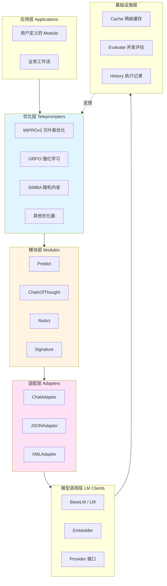

## 核心问题定位

传统 LLM 应用开发依赖手工 Prompt 工程：反复试错调整措辞、手动挑选 Few-Shot 示例、依靠经验判断优劣。这种方式存在三重困境：效率低（每次调整需重新测试全流程）、迁移难（换领域或模型需重新调优）、上限低（人工直觉难以系统探索优化空间）。

DSPy 通过声明式编程范式根本性地解决这些问题：开发者定义"做什么"（Signature 描述任务输入输出），框架负责"怎么做"（自动生成和优化 Prompt）。优化器基于训练数据和评估指标系统搜索最优指令和示例组合，将 Prompt 工程从手工艺转变为可编程、可复现、可持续优化的工程流程。

---

## 全局架构：五层分离设计

DSPy 采用分层架构实现关注点分离，每层职责明确、接口清晰：



**数据流动路径**：用户输入 → Signature 字段映射 → Adapter 格式化（构造 messages） → LM 调用 → Adapter 解析（提取字段） → Prediction 对象 → History 记录。优化流程则在编译时注入：训练数据 → Teleprompter 搜索（生成候选指令/示例） → Evaluate 评估 → 选择最佳配置 → 写回 Module。

---

## 优化器生态：算法范式与适用场景

DSPy 提供十余种优化器，每种基于不同算法范式解决特定问题。

### MIPROv2：贝叶斯优化的系统探索

**算法原理**

MIPROv2 将优化问题建模为贝叶斯超参数搜索，搜索空间包含两个维度：指令文本（instruction candidates）和 Few-Shot 示例集合（demo set candidates）。使用 Optuna 的 TPE（Tree-structured Parzen Estimator）采样器智能探索，通过小批量评估快速筛选 + 周期性全量验证的两阶段策略平衡效率与精度。

核心工作流分为五步：首先 Bootstrap Few-Shot Examples，使用 teacher 模型在训练集上多次运行生成多样化示例集；接着 Instruction Proposal，GroundedProposer 结合程序结构、数据集摘要、任务演示生成候选指令；然后 Bayesian Optimization，Optuna 根据历史评估结果建模性能分布，提出下一组配置试验；Minibatch Evaluation 在小批量数据上快速评分，周期性全量评估验证；最后 Best Configuration Return，返回验证集得分最高的配置。

**Auto 配置策略**

```python
auto_run_settings = {
    "light": {"n": 6, "val_size": 100},      # 6 个候选，100 样本验证
    "medium": {"n": 12, "val_size": 300},    # 平衡模式
    "heavy": {"n": 18, "val_size": 1000}     # 深度搜索
}
```

light 模式适合快速原型验证（数分钟完成），medium 适合生产前的系统优化（十几分钟到半小时），heavy 适合追求极致性能的场景（可能需要数小时但能穷尽更多可能性）。

**适用场景**：通用首选优化器，特别适合需要系统探索指令和示例组合的场景、中等规模数据集（100-1000 样本）、对性能有较高要求但能接受中等优化成本的项目。

---

### GRPO：强化学习的深度优化

**算法原理**

GRPO 将 Prompt 优化视为强化学习问题，通过评估指标的奖励信号直接更新语言模型参数。不同于 MIPROv2 只优化 Prompt 文本，GRPO 进行参数级微调，能学习更深层的模式。

工作流包含四个阶段：Bootstrap Trace Data 阶段运行 teacher 模型收集多次 rollout 的完整执行轨迹（包含中间推理步骤）；Reward Labeling 阶段基于评估指标将每条轨迹转换为带奖励标签的训练样本（成功样本高奖励，失败样本低奖励或负奖励）；RL Training 阶段使用底层 LM 的强化学习能力（如 OpenAI 的 fine-tuning API）根据奖励反馈更新模型参数；Iterative Steps 阶段迭代多轮训练，模型逐步学习生成更符合评估指标的响应。

**Multitask 学习**

GRPO 支持两种模式：multitask=True 时联合训练程序中所有 predictor（共享底层表示，跨任务泛化）；multitask=False 时为每个 predictor 独立训练（隔离性好但资源消耗大）。

**适用场景**：有充足计算资源和微调预算、追求极致性能、数据量大（>1000 样本）、任务稳定不频繁变动的生产系统。不适合快速迭代的原型阶段或成本敏感的项目。

---

### SIMBA：随机内省的自反思优化

**算法原理**

SIMBA 通过内省分析执行轨迹识别改进机会。维护程序变体种群，在小批量训练数据上评估，识别输出变异性大的困难样本（最佳程序和最差程序差距显著），对最佳程序应用两种改进策略：添加成功样本作为 demonstrations 或通过比较成功/失败轨迹生成自反思规则。使用带温度的 softmax 采样平衡探索（尝试新策略）和利用（深化已知好策略），迭代构建新候选程序并选择最佳执行者进入下一轮。

**内省机制**

```
执行轨迹收集 → Best vs Worst 比较
    ↓
    ├─ 策略 A: 添加成功样本为 demo
    │         （强化正确模式）
    └─ 策略 B: 生成自反思规则
              （对比成功/失败路径，提取启发式）
```

策略 A 直接利用成功案例，类似人类通过正例学习；策略 B 更深入，通过失败对比理解"为什么成功"，类似批判性反思。

**温度控制**

`temperature_for_sampling=0.2` 控制程序选择的随机性，低温度偏向当前最佳（利用），高温度探索更多变体（探索）。`temperature_for_candidates` 控制生成候选指令时的创造性。

**适用场景**：复杂推理任务（多跳问答、代码生成）、需要分析失败模式的场景、中等到大规模数据集、追求可解释性的项目（生成的规则可读性强）。

---

### COPRO：协作式的顺序优化

**算法原理**

COPRO 为多 predictor 程序设计，按顺序优化每个 predictor，将前面 predictor 的最佳结果作为上下文传递给下一个，形成协作链。每个 predictor 迭代 `depth` 轮，每轮生成 `breadth` 个新指令候选，在训练集上评估后选择最佳，使用最佳结果通知下一个 predictor 的优化。

**核心组件**

包含两个生成器：BasicGenerateInstruction 从基础指令生成初始变体；GenerateInstructionGivenAttempts 基于历史性能数据创建新 prompt（"之前这个指令得分 0.7，那个指令得分 0.8，现在生成更好的"）。

**适用场景**：多模块串联的复杂程序（如 RAG 系统：检索 → 重排序 → 生成答案）、模块间有明确依赖关系、小到中等规模数据集、对单个模块优化的场景。

---

### Avatar：元学习的对比优化

**算法原理**

AvatarOptimizer 通过分析正负样本差异生成改进反馈。先在训练集上运行当前程序，根据阈值（lower_bound / upper_bound）将样本分为正样本（高分）、负样本（低分）和中间样本（忽略）。Comparator 分析正负样本模式差异（"成功样本都提到了X，失败样本缺少Y"），FeedbackBasedInstruction 基于反馈生成新指令。迭代 `max_iters` 轮直到性能收敛。

**采样策略**

效率考虑限制正负样本数（默认各 10 个），从高分和低分样本中采样代表性案例。这种设计避免了处理全量数据的计算开销，同时保持对比学习的有效性。

**适用场景**：有明确正负样本边界的任务（分类、评分）、需要理解"为什么失败"的场景、中小规模数据集、对可解释性有要求的项目。

---

### 其他专用优化器

**GEPA - 引导式进化**：进化优化器，捕获完整执行轨迹，识别特定 predictor 对应部分，反思 predictor 行为生成新指令。适合需要深度反思执行轨迹的复杂系统。

**BetterTogether - 元优化器**：组合多个优化策略，支持 prompt 优化（p）和权重优化（w）交替（如策略 'p -> w -> p' 先优化 Prompt，再微调模型，再优化 Prompt）。协同效应强但计算成本高。

**BootstrapFewShotWithRandomSearch**：通过随机搜索探索配置空间，生成不同随机种子的多个候选程序，变化 bootstrapped demo 数量，评估每个候选选择最佳。适合对 demo 数量、bootstrap 大小等超参数不确定时的广泛探索。

**KNNFewShot**：使用 K 近邻动态选择相关样本，使用 vectorizer 嵌入输入查询和训练样本，检索 k 个最相似样本在测试时附加为 demonstrations。适合有大训练集、希望运行时动态选择与每个查询最相关样本的场景。

**InferRules**：从样本中归纳自然语言规则，Bootstrap 方法从成功样本提取模式，将模式表述为显式规则附加到 predictor 指令。适合希望从样本中提取显式规则指导模型行为的任务。

---

### 优化器选择决策矩阵

| 场景特征 | 首选优化器 | 核心原因 | 替代方案 |
|---------|----------|---------|---------|
| 通用优化，中等数据（100-1K） | MIPROv2 | TPE 采样高效，搜索空间完整 | SIMBA |
| 复杂推理，需要内省 | SIMBA | 轨迹分析识别困难样本 | GEPA |
| 有微调资源，追求极致 | GRPO | 参数级深度优化 | BootstrapFinetune |
| 多模块串联系统 | COPRO | 顺序协同优化 | MIPROv2 逐模块 |
| 明确正负样本，需可解释 | Avatar | 对比学习生成反馈 | InferRules |
| 快速原型，建立 baseline | BootstrapFewShot | 简单快速，成本低 | RandomSearch |
| 大训练集，动态适应 | KNNFewShot | 运行时检索相关样本 | DynamicFewShot |
| 综合优化 Prompt + 参数 | BetterTogether | 多策略协同 | GRPO |

---

## 评估体系：从内置指标到自动评估

DSPy 提供三层评估能力：内置统计指标（快速但语义弱）、LLM 自动评估（语义强但成本高）、自定义指标（灵活但需领域知识）。

### 内置指标的工程设计

**EM（Exact Match）**：归一化后检查任一参考答案与预测完全匹配。归一化步骤包括 Unicode NFD 归一化、小写化、标点符号移除、英文冠词移除（a/an/the）、空白符折叠。严格匹配零容忍，适用于答案唯一明确的任务（如事实问答"法国首都是？"）。

**F1 Score**：Token 级别 F1 分数，先归一化字符串，按空白符分词，计算 token 重叠的 precision 和 recall，$F_1 = \frac{2PR}{P+R}$。部分匹配容忍，平衡精确率和召回率，适用于生成式任务（摘要、解释性回答）。

**HotPotF1**：HotPotQA 风格 F1，对 yes/no/noanswer 特殊处理。若归一化后任一方在 `{'yes', 'no', 'noanswer'}` 且不同则返回 0，否则标准 F1。二元/三元答案零容忍但其他答案标准 F1，平衡了严格性和灵活性。

**answer_passage_match**：检查预测上下文中任一 passage 是否包含答案，使用 DPR 归一化（NFD + 小写化 + 保留字母数字和空格）。检索任务专用，容忍答案在 passage 中的位置，适合评估检索质量而非生成质量。

### LLM 自动评估的实现策略

**SemanticF1**：使用 LLM 计算语义召回率和精确率，通过 ChainOfThought 引导 LLM 评估系统响应与 ground truth 的语义重叠。基础版本直接计算 recall 和 precision，分解版本（decompositional=True）先枚举 ground truth 和系统响应的关键观点，讨论重叠部分，再计算 recall。分解版本细粒度分析、可解释性强，适合长文本评估。

**CompleteAndGrounded**：组合评估完整性和根据性，双维度平衡质量与可靠性。AnswerCompleteness 评估系统响应相对 ground truth 的完整性（覆盖了多少应有内容），AnswerGroundedness 评估系统响应相对检索文档的根据性（是否基于提供的上下文）。组合分数 = (完整性 + 根据性) / 2，适合 RAG 系统标准评估。

**使用 ChainOfThought 引导评估**：

```python
evaluator = dspy.ChainOfThought(EvaluationSignature)
result = evaluator(ground_truth=gt, system_response=pred)
```

Signature 定义评估 Prompt，reasoning 字段要求 LLM 展示逐步评估推理，score 字段输出最终分数。这种结构化评估流程提供可解释性（可追溯为什么给这个分），评估维度灵活（通过修改 Signature 定义新评估维度），质量高于简单打分（引导深度思考而非直觉判断）。

### 自定义指标的集成机制

DSPy 通过可调用接口支持任意自定义指标：

```python
def custom_metric(example: Example, prediction: Prediction, trace=None) -> float:
    """
    example: 输入样本（含 ground truth）
    prediction: 模型预测输出
    trace: 可选执行轨迹（用于分析中间步骤）
    return: 分数（通常 0-1）
    """
    score = compute_score(example, prediction)
    return score
```

集成点包括：Evaluate 类的 metric 参数、Teleprompter 的 metric 参数（驱动优化方向）、__call__ 方法的 metric 参数（临时覆盖）。适用场景：多标签分类的 macro/micro F1、排序任务的 NDCG、结构化输出的字段级准确率、业务特定的复合指标（如"答案正确 + 简洁 + 有引用"的加权组合）。

---

## 模型能力调用：统一接口与基础设施

DSPy 通过 BaseLM 抽象统一不同 Provider 接口，借助 LiteLLM 支持 100+ 模型提供商（OpenAI、Anthropic、Google、Azure、Bedrock、本地 Ollama/vLLM 等）。

### LM 调用的完整链路

```
用户调用 module(input)
    ↓
Module.forward() 调用 predictor
    ↓
Predictor 使用 Signature 定义输入输出
    ↓
Adapter.format() 构造 messages
    ↓
LM.forward(messages) 调用底层 API
    ↓
LiteLLM.completion() 统一接口
    ↓
Provider API（OpenAI/Anthropic/...）
    ↓
返回响应（OpenAI 格式）
    ↓
Adapter.parse() 提取字段
    ↓
创建 Prediction 对象
    ↓
History 记录调用历史
    ↓
返回结果给用户
```

### 缓存机制的两级设计

DSPy 实现两级缓存优化成本与延迟：内存缓存使用 LRU（最近最少使用）策略，maxsize 默认 1M 条目，访问速度极快（纳秒级）；磁盘缓存使用 FanoutCache，16 个分片减少锁竞争，size_limit 默认 10GB，持久化跨会话复用。

缓存键生成策略：使用 orjson 序列化请求参数（OPT_SORT_KEYS 确保顺序一致），转换 JSON 不兼容类型（Pydantic 模型 → dict、可调用对象 → `<callable:name>`），SHA256 哈希生成 64 字符 hex 字符串。查找流程：先查内存缓存命中直接返回，未命中查磁盘缓存，命中后提升到内存并返回，磁盘也未命中才调用 LLM API，结果写入内存和磁盘。

### Embedder 的双模式支持

Embedder 统一嵌入接口，支持托管模型（如 OpenAI embeddings）和自定义函数（如 sentence-transformers）。托管模型模式通过 LiteLLM 调用 API，支持缓存（减少重复计算），自动批处理（batch_size 参数控制）。自定义函数模式直接调用用户提供的嵌入函数，灵活性强（可集成任意本地模型），无网络开销，适合离线场景。

集成到检索系统的典型模式：预计算语料库嵌入（corpus_embeddings = embedder(corpus)），查询时计算 query 嵌入，余弦相似度检索 Top-K，返回最相关文档。

### 重试策略与流式支持

DSPy 集成 LiteLLM 的重试机制，默认使用指数退避算法（Attempt 1 立即调用，失败后等待 1s、2s、4s...）。适用场景包括 Rate limit 错误（429）、临时服务不可用（503）、超时错误、网络波动。

流式支持基于 anyio 的异步实现，提供 astream() 方法返回异步生成器，每个 chunk 包含 content 和 predict_id（识别哪个 predict 产生）。使用 LiteLLM 的 stream_chunk_builder 聚合 chunks，支持 token usage 跟踪（即使流式模式）。

---

## Prompt 自动生成：元编程的工程实现

DSPy 的核心创新是自动生成和优化 Prompt，将"写 Prompt"这件事程序化。

### GroundedProposer 的情境化策略

GroundedProposer 是 MIPROv2 使用的指令生成器，通过多源信息情境化生成相关指令。

**程序感知**：DescribeProgram Signature 理解程序目的与结构，输入 program_code（伪代码）和 program_example（输入输出示例），输出 program_description（"这个程序实现了检索增强的问答系统，先检索相关段落，然后使用思维链推理生成答案"）。DescribeModule Signature 解释特定模块角色，结合程序描述和模块名称，输出该模块在整体流程中的职责。

**数据集感知**：DatasetDescriptor Signature 生成数据集观察，输入批次样本，输出关于主题、格式、长度、任务等维度的观察。DatasetDescriptorWithPriorObservations 基于先前观察添加新见解，支持迭代式数据集理解（批次 1 观察 → 批次 2 补充观察 → ... → is_complete=True 停止）。ObservationSummarizer 将多条观察汇总为 2-3 句话的简洁摘要，突出最关键特征。

**任务演示**：格式化训练集中的前 n 个样本（默认 3 个），提供具体的输入输出示例帮助 LLM 理解任务。

**历史上下文**：格式化历史指令-性能对，按分数排序保留最佳 k 个（默认 5 个），展示"Previous Attempt 1 (score: 0.82): instruction..."。LLM 看到哪些指令效果好、哪些不好，生成改进版本。

**Tip 注入**：随机或指定注入优化提示（如"Be specific about the expected output format"、"Use clear, unambiguous language"），50% 概率注入增加生成多样性，引导 LLM 关注特定质量维度。

**指令生成流程**：

```
程序分析 → 数据集摘要 → 任务演示 → 历史指令
          ↓
   构造完整上下文（program_desc + dataset_summary + task_demos + history + tip）
          ↓
   GenerateSingleModuleInstruction Signature
          ↓
   LLM 生成候选指令（num_candidates 次，温度随机化）
          ↓
   去重返回候选列表
```

### 模板系统：Signature 作为契约

Signature 定义输入输出契约，类级别 `__doc__` 作为系统指令，字段通过 InputField / OutputField 定义（desc 参数给 LLM 说明、format 参数控制格式化）。动态修改通过 with_instructions() 返回带新指令的 Signature、with_updated_fields() 更新字段属性。

Adapter 负责将 Signature 和运行时值转换为实际 Prompt。ChatAdapter 格式化为对话消息（System message 包含指令，User/Assistant messages 包含 demos 和当前输入），JSONAdapter 利用 LM 的 JSON mode 或手动解析（response_format: json_object，包含 JSON schema），XMLAdapter 转换为 XML 格式（某些 LM 如 Claude 偏好 XML）。

### 质量控制机制

包含四个层面：去重（基于字符串表示，保持顺序，避免重复候选浪费评估资源）、历史评分（InstructionHistory 记录指令-分数对，支持 get_top_k() 获取最佳和 get_diverse_sample() 多样化采样）、完整性检查（检查数据集观察是否覆盖主题、格式、长度、任务等维度，至少 3 条观察且覆盖 2+ 维度）、降级策略（全功能生成失败时禁用程序感知，再失败禁用数据集摘要，完全失败返回默认指令"Perform the task accurately and concisely."）。

---

## 数据持久化：状态管理与版本控制

DSPy 提供灵活的持久化机制支持程序保存、加载和复现。

### dump_state / load_state 机制

Module.dump_state() 序列化模块状态，包含类信息（__class__、__module__）、版本标记（__dspy_version__）、参数字典（递归序列化嵌套 Module、Signature）。不包括 history（执行历史，运行时状态）、callbacks（不可序列化）、临时状态。

Module.load_state() 加载模块状态，检查版本兼容性（版本不匹配时警告），递归加载参数（支持嵌套结构），处理缺失字段（记录警告但不中断）。配合 save() / load() 提供文件级接口（JSON 格式，人类可读，版本控制友好）。

### Cloudpickle 序列化

完整程序序列化包括代码，可序列化任意 Python 对象（lambda、类定义、闭包），无需类定义可用（适合研究和实验）。劣势包括二进制格式不可读、版本兼容性差（Python 版本变化可能无法加载）、安全风险（不要加载不信任的 pickle 文件，可能执行恶意代码）。

### 两级缓存的持久化

内存缓存使用 cachetools.LRUCache（最大 1M 条目），磁盘缓存使用 diskcache.FanoutCache（16 分片，默认 10GB）。缓存键基于 SHA256 哈希（model + messages + kwargs 的 JSON 序列化），写入策略为同时写入内存和磁盘，读取策略为先内存后磁盘（命中磁盘时提升到内存）。磁盘缓存跨会话持久化，显著降低重复实验的成本。

---

## 核心功能 Prompt 设计：分层与模式

DSPy 的 Prompt 设计体现其元编程思想，通过精心设计的 Signature 实现自动化优化。

### Prompt 模板分类

**任务执行类**：ChainOfThought 使用逐步推理解决问题（分解问题为子步骤、展示推理过程、最后给出答案），ReAct 交替进行推理和行动（Thought 分析当前状态 → Action 执行工具调用 → Observation 获取结果，循环直到完成）。

**优化元任务类**：DescribeProgram 分析程序代码理解其设计目的，GenerateSingleModuleInstruction 基于多种上下文生成模块指令（输入包括 dataset_description、program_description、module_description、task_demos、previous_instructions、tip，输出 proposed_instruction）。

**评估与反思类**：SemanticRecallPrecision 评估系统响应的语义召回率和精确率（reasoning 字段展示评估推理过程），Comparator 比较正负样本生成改进反馈（analysis 字段差异分析，feedback 字段改进建议），FeedbackBasedInstruction 基于反馈生成新指令（解决反馈中的问题）。

**数据理解类**：DatasetDescriptor 分析数据集特征（关注主题、语法、格式、任务），DatasetDescriptorWithPriorObservations 在已有观察基础上补充新观察（避免重复），ObservationSummarizer 将多条观察汇总为简洁摘要（2-3 句话突出最关键特征）。

### 分层指令设计

DSPy 采用三层指令体系：L1 Signature.instructions 提供模块级总指令（"使用提供的上下文回答问题，答案必须基于上下文"），L2 Field descriptions 提供字段级细节指令（context: "包含答案的背景信息段落"，reasoning: "分析上下文和问题的关联，逐步推理"），L3 Few-shot demonstrations 在运行时注入（具体示例展示输入输出格式）。

层次化设计的优势：逐层细化指导（从宏观到微观），关注点分离（任务目标、字段语义、格式示例各司其职），灵活组合（可独立调整任一层而不影响其他层）。

### 元提示（Meta-Prompting）

DSPy 使用 LLM 生成 Prompt 的 Prompt，META_INSTRUCTION_GENERATOR 指导如何生成优化指令：

```
You are an expert prompt engineer.

Given:
- Task description
- Example inputs/outputs
- Performance history

Generate an optimized instruction that will help a language model:
1. Understand the task clearly
2. Produce accurate outputs
3. Avoid common mistakes seen in the performance history

The instruction should be:
- Specific and actionable
- 2-3 sentences
- Focus on "how to think" rather than "what to do"
```

这个元提示本身经过精心设计，强调可操作性（不是模糊的"做好任务"而是具体的"如何思考"），简洁性（2-3 句话避免信息过载），历史学习（从失败中吸取教训）。GroundedProposer 使用这个元提示配合程序分析、数据集摘要、历史性能生成候选指令。

---

## 总结：范式转变的工程实现

DSPy 通过分层架构实现关注点分离：应用层定义业务逻辑、优化层自动改进性能、模块层封装可复用组件、适配层处理格式转换、模型调用层统一接口、基础设施层提供支撑服务。每层职责明确、接口清晰，支持独立演化。

优化器生态涵盖多种算法范式：MIPROv2 的贝叶斯优化系统探索搜索空间、GRPO 的强化学习深度优化模型参数、SIMBA 的随机内省通过轨迹分析自反思、COPRO 的协作优化串联多模块、Avatar 的元学习对比正负样本。根据场景特征（数据规模、计算资源、性能要求、可解释性需求）选择合适优化器。

评估体系从内置统计指标（EM / F1 快速但语义弱）到 LLM 自动评估（SemanticF1 / CompleteAndGrounded 语义强但成本高）再到自定义指标（灵活但需领域知识），三层能力覆盖不同场景需求。通过 ChainOfThought 引导评估提供可解释性。

模型调用机制通过 BaseLM 抽象统一 100+ Provider 接口，两级缓存（内存 LRU + 磁盘 FanoutCache）优化成本与延迟，Embedder 双模式支持托管模型和自定义函数，重试策略和流式支持提升鲁棒性和用户体验。

Prompt 自动生成将"写 Prompt"程序化，GroundedProposer 的情境化策略融合程序感知、数据集感知、历史上下文、Tip 注入，Signature 作为契约定义任务结构，Adapter 负责格式转换，质量控制机制确保候选多样性和可靠性。

数据持久化通过 dump_state / load_state 提供人类可读的 JSON 序列化，Cloudpickle 支持完整程序序列化（包括代码），两级缓存持久化跨会话复用，显著降低重复实验成本。

DSPy 实现了从手工 Prompt 工程到数据驱动优化的范式转变。开发者定义"做什么"（Signature 描述任务），框架负责"怎么做"（自动生成和优化 Prompt）。这不仅提高了开发效率，更重要的是通过系统探索搜索空间、基于评估指标优化、持续学习改进，将 LLM 应用开发从手工艺转变为可编程、可复现、可持续优化的工程流程。
