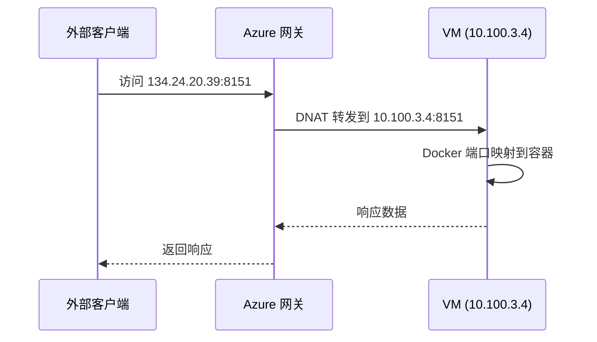
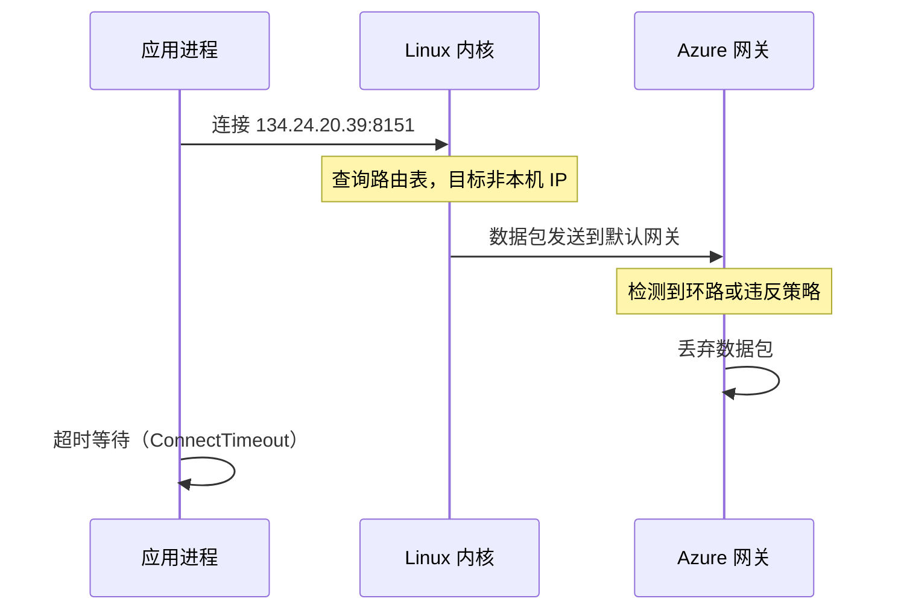
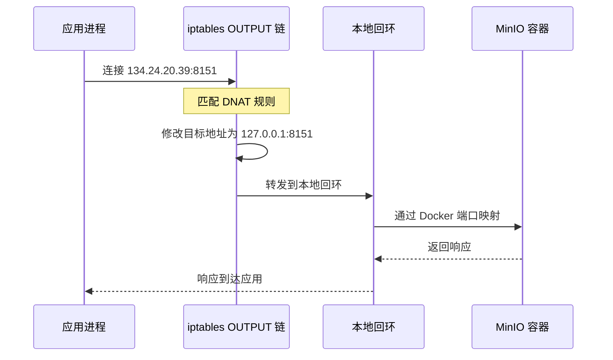

## 问题描述

Azure VM 重启后，运行在 Docker 容器中的 MinIO 服务无法通过公网 IP（`134.24.20.39`(masked)）访问。应用层抛出 `ConnectTimeoutError`，连接超时。容器本身运行正常，通过 `127.0.0.1` 访问正常，但通过公网 IP 访问时数据包消失。

服务配置如下：

- MinIO 容器名称：`md-minio-dev`
- 端口映射：宿主机 `8151` → 容器 `9000` (API)，宿主机 `8152` → 容器 `9001` (Console)
- 数据挂载：`/data01/md-backend/minio/data` → `/data`
- 配置文件：`MINIO_ENDPOINT=134.24.20.39:8151`

## 排查过程

### 容器状态验证

执行 `docker inspect md-minio-dev` 确认容器配置：

- 容器状态：`Running: true`，进程正常
- 端口绑定：`0.0.0.0:8151 → 9000/tcp`，`0.0.0.0:8152 → 9001/tcp`
- 挂载卷：数据目录和配置目录挂载正常
- 网络：容器 IP `173.27.10.3`，网关 `172.17.0.1`

执行 `docker logs md-minio-dev-copy` 确认服务启动：

```plaintext
MinIO Object Storage Server
API: http://173.27.10.3:9000  http://127.0.0.1:9000
WebUI: http://173.27.10.3:9001 http://127.0.0.1:9001
Status: 1 Online, 0 Offline.
```

容器层面无异常。

### 网络连通性测试

执行 `curl -I http://127.0.0.1:8151/minio/health/live`：

```http
HTTP/1.1 200 OK
Server: MinIO
Date: Tue, 20 Jan 2026 11:36:25 GMT
```

本地回环地址访问正常。

执行 `curl -I --connect-timeout 5 http://134.24.20.39:8151/minio/health/live`：

```plaintext
curl: (28) Connection timed out
```

公网 IP 访问超时。数据包未返回。

### 防火墙状态检查

执行 `systemctl status firewalld`：

```plaintext
Active: inactive (dead)
```

操作系统层面的防火墙已关闭，排除本地 firewalld 拦截可能性。

### 网络接口配置检查

执行 `ip addr` 查看网卡配置：

```plaintext
2: eth0: <BROADCAST,MULTICAST,UP,LOWER_UP> mtu 1500
    inet 10.100.3.4/28 brd 10.100.3.15 scope global noprefixroute eth0
```

关键发现：**VM 网卡上只有内网 IP `10.100.3.4`，公网 IP `134.24.20.39` 并未绑定在网卡上**。

### 常见误区：/etc/hosts 为何无效

排查过程中曾尝试修改 `/etc/hosts`，添加以下映射：

```plaintext
127.0.0.1 134.24.20.39
```

期望将公网 IP 解析到本地回环，但应用依然报 `ConnectTimeout`。原因如下：

**`/etc/hosts` 的作用域**：

- **仅用于域名解析**：hosts 文件是本地 DNS 缓存，用于将域名（如 `example.com`）映射到 IP 地址
- **不处理 IP 路由**：当程序直接使用 IP 地址（如 `134.24.20.39`）连接时，完全跳过 DNS 查询和 hosts 文件查找
- **查询流程**：`gethostbyname()` 等函数会查询 hosts，但 `connect()` 直接使用 IP 地址时不触发 DNS 解析

**验证方式**：

```bash
# 域名查询会查找 hosts 文件
ping example.com    # 会查询 /etc/hosts

# 纯 IP 地址直接建立连接
ping 134.24.20.39  # 跳过 hosts，直接查路由表
```

**结论**：修改 hosts 文件无法解决 IP 级别的路由问题，必须在网络层（路由表）或数据包过滤层（iptables）进行干预。

## 根本原因

Azure 采用 **1:1 NAT 架构**，公网 IP 挂载在网关（或负载均衡器）上，VM 内部只持有内网 IP。外部访问流程如下：



当 VM 内部应用尝试访问自己的公网 IP 时，出现 **NAT 回环（Hairpin NAT）** 问题：



Azure 网关检测到来自内网（`10.100.3.4`）的数据包试图访问外部接口（`134.24.20.39`）并要求转回同一内网地址，默认拒绝此类请求，导致连接超时。

## 解决方案

使用 **iptables NAT 表**在数据包离开网卡前拦截并重定向，绕过网关路由。

### 添加 DNAT 规则

执行以下命令，将所有目标为公网 IP 的流量转发到本地回环：

```bash
iptables -t nat -A OUTPUT -d 134.24.20.39 -j DNAT --to-destination 127.0.0.1
```

规则含义：

- `-t nat`：操作 NAT 表
- `-A OUTPUT`：追加规则到 OUTPUT 链（匹配本机发出的数据包）
- `-d 134.24.20.39`：匹配目标地址为公网 IP
- `-j DNAT`：执行目标地址转换（Destination NAT）
- `--to-destination 127.0.0.1`：将目标 IP 修改为本地回环，端口保持不变

### 验证规则生效

执行 `iptables -t nat -nL -v --line-numbers`：

```plaintext
Chain OUTPUT (policy ACCEPT 0 packets, 0 bytes)
num   pkts bytes target     prot opt in     out     source               destination
2        8   480 DNAT       all  --  *      *       0.0.0.0/0            134.24.20.39        to:127.0.0.1
```

`pkts 8` 表示已有 8 个数据包匹配此规则，转发成功。

执行 `curl -I --connect-timeout 5 http://134.24.20.39:8151/minio/health/live`：

```http
HTTP/1.1 200 OK
Server: MinIO
Date: Tue, 20 Jan 2026 11:36:47 GMT
```

公网 IP 访问恢复正常。

### 数据流转示意



数据包在内核层面被拦截并重定向，未离开网卡，完全绕过 Azure 网关。

## 规则持久化

iptables 规则存储在内存中，VM 重启后失效。需要持久化规则。

### 安装 iptables-services

```bash
yum install -y iptables-services
```

### 保存规则

```bash
service iptables save
```

规则写入 `/etc/sysconfig/iptables`：

```plaintext
iptables: Saving firewall rules to /etc/sysconfig/iptables:[  OK  ]
```

### 设置开机自启

```bash
systemctl enable iptables
```

创建符号链接：

```plaintext
Created symlink /etc/systemd/system/multi-user.target.wants/iptables.service → /usr/lib/systemd/system/iptables.service.
```

### 验证持久化配置

查看规则文件：

```bash
cat /etc/sysconfig/iptables
```

确认 NAT 表包含以下规则：

```plaintext
*nat
:OUTPUT ACCEPT [0:0]
-A OUTPUT -d 134.24.20.39/32 -j DNAT --to-destination 127.0.0.1
COMMIT
```

## 网络配置工具体系

### 核心组件对比

Linux 网络配置涉及多个层级的工具，各自作用域和优先级不同：

| 工具 | 层级 | 作用域 | 持久化方式 | 典型场景 |
|------|------|--------|-----------|----------|
| **`/etc/hosts`** | 应用层 | 域名解析（DNS）| 文件本身持久 | 将域名映射到 IP，不影响路由 |
| **`iptables`** | 内核层（Netfilter） | 数据包过滤/NAT | 需 `iptables-services` | 精细控制流量转发、端口映射 |
| **`iptables-services`** | 系统服务 | iptables 规则管理 | `/etc/sysconfig/iptables` | 保存和恢复 iptables 规则 |
| **`firewalld`** | 用户空间守护进程 | 高级防火墙管理 | `/etc/firewalld/*.xml` | 基于区域和服务的动态规则 |

### 底层架构关系

```mermaid
graph TB
    subgraph 应用层
        App[应用程序]
        Hosts[/etc/hosts]
    end
    
    subgraph 用户空间
        Firewalld[firewalld 守护进程]
        IptablesServices[iptables-services]
    end
    
    subgraph 内核空间
        IptablesCmd[iptables 命令]
        Netfilter[Netfilter 框架]
        Routing[路由表]
    end
    
    App -->|域名查询| Hosts
    App -->|IP 连接| Routing
    Firewalld -->|生成规则| IptablesCmd
    IptablesServices -->|保存/恢复| IptablesCmd
    IptablesCmd -->|配置| Netfilter
    Netfilter -->|过滤/转发| Routing
```

### 详细说明

**`/etc/hosts`**：
- 本质：本地 DNS 缓存文件
- 查询时机：仅当应用调用 `gethostbyname()` 等域名解析函数时生效
- 局限性：不影响纯 IP 地址的连接，不影响路由决策
- 示例：`echo "127.0.0.1 example.com" >> /etc/hosts` 使 `ping example.com` 指向本地，但 `ping 1.2.3.4` 不受影响

**`iptables`**：
- 本质：操作 Linux 内核 Netfilter 框架的命令行工具
- 作用层级：数据包进入/离开网卡前的最后一道关卡
- 规则存储：仅存在于内存中，重启后消失
- 能力：修改数据包的源/目标地址（SNAT/DNAT）、端口映射、丢弃/接受数据包
- 示例：`iptables -t nat -A OUTPUT -d 1.2.3.4 -j DNAT --to-destination 127.0.0.1` 在内核层面劫持流量

**`iptables-services`**：
- 本质：systemd 服务单元，负责 iptables 规则的持久化
- 工作机制：
  - 开机时从 `/etc/sysconfig/iptables` 加载规则到内核
  - `service iptables save` 时将当前内存中的规则写入配置文件
- 依赖关系：必须关闭 firewalld，否则两者管理权冲突
- 适用场景：需要手动编写复杂 iptables 规则时使用

**`firewalld`**：
- 本质：运行在用户空间的防火墙管理守护进程
- 抽象层级：通过"区域（Zone）"和"服务（Service）"概念简化规则配置
- 底层实现：将高级配置转换为 iptables/nftables 规则
- 动态特性：支持运行时修改规则，无需重启服务
- 管理权独占：启用时会清除所有"未注册"的 iptables 规则

### 冲突机制与选择策略

**冲突场景**：

```bash
# 场景 1：手动添加 iptables 规则
iptables -t nat -A OUTPUT -d 1.2.3.4 -j DNAT --to-destination 127.0.0.1

# 场景 2：firewalld 重载
systemctl restart firewalld
# 或者
firewall-cmd --reload

# 结果：手动添加的规则被清空
iptables -t nat -nL OUTPUT  # 规则消失
```

**当前环境选择**：

```bash
systemctl status firewalld
# Active: inactive (dead)
```

由于需要精细控制 NAT 转发规则（公网 IP → 本地回环），选择关闭 firewalld，使用纯 iptables 模式，并通过 `iptables-services` 持久化。

**推荐策略**：

| 场景 | 推荐工具 | 原因 |
|------|---------|------|
| 简单端口开放（SSH、HTTP） | `firewalld` | 通过 `firewall-cmd --add-service=ssh` 快速配置 |
| 复杂 NAT/负载均衡 | `iptables` + `iptables-services` | 需要完整控制 PREROUTING/OUTPUT 链 |
| 容器环境（Docker/K8s） | `iptables` | Docker 直接操作 iptables，firewalld 会干扰 |
| 生产环境标准化 | `firewalld` | 统一管理界面，减少人为错误 |

**禁止混用原则**：

- 同时启用 `firewalld` 和手动 `iptables` 会导致规则被覆盖
- 必须明确选择一种管理方式并持续使用
- 如需切换，务必先清空现有规则，避免遗留冲突

## 总结

问题的本质是云厂商的网络架构设计：公网 IP 与 VM 网卡解耦，通过网关进行 NAT 转换。这种架构阻止了 VM 内部对自身公网 IP 的直接访问（NAT 回环）。解决方案是在数据包离开 VM 之前，通过 iptables 在内核层面进行地址重写，强制将公网 IP 流量转发到本地回环，完全绕过网关层的路由判断。

这种问题在 AWS EC2、阿里云 ECS、腾讯云 CVM 等公有云环境中普遍存在，排查思路和解决方案可直接迁移。关键是理解云厂商的网络拓扑结构，定位数据包在哪个环节被丢弃，然后选择合适的工具在正确的层级进行干预。
