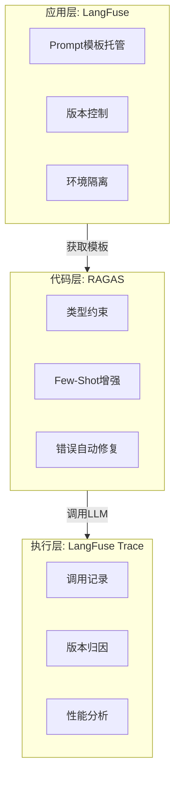
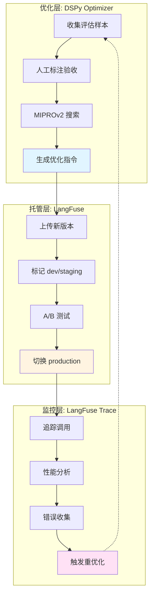

> 两种方案解决Prompt生命周期中不同阶段的问题：RAGAS回答"如何构建"，LangFuse回答"如何管理"。

---

## 核心定位差异

两者解决的是Prompt工程链路上**不同抽象层次**的问题，不存在直接竞争关系。

| 维度 | RAGAS Prompt | LangFuse Prompt |
|------|-------------|-----------------|
| **定位** | 代码级Prompt构建抽象 | 运维级Prompt托管管理 |
| **核心价值** | 类型安全、结构化输出、智能增强 | 版本控制、热更新、环境隔离 |
| **变更粒度** | 需部署代码 | 无需部署，远程热切换 |
| **复杂度承载** | 高（动态Few-Shot、多模态、语义检索） | 低（模板字符串 `{{variable}}` 替换） |
| **协作模型** | 工程师主导 | 支持非技术人员参与 |
| **依赖形态** | 本地库 | 远程服务 + SDK |

---

## 各自擅长领域

选型的首要原则：**匹配场景**，而非比较功能多少。

### RAGAS擅长：工程严谨性场景

RAGAS将Prompt视为代码组件，适合以下场景：

**1. 评估流水线**

批量评估RAG系统质量时，RAGAS的结构化输出发挥核心价值：

```python
# 输出必须是可计算的结构化数据
class EvalOutput(BaseModel):
    faithfulness: float = Field(ge=0, le=1)
    relevance: float = Field(ge=0, le=1)
    reasoning: str

# 批量评估，结果直接可聚合
scores = [result.faithfulness for result in eval_results]
avg_score = sum(scores) / len(scores)
```

LangFuse的自由文本输出无法直接支持这种聚合计算。

**2. 输入分布多样化的任务**

动态Few-Shot构成RAGAS的差异化能力。用户输入千变万化时：

```python
# 语义检索自动选择最相关的示例
# 问"如何退款" → 选择退款相关示例
# 问"如何注册" → 选择注册相关示例
dynamic_prompt = DynamicFewShotPrompt(
    embedding_model=embeddings,
    max_similar_examples=5
)
```

静态示例无法覆盖所有输入模式，动态选择可提升15-30%准确率。

**3. 多模态内容处理**

RAGAS内置了完整的安全防护链路：

```
URL输入 → SSRF检查 → DNS解析 → IP白名单 → 下载限制 → 内容验证 → Base64编码
```

这套链路在LangFuse中需要从零实现。

**4. 需要错误自愈的场景**

LLM输出不稳定是常态。RAGAS的自动修复机制：

```
解析失败 → 提取错误信息 → 构造修复Prompt → 重新生成 → 再次验证
```

减少了人工介入处理脏数据的频率。

### LangFuse擅长：运维灵活性场景

LangFuse将Prompt视为配置项，适合以下场景：

**1. Prompt迭代频繁的业务**

客服话术、营销文案等场景，Prompt可能每天调整多次：

```python
# 代码不变，运营人员在UI上修改Prompt内容
# 修改后60秒内生效，无需发版
prompt = langfuse.get_prompt("customer-greeting", label="production")
```

RAGAS的"改代码→测试→构建→部署"流程在这种场景下是不可接受的。

**2. 非技术人员参与的场景**

产品经理、运营人员可以直接在LangFuse UI上：
- 查看当前生产环境使用的Prompt
- 创建新版本并打上dev标签测试
- 对比不同版本的效果
- 确认后切换production标签

RAGAS要求所有参与者都能读写Python代码。

**3. A/B测试与灰度发布**

LangFuse的版本+标签系统天然支持流量分割：

```python
# 10%流量使用新版本
if random.random() < 0.1:
    prompt = langfuse.get_prompt("answer-gen", version=3)  # 新版本
else:
    prompt = langfuse.get_prompt("answer-gen", label="production")  # 稳定版本
```

**4. 需要Prompt与Trace关联的场景**

当你需要回答"这次糟糕的输出用的是哪个版本的Prompt"时：

```python
# Trace中自动记录Prompt版本
config["metadata"] = {
    "prompt_name": prompt.name,
    "prompt_version": prompt.version,
}
# 后续可在LangFuse UI中按Prompt版本过滤Trace
```

RAGAS没有原生的可观测性集成。

**5. 简单模板替换足够的场景**

很多场景不需要结构化输出、不需要Few-Shot，一个简单的模板就够了：

```python
# LangFuse足够简洁
prompt = langfuse.get_prompt("summarize")
result = prompt.compile(text=user_input)
```

用RAGAS会引入不必要的复杂度。

### 擅长领域速查表

| 场景特征 | 首选方案 | 核心原因 |
|---------|---------|---------|
| 输出必须是结构化数据 | RAGAS | Pydantic约束 + 自动修复 |
| 输入模式多样化 | RAGAS | 动态Few-Shot语义检索 |
| 涉及图像/文件处理 | RAGAS | 安全防护链路完整 |
| 需要批量异步处理 | RAGAS | generate_multiple + asyncio |
| Prompt每天调整多次 | LangFuse | 热更新无需部署 |
| 非工程师参与迭代 | LangFuse | UI可视化管理 |
| 需要A/B测试 | LangFuse | 版本+标签系统 |
| 需要Trace归因 | LangFuse | 原生可观测性 |
| 简单模板替换 | LangFuse | 轻量无负担 |
| 生产级复杂系统 | 混合使用 | 各取所长 |

---

## 工程局限性分析

以下从工程视角剖析两者的局限，识别潜在风险。

### RAGAS：优势与局限

#### 优势

**1. 类型安全**

RAGAS通过Pydantic模型约束输入输出，生产环境中这是刚需：

```python
class AnswerEvaluationInput(BaseModel):
    question: str = Field(description="用户问题")
    context: list[str] = Field(description="检索到的上下文")
    answer: str = Field(description="生成的答案")

class AnswerEvaluationOutput(BaseModel):
    relevance_score: float = Field(ge=0, le=1)
    accuracy_score: float = Field(ge=0, le=1)
    reasoning: str
```

工程价值：
- 编译时类型检查，IDE智能提示友好
- 自动生成JSON Schema作为输出规范
- 运行时验证防止脏数据流入下游

**2. 结构化输出自动化**

LLM输出天然不稳定，RAGAS的自动修复机制降低了工程负担：

```
LLM生成输出 → 解析失败 → 触发FixOutputFormat → 重新生成 → 验证成功
```

这个链路在LangFuse中需要开发者完全自行实现。

**3. 动态Few-Shot是差异化能力**

```python
# 语义检索流程
用户输入 → 向量化 → 余弦相似度计算 → Top-K筛选 → 阈值过滤 → 动态注入
```

对于输入分布多样化的场景（如开放域问答），动态选择相关示例比静态示例效果提升15-30%。LangFuse无此能力。

**4. 模块化可组合**

```python
# 渐进式增强，不破坏原有代码
base_prompt = PydanticPrompt(...)
dynamic_prompt = DynamicFewShotPrompt.from_prompt(base_prompt, embedding_model=embeddings)
adapted_prompt = await dynamic_prompt.adapt(target_language="chinese", llm=llm)
```

**5. 安全防护机制完善**

多模态场景的SSRF防护、内容验证、资源限制，这些在LangFuse中完全缺失：

```python
# RAGAS的安全检查
def _is_url_safe(url: str) -> bool:
    # DNS解析获取IP
    # 拒绝私有地址、环回地址、保留地址
    ...
```

#### 局限

**1. 重耦合问题**

Prompt模板与代码强绑定。修改一个instruction的措辞，需要：
1. 改代码
2. 跑测试
3. 构建镜像
4. 部署上线

对于Prompt迭代频繁的场景，这是不可接受的工程负担。

**2. 版本管理原始**

依赖文件系统的`save/load`：

```python
prompt.save("prompts/zh/evaluation.json")
prompt = Prompt.load("prompts/zh/evaluation.json")
```

无环境隔离（dev/staging/production）、无标签系统、无版本历史追溯、无回滚机制。

**3. 协作困难**

非技术人员无法参与Prompt迭代。产品、运营想调整一个提示语，必须提需求给工程师改代码。

**4. 过度工程化风险**

对于简单场景（如固定格式的客服话术），继承体系、泛型约束、Pydantic模型是显著负担：

```python
# 为了一个简单的问候语，需要定义这些
class GreetingInput(BaseModel): ...
class GreetingOutput(BaseModel): ...
class GreetingPrompt(PydanticPrompt[GreetingInput, GreetingOutput]): ...
```

---

### LangFuse：优势与局限

#### 优势

**1. 热更新能力**

修改Prompt无需重新部署，生产环境即时生效。Prompt迭代周期短（小时级）的场景直接受益：

```python
# 代码不变，远程模板内容可随时更新
prompt = langfuse.get_prompt("rag-generation-v1", type="text")
compiled = prompt.compile(context=context_text, question=question)
```

**2. 环境隔离清晰**

原生支持dev/staging/production标签：

```python
# 开发环境
langfuse.create_prompt(name="my-prompt", prompt="...", labels=["dev"])

# 测试通过后升级
langfuse.create_prompt(name="my-prompt", prompt="...", labels=["staging"])

# 正式发布
langfuse.create_prompt(name="my-prompt", prompt="...", labels=["production"])
```

**3. A/B测试原生支持**

```python
# 版本对比
prompt_v1 = langfuse.get_prompt("rag-generation-v1", version=1)
prompt_v2 = langfuse.get_prompt("rag-generation-v1", version=2)
```

**4. 可观测性集成**

Prompt版本与Trace天然关联，便于归因分析：

```python
config["metadata"].update({
    "prompt_name": "rag-generation-v1",
    "prompt_version": prompt.version,
})
```

**5. 低门槛协作**

非技术人员可通过UI管理Prompt，降低沟通成本。

#### 局限

**1. 能力单薄**

仅支持`{{variable}}`简单字符串替换：

```python
prompt="根据以下上下文回答问题。\n\n上下文：\n{{context}}\n\n问题：{{question}}"
```

无类型校验、无结构化输出约束、无输出解析、无错误修复。

**2. 无Few-Shot原生支持**

动态示例选择需完全自行实现：
- 示例向量化
- 相似度计算
- Top-K筛选
- 格式化注入

**3. 缓存陷阱**

SDK默认60秒缓存，可能导致版本不一致：

```python
# 官方文档的"不推荐"
# 推荐：使用明确版本号
prompt = langfuse.get_prompt("my-prompt", version=5)

# 不推荐：使用标签（可能受缓存影响）
prompt = langfuse.get_prompt("my-prompt", label="production")
```

"推荐用版本号而非标签"暴露了设计妥协——标签的核心价值在于解耦版本号，现在又建议绑定版本号，逻辑自洽性存疑。

**4. 网络依赖**

API调用引入：
- 延迟（网络RTT）
- 可用性风险（服务宕机）
- 成本（API调用计费）

需实现降级逻辑：

```python
try:
    prompt_template = langfuse.get_prompt("rag-generation-v1", type="text")
except Exception as exc:
    logger.warning("Failed to use Langfuse prompt, falling back to hardcoded: %s", exc)
    # 降级到硬编码prompt
```

---

## 场景适配判断

| 场景 | 推荐方案 | 核心理由 |
|------|---------|---------|
| RAG评估/复杂推理 | **RAGAS** | 需要结构化输出、类型约束、Few-Shot |
| 简单问答/客服场景 | **LangFuse** | Prompt迭代频繁，业务人员参与 |
| 多模态审核 | **RAGAS** | 安全防护机制、图像处理能力 |
| A/B测试/灰度发布 | **LangFuse** | 原生版本管理、标签系统 |
| 大规模评估流水线 | **RAGAS** | 批处理优化、异步支持、错误恢复 |
| 跨团队协作 | **LangFuse** | 低门槛、可视化管理、非技术人员友好 |
| 高可用生产环境 | **混合方案** | LangFuse热更新 + 本地降级 |

---

## 互补架构设计

两者不是非此即彼的选择。合理架构采用**分层组合**：



### 实际代码示意

```python
from langfuse import Langfuse
from ragas.prompt import PydanticPrompt
from pydantic import BaseModel, Field

# ========== 1. 从LangFuse获取基础模板（享受热更新、版本管理）==========
langfuse = Langfuse()
template = langfuse.get_prompt("rag-evaluation", label="production")

# ========== 2. 用RAGAS构建结构化Prompt（享受类型安全、Few-Shot）==========
class EvalInput(BaseModel):
    question: str
    context: list[str]
    answer: str

class EvalOutput(BaseModel):
    score: float = Field(ge=0, le=1)
    reasoning: str

class EvalPrompt(PydanticPrompt[EvalInput, EvalOutput]):
    instruction = template.prompt  # 动态注入LangFuse模板
    input_model = EvalInput
    output_model = EvalOutput

# ========== 3. 执行并记录 ==========
prompt = EvalPrompt()
result = await prompt.generate(
    llm, 
    EvalInput(question=q, context=ctx, answer=ans),
    callbacks=[langfuse_handler]  # Trace记录
)
```

### 降级策略

```python
def get_prompt_with_fallback(name: str, fallback_instruction: str) -> str:
    """带降级的Prompt获取"""
    try:
        template = langfuse.get_prompt(name, label="production")
        return template.prompt
    except Exception as exc:
        logger.warning("LangFuse unavailable, using fallback: %s", exc)
        return fallback_instruction

class RobustEvalPrompt(PydanticPrompt[EvalInput, EvalOutput]):
    instruction = get_prompt_with_fallback(
        "rag-evaluation",
        fallback_instruction="Evaluate the answer quality based on context..."
    )
```

---

## DSPy 优化器集成：数据驱动的 Prompt 演化

在混合架构基础上，RAGAS 的 DSPy 优化器为 LangFuse 托管的 Prompt 提供了数据驱动的优化能力，形成"优化 → 托管 → 追踪 → 再优化"的完整闭环。

### 集成架构

DSPy 优化器通过人工标注数据自动搜索最优 Prompt 指令，LangFuse 负责托管优化后的多个版本并进行灰度发布。两者结合解决了 Prompt 生命周期的两个核心问题：如何找到好的 Prompt（DSPy），如何管理和追踪这些 Prompt（LangFuse）。



### 完整工作流与实践

集成工作流从初始部署开始，先从 LangFuse 获取人工编写的通用 Prompt 模板作为基线。随后运行评估收集样本，人工审核标记 `is_accepted` 和 `edited_output`，积累 20-30 个高质量标注后启动 DSPy 优化器。优化器通过 MIPROv2 算法在验证集上反复评估候选指令（候选数 × 样本数 × 评估轮次的大量 LLM 调用，轻量级配置耗时数分钟，深度配置可能需要数小时），选出得分最高的配置。

优化完成后，将新 instruction 上传到 LangFuse 创建版本，经过 dev 开发测试 → staging 小流量灰度（10% 流量）→ 通过 Trace 对比性能指标（准确率、召回率、响应时间）→ 切换 production 全量发布的完整链路。生产环境中，LangFuse Trace 持续记录每次调用的 Prompt 版本、输入输出和性能指标，发现新错误案例时收集标注并增量扩充训练集，周期性（如每月）重新运行优化器，形成持续改进闭环。

工程实践需要建立三个关键机制：自动化流程（脚本收集 Trace 错误案例、标注工具如 Label Studio、定时优化任务、自动上传结果），版本追踪（在 LangFuse Prompt metadata 中记录优化来源、训练数据集、Loss 函数、时间戳，建立版本与优化任务的映射关系，保留完整日志），降级兜底（LangFuse 不可用时降级到本地缓存、优化失败时保留当前生产版本、人工审核机制避免自动上线质量差的版本）。

这种集成特别适合需要领域专用优化（医疗、金融的评估指标）、数据驱动的频繁迭代、跨团队协作（工程师优化、运营标注灰度）、长期维护的生产级系统。不适合数据量极少（<5 个样本）、内容固定不迭代、缺乏标注资源或对优化成本敏感的项目。成本方面，计算主要来自 DSPy 优化阶段（建议先用 light 验证再用 heavy，利用 RAGAS 缓存避免重复），人工需要初始集中投入 20-30 个样本后转为增量模式（每周 5-10 个），托管的 API 调用计费通常可忽略但需考虑网络延迟和降级逻辑。这种集成提供了从"生成优质 Prompt"到"持续演化 Prompt"的完整解决方案。

---

## 工程决策矩阵

| 决策维度 | 选LangFuse单独使用 | 选RAGAS单独使用 | 选混合方案 |
|---------|------------------|----------------|-----------|
| 团队规模 | 小型/无专职LLM工程师 | 有专职LLM工程师 | 中大型团队 |
| Prompt复杂度 | 简单模板替换 | 复杂推理/评估 | 两者兼有 |
| 迭代频率 | 高（日级/小时级） | 低（周级/月级） | 分层管理 |
| 输出要求 | 自由文本即可 | 必须结构化 | 按场景区分 |
| 安全要求 | 一般 | 高（多模态/敏感数据） | 分层防护 |
| 可观测性需求 | 强依赖Trace | 无特殊要求 | 全链路追踪 |

---

## 结论

### 本质区分

| 方案 | 定位 | 核心问题 |
|-----|------|---------|
| **RAGAS** | Prompt构建框架 | 如何写好Prompt |
| **LangFuse** | Prompt管理平台 | 如何管好Prompt |

两者不在同一抽象层次竞争，解决的是Prompt生命周期中不同阶段的问题。

### 各自核心价值

| 方案 | 核心价值主张 | 最适合的团队 |
|-----|-------------|-------------|
| **RAGAS** | 类型安全、结构化输出、智能Few-Shot、错误自愈 | 有LLM工程师、追求输出质量稳定性 |
| **LangFuse** | 热更新、版本管理、环境隔离、可观测性、低门槛协作 | 迭代快、跨职能协作、重运维 |

### 各自局限

| 方案 | 主要局限 | 影响场景 |
|-----|---------|---------|
| **RAGAS** | 重耦合（改Prompt要部署）、协作门槛高 | Prompt高频迭代、非技术人员参与 |
| **LangFuse** | 能力单薄（仅字符串替换）、网络依赖 | 复杂推理、结构化输出、离线环境 |

### 实践建议

| 场景类型 | 推荐方案 |
|---------|---------|
| 轻量场景（简单对话、固定格式） | LangFuse单独够用 |
| 复杂场景（评估、推理、多模态） | RAGAS刚需 + 外部版本管理 |
| 生产级系统 | 混合架构：LangFuse托管 + RAGAS构建 + 降级兜底 |

---

## 附录：关键能力对比速查

| 能力 | RAGAS | LangFuse |
|-----|-------|----------|
| 类型安全（Pydantic） | Yes | No |
| 结构化输出约束 | Yes (自动JSON Schema) | No |
| 输出解析错误自动修复 | Yes | No |
| 动态Few-Shot | Yes (语义检索) | No |
| 多模态支持 | Yes (SSRF防护) | No |
| 热更新 | No | Yes |
| 环境隔离 | No | Yes (标签系统) |
| 版本历史 | No (文件级) | Yes (UI可视化) |
| A/B测试 | No | Yes |
| 非技术人员协作 | No | Yes |
| 网络依赖 | No | Yes |
| Trace集成 | 需自行实现 | 原生支持 |

---

## 延伸阅读

- [RAGAS 指标体系拆解：RAG 质量评估的工程实现]() - 深入解析 RAGAS 的 30 余个评估指标，揭示检索增强生成系统的性能测量逻辑
- [DSPy 框架工程剖析：从声明式Prompt到自动化优化]() - 拆解 DSPy 框架的分层架构、优化器算法原理与 Prompt 自动生成策略
- [DSPy 优化器：RAGAS 中的程序化 Prompt 调优机制]() - 剖析 RAGAS 如何利用 DSPy/MIPROv2 实现评估 Prompt 的自动优化