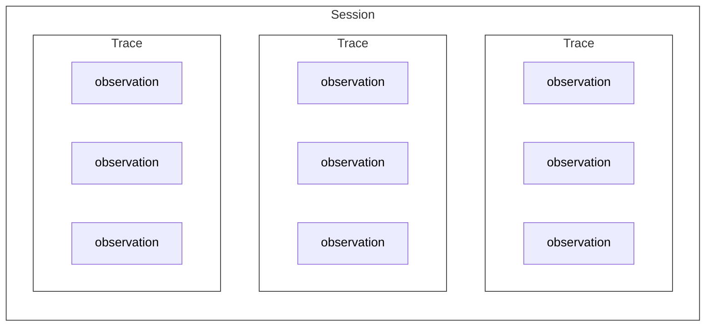
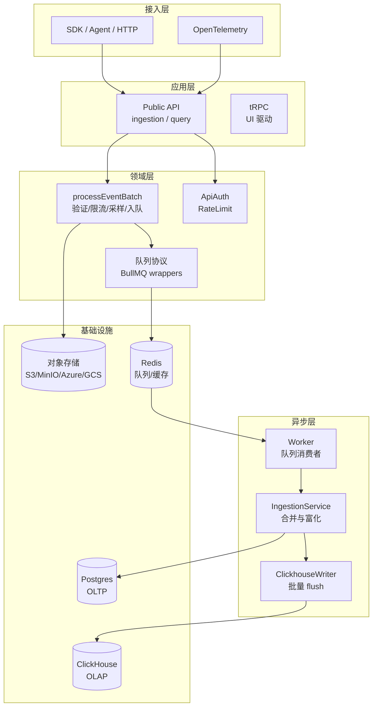

## 引子：可观测系统为何成为 LLM 工程的必答题

大语言模型（LLM）应用的生产化过程中，可观测性不再是可选项。当一个 Agent 系统调用多个模型、检索多个知识源、执行多个工具时，调用链路的复杂度呈指数级增长。无法回溯执行路径、无法归因成本、无法评估质量，系统就无法被信任与迭代。

可观测系统需要解决三个核心问题：如何采集执行轨迹（trace）、如何结构化存储与富化（observation）、如何闭环评估与改进（evaluation）。这三个问题的解法，决定了一个可观测平台的能力边界与工程代价。

本文聚焦两个代表性方案：Langfuse 与 MLflow。前者是以可观测为第一公民的产品化系统，后者是在 ML 生命周期平台上生长出的可观测子系统。两者的设计哲学不同，带来的工程权衡也截然不同。

---

## 第一部分：Langfuse 的架构逻辑

### Langfuse 的系统定位：可观测优先的设计哲学

Langfuse 是一个 LLM 工程平台，核心能力是采集、存储、查询、评估。它的架构围绕一个统一抽象展开：**Observation**。Observation 是执行节点的统一表达，无论是 LLM 生成、工具调用、检索操作还是评估器执行，都被归一为 Observation，并在同一套体系中被富化、查询、评估。

这种设计意味着：Langfuse 把"节点语义"提升到系统的第一层，而不是事后在通用链路数据上做二次抽取。这带来的直接优势是可分析密度高，代价是必须接受多阶段归一化与最终一致性。

### 核心抽象：Observation 不是记录，而是能力载体

Langfuse 将应用数据组织为三个核心概念的层次结构：Session（会话）包含多个 Trace（调用链），每个 Trace 包含多个 Observation（执行节点）。这种分层设计让系统既能聚合用户级别的会话行为，又能下钻到单次调用链的节点细节。

Observation 在 Langfuse 中不是单条数据记录，而是一条端到端的处理链路。它的生命周期跨越四个阶段：

#### 采集与归一化

采集侧支持多种来源：SDK 通过 HTTP public ingestion 提交事件批，OpenTelemetry（OTEL）通过 OTLP ingest 转换 spans。无论来源如何，事件最终进入统一的批处理流水线：验证、限流、排序、分组、采样、入队。

归一化策略的关键在于容忍乱序。SDK 可能先发送更新事件、后发送创建事件；父节点可能晚于子节点到达。系统不依赖强顺序写入，而是通过事件排序与最终一致性保证树结构最终完整。

这种设计的工程含义是：写入端追求入口快、可重放、可削峰，而不是同步写入完成。事件先落入对象存储（S3/MinIO/Azure Blob/GCS），再投递到队列（BullMQ），最后由 Worker 异步合并写入 ClickHouse 与 Postgres。

#### 异步合并与富化

Worker 从队列消费事件后，进入合并流程。合并不是简单的覆盖，而是遵循字段级别的策略：

- 不可变字段（如 `id`、`projectId`）在创建时锁定，后续事件无法覆盖
- I/O 字段采用"最后一次非空覆盖"策略，避免更新事件把数据置空导致信息丢失
- 时间字段存在保护性修正：如果 `end_time` 早于 `start_time`，强制将 `end_time` 置为 `start_time`，宁可延迟为零也不要负延迟

合并后立即进入富化阶段。富化是 Langfuse 提升可分析密度的核心环节，包含三类语义增强：

**LLM 归因**：系统同时保留客户端提供的用量成本（`provided`）与系统归一后的用量成本（`usage_details`、`cost_details`）。前者允许自定义模型的自定义计费，后者通过内部模型价格表统一计价。这种双轨策略在保持灵活性的同时，保证了成本聚合分析的可计算性。

**Prompt 绑定**：Worker 解析事件中的 `promptName`、`promptVersion` 或 `promptId`，查询 Prompt 管理系统并将关联信息写入 Observation。这一绑定是弱约束的：Prompt 可以被删除而不阻断 ingestion，历史 Observation 保留关联字段但可能解析失败。这是鲁棒性换一致性的典型权衡。

**Tool Calling 抽取**：从原始的 input/output JSON 中推导工具调用信息。抽取器覆盖多个生态格式：OpenAI 的 `choices[].message.tool_calls`、Anthropic 的 `content: [{type:'tool_use'}]`、LangChain 的 `additional_kwargs.tool_calls`。抽取失败不阻断主链路，系统通过 try/catch 容错，失败只记录日志并跳过工具字段。

**最终一致性的实际边界**

最终一致性不是抽象的架构术语，而是会影响查询结果的系统约定。入口返回成功时，系统保证的是"事件已落对象存储并入队"，而不是"observation 已完全收敛且可查询"。在这个时间窗口内，会经历三种典型的不完整状态：

**乱序到达的修正**：同一 observation 可能先收到 update 事件、后收到 create 事件。Worker 合并时按 timestamp 排序，并对同 timestamp 做 create 优先。如果时间字段出现逻辑错误（如 end_time 早于 start_time），系统会保护性修正而不是拒绝写入。

**调用树的短暂缺边**：child 节点先到、parent 节点后到时，短时间内查询会看到孤儿节点或缺父边。树结构的完整性依赖 parent 事件最终到达并合并。这意味着任何基于树结构的分析（根因定位、路径聚合）都必须容忍短暂的结构缺失。

**富化字段的延迟出现**：tool calls 从 raw I/O 抽取、usage/cost 从模型价格表计算、prompt 从管理系统查询，这些都在 worker 合并阶段完成。SDK 可能先上报基础 span，再补充 model/usage 或输出里的 tool_calls。因此查询到的 observation 可能暂时缺失这些派生字段。

这种设计的收益是吞吐与成本可控：入口快速响应，重处理下沉到 worker；对象存储保证可重放，队列失败可重试；读侧通过版本选择规则避免 FINAL 的高成本。代价是所有上层推理都必须明确"实时"的语义边界，否则会把"尚未收敛"误判为"数据缺失"。

#### 结构化存储与查询

富化后的 Observation 写入 ClickHouse 的 `observations` 表。这是 OLAP 层的权威数据源，针对查询优化。存储策略包含三个关键设计：

**ReplacingMergeTree 与去重策略**：表引擎是 ReplacingMergeTree，但系统并不无条件执行 FINAL 查询（成本高昂）。相反，查询通过 `LIMIT 1 BY ... ORDER BY event_ts DESC` 取最新记录，并对 OTEL 项目跳过去重（认为 spans 不可变）。这是一致性与成本的动态平衡。

**物理布局优化**：ORDER BY 键包含 `toDate(start_time)`，查询默认排序会优先使用日期键，减少磁盘随机读。表格查询明确注释"join traces 很贵"，只有当 UI 过滤/排序/搜索需要 traces 字段时才 join。

**大字段保护**：trace 详情读取会累加所有 observation 的 input/output/metadata 总体积，超过配置上限直接抛错。这不是功能缺失，而是平台保护机制：宁可失败也不允许把 API 进程拖死。

#### 评估联动

Observation 是评估的锚点。Score 可以绑定到 trace、observation、session 或 datasetRun。评估任务（EvalJob）可以针对 observation 触发，评估结果以 Score 形式写回系统。Worker 在创建 eval job 前会校验 observation 引用是否存在，避免孤儿评估。

这种联动的设计意图是：让评估不只停留在 trace 级别，而可以下钻到链路中的任意节点。例如评估"某个检索步骤的召回质量"或"某个工具调用的参数合理性"。

### ObservationType：类型系统即语义契约

Observation 的类型不是简单的枚举，而是决定了节点如何被归因、聚合与查询的语义契约。类型集合包含：

- 基础类型：`SPAN`、`EVENT`、`GENERATION`
- 扩展类型：`AGENT`、`TOOL`、`CHAIN`、`RETRIEVER`、`EVALUATOR`、`EMBEDDING`、`GUARDRAIL`

其中 generation-like types 由 `isGenerationLike()` 定义，涵盖除 `SPAN` 和 `EVENT` 外的所有类型。这些类型享受一致的 I/O、usage/cost、tool-call 语义，并可被按 model、按 tool、按 evaluator 聚合。

OTEL ingestion 存在类型纠偏机制。系统不完全信任调用方提供的类型，而是基于 attribute 形态做保守修正。例如对特定 SDK 版本，当 type 为 span 但出现 generation-like attributes 时，会强制映射为 GENERATION。这提升了跨 SDK/跨生态的一致性，但也意味着类型语义不是纯声明式，而是运行时推导的结果。

### 架构分层：从接入到基础设施

Langfuse 的架构是经典的分层模型，每层职责明确：

**接入层**负责协议适配。Public API 处理 SDK/HTTP 请求，OTEL processor 转换 OTLP spans。两者最终都生成统一的事件批。

**应用层**分为公共 API 与内部 API。前者面向 SDK 与集成，后者通过 tRPC 驱动 UI。鉴权、限流、批处理在此层完成。

**领域层**是共享能力集合。`processEventBatch` 是批处理的核心流水线，负责验证、排序、分组、采样与入队。队列协议定义了 job schema，存储抽象支持多云对象存储。

**异步层**由 Worker 驱动。Worker 启动时按环境变量开关注册消费者，覆盖 ingestion、eval、retention、export、integrations 等大量队列。IngestionService 实现合并与富化逻辑，ClickhouseWriter 负责批量写入与容错。

**基础设施**采用读写分离与存储分层。Postgres 承载 OLTP（事务、关系、配置），ClickHouse 承载 OLAP（观测数据、聚合查询），Redis 承载队列与缓存，对象存储承载事件回放与大字段卸载。

### 运维视角：Observation 为何最容易成为瓶颈

Observation 的数据体积与写入频率决定了它是系统最大的压力源。运维设计围绕三个策略展开：

**Backpressure 控制**：入口不追求同步写入完成，而是快速落对象存储并投递队列。当对象存储响应 SlowDown 时，系统标记项目并引导进入 secondary queue，避免单个慢项目拖垮全局。队列支持 shard，分散消费压力。

**写入容错**：ClickhouseWriter 是系统最后一道防线。它批量 flush、网络错误重试、超大记录截断或拆批。这保护 Worker 不被单条异常数据打穿（例如超大 input/output、极端 metadata）。

**读侧保护**：单 trace 过大时，查询会直接拒绝。这不是功能缺失，而是平台保护：宁可返回错误也不允许单个请求把 API 进程的内存耗尽。

### Prompt 管理：独立版本化实体与弱约束关联

Prompt 在 Langfuse 中是独立实体，支持版本化与依赖解析。一个 Prompt 由 `(projectId, name, version)` 唯一标识，labels（如 `production`）用于解析默认版本。PromptService 支持 `buildAndResolvePromptGraph()`，允许 prompt 引用其他 prompt 的依赖解析语法。

Observation 通过 `promptId` 或 `promptName + promptVersion` 关联 Prompt。这一关联是弱约束的：无强外键约束，Prompt 删除不阻断 ingestion。Worker 在合并时查询 Prompt 并写入关联字段，查询失败则跳过。

这种设计的优势是鲁棒性：ingestion 链路不会因 Prompt 管理操作（删除、重命名）而中断。代价是历史追溯的一致性需要产品侧补强：你可能遇到"关联存在但解析不到"的幽灵数据，需要通过治理流程而非系统约束来避免。

### 评估体系：作业化的闭环

Langfuse 把评估当作可观测系统的常规工作负载。评估任务（EvalJob）由配置（JobConfiguration）与执行（JobExecution）组成，支持多种目标对象（trace、observation、session、datasetRun）。

Worker 侧的 eval service 负责调度与执行。调度器会检查 observation 是否存在、是否已评估（去重）、是否满足触发条件。执行完成后，结果以 Score 形式写回系统。Score 是独立实体，支持绑定四种目标对象之一。

这种作业化设计的优势是可运营性：配置可版本化、执行可追溯、结果可聚合。短板是评分结果的类型安全依赖运行时约定：Score 的多目标绑定本质是弱类型结构，系统越大越容易出现"同名 score 在不同目标上的语义不一致"，最终影响聚合分析可信度。

---

## 第二部分：延伸到 MLflow 的对比

### MLflow 的系统定位：ML 平台上的可观测子系统

MLflow 是一个 ML 生命周期平台，核心能力覆盖实验追踪（Experiment/Run）、模型注册（Model Registry）、模型服务（Gateway）、可观测（Tracing）。Tracing 是平台的一个子系统，而非第一公民。

这种定位带来的直接影响是：MLflow 的可观测能力必须与 Experiment/Run/ModelRegistry 强耦合，才能形成平台级闭环。优势是统一平台内的数据打通，代价是 Trace 与 Run 的一致性不是系统默认保证，而是通过显式关联与后续补偿实现。

### 核心抽象对比：Trace/Span vs Observation

MLflow 的核心抽象是 Trace 与 Span，遵循 OpenTelemetry（OTEL）语义。Trace 是元数据容器，保存 tags、metadata、assessments；Span 是 OTEL 可互操作的统一载体，携带 attributes、events、status。

Langfuse 的核心抽象是 Observation。Trace 只是轻量容器，执行细节全部下沉到 Observation。Observation 统一了 SPAN/EVENT/GENERATION/AGENT/TOOL/CHAIN 等所有节点类型。

这两种抽象的差异体现了设计哲学的分歧：

**MLflow 的路线**是以 OTEL 作为基础协议与语义。强项是标准化与生态兼容，弱项是很难在第一天就把"LLM/Agent 的语义节点"抽象为统一概念并强制落地一致的归一化字段集。SpanType/attributes 由 OTEL + MLflow registry 共同定义，字段/语义映射的复杂度高。

**Langfuse 的路线**是先定义产品语义，再做协议归一化映射。强项是语义一致、可分析天然成立，弱项是对外互操作需要额外映射层，且系统更依赖 ingestion/merge 的工程复杂度。

### 语义富化对比：集中 vs 分散

Langfuse 把富化作为 ingestion pipeline 的必经之路。Worker 合并后立即补齐 usage/cost、绑定 prompt、抽取 tool calls。富化是系统的主航道，代价是 ingestion 系统复杂（多阶段、异步、最终一致），收益是查询/分析侧的统一语义。

MLflow 的富化分散在多条路径里：

- **Tracing 维度**：在 tracing processors、span attributes registry 等模块分层处理
- **Gateway 维度**：记录 invocation telemetry，但不等价于 trace（默认不会自动生成 trace）
- **OTLP ingest 维度**：转换 OTel spans 为 MLflow Span，按 trace_id 分组落 store

这种分散的优点是模块边界清晰且兼容面宽，缺点是"跨域语义一致性"更难天然保证。当你要做统一分析时，会更依赖二次归一化。

### 评估闭环对比：资产化 vs 作业化

MLflow 的评估是"Scorer → Assessment"，并强绑定 Tracing。Scorer 是可序列化、可注册、可在线运行的评估器，支持 builtin、decorator、LLM judge 等类型，并支持聚合。Assessment 是结果载体，通过 `trace_id` 或 `span_id` 指向 trace/span。

MLflow 在评估上非常平台化：把 scorer 当可管理资产（版本化、可在线运行、可聚合）。这对生产评估闭环是强项。但它也意味着：评估体系会更紧密依赖 tracing 的可用性与关联一致性（trace/run/prompt 的关联如果不稳，会直接影响评估可解释性与聚合能力）。

Langfuse 的评估是"JobConfiguration/Execution → Score"，并支持多目标对象。Eval 是作业（可配置、可执行、可去重），Score 是统一结果载体。强项是可运营的评估流水线，短板是评分结果的类型安全更多依赖约定。

**二者的第一性假设不同**：MLflow 假设评估是平台能力的一部分，应该被资产化；Langfuse 假设评估是可观测系统的常规工作负载,应该被作业化。

### Prompt 管理对比：平台资产 vs 独立实体

MLflow 把 Prompt 纳入 Model Registry 的范畴。Prompt 映射到 RegisteredModel，PromptVersion 映射到 ModelVersion。OSS 存储策略通过特殊 tags 标识 prompt 并存储 prompt 文本/类型/response_format/model_config。

Prompt 与 Trace 的关联策略存在两条路径：entity association（store 支持时）或 TraceTagKey.LINKED_PROMPTS（tag 过渡/兜底）。

这种设计是平台一体化的典型体现：prompt 被当作一种可注册资产，并天然进入版本化/治理体系。但 OSS 方案依赖 tags 存 payload，会碰到内容体积、查询效率、语义表达力的天花板。这不是实现问题，而是模型选择的代价。

Langfuse 的 Prompt 是独立实体，支持版本化、依赖解析、label 解析。Observation 通过弱约束关联 Prompt，容错性高但一致性强度低。Prompt 更像"可观测系统的输入资产"，优先满足可解析、可引用、可绑定到 observation、可用于评估模板。

---

## 第三部分：工程视角的结构性权衡

### Langfuse 的结构性问题

**最终一致性是系统默认语义**：ingestion → merge → propagation 的分层写入与补偿机制，带来的代价是任何"实时"分析都必须定义"实时"的含义。否则会把缺父节点/缺富化字段误判为缺数据。

**Trace 与 Observation 的边界存在重叠风险**：Trace 可转换为 synthetic SPAN。当做统一查询/导出时，需要决定把"根节点语义"放在 Trace 还是 Observation，边界不稳会造成长期维护成本。

**Prompt 关联弱约束**：鲁棒性换一致性。历史追溯会出现"引用存在但不可解析"，要避免只能靠治理流程而非系统约束。

**Score 的多目标绑定是弱类型结构**：可扩展但容易污染语义。系统越大，越容易出现"同名 score 在不同目标上的语义不一致"，最终影响聚合分析可信度。

**评估执行的可解释性依赖额外链路**：评估流程会生成执行 trace，但 job 状态与 trace 写入不是同一事务语义。失败/超时/部分写入会让调试链条变长，影响对评估体系的信任。

### MLflow 的结构性问题

**Trace 与 Run 的一致性不是系统默认保证**：关联通过 store 的 entity association（如 `link_traces_to_run`）或 metadata + tags 的混合策略。在做"实验-链路-评估"的统一分析时，必须接受关联可能缺失或延迟。

**Telemetry 与 Tracing 分离**：gateway invocation 记录 telemetry，但不会自动生成 trace。平台数据统一性不可能自然成立，需要额外约定，在产品侧会变成教育成本。

**OTLP ingest 强依赖 experiment_id header**：这是协议互操作的隐性摩擦。跨语言/标准 OTel pipeline 接入会卡在"额外上下文注入"。

**OSS Prompt 的 tag-based 存储天然受限**：当 prompt 成为核心资产（长模板/复杂结构化输出）时，系统必然面临性能/可治理性的天花板。

**Span 级评估虽然模型支持，但产品闭环更偏 Trace 级**：Assessment 支持 `span_id`，但体系设计核心是 trace/run/experiment 聚合。当要评估"链路中某个节点"的质量时，可能缺少一等公民的闭环能力。

### 选型决策框架

如果要的是**平台统一**：实验/模型/评估/可观测在同一平台里形成闭环，MLflow 更接近答案。但必须接受：Tracing 不是系统的第一抽象，很多一致性要靠约定与补偿。

如果要的是**可观测产品本体**：把链路节点（LLM/Tool/Retriever/Evaluator）当第一公民，追求可分析密度与评估作业体系，Langfuse 更接近答案。但必须接受：最终一致性、多阶段归一化、弱约束关联带来的长期语义治理成本。

没有绝对的优劣，只有设计哲学与工程代价的匹配度。选择取决于你的第一性问题：是先有 ML 平台再长出可观测能力，还是先有可观测系统再整合实验管理能力。

---

## 参考资料

- [Langfuse Observability Overview](https://langfuse.com/docs/observability/overview)
- [MLflow Tracking Documentation](https://mlflow.org/docs/latest/ml/tracking/)
