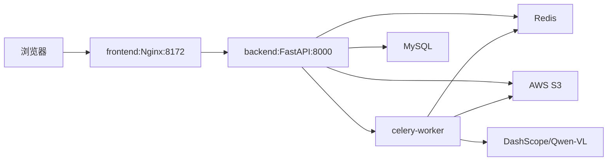

title: mxd-AI 部署：网络代理问题排障与经验复盘
description: 单机 Docker Compose 部署中，从"宿主机能通、容器不通"到"代理配置优先级混乱"的完整踩坑记录。包含错误假设、失败尝试与最终解决方案。
author: Alden
date: 2026-02-09 10:00:00 +0800
categories: [DevOps]
tags: [Docker, Network, Deployment, Container, Proxy, AWS]
pin: false
mermaid: true
comments: true
---

## 写在前面

这篇文章记录的是我们在 `mxd-ai` 单机部署（Docker Compose）过程中遇到的网络代理问题。外部依赖包括 AWS S3（存储）和 DashScope/Qwen-VL（大模型推理）。

写作动机很简单：这类问题的坑在于，你在宿主机上跑脚本是通的，但放到容器里就不通了；你配了环境变量，但不知道为什么没生效；你改了 `.env`，但容器拿到的还是旧值。这些问题会让人反复试错，浪费大量时间。

---

## 背景：系统结构与部署环境

### 服务架构

`mxd-ai` 是一个视频分析系统，架构如下：



关键组件：

- `frontend`：Nginx 容器，反代 `/api` 到后端，对外暴露 8172 端口
- `backend`：FastAPI 应用，处理同步 HTTP 请求，触发异步任务
- `celery-worker`：异步任务队列，负责视频处理、VLM 分析、场景合并等（频繁访问 S3 和 AI 服务）
- `mysql` / `redis`：数据库和缓存
- 外部依赖：
  - **AWS S3**：视频文件、图片、分析结果的存储
  - **DashScope/Qwen-VL**：通过 OpenAI SDK 兼容接口调用的视觉大模型

### 部署环境

- 企业内网环境（需要通过代理访问公网 443）
- 宿主机已配置代理：`http_proxy=http://hqsproxy.mxd.com:8080`
- 使用 Docker Compose 部署所有服务

### 网络架构演进

> **关于混合网络的坑**  
> 早期部署时我们混用了 Compose 内部网络和宿主机网络。这导致容器需要通过公网 IP 访问宿主机服务时，会触发 NAT 回环问题（详见 [Azure VM NAT 回环问题排查]()。
[Pregel 执行模型与步进调度]()  

> 
> 后来我们统一改为 Compose 内部通信（通过服务名解析），才消除了这个复杂性。
{: .prompt-info }

---

## 第一次遇到问题：宿主机能通，容器不通

### 现象

我们在宿主机上测试 Qwen-VL 的调用脚本 `test_qwen.py`，能正常拿到返回：

```bash
python test_qwen.py
# 输出：成功调用 Qwen-VL，返回分析结果
```

但启动 Docker Compose 后，`celery-worker` 执行 VLM 分析任务时报错：

```text
httpcore.ConnectError: [Errno 101] Network is unreachable
openai.APIConnectionError: Connection error.
```

### 我们的错误假设

**当时的想法**：宿主机能访问 DashScope，容器应该也能访问啊，毕竟容器用的是宿主机的网络栈。

**实际情况**：大错特错。容器默认是隔离的，宿主机的环境变量（包括 `http_proxy`）不会自动传递到容器里。

### 第一次验证

我们在宿主机和容器里分别执行：

```bash
# 宿主机
env | grep -i proxy
# 输出：
# http_proxy=http://hqsproxy.mxd.com:8080
# https_proxy=http://hqsproxy.mxd.com:8080

# 容器
docker exec -it mxd-ai-celery-worker sh -lc 'env | grep -i proxy || true'
# 输出：（空）
```

结论很直观：**容器里没有代理变量，所以出不了网**。

---

## 第二次尝试：手动注入代理，临时验证

### 做法

既然容器里没有代理变量，那我们手动加上：

```bash
docker exec -it mxd-ai-celery-worker sh
export http_proxy=http://hqsproxy.mxd.com:8080
export https_proxy=http://hqsproxy.mxd.com:8080
# 临时启动一个 worker 验证
celery -A app.celery_app worker --loglevel=info --hostname=proxytest@%h
```

### 结果

这次 DashScope 调用成功了，VLM 分析任务能正常完成。

### 价值与局限

**价值**：这个临时方案能快速区分两类问题：

- 容器出网不通（网络层）
- vs 应用配置/证书/代理策略问题（应用层）

**局限**：这种"进容器手动 export"的方法只能验证思路，**容器重建后就丢了**，无法作为持久方案。

---

## 第三次尝试：透传代理到 Compose，结果 S3 坏了

### 做法

我们在 `docker-compose.yml` 里加上代理环境变量：

```yaml
services:
  backend:
    environment:
      http_proxy: http://hqsproxy.mxd.com:8080
      https_proxy: http://hqsproxy.mxd.com:8080
  
  celery-worker:
    environment:
      http_proxy: http://hqsproxy.mxd.com:8080
      https_proxy: http://hqsproxy.mxd.com:8080
```

重启容器：

```bash
docker compose up -d --no-build --force-recreate backend celery-worker
```

### 现象

- **好消息**：DashScope 不再报 `Network is unreachable`
- **坏消息**：上传视频到 S3 时报错：

```text
urllib3.exceptions.ProxyError: ('Unable to connect to proxy', OSError('Tunnel connection failed: 403 DefaultErrorTemplate'))
botocore.exceptions.ProxyConnectionError: Failed to connect to proxy URL: "http://hqsproxy.mxd.com:8080"
```

### 我们的理解

代理让 DashScope 可达了，但同时也把 S3 请求路由到了代理。而企业代理策略**不允许 CONNECT 到 AWS 域名**（`*.amazonaws.com:443`），返回 403。

所以我们需要：**让 AI 服务走代理，但让 S3 绕过代理（直连）**。

---

## 第四次尝试：配置 NO_PROXY，但没生效

### 做法

我们在 `docker-compose.yml` 里加上 `NO_PROXY`：

```yaml
services:
  backend:
    environment:
      http_proxy: http://hqsproxy.mxd.com:8080
      https_proxy: http://hqsproxy.mxd.com:8080
      NO_PROXY: localhost,127.0.0.1,::1,mysql,redis,backend,.amazonaws.com,amazonaws.com
  
  celery-worker:
    environment:
      http_proxy: http://hqsproxy.mxd.com:8080
      https_proxy: http://hqsproxy.mxd.com:8080
      NO_PROXY: localhost,127.0.0.1,::1,mysql,redis,backend,.amazonaws.com,amazonaws.com
```

重启容器后，再次测试。

### 现象

S3 上传**还是报 403**。

### 困惑的时刻

我们进容器检查环境变量：

```bash
docker exec -it mxd-ai-backend sh -lc 'env | grep -i proxy'
```

输出让人迷惑：

```text
http_proxy=http://hqsproxy.mxd.com:8080
https_proxy=http://hqsproxy.mxd.com:8080
no_proxy=localhost,127.0.0.1,::1        # 为什么这么短？
NO_PROXY=localhost,127.0.0.1,::1,mysql,redis,backend,.amazonaws.com,amazonaws.com
HTTP_PROXY=                             # 为什么是空的？
HTTPS_PROXY=                            # 为什么是空的？
```

发现两个怪异现象：

1. `no_proxy`（小写）的值很短，没有包含 `.amazonaws.com`
2. 出现了空值的 `HTTP_PROXY=` 和 `HTTPS_PROXY=`

### 进一步验证：让库自己说话

光看环境变量还不够可靠，我们让 boto3 自己告诉我们"某个 URL 会不会走代理"：

```bash
docker exec -it mxd-ai-backend sh -lc "python - <<'PY'
from botocore.utils import get_environ_proxies
targets = [
  'https://dashscope.aliyuncs.com',
  'https://s3.ap-southwest-1.amazonaws.com',
  'https://mr-low-code-bucket-01.s3.ap-southwest-1.amazonaws.com',
]
for t in targets:
  print(t, '->', get_environ_proxies(t))
PY"
```

输出：

```text
https://dashscope.aliyuncs.com -> {'https': 'http://hqsproxy.mxd.com:8080'}
https://s3.ap-southwest-1.amazonaws.com -> {'https': 'http://hqsproxy.mxd.com:8080'}
https://mr-low-code-bucket-01.s3.ap-southwest-1.amazonaws.com -> {'https': 'http://hqsproxy.mxd.com:8080'}
```

**S3 还是在走代理！**

---

## 转折点：发现环境变量优先级的陷阱

### 根因 1：大小写兼容性问题

不同的库对代理环境变量的读取策略不同：

- Python 的 `requests` 和 `urllib3` 会同时读取大小写变量，**但优先级不同**
- `botocore` 优先读取小写（`http_proxy`、`no_proxy`）
- Go 程序优先读取大写（`HTTP_PROXY`、`NO_PROXY`）

我们配置了 `NO_PROXY`（大写），但 `no_proxy`（小写）还是旧值。而 boto3 可能优先读取了小写的 `no_proxy`，导致 S3 域名没被豁免。

### 根因 2：Docker Compose 的变量优先级

这是更隐蔽的问题。

`docker compose` 在解析 `${VAR}` 时，优先级是：

1. **当前 shell 环境**（`export VAR=...`）
2. 项目目录 `.env` 文件
3. `${VAR:-default}` 的默认值

我们发现：宿主机的 shell 环境里已经 `export` 了代理变量（登录时自动配置的）。

当我们在 `docker-compose.yml` 里写：

```yaml
environment:
  NO_PROXY: ${NO_PROXY}
```

Compose 会从 shell 环境读取 `NO_PROXY` 的值。而 shell 里的 `NO_PROXY` 是一个短的旧值（只有 `localhost,127.0.0.1,::1`），**覆盖了我们在 `.env` 里写的完整值**。

证据：我们在 `.env` 里写的代理地址是 `hqsproxy.example.com`，但容器里拿到的却是 `hqsproxy.mxd.com`（shell 里的值）。

### 为什么会有空值的 HTTPS_PROXY？

在 `docker-compose.yml` 里写：

```yaml
environment:
  HTTPS_PROXY: ${HTTPS_PROXY}
```

如果宿主机 shell 没有设置 `HTTPS_PROXY`，Compose 会把它解析成**空字符串**并注入容器，导致：

```text
HTTPS_PROXY=
```

对某些库来说，"变量存在但为空"可能等价于"关闭代理"或其他预期外行为。

---

## 解决方案：大小写同时配置 + 避免优先级覆盖

### 方案 1：大小写都配，且值一致

在 `docker-compose.yml` 里：

```yaml
services:
  backend:
    environment:
      http_proxy: http://hqsproxy.mxd.com:8080
      https_proxy: http://hqsproxy.mxd.com:8080
      HTTP_PROXY: http://hqsproxy.mxd.com:8080
      HTTPS_PROXY: http://hqsproxy.mxd.com:8080
      no_proxy: localhost,127.0.0.1,::1,mysql,redis,backend,.amazonaws.com,amazonaws.com
      NO_PROXY: localhost,127.0.0.1,::1,mysql,redis,backend,.amazonaws.com,amazonaws.com
  
  celery-worker:
    environment:
      http_proxy: http://hqsproxy.mxd.com:8080
      https_proxy: http://hqsproxy.mxd.com:8080
      HTTP_PROXY: http://hqsproxy.mxd.com:8080
      HTTPS_PROXY: http://hqsproxy.mxd.com:8080
      no_proxy: localhost,127.0.0.1,::1,mysql,redis,backend,.amazonaws.com,amazonaws.com
      NO_PROXY: localhost,127.0.0.1,::1,mysql,redis,backend,.amazonaws.com,amazonaws.com
```

### 方案 2：清空 shell 干扰，强制使用 .env

在启动 Compose 前，先 `unset` 掉当前 shell 的代理变量：

```bash
unset http_proxy https_proxy ftp_proxy no_proxy HTTP_PROXY HTTPS_PROXY FTP_PROXY NO_PROXY
docker compose --env-file ./.env up -d --no-build
```

这样 Compose 就只会从 `.env` 文件读取变量，不会被 shell 环境覆盖。

### 方案 3：兜底写法（推荐）

在 `docker-compose.yml` 里用兜底语法，避免注入空值：

```yaml
environment:
  http_proxy: ${http_proxy:-}
  https_proxy: ${https_proxy:-}
  HTTP_PROXY: ${HTTP_PROXY:-${http_proxy:-}}
  HTTPS_PROXY: ${HTTPS_PROXY:-${https_proxy:-}}
  no_proxy: ${no_proxy:-}
  NO_PROXY: ${NO_PROXY:-${no_proxy:-}}
```

这样：

- 如果 `HTTP_PROXY` 未设置，就回退到 `http_proxy`
- 如果 `http_proxy` 也未设置，就是空（不注入）

### 验证

重启容器后，再次执行：

```bash
docker exec -it mxd-ai-backend sh -lc "python - <<'PY'
from botocore.utils import get_environ_proxies
print('dashscope:', get_environ_proxies('https://dashscope.aliyuncs.com'))
print('s3:', get_environ_proxies('https://s3.ap-southwest-1.amazonaws.com'))
PY"
```

期望输出：

```text
dashscope: {'https': 'http://hqsproxy.mxd.com:8080'}
s3: {}
```

DashScope 走代理，S3 不走代理。**问题解决**。

---

## 认知复盘：我们踩的坑与纠正的假设

### 假设 1：宿主机能访问 = 容器能访问

**错误理解**：容器用的是宿主机的网络栈，宿主机能访问外网，容器也应该能。

**实际情况**：容器默认是隔离的，环境变量不会自动继承。宿主机通过 `http_proxy` 出网，但容器里没有这个变量。

### 假设 2：改了 .env 就会生效

**错误理解**：我在 `.env` 里写了代理配置，启动 Compose 就会用这个配置。

**实际情况**：shell 环境的 `export` 变量优先级更高，会覆盖 `.env`。你以为用了 `.env`，其实容器拿到的是 shell 里的旧值。

### 假设 3：NO_PROXY 配了就行

**错误理解**：配了 `NO_PROXY` 就能让 S3 绕过代理。

**实际情况**：不同库读取大小写变量的策略不同。boto3 优先读小写 `no_proxy`，如果小写值是旧的（或不存在），大写的 `NO_PROXY` 可能不生效。

### 假设 4：改了 nginx.conf 就会生效

**错误理解**：修改 `frontend/nginx.conf` 后重启容器就会生效。

**实际情况**：取决于配置是如何进入容器的：

- 如果是 build 时 COPY 进去，必须 `docker compose build` 后再 `up -d --force-recreate`
- 如果是 volume 挂载，重启容器就行
- 如果你用的是 `dev.sh`（Vite dev server），`nginx.conf` 根本不会生效

---

## 知识沉淀：为什么会这样？

### Docker Compose 的环境变量来源

当你在 `docker-compose.yml` 里写：

```yaml
environment:
  VAR: ${VAR}
```

Compose 会按优先级查找 `VAR`：

1. 当前 shell 环境（`export VAR=...`）
2. 项目目录 `.env` 文件
3. `${VAR:-default}` 的默认值

最终注入容器的值来自**优先级最高的那个来源**。

### 两种 ".env" 的区别

**Compose 的 `.env`（用于变量替换）**

- 作用：在 `docker-compose.yml` 里做 `${VAR}` 的插值
- 默认文件：当前目录 `.env`
- **不等于**自动注入容器环境

**服务的 `env_file:`（用于注入容器）**

- 作用：把文件里的 `KEY=VALUE` 注入容器 env
- 可以指定多个文件

### NO_PROXY 的匹配规则

`no_proxy` / `NO_PROXY` 的基本语法（跨语言通用）：

- 逗号分隔：`a,b,c`
- 支持：
  - 域名：`example.com`
  - 子域（带点）：`.example.com`
  - IP：`127.0.0.1`
  - CIDR（部分实现）：`192.168.0.0/16`

对于 AWS S3，推荐同时写：

- `.amazonaws.com`
- `amazonaws.com`
- `.amazonaws.com.cn`
- `amazonaws.com.cn`

这样能覆盖：

- `s3.ap-southwest-1.amazonaws.com`
- `<bucket>.s3.ap-southwest-1.amazonaws.com`

### 为什么要大小写都配？

| 库/工具         | 优先读取     | 备注                          |
|-----------------|--------------|-------------------------------|
| Python requests | 小写优先     | `http_proxy` > `HTTP_PROXY`   |
| Python urllib3  | 小写优先     | 同上                          |
| botocore        | 小写优先     | `no_proxy` > `NO_PROXY`       |
| Go 标准库       | 大写优先     | `HTTP_PROXY` > `http_proxy`   |
| curl            | 同时支持     | 建议都配                      |

保守策略：**大小写都配，且值一致**。

---

## 实用工具与验证方法

### 1. 查看 Compose 最终解析的配置

```bash
docker compose config > /tmp/compose.resolved.yml
rg -n "PROXY|proxy" /tmp/compose.resolved.yml
```

这能让你直接看到：Compose 把哪些值写进了 `environment` 块。

### 2. 查看容器内的环境变量

```bash
docker exec -it mxd-ai-backend sh -lc 'env | grep -i proxy'
docker exec -it mxd-ai-celery-worker sh -lc 'env | grep -i proxy'
```

### 3. 验证 boto3 的代理行为

```bash
docker exec -it mxd-ai-backend sh -lc "python - <<'PY'
from botocore.utils import get_environ_proxies
targets = [
  'https://dashscope.aliyuncs.com',
  'https://s3.ap-southwest-1.amazonaws.com',
  'https://your-bucket.s3.ap-southwest-1.amazonaws.com',
]
for t in targets:
  print(t, '->', get_environ_proxies(t))
PY"
```

### 4. 测试 TCP 连通性（不依赖 HTTP 库）

```bash
docker exec -it mxd-ai-celery-worker sh -lc "python - <<'PY'
import socket
socket.create_connection(('dashscope.aliyuncs.com', 443), timeout=10)
print('dashscope tcp ok')
PY"
```

### 5. 强制重新读取环境变量（不 rebuild）

```bash
docker compose up -d --no-build --force-recreate backend celery-worker
```

### 6. 查看 Nginx 配置（容器内）

```bash
docker exec -it mxd-ai-frontend sh -lc "nginx -T 2>/dev/null | head -n 200"
```

`nginx -T` 会输出经过 include 后的完整配置，比"我以为改了 nginx.conf"靠谱。

---

## 快速诊断清单

如果你遇到类似问题，按这个顺序排查：

### 第一步：确认容器有代理变量

```bash
docker exec -it <container> sh -lc 'env | grep -i proxy'
```

如果输出为空，或者没有 S3 域名在 `NO_PROXY` 里，问题就在这。

### 第二步：让库自己说话

```bash
docker exec -it <container> sh -lc "python - <<'PY'
from botocore.utils import get_environ_proxies
print('AI:', get_environ_proxies('https://dashscope.aliyuncs.com'))
print('S3:', get_environ_proxies('https://s3.ap-southwest-1.amazonaws.com'))
PY"
```

期望：

- AI 服务返回代理信息（非空 dict）
- S3 返回空 dict

### 第三步：检查 Compose 解析结果

```bash
docker compose config | rg -A 5 'environment:'
```

看看 `http_proxy`、`https_proxy`、`no_proxy`、`NO_PROXY` 的值是不是你期望的。

### 第四步：排查是否有 shell 环境干扰

```bash
env | grep -i proxy
```

如果宿主机 shell 里有代理变量，而且值和你的 `.env` 不一致，那就是被覆盖了。

### 第五步：清空干扰后重试

```bash
unset http_proxy https_proxy no_proxy HTTP_PROXY HTTPS_PROXY NO_PROXY
docker compose --env-file ./.env up -d --no-build --force-recreate <service>
```

---

## 常见问题

### Q1: 我明明写了 NO_PROXY，为什么 S3 还走代理?

**可能原因 1**：你只配了大写 `NO_PROXY`，但 boto3 优先读小写 `no_proxy`。

**解决**：大小写都配。

**可能原因 2**：shell 环境的 `NO_PROXY` 是旧值，覆盖了你的 `.env`。

**解决**：`unset` 后重启，或用兜底语法。

### Q2: 为什么容器里会有空值的 HTTPS_PROXY=？

**原因**：`docker-compose.yml` 里写了 `HTTPS_PROXY: ${HTTPS_PROXY}`，但宿主机没设置这个变量。Compose 把它解析成空字符串并注入容器。

**解决**：用兜底语法 `${HTTPS_PROXY:-}`，或直接写死值。

### Q3: 改了 nginx.conf 为什么没效果？

**可能原因 1**：你在用 `dev.sh`（Vite dev server），`nginx.conf` 根本不生效。

**可能原因 2**：配置是 build 时 COPY 进镜像的，改了文件但没 rebuild。

**解决**：`docker compose build frontend && docker compose up -d --force-recreate frontend`。

**可能原因 3**：配置是 volume 挂载的，但没重启容器或 reload。

**解决**：`docker compose restart frontend` 或进容器 `nginx -s reload`。

### Q4: 前端 Nginx 报 504，但后端日志没错？

**原因**：504 只是症状。真实原因通常在后端日志里，你需要找同一个 `trace_id` 的错误。

**排查**：

```bash
docker logs --tail 500 mxd-ai-backend | rg 'trace_id=<your_trace_id>|ProxyConnectionError|Tunnel connection failed'
```

常见的真实原因：

- S3 上传被代理拦截（403）
- AI 推理超时（180s）
- 数据库锁超时

---

## 结论

这篇文章核心教训是：

1. **宿主机能通不等于容器能通**：网络栈、环境变量、路由策略可能完全隔离。
2. **代理是双刃剑**：开启全局代理后必须立即配 `NO_PROXY`，尤其是 S3 这类常被企业代理拒绝的域名。
3. **优先级是根因**：`.env`、shell export、compose interpolation 之间的优先级关系，如果不清楚，会反复遇到"明明写了为什么没生效"。
4. **验证要让库说话**：`get_environ_proxies(url)` 比 `env | grep proxy` 更接近真实路由行为。
