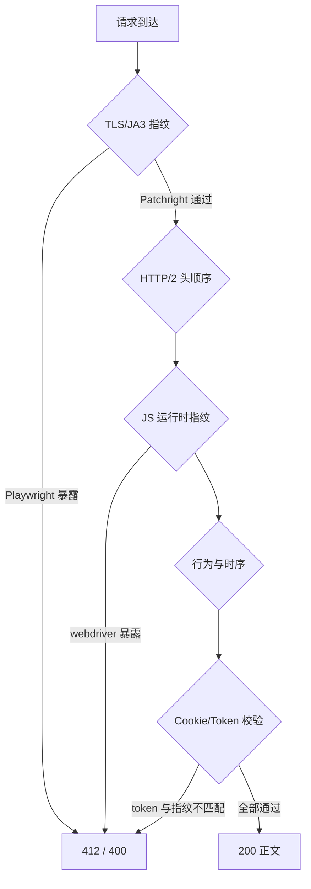

## 结论先行

同一个 URL，三条路径，结果如下：

- 纯 HTTP 请求：`412 Precondition Failed`，输出为空
- 常规浏览器自动化（原生 Playwright + Chrome）：`400 Bad Request`，输出为空
- Patchright + 66 个 stealth 参数：`200 OK`，正文 6859 字节，附件链接完整

断点不在 User-Agent 有没有写对。断点在引擎的 fingerprint 本身。

## 两轮失败的弧线

### 2025 年：RS6 面前，headless 全线崩溃

[第一轮对抗](/posts/crawl-download-trace/)复盘于 2025 年 5 月。目标是某政务平台的文件发布页，附件需批量拉取。

当时观测到的现象是固定的：HTTP 请求打回 `412`，Playwright headless 拿到空 DOM，改 UA 和等待时长无效，把 headless context 的 cookie 提出来直连同样是 `400`。

背后是瑞数（Ruishu）RS6 级防护的完整运作机制。首次请求触发 JS challenge，浏览器需要在本地生成 token 并写回 cookie；headless 环境算出的 token 与它收集的指纹不一致，服务端拒绝。`412` 是"前置条件不满足"，`400` 是"指纹或签名不匹配"，两个状态码各有语义，不能混用来判断拦截层次。

最终走通的是 CDP 会话复用方案：真人在真实 Chrome 中完成一次验证，程序通过 Chrome DevTools Protocol 连接已验证的会话，只做读取与搬运，不碰挑战本身。这条路有效，但有一个硬性前提——每次启动都需要人工介入。

### 2026 年初：换一批 URL，412/400 重演

数月后再次面对同类站点，这次想要一条完全自动化的路径。

按直觉逐步升级：

`headless-web-viewer`（基于标准 Playwright 的渲染工具）跑完，HTML 仅有 39 字节，内容是 `<html><head></head><body></body></html>`。原生 `Invoke-WebRequest` 直接打回 `412`。手写 stealth patch 注入 `navigator.webdriver = undefined` 并拉长等待，拿到 `400`，正文长度为零。

格局没变。挑战依然存在，只是从 2025 年换了一批 URL。

---

## Scrapling 出现：第一个真正有效的信号

在 GitHub 上找到了 [D4Vinci/Scrapling](https://github.com/D4Vinci/Scrapling) 项目。它提供三级抓取命令，按反检测强度递进——`get`、`fetch`、`stealthy-fetch`。

按三段式走一遍验证：

```bash
# Step 1: 纯 HTTP
scrapling extract get "$URL" output_get.md --timeout 60
# 结果: 412，输出 0 字节

# Step 2: 普通浏览器自动化
scrapling extract fetch "$URL" output_fetch.md \
  --network-idle --timeout 90000 --wait 4000 --headless --real-chrome
# 结果: 400，输出 0 字节

# Step 3: stealthy-fetch
scrapling extract stealthy-fetch "$URL" output_stealthy.md \
  --timeout 90000 --wait 5000 --headless --real-chrome --solve-cloudflare
# 结果: 200，输出 6859 字节，正文完整，附件链接可见
```

`stealthy-fetch` 成功了。接下来的问题是：它和前两条路径的差异究竟在哪。

---

## 源码拆解：stealthy-fetch 的断点在哪

### 引擎替换：Playwright → Patchright

三条命令在引擎层面的分叉是确定的：

- `get`：纯 HTTP，无浏览器上下文
- `fetch`：`from playwright.sync_api import sync_playwright`
- `stealthy-fetch`：`from patchright.sync_api import sync_playwright`

Patchright 是 Playwright 的 drop-in 替换，API 完全兼容，但在 Chromium 启动层打了补丁——在命令行和二进制两个层面清除自动化标记。其包元数据明确声明：

- `--disable-blink-features=AutomationControlled` 已添加
- `--enable-automation` 已移除

这不是 User-Agent 伪装层面的事情。是在 Blink 引擎的自动化控制位上动刀。

### 参数维度的质变

从 Scrapling 的 `engines/constants.py` 取出参数集，本机实测计数：

| 路径 | 参数总数 |
|:--|--:|
| 普通 fetch（DEFAULT_ARGS） | 11 |
| stealthy-fetch（DEFAULT_ARGS + STEALTH_ARGS） | 66 |

差了 55 个参数。这不是微调，是维度升级。

核心对立关系清晰：`HARMFUL_ARGS` 列举了需要主动剔除的参数，`STEALTH_ARGS` 列举了需要主动注入的参数。两者同时作用在 `launch_persistent_context` 的调用上：

```python
context = playwright.chromium.launch_persistent_context(
    user_data_dir=profile_dir,
    args=dedupe_flags(DEFAULT_ARGS + STEALTH_ARGS),
    ignore_default_args=list(HARMFUL_ARGS),   # 主动剔除自动化标志
    headless=headless,
    **context_options,
)
```

`ignore_default_args` 这个参数是关键。Playwright 默认会向 Chromium 注入一批参数，其中就包含 `--enable-automation`——这个参数直接告知站点："我是自动化程序"。`HARMFUL_ARGS` 的存在，是在启动阶段就把这句话抹掉。

### 上下文配置：整套一致性

除了参数，context 配置本身也在对齐真实用户环境：

```python
context_options = {
    "color_scheme": "dark",
    "device_scale_factor": 2,
    "is_mobile": False,
    "has_touch": False,
    "service_workers": "allow",        # 允许 Service Worker，与真实浏览器行为一致
    "ignore_https_errors": True,
    "screen": {"width": 1920, "height": 1080},
    "viewport": {"width": 1920, "height": 1080},
    "permissions": ["geolocation", "notifications"],
}
```

同时，默认 `google_search=True`，导航时携带 `Referer: https://www.google.com/`，模拟从搜索结果点进来的入口路径。

对站点侧的信号组合是：一台正在使用 Google 搜索结果进行阅读的真实桌面 Chrome，分辨率 1920×1080，开启了 Service Worker，有地理位置和通知权限。

这套信号不是某一个参数的效果，而是整套一致性通过了多维检测：



### launch_persistent_context 而非 launch

标准 Playwright 的用法是 `browser.launch()` 然后 `browser.new_context()`。Patchright 推荐的路径是 `launch_persistent_context`——直接在持久化 profile 下启动，上下文只有一个，指纹在整个会话内保持一致。

`launch` + `new_context` 每次创建 context 时可能引入细微不一致，在严格指纹校验下是额外的暴露点。`launch_persistent_context` 规避了这个风险。

---

## 抽取 Core：去掉 Scrapling 依赖

理解了断点后，真正需要的依赖被精简到三个：

```
patchright       ← 替换 playwright 的引擎，API 兼容
browserforge     ← 生成与 Chrome 版本匹配的真实 User-Agent
beautifulsoup4   ← HTML 解析
```

从 Scrapling 的 `constants.py` 和 `_base.py` 中抽出参数集，在 `fetch_with_patchright()` 中直接复现，整个实现不超过 470 行，核心逻辑集中在以下几个函数：

```
HARMFUL_ARGS     ← 5 个需要剔除的自动化参数
DEFAULT_ARGS     ← 11 个基础无害参数
STEALTH_ARGS     ← 55 个 stealth 参数
fetch_with_patchright()  ← 主抓取逻辑，含重试与四元判定
extract_attachments()    ← 从 BeautifulSoup 中提取附件链接
download_attachments()   ← 携带 Referer/UA 下载附件
```

`dedupe_flags()` 负责在合并参数时去重，避免相同 flag 被注入两次产生不确定行为。

User-Agent 的生成使用 `browserforge.headers.HeaderGenerator`，按指定 Chrome 版本和 OS 生成与版本号匹配的真实 UA 字符串，而不是手写一个固定值。

---

## 验收四元判定

每次抓取，四个条件同时满足才算成功，缺一不可：

| 维度 | 判定标准 |
|:--|:--|
| HTTP 状态码 | `== 200` |
| 文本长度 | `> 1000` 字符 |
| 命中关键词 | 包含预期正文内容 |
| 未命中拦截词 | 不含 `forbidden`、`验证码`、`访问异常` |

"内容有但长度短"不是模糊的成功，是拿到了拦截页面的某一段。"状态码 200 但正文为空"也是失败。两个条件都要显式通过。

---

## 三段式 SOP

面对同类站点，固定走三段式，按梯级升级，不要从第一步失败直接去"调参数"：

```
Step 1  纯 HTTP（get）                   ← 快速探测，拿状态码
Step 2  普通浏览器自动化（fetch）          ← 确认是否需要 JS 执行完才能拿到正文
Step 3  Patchright + stealth（stealthy-fetch 或自实现）  ← 最终方案
```

每步都跑四元判定，记录失败快照（HTML 原文 + 状态码 + headers），为后续规则迭代留依据。

成功后的标准动作：

1. 从正文中提取 `a[href]` 内以 `.pdf/.doc/.docx/.xls/.xlsx/.zip/.rar` 结尾的链接
2. 相对路径用 `urljoin` 转绝对路径
3. 下载时携带 `Referer`（目标页 URL）和与会话匹配的 `User-Agent`
4. 保留一次成功的 HTML 快照作为回归基线，下次跑完用 diff 验收

---

## 两轮失败的对比

回过头看，两轮失败的共性是"对抗方向选错了"：

2025 年的思路是"怎么让 headless 更像真实浏览器"，改 UA、补 webdriver patch、加等待，但核心问题是 TLS/协议层和挑战-应答链路根本没有被解决，最终选择了绕路（CDP）。

2026 年初的重试，同样卡在"UA 没写对"和"等待不够长"的错误归因上，直到发现 Scrapling 才意识到：问题的根本是引擎，不是参数的微调。

Patchright 解决了引擎层面的问题，stealth 参数集解决了启动信号层面的问题，两者叠加才让整套 fingerprint 通过了多维检测。

---

## 合规边界

本文所述方法仅适用于公开可访问的页面，目标页面无需登录、无权限控制。使用时需控制抓取频率，避免对目标服务器造成非正常负载，内容使用遵循目标站点使用条款与相关法律法规。技术本身的学习与研究价值不等同于任意使用的许可。
