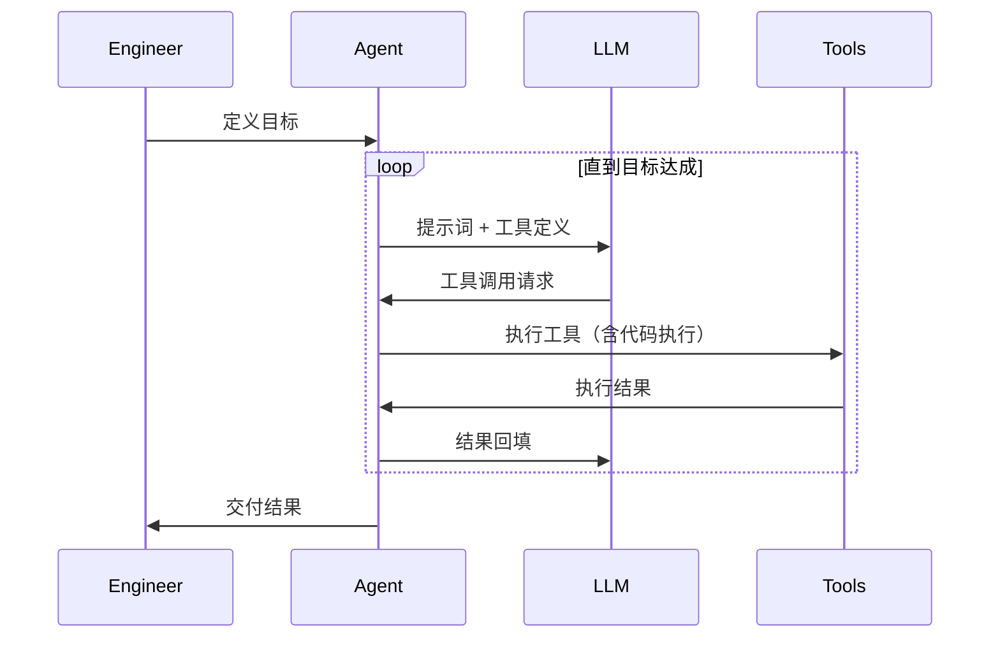
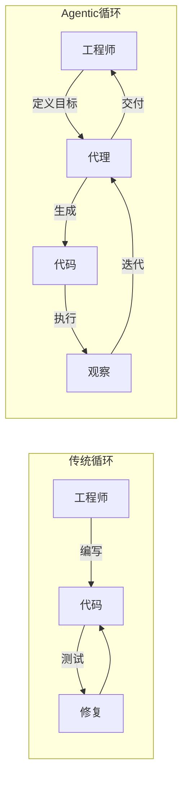

Simon Willison 持续维护着一份名为 [Agentic Engineering Patterns](https://simonwillison.net/guides/agentic-engineering-patterns/) 的工程指南。指南的核心命题是：代码生成的成本趋近于零，但交付好代码的成本依然高昂。两句话方向相反，都成立。

指南目前包含六个主要模块：原则（Principles）、与编程代理协作（Working with coding agents）、测试与质量保证（Testing and QA）、理解代码（Understanding code）、注释提示（Annotated prompts）、附录（Appendix）。以下按概念层次逐层展开。

---

## 代理是什么

定义先行。自 1990 年代以来，AI 研究界对"代理"的定义持续争议，但在大语言模型（LLM）语境下，这个定义被精简到一句话：

> 代理在循环中调用工具，以达成目标。

具体机制：软件携带提示词和工具定义，调用 LLM；LLM 返回工具调用请求；软件执行工具，将结果再次喂回 LLM。循环往复，直到目标达成。

编程代理在此基础上加了一个决定性能力：**代码执行权**。LLM 生成代码，代理直接运行，观察结果，迭代修正。没有执行权，LLM 的输出只是文本；有了执行权，代理才能收敛到"确实能跑"的代码。

---

## 成本结构的断裂

编程代理让代码生成成本接近于零。但 Simon 给出了一份清单，定义什么是"好代码"：

- 代码能工作，有证据证明解决了正确的问题
- 优雅处理错误情况，不只走快乐路径
- 最小化实现，只做需要做的事
- 有测试保护，防止未来回归
- 文档反映系统的当前状态
- 设计便于未来修改

逐条看下来，没有一条是"打字能力"。代码生成成本归零，但验证成本、判断成本、问题定义成本，都没有跟着归零。

人类工程师的角色因此发生了迁移：从代码编写者，变成问题定义者和质量保证者。

---

## 从编写代码到设计生成系统

传统编程循环与 Agentic 循环的对比，表面上只是在中间插入了代理，实质上是一次架构层的提升：

工程师不再直接操作代码，而是设计能够生成代码的系统。Hrishi 的比喻很精准：Agentic Engineering 是"锤子工程"——答案是两者都是，但优先级翻转了。核心工作变成设计锤子（代理系统），而非挥锤（写代码）。

Simon 的定义更精确：**Agentic Engineering 是上下文流设计**。每一个决策都围绕信息在哪里、何时流动、以什么形式流动。调用哪些工具，反而是次要问题。

把代理系统想象成一组带有"大脑"的微服务：架构师代理负责规划，批评家代理负责质量控制。没有清晰的上下文边界，整个群体就会在"上下文漂移"（context drift）中失控。这不是提示词工程，也不是编排，是信息流的拓扑设计。

---

## 问题求解的真实形态

Hrishi 在 *Antibrittle Agents* 中指出了一个容易被忽视的事实：真实的问题求解，根本不是线性的。

不是 A → B → C → Done，而是一个迷宫：多条路径、若干死胡同、反复回溯。人类在解决复杂问题时也是如此，区别只在于回溯的速度和经验。

这个事实直接解释了为什么 TODO 列表式的代理设计往往弊大于利：它把非线性问题强行压缩成一条直线，破坏了任务的天然结构。好的代理架构应该匹配问题的形状，而不是反过来用线性框架削足适履。

---

## 工程模式：从原则到实践

Simon 指南中有几个可立即落地的模式：

**红绿 TDD**：让代理先写测试（红：测试失败），再写实现代码（绿：测试通过）。防止代理生成"看起来对但实际不工作"代码的最有效屏障。四个字"先写测试"，背后是一整套软件工程纪律。

**首次运行测试**：任何新会话，第一步让代理运行测试套件。这不只是检查现状，更是让代理"感知"到质量基准的存在，以测试结果为锚点迭代。

**子代理**：LLM 上下文窗口有上限（当前约 100 万 token）。子代理在全新上下文中处理子任务，避免主上下文的污染和消耗。多个子代理并行运行，还能压缩任务时间。

**Git 高级用法**：代理精通历史重写、分支管理等复杂 Git 操作，允许更激进的版本控制策略。以前因"操作太复杂"而搁置的版本管理决策，现在值得重新评估。

以 Simon 的 GIF 优化工具为例：一个提示词，让 Claude Code 将 Gifsicle 编译为 WebAssembly 并构建完整的 Web 界面。这种"组合已知模式"的能力，大幅压缩了复杂工具的原型开发周期。

---

## 认知债务：新的技术债务形态

当代理编写的代码体量增大，一种新的债务类型开始积累：**认知债务**。

代理生成的代码变成黑盒——工程师能运行它，但不完全理解它。规划新功能时，这种理解缺口转化为决策障碍，最终像技术债务一样拖慢迭代速度。

应对策略：主动偿还认知债务。具体方法包括构建交互式代码走查（Interactive Walkthrough）和线性走查（Linear Walkthrough）。Simon 用动画词云解释算法的案例展示了一种思路：把复杂的代码逻辑重新映射到可视化的认知表示上，让工程师重新建立理解。

---

## 复合工程循环

指南中一个容易被忽略的概念：**复合工程循环（Compound Engineering Loop）**。

每个编码项目结束时，以回顾收尾，记录哪些策略有效。这份记录供未来的代理运行使用。质量改进开始以复利方式积累。

在代理工程语境下，这个概念获得了新的重量：知识不再只存在于人脑里，它被外化到系统提示、工具配置、代理指令中，成为可被继承、可被复用的工程资产。随着任务时间跨度延长到数天，生成的 token 量达到数百万，好的中间状态将提供有意义的中断点。何时让人介入、如何设计中断，将成为越来越核心的工程问题。

---

## 什么仍然稀缺

Simon 在指南中明确指出，代码生成成本趋零之后，人类工程师的核心价值集中在四个方向：

- **问题定义能力**——把模糊的业务需求转化为可执行的工程规格
- **系统设计思维**——在多个有效方案中识别最优权衡
- **质量判断力**——判断代理输出是否真正解决了正确的问题
- **业务理解深度**——理解代码背后的约束和目标

指南本身仍在持续更新，Simon 会随着工具演进不断补充新章节。完整内容：[simonwillison.net/guides/agentic-engineering-patterns](https://simonwillison.net/guides/agentic-engineering-patterns/)
