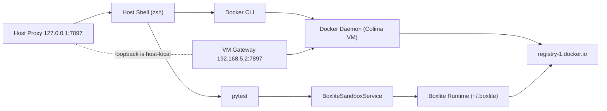

## 阅读定位

本文面向一种迁移场景：长期在 Ubuntu 使用 Docker，首次迁移到 macOS 后，在 `docker pull` 与 `sandboxed_tool` 测试里反复遇到网络超时、镜像拉取与缓存判定冲突。

目标不在命令堆叠，而在建立稳定的判定顺序：先锁定“谁在发请求”，再确认“请求走哪条网”，最后核验“缓存属于谁”。

## 环境事实（排障基线）

本次复盘基于以下可验证事实：

| 维度 | 事实 |
|---|---|
| 宿主机 | macOS `darwin 25.3.0` |
| 运行壳 | `zsh` |
| Docker context | `colima`（active） |
| Colima runtime | `docker` |
| Docker daemon | `29.2.1`，运行于 Colima VM（Ubuntu 24.04.4 LTS） |
| 宿主机代理 | `127.0.0.1:7897` |
| Colima VM 代理 | `HTTP_PROXY/HTTPS_PROXY=http://192.168.5.2:7897` |
| Docker 本地镜像 | 已存在 `debian:bookworm-slim`、`xprobe/xagent-sandbox:latest` |
| 失败用例 | `tests/core/tools/adapters/sandboxed_tool/test_sandboxed_tool_wrapper.py` |

`~/.zshrc`{: .filepath} 关键 alias：

```bash
alias proxy='export http_proxy=http://127.0.0.1:7897 https_proxy=http://127.0.0.1:7897 all_proxy=socks5://127.0.0.1:7897; echo "✅ Proxy On"'
alias unproxy='unset http_proxy https_proxy all_proxy; echo "❌ Proxy Off"'
```
{: .nolineno }

## 主拓扑：四层主语，不再是两层主语

Ubuntu 常见直觉是 “shell → docker daemon → registry”。macOS + Colima + Boxlite 的结构会多出一条独立运行时链路：



这张图给出两个边界条件：

- **出网主语**：`docker pull` 的请求来自 VM 内 daemon；`sandboxed_tool` 的镜像动作来自 Boxlite runtime。
- **代理作用域**：宿主机的 `proxy` alias 只影响当前 shell，不会自动落到 VM 内 daemon，更不会落到 Boxlite runtime。

## 场景一：系统已开代理，但 `docker pull` 仍超时

### 现象

浏览器可访问 Docker Hub，终端已执行 `proxy`，但 `docker pull xprobe/xagent-sandbox:latest` 仍报 `dial tcp ... i/o timeout`。

### 机制

`proxy` alias 写入的是宿主机 shell 环境变量，但 `docker pull` 的网络请求来自 Colima VM 内 daemon。VM 内没有可达代理时，daemon 会直连 registry，在网络边界超时。

### 关键误判

“我已经 `proxy` 了”仅对当前 shell 成立，不对 VM 内 daemon 自动成立。

### 修复路径

把代理写入 `~/.colima/default/colima.yaml`{: .filepath}，并使用 VM 视角地址而非 host loopback：

```yaml
env:
  HTTP_PROXY: http://192.168.5.2:7897
  HTTPS_PROXY: http://192.168.5.2:7897
  NO_PROXY: localhost,127.0.0.1,docker-registry.somecorporation.com
```

重启 Colima：

```bash
colima stop
colima start
```
{: .nolineno }

代理软件还需要开启局域网入口（Allow LAN）。否则 VM 到 `192.168.5.2:7897` 仍会被拒绝。

## 场景二：Docker 已有 `bookworm` 镜像，但沙盒仍触发远端拉取

### 现象

`docker images` 可见 `debian:bookworm-slim`，但 `sandboxed_tool` 用例仍报错：

```text
Failed to pull image 'debian:bookworm-slim'
failed to pull manifest: ... https://index.docker.io/v2/library/debian/manifests/bookworm-slim
```
{: .nolineno }

### 机制

失败链路走的是 `BoxliteSandboxService`，不是 Docker sandbox。Boxlite runtime 使用独立镜像存储（默认 `~/.boxlite`{: .filepath}），因此不会复用 Docker daemon 的 `images` 缓存。

### 关键误判

把 “Docker 有镜像” 外推为 “Boxlite 也有镜像”。

### 修复路径

先修网络可达性，再修 Boxlite 侧的拉取策略。短期可以通过代理让 Boxlite 能访问 registry；中期应当给 Boxlite runtime 提供可配置的 `image_registries`，降低对单一路径的依赖。

## 场景三：判定脚本显示“变量为空”，但代理其实有效

### 现象

执行 `colima ssh -- echo $HTTP_PROXY` 输出为空；随后 `curl` 却返回 `HTTP/1.1 200 Connection established`。

### 机制

`$HTTP_PROXY` 在宿主机 shell 已先展开。这条命令的空输出反映的是“展开位置”，不是 VM 内变量的真实状态。

### 正确检查

```bash
colima ssh -- env | grep -i proxy
colima ssh -- sh -lc 'echo $HTTP_PROXY'
colima ssh -- printenv HTTP_PROXY
```
{: .nolineno }

## 收敛方法：三步判定框架（主语 → 路径 → 状态）

先问主语：请求由 shell、daemon，还是 Boxlite runtime 发起。再问路径：请求走 host loopback、VM 网关，还是直连外网。最后看状态：缓存是否命中、registry 是否可达、测试是否恢复。

这个顺序能直接绕开最常见的误判：先看结果，再猜主语。

## 验证闭环：从链路探针到业务恢复

```bash
source ~/.zshrc
proxy
export HTTP_PROXY="$http_proxy" HTTPS_PROXY="$https_proxy" ALL_PROXY="$all_proxy"

# host layer
curl -I --max-time 10 https://index.docker.io/v2/

# vm layer
colima ssh -- sh -lc 'env | grep -i proxy'
colima ssh -- curl -I --max-time 10 https://index.docker.io/v2/

# daemon layer
docker pull debian:bookworm-slim
docker pull xprobe/xagent-sandbox:latest

# business layer
pytest tests/core/tools/adapters/sandboxed_tool/test_sandboxed_tool_wrapper.py -vv -s
```
{: .nolineno }

验收标准按层递进：VM 能通、daemon 能拉、测试能过。只满足其中一层，都不算收敛。

## 工程化沉淀

短期动作是把 `index.docker.io` 可达性前置为测试前探针。中期动作是让 Boxlite runtime 支持环境可配置的 registry 列表。长期动作是固定镜像 digest，减少 `latest` 带来的解析漂移，并把“缓存与网络主语必须一致”纳入故障手册。

结论保持不变，但表述需要带主语：代理是否生效、镜像是否可用、拉取是否应发生，都必须在同一句话里说明请求是谁发起。

## 相关阅读

- [Azure VM 重启后 MinIO 无法访问：NAT 回环问题排查与 iptables 解决方案]({{ site.url }}{{ site.baseurl }})
- [mxd-AI 部署：网络代理问题排障与经验复盘]({{ site.url }}{{ site.baseurl }})
