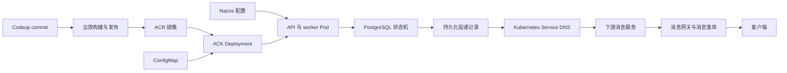
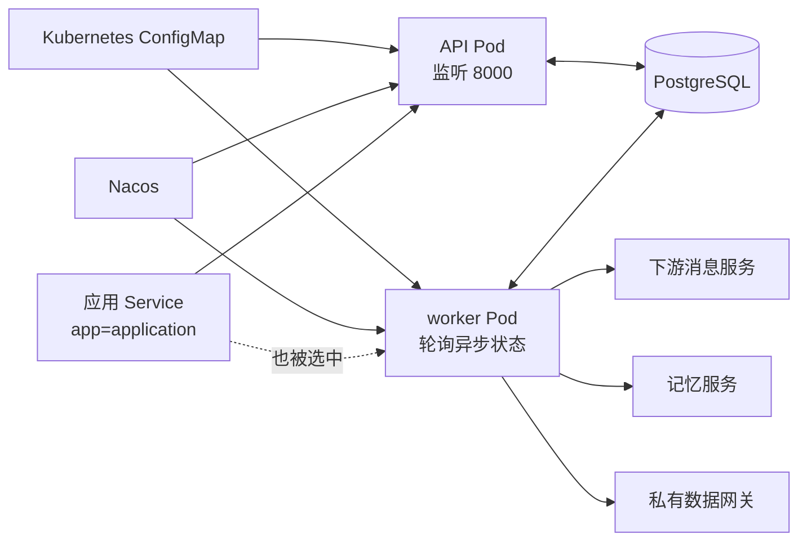

# 一个 Agent 工程师第一次把服务推上 ACK，从云效流水线到真实消息落库

| 项目 | 内容 |
| --- | --- |
| 创建日期 | 2026-08-14 |
| 更新日期 | 2026-08-14 |
| 复盘范围 | 一次云效流水线、ACR、ACK、Kubernetes、ConfigMap、API 与 worker 发布，以及集群内联调和真实消息验收 |

## 参考文档

- 当时的流水线日志、Kubernetes 事件、容器日志与脱敏后的联调记录
- Kubernetes API 与 worker 工作负载清单

## 为什么问题会在两天内一起涌来

这两天，我原本想做的事情很具体。把一个 Agent 服务发布到测试环境，让它在一条真实的定时任务路径上做出一次消息决策，再确认消息确实进入下游。

如果只看 Agent 代码，这条链已经相当熟悉。冻结输入，组装 Prompt，让模型生成结构化 Candidate，再由 Harness 决定是否产生副作用投递。日常排障也多半围绕一次调用展开，输入、输出、schema 和 trace 都在看得见的边界里。

问题出在目标发生了变化。这一次要证明的范围已经越过单次模型决策。我还得证明这份代码以正确版本运行在阿里云测试集群里，由正确的 worker 读到正确配置，再从正确的网络环境调用正确的微服务，最终形成一条可追溯的真实消息记录。

代码之外，一整套此前很少需要亲自处理的工程边界在两天内同时出现了。云效负责构建和发布，ACR 保存镜像，ACK 承载 Kubernetes 工作负载，ConfigMap 与 Nacos 提供运行配置，PostgreSQL 保存异步状态，下游消息服务接收消息，后面还有消息网关和客户端。API、worker 和数据库迁移又各有自己的发布节奏。



高密度踩坑并不是偶然。过去被开发环境遮住的环节，这一次全部成了我要亲自给出证据的环节。最初最容易犯的错误，是拿前一层的成功替后一层作证。镜像推到 ACR，不等于 ACK 已经使用它；Pod Running，不等于 worker 在工作；HTTP 200，也不等于用户已经看到消息。

这条“证据不能跨层透支”的主线，后来几乎解释了两天里遇到的所有问题。

## 代码还没进集群，发布链已经开始失真

最早的失败甚至没有发生在 Kubernetes 里。

云效流水线的环境变量没有实际值，变量渲染后，命名空间成了空字符串，清单路径也偏离了仓库中的实际目录。补上环境变量后，模板里的命名空间约定又与集群中的真实命名空间不一致。

日志里的 Kubernetes 客户端和服务端版本差距很醒目，但它只是一条 warning。让流程停下来的错误，是流水线最终拿到了一个不存在的目录。这个小插曲第一次提醒我，排障时最显眼的信息不一定最重要。先看变量渲染后的实值，找到第一条改变控制流的错误，通常比围着 warning 猜版本兼容问题有效。

紧接着出现的是权限。创建自有流水线时，云效明确拒绝使用团队的 ACR 服务连接和 ACK 集群连接。此前 Codeup 连接已经可用，本地 kubeconfig 也能访问目标命名空间，我下意识把这些事实拼成了“权限应该够”。实际却是三套身份边界。

Codeup 连接只负责拉源码，ACR 连接负责推镜像，ACK 连接负责把清单发布到集群。本地 `kubectl` 使用的个人身份，与云效流水线的执行身份也没有继承关系。后来继续使用已有且已经授权的两条流水线，发布才得以向前推进。

这件事让我第一次理解云 IAM、云效服务连接和 Kubernetes RBAC 怎样共同作用。遇到 `permission denied` 时，只问“我有没有权限”太笼统。要先说清楚谁在执行、通过哪种身份、操作哪个平台的哪类资源。管理员需要的也是这四个坐标，而不是一张笼统的“开发权限”。

镜像构建又暴露了本地与云端的差异。本地依赖由 `uv.lock` 管理，最初 Dockerfile 也走 `uv sync`；云效已有的私有依赖仓库接入方式却是 pip，并通过 BuildKit secret 注入 `pip.conf`。工具和凭据协议没有对上，代码本身没有报错，制品仍然构建不出来。

最后的处理没有放弃本地的 uv，也没有把私库凭据写进镜像。`uv.lock` 继续作为依赖事实源，`requirements.txt` 从锁文件导出，Dockerfile 在构建时挂载 pip 配置，再用 pip 安装固定依赖。依赖导出与云端安装方式随后被固化进仓库。

这里需要保持一致的是锁定后的依赖集合、构建输入和凭据注入协议。开发机与流水线可以使用不同工具，只要它们最后消费的是同一份可复现事实。

依赖问题处理完，worker 流水线终于完成构建、镜像推送和 Kubernetes 发布。云效已经显示成功，ACK 里的 worker 却没有启动。此时容器尚未创建，也就没有应用日志，能看到的只有 Pod 事件。

```text
configmap "<worker-bootstrap-config>" not found
```

新流水线把服务名配成了带角色后缀的名字，而 worker 清单自己还会追加角色后缀。渲染结果因此出现重复后缀，引用了不存在的 bootstrap ConfigMap，镜像名也跟着偏离。把服务名改回基础应用名后重新运行，worker 才进入 Ready。

这次失败正好卡在发布与运行的交界。云效 Success 说明清单已经交给 ACK，Pod 是否创建、容器是否启动、进程是否 Ready，还要由 ACK 里的状态和事件继续回答。

## API Running 只是系统的一部分

worker 终于 Ready 后，我回头看 API 第一次变成 Running 的那一刻，才发现自己当时把一部分系统当成了整个项目。负责定时调度、评估、Outbox 和副作用投递的 worker 尚未发布，scheduler 也保持关闭。此时 HTTP 接口和数据库连接可以正常，系统却不会自动前进一步。

这个项目的 worker 不是 Redis 消费者，也没有接入 XXL-JOB。它是一个长期运行的 Python 进程。

```text
python -m <worker-module>
```

它轮询 PostgreSQL 中的到期调度、评估、Outbox、投递记录和补偿工作。API 与 worker 使用同一份镜像，但启动命令、探针、扩缩容、故障恢复和发布时机都不同。数据库迁移又是第三条线，研发维护 Alembic revision 和可审计 SQL，测试与生产库由 DBA 执行，应用启动时不自动修改线上 schema。

因此，一个代码仓库在运行时展开成了三个独立边界。

```text
API 清单       -> API Deployment、Service、Nacos bootstrap ConfigMap
worker 清单    -> worker Deployment
Alembic/SQL   -> DBA 管理的数据库迁移
```

我顺着这三个边界回到 ACK 控制台。目标命名空间是一个共享微服务环境，包含多个 Deployment 与 ClusterIP Service；应用的 API 与 worker 共同读取 Kubernetes ConfigMap 和 Nacos 配置，通过 PostgreSQL 交接异步状态，再由 worker 调用集群内服务和私有数据网关。



控制台也在这里暴露了一个仅看 Pod `Running` 很难发现的问题。API Pod 的标签是 `app=application`，worker Pod 除了 `component=worker`，也保留了同一个 `app` 标签；偏偏应用 Service 的 selector 只有 `app=application`。Endpoints 于是同时收录了两个 Pod，而 Service 又会把 80 端口转到目标的 8000。容器内探测显示 API 正在监听 8000，worker 的 8000 则是关闭的。这意味着发给 API Service 的 HTTP 请求有可能被转给一个根本不提供 HTTP 服务的 worker。

API 与 worker 虽然已经被拆成两个 Deployment，流量边界却又被一个过宽的标签选择器粘了回去。`app` 表达“属于哪个应用”，`component` 才表达“这个进程承担什么能力”；Service 选择的是可提供 HTTP 的后端，不应该只选择共同的应用身份。资源数量只交代了环境，Endpoints 才暴露出声明拓扑与预想拓扑的偏差。

API 与 worker 的清单随后拆到各自目录。这个拆分看起来只是挪 YAML，实际上是在承认它们是两种 workload。仓库数量不是运行单元的边界，职责、发布顺序和恢复方式才是。

两条流水线最终能分别发布 API 和 worker，但它们也暴露出下一项改进空间。同一个 commit 被两条流水线各构建一次，得到两个不同时间戳 tag。它们当时都能运行，版本追溯却不够干净。更稳定的发布模型应该是一次构建产生唯一 digest，再由 API 和 worker 共同引用这个不可变制品。

手工发布跑通后，自动触发又暴露出一个小缺口。API 与 worker 的 master Push 触发器在云效页面里都保存过，后来真实 push 却没有产生新 run，只能再次手工启动两条流水线。页面里有一条配置，只能证明平台保存了一个对象。事件有没有从 Codeup 到达云效、有没有命中分支并获得执行权限，仍要看一次真实 push 后是否出现对应 run。

到这里，CI/CD 已经不再只是把几条命令放到页面上执行。变量、身份、制品和外部事件都参与决定同一份代码最后会不会运行。

## ConfigMap 保存成功，离进程读到正确配置还很远

服务开始创建 Pod 后，问题集中转向配置。这也是两天里最容易反复绕圈的一层。

当前 API 与 worker 会从多份 ConfigMap 读取环境变量，分别承担 Nacos bootstrap、公共接入、观测和应用运行参数等职责。

进程先从 Kubernetes 注入的环境变量构造 Settings，再根据 bootstrap 参数连接 Nacos。当前代码会监听 Nacos 变更，但只允许各进程白名单内的字段更新。它先构造完整候选 Settings，完成校验后再原子替换，避免一组相关配置只更新一半。

这里有一个容易混淆的边界。Nacos 在当前项目里承担配置中心职责，集群内的服务注册与发现仍由 Kubernetes Service 和 DNS 完成。看到下游服务能被解析，不代表它来自 Nacos；看到 Nacos 配置加载完成，也不能替代一次真实的 Service DNS 和 HTTP 契约验证。

Kubernetes 注入 ConfigMap 时，所有值都是字符串。字段缺失、字段存在但值为空、字段里写着一段说明性占位符，会进入三条不同的应用路径。

一个限定为 `0` 或 `1` 的开关是最典型的一例。代码把它定义成 `Literal[0, 1]`，默认值本来合法，ConfigMap 注入的却是字符串 `"0"` 或 `"1"`，当前 Pydantic 解析会拒绝它们。删掉这个键可以使用默认值；若要支持配置，则需要显式转换和回归测试。把页面值从 `"1"` 改成 `"0"`，并没有解决类型边界。

另一个可选 URL 字段一度填着说明性占位文本。这段文字适合出现在说明文档里，进入进程后却会被当成真实 URL 校验。即使当时 adapter 还是 mock，Settings 也会先遇到无效输入。可选字段可以缺失，不等于可以塞进任意占位文本。

更隐蔽的一点是，ACK 页面保存 ConfigMap 后，已经运行的 Pod 环境不会随之改变。`envFrom` 在 Pod 创建时完成注入，旧进程仍持有旧值。每次修改之后都要滚动对应 Deployment，再核对新 Pod 的非敏感环境和启动日志。

有一次 ConfigMap patch 甚至在 shell 展开阶段就失败了，JSON 参数没有传给 `kubectl`。命令没有报出我预想的业务错误，Deployment 也没有出现 rollout。正是“为什么新 Pod 没有出现”这个反常现象，帮助确认写操作根本没发生。后来把参数赋值和 patch 分开，配置才被写入。

这组经历最终把“配置正确”拆成了三个可以观察的状态。ACK 或 Nacos 中保存了什么，是控制面的状态；Deployment 模板准备给下一批 Pod 注入什么，是声明状态；当前进程最后采用了什么，是运行状态。只看其中一份，很容易拿旧状态解释新现象。

如果让我从这些细节里只留下一个改进项，我会先做配置预检。使用目标镜像同版本的 Settings，对准备进入 ACK 的脱敏配置分别执行 API 与 worker 校验，检查空字符串、占位符、URL、枚举、数字和 feature flag 的跨字段约束。许多 CrashLoop 可以在发布之前变成一条普通的 CI 错误。

## 同一个服务地址，在 Mac 和 Pod 里是两张地图

API Pod 拿到集群内地址后，我曾从本地 Mac 直接请求它，结果一直超时，应用日志也毫无反应。原因很简单，这个地址属于 ACK 的 Pod 网段，本地机器没有通往该网段的路由。

从本地临时验证 API，合适的入口是把 ClusterIP Service 转发到本机。

```bash
kubectl -n <namespace> port-forward svc/<api-service> 18000:80
curl http://127.0.0.1:18000/healthz
curl http://127.0.0.1:18000/readyz
```

worker 调用同集群微服务时，则应该使用 Kubernetes Service DNS，例如 `http://<downstream-service>`。Pod IP 是易变的实现地址，Service 才是稳定入口。本地、集群内和外部用户这三种调用者处在不同网络平面，不能共享一套“我这里能 curl 通”的结论。

URL 本身也连续暴露了两个小坑。服务名只是主机名，Pydantic URL 校验要求它带上 `http://`；另一方面，配置项应该保存 base URL，固定路径由 adapter 追加。把完整 endpoint 也塞进 base URL，会拼出重复路径。

能够解析一个 Service 名，只能证明 DNS 知道它，不能证明这个服务就是我脑中猜测的那个系统。最初沿用别的项目经验，假设了一套相似但错误的路径和请求体。随后从与 worker 相同的集群环境读取候选服务的 live OpenAPI，才确认真实入口、请求 schema 与幂等字段。

这次微服务联调中，最有效的“服务发现”是从真实调用者的网络身份出发，依次验证 DNS、端口、OpenAPI、实际 endpoint 和业务 envelope。服务名相似、别的仓库有类似接口，都只是线索，不能直接成为生产契约。

健康探针也有同样的证据边界。项目的 `/healthz` 证明 API 进程活着，`/readyz` 进一步执行 PostgreSQL `SELECT 1`。它们没有检查下游微服务、模型服务或消息网关。

后来从 worker 所在的网络环境调用下游服务的查询接口，得到成功响应，才证明 DNS、网络、路径与响应结构在这条调用链上成立。这个 preflight 仍然不能证明状态机会真的产生副作用，只是把故障范围从网络与协议推进到了业务执行层。

为了让一项定时任务立即到期，我还手动推进过测试数据的时间。某次修改制造了违反时序约束的不可能状态，worker 读到数据后抛错，Pod 随即重启。第一眼看上去像 Kubernetes 不稳定，根因却藏在应用状态不变量里，Kubernetes 只是在忠实执行进程失败后的重启策略。

这个坑对 Agent 工程同样重要。真实测试不能只追求“让任务赶紧触发”，还要沿业务允许的入口创建一组时间一致、可审计、可清理的数据。绕过入口直接改几张表，可能得到正式流量永远不会产生的状态，接下来的所有日志都会被这份假现场带偏。

## 真实消息把前面的边界一次串了起来

前面的排障大多还可以停在技术层，真实消息验收第一次把云效、ACK、worker、微服务和用户可见副作用连成同一件事。

为了控制变量，我在测试环境临时加入只对本轮生效的模型指令，创建唯一的测试任务，让模型稳定选择消息投递。配置写入后滚动 worker，确认新 Pod 采用真实下游 adapter，再让任务沿正式状态机经过评估、决策、Outbox 和投递。没有直接 curl 下游来代替正式执行，因为那样只能证明下游接口可用，无法证明 Agent 的持久化副作用链成立。

第一次真实执行里，模型确实输出了消息决策，投递记录却进入不可重试的失败状态。沿着投递回执向外追，worker 已经把请求发给下游消息服务；它继续调用消息网关时得到网关错误。该服务采用下游成功后再落库的语义，因此数据库里没有出现消息记录。

这次失败的价值很高。它证明 adapter 路径和请求已经越过应用边界，故障发生在下游消息服务之后。此时继续修改 Prompt、Kubernetes 清单或请求体都不会更接近根因。网关为什么返回错误没有进一步证据，文章也不能把后来的成功归因于某次未经证明的修复。

路由迁移本身也留下了一个重要认识。替换下游入口时，请求 schema 必须一起迁移。旧协议中的调用方字段未必属于新接口；已经持久化的投递标识则可以成为跨重试稳定的幂等键。只替换 URL，通常会得到一个网络可达但语义错误的集成。

后续受控重跑终于拿到了完整证据。

- 定时任务完成执行。
- 评估、决策和投递均完成。
- 下游消息服务返回成功响应。
- 消息成功落库。

测试完成后，临时模型指令被删除，worker 再次滚动，新 Pod 恢复 Ready，本地端口转发也被关闭。这些清理动作也属于验收。一次能产生真实用户可见副作用的测试，如果没有明确撤回临时策略，它留下的风险可能比测试本身更大。

即使确认消息已落库，结论仍然只能写到“下游已接受并落库”。客户端是否展示、是否送达、是否已读，是另外几层证据。这个边界看似保守，却是整次复盘里最重要的工程习惯。系统越分布式，“成功”这个词越需要带上主语。

## 踩完以后，我才知道这是什么领域

这次接触的是云原生应用交付与运行工程。里面同时有 CI/CD、容器供应链、阿里云 IAM、Kubernetes workload、配置治理、微服务网络、SRE 可观测性和分布式副作用语义。Kubernetes 只是其中负责运行编排的一层，前面还有云效与 ACR，后面还有 PostgreSQL 状态机、下游消息服务和真实消息副作用。

它和 Agent 工程的交点也很具体。Harness 约束模型决策，Outbox 与幂等键约束持久化 Tool call，Deployment、ConfigMap 和 Service DNS 决定执行这些调用的进程以什么版本、配置和网络身份运行。

两天之前，我容易把“上线”理解为代码合并、镜像构建成功或 Pod Running。两天之后，这个词变成了一串有边界的陈述。API 已通过数据库 readiness，worker 已加载目标配置，集群内依赖契约已验证，下游已接受消息，消息已经落库，客户端展示仍待确认。
